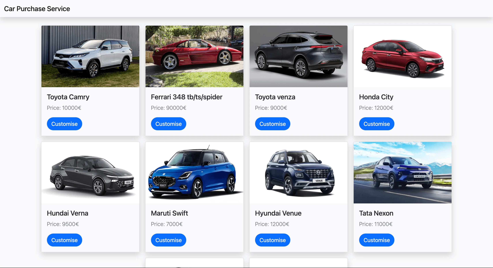

# Projekt A - Car Purchase App

**Cloud Web App zum konfigurieren und kaufen von Fahrzeugen**: Entwickle eine Web App zur Konfiguration und dem Kauf von Fahrzeugen. Hierfür soll sowohl eine Flask API mit Anbindung zur Datenbank sowie ein simples Frontend mit Bootstrap erstellt werden.

Projektthema: API und Web App Entwicklung mit Deployment auf Azure

[App Demo](./assets/Car-purchase-recording.mp4)

## Normalsprachliche Beschreibung des Projektes

### Überblick

Die Softwarelösung ist eine vollständig deployte Web App, die es den Nutzern erlaubt, Fahrzeuge leicht zu Konfigurieren und zu Bestellen. Für jedes Fahrzeug gibt es einige Anpassungsoptionen die den finalen Preis beeinflussen..

### Kernaspekte

1. **Kaufverwaltung:**
    - Speicherung und Verwaltung von Käufen mit Daten wie Name, Email, Modell.
    - Möglichkeit, neue Käufe in einer Datenbank zu speichern.
    - Dynamisches Pricing bei Änderung der Fahrzeugparameter

2. **Dokumentation und Testing:**
    - Dokumentation der Struktur und folgen der Clean Code Prinzipien.
    - Simples Testing des Backends über Python Unit Tests sowie Postman Integration Tests.

3. **Deployment auf Azure:**
    - Aufteilung und Deployment der Web App in zwei separaten Teilen (Backend und Frontend).
    - Vernetzung der einzelnen Deployments über die Azure Oberfläche.

### Benutzeroberfläche und Interaktion

- Die Software bietet eine benutzerfreundliche Oberfläche, die es den Nutzern ermöglicht, effizient auf
  Informationen zuzugreifen und Operationen durchzuführen.
- Einfache Einsicht in die verschiedenen Fahrzeuge und deren Konfigurationen.
- Simpler Prozess zum Kauf eines Fahrzeuges mit den gewollten Änderungen.

### Erweiterbarkeit und Skalierbarkeit

- Die Software ist so konzipiert, dass sie mit dem Wachstum des Unternehmens skaliert werden kann.
- Modularer Aufbau, der es ermöglicht, das Frontend und Backend separat zu erwitern und veröffentlichen.

### Deployment und Verfügbarkeit 

- Veröffentlichung der App für Nutzer über ein Azure Deployment als Web App.

## Zusammenfassung

Diese Softwarelösung zielt darauf ab, ein Service für Autoverkäufer bereitzustellen, mit dem es Nutzern erleichtert wird, direkt die Konfiguration ihres Fahrzeugs anzupassen. Durch die Kombination aus Flask Backend, Datenbank Integration über ein ORM, Web Frontend mit Bootstrap und dem Deployment als Web App auf Azure, wird ein vollständiger Entwicklungszyklus durchlaufen.