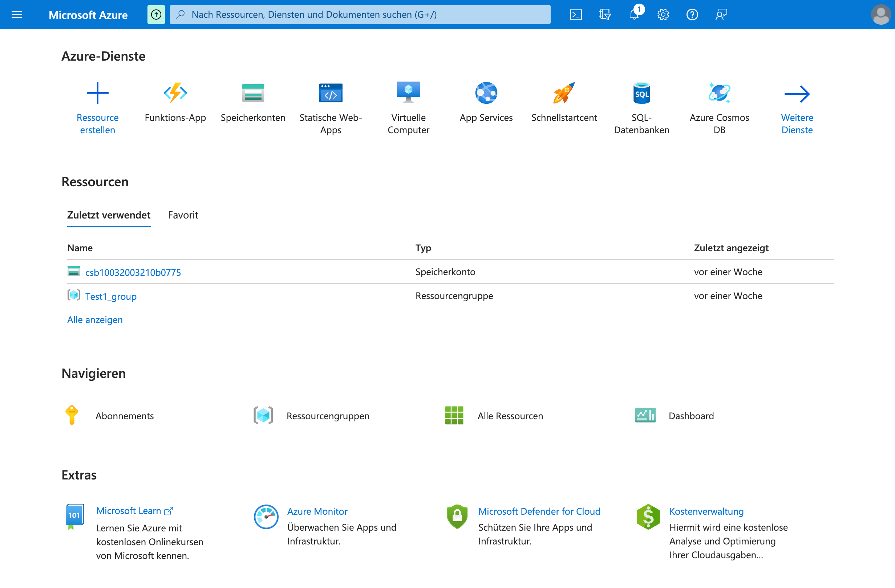
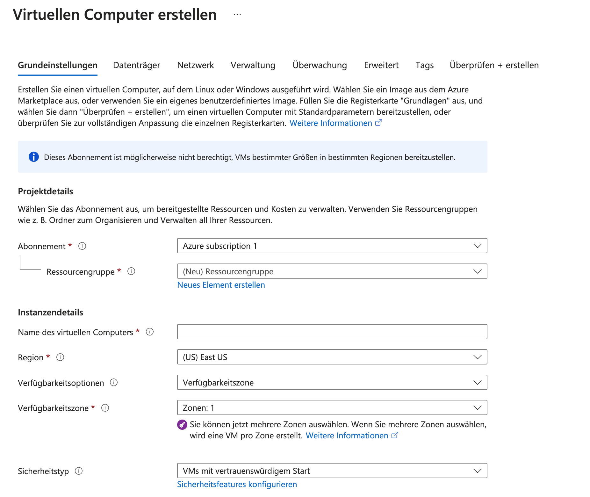

# Azure Intro
[90 min]

## Azure Hands-On: Erkundung des Azure Portals und der Ersten Services
Das Azure Portal bietet den Einstieg in die Welt der Microsoft Cloud-Dienste. Es ist ein zentraler Ort für das Management von Azure-Ressourcen, der eine intuitive Benutzeroberfläche für eine Vielzahl von Cloud-Diensten bietet.

### Konzepte in Azure

Die effektive Nutzung von Azure setzt ein Verständnis seiner Kernkonzepte voraus.

1. **Subscription**: 
   - Die Grundlage für die Nutzung von Azure-Diensten. Jede Subscription steht für ein Vertragsverhältnis mit Microsoft, um Zugriff auf Cloud-Dienste zu erhalten. Sie ist oft mit einer Zahlungsvereinbarung und Zugriffsrechten verbunden.

2. **Resource Groups**: 
   - Dienen als Container, um verwandte Azure-Ressourcen zu gruppieren. Dies erleichtert die Organisation, Verwaltung und Abrechnung von Ressourcen. Eine Resource Group könnte beispielsweise alle Ressourcen für eine bestimmte Anwendung enthalten.

3. **Azure Resource Manager (ARM)**: 
   - Das zugrunde liegende Bereitstellungs- und Verwaltungsservice in Azure. ARM ermöglicht es Ihnen, Ressourcen in Azure zu erstellen, zu aktualisieren und zu löschen. Es bietet eine konsistente Managementebene.

4. **Azure Policy**: 
   - Hiermit können Sie regelbasierte Richtlinien für Azure-Subscriptions erstellen und durchsetzen. Dies hilft bei der Einhaltung von Compliance-Standards und der Verwaltung von Sicherheitsrisiken.

5. **Azure Management Groups**: 
   - Diese erlauben die Verwaltung von Zugriffsrechten und Richtlinien über mehrere Azure-Subscriptions hinweg. Sie sind nützlich für größere Organisationen mit komplexen Anforderungen an die Ressourcenverwaltung.

## Erster Touchpoint: Virtuelle Computer (VMs)
Die Erstellung einer virtuellen Maschine ist einer der ersten Schritte in Azure. VMs bieten die Flexibilität, verschiedene Anwendungen auszuführen, von Webservern bis zu Datenbanken. Sie können auch für Entwicklungsumgebungen, Tests oder als Produktionsumgebung für Business-Anwendungen verwendet werden.

### Live Demo: Azure Virtual Computer
[45 min]

Eine Live-Demonstration zur Erstellung und Nutzung einer Azure VM bietet einen praktischen Einblick in die Funktionsweise von Azure.

#### Schritte zur Erstellung und Nutzung einer Azure VM

1. **Auswahl und Einrichtung**: Zuerst wird das Betriebssystem ausgewählt und die VM-Größe bestimmt. Konfiguriere anschließend die Netzwerkeinstellungen und Sicherheitsfeatures wie Firewalls und SSH-Keys.

2. **Bereitstellung und Management**: Nach der Erstellung der VM kann diese über das Azure Portal verwaltet werden. Dort kann man sie starten, stoppen, überwachen und bei Bedarf anpassen.

3. **Zugriff und Nutzung**: Per Remote Desktop oder SSH kann man sich in die VM einloggen.

#### Virtueller Computer Parameter
Beim Erstellen eines virtuellen Computers (VM) in Microsoft Azure müssen eine Reihe von Parametern definiert werden, die die Konfiguration und Leistung Ihrer VM beeinflussen. Folgend eine Übersicht und kurze Erklärung der einzelnen Parameter.

**Abonnement**: Ein bestehendes Azure-Abonnement, unter dem die VM erstellt wird. Dieses Abonnement bestimmt, wie Ressourcen abgerechnet und verwaltet werden.

**Ressourcengruppe**: Eine Ressourcengruppe ist ein Container, der verwandte Azure-Ressourcen für eine Anwendung oder einen spezifischen Geschäftszweck zusammenhält.

**Virtueller Maschinenname**: Der eindeutige Name für die VM in Azure. Dieser Name wird verwendet, um die VM innerhalb Ihres Abonnements zu identifizieren.

**Region**: Die geografische Region, in der Ihre VM gehostet wird. Die Wahl der Region kann sich auf die Latenz und die Verfügbarkeit der Dienste auswirken. Es ist oft ratsam, eine Region zu wählen, die geografisch nahe an Ihren Benutzern oder Kunden liegt.

**Verfügbarkeitsoptionen**: Verschiedene Verfügbarkeitskonfigurationen sind verfügbar, wie z.B. Verfügbarkeitszonen oder Verfügbarkeitssätze, um die Hochverfügbarkeit und Fehlertoleranz der VM zu erhöhen.

**Image/OS**: Betriebssystem-Image, das auf der VM installiert werden soll. Azure bietet eine Auswahl an Images von Windows- und Linux-Distributionen.

**Größe der VM**: Die Größe der VM bestimmt die Menge an CPU, RAM und anderen Ressourcen, die der VM zugewiesen werden. Azure bietet eine Vielzahl von VM-Größen für verschiedene Anwendungsfälle und Budgets.

**Administrationskonto**: Administrationsanmeldeinformationen wie Benutzernamen und Passwort oder öffentlichen SSH-Schlüssel, um auf die VM zuzugreifen.

**Netzwerkeinstellungen**: Netzwerkeinstellungen wie das virtuelle Netzwerk, Subnetz und die öffentliche IP-Adresse.

**Datenträger**: Speicheroptionen für die VM. Dies umfasst das Festlegen des Betriebssystemdatenträgers sowie das Hinzufügen zusätzlicher Datenträger für Daten.

**Erweiterte Einstellungen**: Zusätzliche Funktionen und Optionen wie Überwachung, Diagnose, automatische Skalierung und Backups.

**Überprüfung und Erstellung**: Nach Bestätigung dieser Einstellungen wird die VM in Azure erstellt.

## Aufgaben
[60 min]

### Erster Zugang zu Azure 🌶️️
Logge dich mit deinem 365 Account bei Azure ein und finde dich in der Oberfläche zurecht.

### Der erste virtuelle Server 🌶️️🌶️️
Erstelle eine VM mit Azure, logge dich über die Azure CLI ein und erstelle mit Bash ein Python Skript, dass bei Ausführung "Hallo Welt" printed.

### Server offline nehmen 🌶️️
Verlasse den Server über die CLI und Lösche die VM wieder.