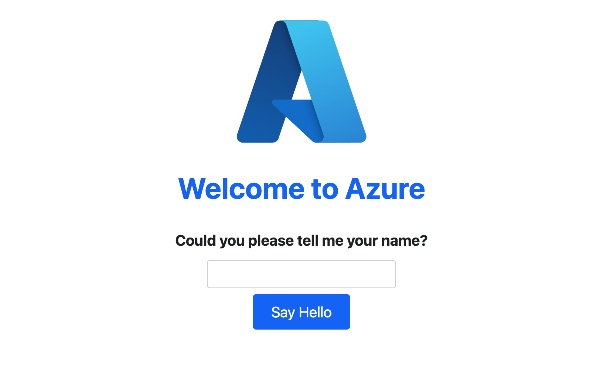

# Flask API in der Cloud
[60 min]

Eine Flask-API mit Azure Web Apps zu deployen, ermöglicht es, leistungsfähige Webanwendungen und APIs in einer skalierbaren und verwalteten Cloud-Umgebung zu hosten. Flask ist ein leichtgewichtiges und flexibles Mikro-Webframework für Python, ideal für schnelle Entwicklung und einfache Bereitstellung von Webanwendungen.

## Die Azure CLI
Die Azure Command Line Interface (CLI) ist ein Befehlszeilen-Tool, das eine schnelle, textbasierte Schnittstelle zur Ausführung von Azure-Diensten und -Operationen bietet. Die Mächtigkeit dieses Tools wird in den folgenden Beispielen klar.

> Die Azure CLI ist sowohl für Windows als auch für Linux/MacOS muss aber vor Verwendung installiert werden.

Mit der Azure CLI kann z.B. eine virtuelle Maschine erstellt, Ressourcengruppen verwaltet oder Datenbankdienste konfiguriert werden. Ein typischer Befehl um eine neue VM in einer bestehenden Ressourcengruppe zu erstellen könnte z.B. wie folgt aussehen. 

```bash
az vm create --resource-group MyResourceGroup --name MyVM --image UbuntuLTS --generate-ssh-keys`
```

Mit etwas Übung kann fast das ganze Management der Ressourcen über das Terminal abgewickelt werden.

**Auflisten aller virtuellen Maschinen**:
Zeigt alle VMs in Ihrem Abonnement in einer tabellarischen Form an.

```bash
az vm list --output table
```

**Deployment eines ARM Templates**:
Ressourcengruppen-Deployment unter Verwendung einer ARM-Vorlagendatei durchführen.

```bash
az deployment group create --resource-group myResourceGroup --template-file template.json
```

**Oder auch die Erstellung und das gesamte Deployment einer Web App**: Erstellt eine neue Web App und führt folgende Aktionen aus.

- Erstellen einer Standardressourcengruppe

- Erstellen eines App Service-Plans

- Erstellen einer App mit dem angegebenen Namen

- Bereitstellen eines ZIP-Pakets aller Dateien aus dem aktuellen Arbeitsverzeichnis mit aktivierter Buildautomatisierung

```bash
az webapp up --runtime PYTHON:3.9 --sku B1 --logs
```

## Live Deployment der Beispiel Flask API auf Azure
Das [Deployment einer Web-App mit der Azure-CLI](https://learn.microsoft.com/de-de/azure/app-service/quickstart-python?tabs=flask%2Cwindows%2Cazure-cli%2Cvscode-deploy%2Cdeploy-instructions-azportal%2Cterminal-bash%2Cdeploy-instructions-zip-azcli) kann in wenigen Schritten realisiert werden. Hier der volle Prozess zum Deployment der Flask Beispiel API.

**1. Clonen des [Beispiel-Projektes](https://github.com/Azure-Samples/msdocs-python-flask-webapp-quickstart)** und lokales Ausführen.

```bash
git clone https://github.com/Azure-Samples/msdocs-python-flask-webapp-quickstart

cd msdocs-python-flask-webapp-quickstart
pip install -r requirements.txt

flask run
# => 127.0.0.1:5000
```

**2. Installieren der Azure-CLI** über [Homebrew](https://brew.sh/) und ausführen des Deployment.

```bash
brew update && brew install azure-cli

# Einloggen in Azure Account
az login
# Erstellen der Web App mit allen Ressourcen
az webapp up --runtime PYTHON:3.9 --sku B1 --logs
```

**3. Zeige die Default-Website an** indem du die URL der Ressource öffnest.
```bash
You can launch the app at http://<app-name>.azurewebsites.net
{
  # Kopiere die URL im Terminal
  "URL": "http://<app-name>.azurewebsites.net",
  "location": "centralus",
  ...
}
```



**4. Lösche die Web App und Ressource-Gruppe** und verhindere, dass mehrere nicht mehr gebrauchte Web Applikationen im Leerlauf Ressourcen ziehen.

```bash
az group delete --name msdocs-python-webapp-quickstart --no-wait
```


## Aufgaben
[60 min]

### Deployment der Beispiel Flask API 🌶️️🌶️️
Nutze das [Flask Beispielprojekt von Microsoft](https://github.com/Azure-Samples/msdocs-python-flask-webapp-quickstart) um eine erste Flask API als Azure Web App zu deployen.

### Deployment einer eigenen REST Flask API 🌶️️🌶️️🌶️️
Erstelle eine simple REST Flask API und deploye diese mit der Azure-CLI. Nutze anschließend Postman um die Funktionalität deiner Endpunkte zu überprüfen.


[Lösungs Tutorial](https://learn.microsoft.com/de-de/azure/app-service/quickstart-python?tabs=flask%2Cwindows%2Cazure-cli%2Cvscode-deploy%2Cdeploy-instructions-azportal%2Cterminal-bash%2Cdeploy-instructions-zip-azcli)