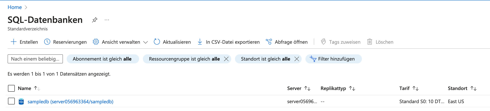

# Die erste Cloud Database
[45 min]

Die erste Cloud-Datenbank in Azure zu erstellen und zu nutzen, bietet eine grundlegende Plattform für das Hosting und die Verwaltung von Daten in der Cloud. Azure-Datenbanken, wie Azure SQL Database, Cosmos DB und Azure Database for MySQL, bieten verschiedene Service-Pläne, die sich in Leistung, Skalierbarkeit und Preisgestaltung unterscheiden.


## Azure Datenbank 
Azure bietet verschiedene Service-Modelle und -Pläne für Datenbanken, die auf unterschiedliche Bedürfnisse und Anforderungen abgestimmt sind. Service-Pläne sind im Wesentlichen verschiedene Pakete oder Konfigurationen, die ein bestimmtes Set an Ressourcen, Fähigkeiten und Leistungsniveaus bieten. Zu den Hauptdiensten gehören Azure SQL Database, Cosmos DB und Azure Database for MySQL.

1. **Azure SQL Database**: Ideal für relationale Datenbankanforderungen und bietet verschiedene Leistungsstufen, automatisiertes Management und integrierte Intelligenz.

2. **Cosmos DB**: Eine global verteilte Datenbank für NoSQL-Anforderungen, die Multi-Modell-Datenbankfunktionen und eine schnelle, skalierbare Leistung bietet.

3. **Azure Database for MySQL**: Eine verwaltete Datenbanklösung für MySQL, die automatisierte Skalierung, Sicherung und Wiederherstellung bietet.


## Live Erstellung und Befüllung einer Datenbanken
Das [Deployment einer Beispiel SQL-Datenbank mit der Azure-CLI](https://learn.microsoft.com/de-de/azure/azure-sql/database/single-database-create-quickstart?view=azuresql&tabs=azure-cli-sql-up) kann in wenigen Schritten realisiert werden. Folgend der volle Prozess zum Deployment der SQL Datenbank.

**1. Erstellen der Beispiel Datenbank mit der CLI** und Anzeigen im Azure Portal.

```bash
az sql up
```



**2. Einloggen in den Abfrage Editor** und erstellen einer Tabelle sowie Beispieldaten. Nach erfolgreicher Erstellung der Datenbank werden Login-Details (auch für den Abfrage-Editor) im Terminal bereitgestellt.

```bash
{
  "connectionStrings": {...},
  "host": "server056963364.database.windows.net",
  "password": "7651b449-6198-4c8c-a43a-3ce631e38587",
  "username": "rundownSalami7@server056963364"
}
```

Nutze den Abfrage-Editor um manuell eine Beispieltabelle für Nutzer zu erstellen und diese mit Beispieldaten zu füllen.

```sql
CREATE TABLE Nutzer (
    NutzerID INT PRIMARY KEY,
    Name VARCHAR(100),
    Email VARCHAR(100),
    Passwort VARCHAR(100)
);

INSERT INTO Nutzer (NutzerID, Name, Email, Passwort) VALUES (1, 'Max Mustermann', 'max.mustermann@example.com', 'pass123');
INSERT INTO Nutzer (NutzerID, Name, Email, Passwort) VALUES (2, 'Maria Musterfrau', 'maria.musterfrau@example.com', 'pass456');
INSERT INTO Nutzer (NutzerID, Name, Email, Passwort) VALUES (3, 'Julia Beispiel', 'julia.beispiel@example.com', 'pass789');
```


## Aufgaben
[45 min]

### Datenbank erstellen und Tabelle mit Daten einfügen 🌶️🌶️
Erstelle deine erste Datenbank in Azure und lege eine Tabelle Inventory an. Lege manuell einzelne Einträge mit Items und deren Lagerstand an.

### Verbinde deine SWA mit der Datenbank 🌶️🌶️🌶️
Zeige die manuell eingefügten Daten zum Lagerbestand der einzelnen Einträge in einem Frontend deiner Wahl (SWA oder Flask Web App) an.


## Komplex-Aufgaben
[90 min]

### Inventory Management SWA 🌶️🌶️🌶️🌶️
Erstelle eine simple statische Webapp mit einem Formular um Inventaritems in die Datenbank zu schreiben. Zeige die Inventarliste in der SWA direkt an.