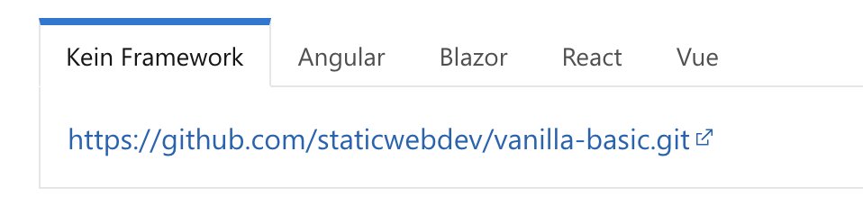

# Die erste Static Web App
[45 min]

Microsoft Azure Static Web App Service ist eine moderne Web-Hosting-Service-Lösung, die speziell für statische Webseiten entwickelt wurde. Dieser Dienst vereinfacht das Hosting und die Verwaltung statischer Inhalte wie HTML, CSS und JavaScript, sowie die Integration mit modernen Frameworks und Bibliotheken.

#### Schnelles, einfaches und weltweites Deployment 
Azure Static Web App Service bietet integrierte Continuous Integration und Continuous Deployment (CI/CD) über GitHub oder Azure DevOps (für z.B. BitBucket). Das ermöglicht schnelle Deployment-Updates. Zusätzlich erfolgt die Auslieferung über das Azure Content Delivery Network (CDN), wodurch Inhalte zuverlässig weltweit ausgeliefert werden.

## Templates in Azure Static Web App Service
Azure bietet eine [Reihe von vorgefertigten Templates](https://github.com/staticwebdev/vanilla-basic), die die Erstellung von statischen Webseiten vereinfachen. Diese Templates decken ein breites Spektrum von Frameworks und Bibliotheken ab, einschließlich Angular, React und Vue.js. Für die Arbeit mit [VSCode und GitHub gibt es zusätzliches Tooling](https://github.com/microsoft/vscode-azurestaticwebapps), das den Umgang mit Static Web Apps weiter vereinfacht.



## Live Deployment einer simplen HTML Static Web App mit Bitbucket

Das [Deployment einer statischen Web-App in Azure](https://learn.microsoft.com/de-de/azure/static-web-apps/bitbucket?tabs=vanilla-javascript) kann in wenigen Schritten realisiert werden. Hier der volle Prozess zum Deployment einer simplen HTML-Webseite.

- **1. Erstelle ein neues Bitbucket Repository** und importiere dabei das [Template von Azure](https://github.com/staticwebdev/vanilla-basic.git).

- **2. Erstelle die erste Static Web App** über das Azure Portal und ergänze alle nötigen Ressourceinformationen.

- **3. Erstelle die Deployment-Config** im Bitbucket Repository um die importierte Basis-App automatisiert zu deployen. Über YAML-Code werden alle Anweisungen zum Deployment an Bitbucket Pipelines übergeben.

```yml
pipelines:
  branches:
   main:
    - step: 
        name: Deploy to test
        deployment: test
        script:
          - pipe: microsoft/azure-static-web-apps-deploy:main
            variables:
                APP_LOCATION: '$BITBUCKET_CLONE_DIR/src'
                OUTPUT_LOCATION: '$BITBUCKET_CLONE_DIR/src'
                API_TOKEN: $deployment_token
```

- **4. Zeige die Default-Website an** indem die generierte URL im Azure Portal geöffnet wird.  


- **5. Passe die SWA an** indem neue Commits mit Änderungen in das Bitbucket Projekt gepushed werden.


## Aufgaben
[60 min]

### Statische Website in der Cloud 🌶️️🌶️️
Erstelle ein neues Bitbucket Projekt, folge dabei dem Azure SWA Template und deploye eine Azure SWA.

### "Realtime" changes mit Git 🌶️️🌶️️
Passe das HTML Dokument deines deployten Bitbucket-Projektes an und commite die Änderungen. Wie verhält sich die Azure SWA?

[Lösungs Tutorial](https://learn.microsoft.com/de-de/azure/static-web-apps/bitbucket?tabs=vanilla-javascript)