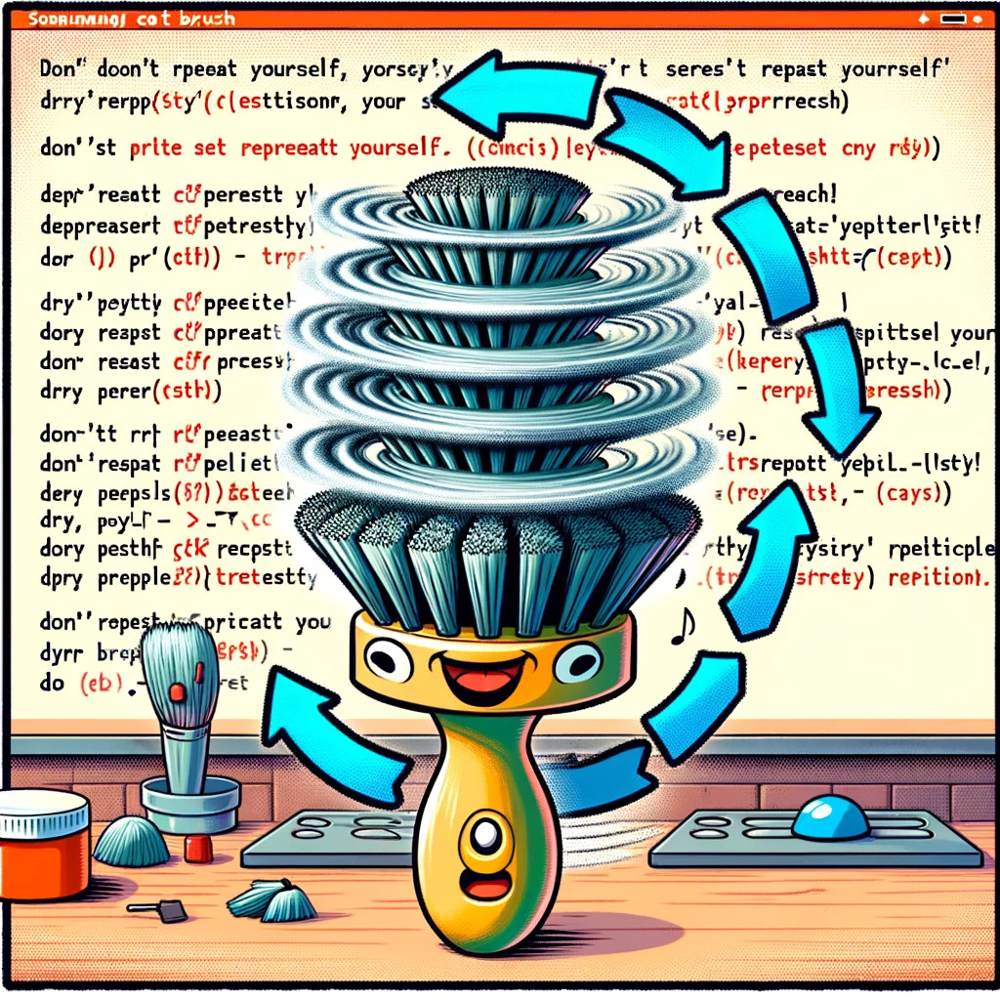

# DRY - Don't Repeat Yourself



```python
# Berechnung des Quadrats von Zahlen
num1 = 4
quadrat_num1 = num1 * num1

num2 = 5
quadrat_num2 = num2 * num2

num3 = 6
quadrat_num3 = num3 * num3

print(quadrat_num1, quadrat_num2, quadrat_num3)
```

Funktionen reduzieren die Code-Menge und erhöhen die Wartbarkeit.

```python
def quadrat(zahl):
    return zahl * zahl


num1 = 4
num2 = 5
num3 = 6

quadrat_num1 = quadrat(num1)
quadrat_num2 = quadrat(num2)
quadrat_num3 = quadrat(num3)

print(quadrat_num1, quadrat_num2, quadrat_num3)
```

Das obige Beispiel ist sehr trivial. Man könnte sagen: "Ist doch klar, was soll das?". Also warum wird dieser
Punkt hier aufgelistet?

Funktionen und Prozeduren sind zentrale Elemente in der Programmierung, um wiederholten Code zu vermeiden und gehören zu
den ältesten Programmierparadigmen. Ihre Effizienz ist sogar auf Prozessorebene verankert: Wenn eine Funktion aufgerufen
wird, speichert der Prozessor die Adresse, an die nach Beendigung der Funktion zurückgekehrt wird, in einem speziellen
Speicherbereich. Dies ermöglicht eine nahtlose und zeiteffiziente Fortsetzung des Programms.

Einer der Hauptvorteile dieses Ansatzes ist, dass Änderungen nur an einer Stelle im Code vorgenommen werden müssen, was
die Wartung und Aktualisierung von Software erheblich vereinfacht.

Allerdings ist es in der modernen Softwareentwicklung oft eine Herausforderung, redundante Codeabschnitte zu
identifizieren, da diese nicht immer offensichtlich sind. Dies kann in der Komplexität des eigenen Codeabschnitts oder
in umfangreichen Projekten mit mehreren Entwicklern begründet sein, die möglicherweise denselben Code schreiben, ohne es
zu bemerken. Hier sind Code-Bibliotheken, ein bewusster Blick über den eigenen Code hinaus und eine durchdachte
Softwarearchitektur hilfreich.

Es erfordert jedoch auch einiges an Erfahrung, effektive Lösungen zur Vermeidung von Redundanz zu entwickeln und
anzuwenden. Das Erkennen und Umstrukturieren von wiederholtem Code in effizientere, modulare Strukturen ist eine
Fähigkeit, die sich Entwickler im Laufe der Zeit aneignen und die für die Erstellung wartbarer, skalierbarer und
effizienter Software unerlässlich ist.

**Aufgabe**: Löse die Code Duplikationen auf.

```python
def verarbeite_kundendaten(kunden_liste):
    # Verarbeite Kundendaten
    verarbeitete_daten = []
    for kunde in kunden_liste:
        # Nehmen wir an, es gibt einige komplexe Logiken
        verarbeitete_daten.append({
            "name": kunde["name"],
            "email": kunde["email"],
            # Weitere spezifische Logik für Kunden
        })
    return verarbeitete_daten


def verarbeite_mitarbeiterdaten(arbeiter_liste):
    # Verarbeite Mitarbeiterdaten
    verarbeitete_daten = []
    for arbeiter in arbeiter_liste:
        # Ähnliche Logik wie bei Kunden, aber leicht unterschiedlich
        verarbeitete_daten.append({
            "name": arbeiter["name"],
            "email": arbeiter["email"],
            # Weitere spezifische Logik für Mitarbeiter
        })
    return verarbeitete_daten


# Beispielaufrufe
kunden = [{"name": "Kunde1", "email": "kunde1@example.com"}, ...]
mitarbeiter = [{"name": "Mitarbeiter1", "email": "mitarbeiter1@example.com"}, ...]
```

**Aufgabe**: Finde Ausnahmen zur DRY-Regel

**Diskussion und Fazit**

[zurück](../TheGoodPractices)
