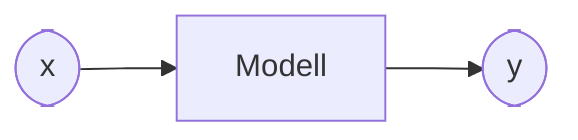

# Einführung in Data Science 

[//]: # ([10 min])

🎦 Video

<iframe width="560" height="315" src="https://www.youtube.com/embed/8rGP5ErEKOU?si=thReMME17WkPEXzL" title="YouTube video player" frameborder="0" allow="accelerometer; autoplay; clipboard-write; encrypted-media; gyroscope; picture-in-picture; web-share" allowfullscreen></iframe>

Was ist Data Science?

Der amerikanische Zukunftsforscher John Naisbitt hat 1982 ein Buch namens "Megatrends" veröffentlicht, das über 14 Millionen Mal verkauft wurde. In dem Buch beschrieb Naisbitt einen wichtigen Trend, den er schon damals erkannte. Unsere Gesellschaften entwickeln sich in Richtung Informationsgesellschaften und sammeln dabei immer mehr Informationen bzw. Daten. Und irgendwann sah Naisbitt folgende Situation auf uns zukommen:

    "Wir ertrinken in Daten, aber hungern doch nach Wissen" (John Naisbitt, 1982)

Genau hier setzt Data Science an. Data Science ist ein Bereich, bei dem wir mittels Statistik, Visualisierungen und Machine Learning (zu diesen Begriffen später mehr!) versuchen aus riesigen Mengen von Zahlen das zu generieren, was uns wirklich interessiert: *Wissen* (neue Erkenntnisse, neue Einsichten).

Um es kurz zu machen: Data Science ist ein Prozess, der aus Daten Wissen generiert.

# Der Data Science Prozess 

[//]: # ([20 min])

Die Frage ist, ob man diesen Prozess ("mache aus Daten neues Wissen") irgendwie als einen Standardprozess formulieren kann. Hierzu gibt es verschiedene Data Science Prozess Modelle. Das vielleicht bekannteste Data Science Prozess Modell ist das *CRISP-DM* Prozess Modell.

Wofür steht diese kryptische Abkürzung?

*CRISP-DM* steht hierbei für *Cross Industry Standard Process for Data Mining*, also auf Deutsch ein Industrie-übergreifender Standardprozess für das Data Mining. Was ist jetzt schon wieder *Data Mining*? Dieser Begriff meint im Wesentliche das Gleiche wie *Data Science* war aber früher verbreiteter. Heute reden alle nur noch von *Data Science* und keiner mehr von *Data Mining*.

Das CRISP-DM Data Science Prozessmodell umfasst dabei folgende sechs Phasen:

| Phase | Name der Phase             | Beschreibung                                                                                         |
|----|----------------------------|------------------------------------------------------------------------------------------------------|
|1| Geschäftsverständnis       | Verstehen der Projektziele und Anforderungen aus geschäftlicher Sicht. Entwicklung eines Projektplans.|
|2| Datenverständnis           | Sammeln der Daten, Identifizierung der Datenqualität, Erkundung der Datenstrukturen und Inhalte.     |
|3| Datenvorbereitung          | Bereinigung und Transformation der Daten für die Analyse. Erstellung von Datensätzen zum Modellieren. |
|4| Modellierung               | Auswahl und Anwendung verschiedener Modellierungstechniken. Kalibrierung der Modellparameter.        |
|5| Bewertung                  | Bewertung der Modelle, um sicherzustellen, dass sie den Geschäftszielen entsprechen.                  |
|6| Bereitstellung             | Planung der Bereitstellung der Modelle, Erstellung von Berichten, Finalisierung des Modells für die Praxis.       |

# Ein Data Science Beispiel [45 min]

War dir das zu abstrakt? Hier ist ein konkretes echtes Beispiel aus der Praxis!

Die Firma Rossmann hat vor einigen Jahren auf der Webseite Kaggle einen Wettbewerb ausgerufen:

[Rossmann Store Sales - Forecast sales using store, promotion, and competitor data](https://www.kaggle.com/c/rossmann-store-sales)

Es ging um folgende Situation: die Firma Rossmann hat in Deutschland 1115 Filialen. Jeder Leiter muss für die Personalplanung vorplanen wieviele Mitarbeiter er in den nächsten Tagen und Wochen (beispielsweise an den Kassen) einplant. Das hängt wiederum davon ab, wieviel in der Filiale los sein wird.

Daher hat die Firma Rossmann die Anzahl der gekauften Produkte und die Anzahl der Kunden über einen längeren Zeitraum (2.5 Jahre) für jede der 1115 Filialen veröffentlicht. Die Anzahl der gekauften Produkte und die Anzahl der Kunden (jeweils pro Tag) über diese 2.5 Jahre ist jeweils eine lange Zeitreihe. Die Hoffnung war, dass man aus solchen Zeitreihen etwas über die Verkäufe und die Kundenanzahlen in den nächsten sechs Wochen sagen könnte.

Der CRISP-DM Data Science Prozess kann nun hierbei so aussehen:

*1. Geschäftsverständnis:* Ein Data Scientist versucht genau dieses Problem in der Diskussion mit der Geschäftsleitung zu verstehen und definiert zusammen mit der Geschäftsleitung das Ziel bzw. die Ziele des Projektes: Wir wollen die Anzahl der Kunden und verkauften Produkte in der Zukunft (kommenden 6 Wochen) vorhersagen können. Mehrwert dann: wir können die Personalplanung besser durchführen.

*2. Datenverständnis:* Der Data Scientist informiert sich welche Daten es gibt. Hier sind es beispielsweise historische Daten (der letzten 2.5 Jahre) über die Anzahl der Kunden und der Anzahl der verkauften Produkte auf Tagesbasis. Der Data Scientist überprüft die *Datenqualität*: Liegen die Daten  wirklich für alle 1115 Filialen durchgehend vor oder gibt es Lücken in den Daten? Gibt es vielleicht Fehler in den Daten (negative Verkaufszahlen, unmögliche hohe Kundenanzahlen pro Tag)?

*3. Datenvorbereitung:* Der Data Scientist "bereinigt" die Daten. Beispielsweise interpoliert er fehlende Werte durch den letzten und den nächsten vorhandenen Wert. Eventuell trägt er auch Daten aus verschiedenen Quellen in ein einheitliches Format, um die nachfolgende Analyse einfacher zu machen. Beispielsweise könnten einige Zeitreihen als .xlsx Dateien vorliegen, andere als .csv Dateien. Er könnte dann ein Python-Skript schreiben, das über alle Dateien läuft, diese einliest und als eine einzige große .csv Datei speichert.

*4. Modellierung:* Wir wünschen uns ein Modell, das auf Basis der Auslastung einer Filiale in der Vergangenheit die Auslastung der Filiale in der Zukunft vorhersagen kann. Sehr beliebt ist heute in dieser Phase das Machine Learning. Dabei programmieren wir nicht ein, wie ein Computer diese Aufgabe lösen soll, sondern zeigen dem Computer einfach Beispiele (x,y):

        x = (Anzahl Kunden vor 14 Tagen, Anzahl Kunden vor 13 Tagen , ..., Anzahl Kunden gestern)
        
        y = (Anzahl Kunden morgen, Anzahl Kunden in 2 Tagen, ..., Anzahl Kunden in 6 Wochen)
                                           
und Machine Learning Algorithmen versuchen dann den Zusammenhang zwischen x und y zu erlernen und liefern ein Modell zurück, dass bei Eingabe von x dann y zurückgibt:

Ein kleiner Hinweis: es muss aber nicht immer Machine Learning sein!

Manchmal kann man auch durch einfache Visualisierungen bereits klare Muster in den Daten erkennen, die man in die Zukunft fortsetzen kann. Zum Beispiel könnten wir auch durch eine tagesweise Mittelung der Kundenanzahlen (Montage-Samstage) sehen, dass es ein typisches wochenweises Auslastungsmuster über der Zeit gibt, das wir dann einfach für die Auslastungsvorhersage nehmen könnten - ganz ohne Machine Learning.

*5. Bewertung:* Meistens erstellt ein Data Scientist nicht nur ein Modell, sondern probiert mehrere Modelle aus. Jedes Modell wird dann auf sogenannten Testdaten getestet, wie gut es funktioniert. Hier wäre der Test beispielsweise wie gut das Modell die Anzahl der Kunden in den nächsten Wochen vorhersagen kann. Das beste Modell könnte dann ausgewählt werden.

*6. Bereitstellung:* Wenn das beste Modell auf dem Computer des Data Scientist liegt, bringt es der Firma nicht viel. Es soll ja von den Filialleitern zur Personalplanung genutzt werden könnnen. Daher muss es diesen auch zur Verfügung gestellt werden. Zum Beispiel könnte das Modell auf einem eigenen Server gehostet werden. Die Filialleiter könnten dann über ein Webinterface die Auslastung der vergangenen Wochen eingeben. Das Webinterface reicht diese Zahlen x dann an ein Python-Skript weiter, dass das Modell einliest und die Vorhersage y berechnet. Diese Vorhersage wird dann abschließend über ein dynamisches Webinterface dem Filialleiter ausgegeben.

# Das Python-Ökosystem für Data Science [15 min]

Python ist auch so beliebt, weil es so unglaublich viele hilfreiche Module für alle möglichen Aufgaben gibt. Wenn du ein Modul mit `pip install <Modulname>` installierst, kommen diese normalerweise vom *Python Package Index* (kurz: *PyPI*) https://pypi.org/. Und dort finden sich aktuell fast eine halbe Millionen Module!

Für die Analyse von Daten mit Python sind dabei vor allem folgende vier Module wichtig:

| Modulname    | Projektwebseite                                          | Wozu brauche ich das?                                                                               |
|--------------|----------------------------------------------------------|-----------------------------------------------------------------------------------------------------|
| Pandas       | [https://pandas.pydata.org](https://pandas.pydata.org)   | Das ist quasi das "Excel für Python"                                                                |
| Matplotlib   | [https://matplotlib.org](https://matplotlib.org)         | Erzeugung beliebiger Diagramme                                                                      |
| Seaborn      | [https://seaborn.pydata.org](https://seaborn.pydata.org) | Baut direkt auf Matplotlib auf, um Statistikplots einfacher als Matplotlib zur Verfügung zu stellen |
| Scikit-learn | [https://scikit-learn.org](https://scikit-learn.org)     | Enthält alle wichtigen Machine Learning Algorithmen                                                 |
