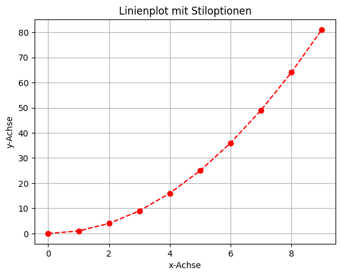

# Matplotlib: Linienplots

## Einführung [10min]

Matplotlib, eine der prominentesten Bibliotheken in der Python-Programmierwelt, bietet vielfältige Möglichkeiten zur Datenvisualisierung. Unter den verschiedenen Plot-Typen sind Linienplots besonders beliebt. Diese Darstellungsform ist nicht nur ästhetisch ansprechend, sondern auch ungemein informativ, um Trends und Muster in Daten sichtbar zu machen. Daher sind Linienplots ein wichtiges Werkzeug für Data Science.

## Was sind Linienplots?

Linienplots, häufig auch als Liniendiagramme bezeichnet, verbinden einzelne Datenpunkte durch gerade Linien. Diese Art der Darstellung eignet sich hervorragend, um Veränderungen über Zeit zu illustrieren – sei es der Anstieg der globalen Temperaturen, Aktienkursentwicklungen oder die Fortschritte eines Projekts.

ää Anwendungsbereiche von Linienplots

Linienplots sind in nahezu jedem Bereich, der Datenanalyse und -visualisierung benötigt, einsetzbar. Einige Beispiele:

- Wissenschaft und Forschung: In der Wissenschaft helfen Linienplots dabei, experimentelle Daten zu visualisieren und Trends oder Anomalien schnell zu erkennen.

- Finanzwelt: In der Finanzwelt werden Linienplots verwendet, um Aktienkurse, Wirtschaftsindikatoren und Budgetentwicklungen darzustellen.

- Gesundheitswesen: Im Gesundheitsbereich können sie genutzt werden, um die Verbreitung von Krankheiten oder die Wirksamkeit von Medikamenten zu veranschaulichen.

- Technik und Ingenieurwesen: In der Technik helfen Linienplots, die Leistungsfähigkeit von Maschinen und Systemen über Zeit zu beurteilen.

## Linienplots in Matplotlib

Matplotlib bietet eine einfache, aber mächtige Schnittstelle, um Linienplots zu erstellen und anzupassen. Zu den Vorteilen zählen:

- Einfachheit: Auch ohne tiefgreifende Programmierkenntnisse können Sie leicht aussagekräftige Plots erstellen.
- Anpassungsfähigkeit: Matplotlib erlaubt es, fast jeden Aspekt eines Plots zu personalisieren – von Farben über Achsenbeschriftungen bis hin zu Legenden.
- Integration mit anderen Bibliotheken: Matplotlib arbeitet nahtlos mit anderen Datenverarbeitungs- und Analysetools wie Pandas, NumPy, Seaborn zusammen.

## Codebeispiele [30 min]

### Beispiel 1: Einfacher Linienplot


```python
import matplotlib.pyplot as plt

x = [0, 1, 2, 3, 4]
y = [0, 1, 4, 9, 16]

plt.plot(x, y)
plt.title("Einfacher Linienplot")
plt.xlabel("x-Achse")
plt.ylabel("y-Achse")
plt.show()
```


    

    


Dieses Beispiel zeigt einen einfachen Linienplot. Hier wird eine Liste von x-Werten (`x`) und ihre entsprechenden y-Werte (`y`) definiert. Mit `plt.plot(x, y)` wird der Linienplot erstellt. Titel und Achsenbeschriftungen werden mit `plt.title`, `plt.xlabel` und `plt.ylabel` hinzugefügt. `plt.show()` zeigt den Plot an.

### Beispiel 2: Linienplot mit Stiloptionen


```python
import matplotlib.pyplot as plt

x = range(10)
y = [xi**2 for xi in x]

plt.plot(x, y, color='red', linestyle='--', marker='o')
plt.title("Linienplot mit Stiloptionen")
plt.xlabel("x-Achse")
plt.ylabel("y-Achse")
plt.grid(True)
plt.show()
```


    

    


In diesem Beispiel werden Stiloptionen verwendet. Die Linie wird als gestrichelte Linie (`linestyle='--'`) in Rot (`color='red'`) mit Kreismarkierungen an jedem Datenpunkt (`marker='o'`) dargestellt. `plt.grid(True)` fügt ein Gitternetz zum Plot hinzu, um die Lesbarkeit zu verbessern.

### Beispiel 3: Mehrere Linien in einem Plot


```python
import matplotlib.pyplot as plt

x = range(1, 6)
y1 = [xi**2 for xi in x]
y2 = [xi**3 for xi in x]

plt.plot(x, y1, label='x^2')
plt.plot(x, y2, label='x^3')
plt.title("Mehrere Linien in einem Plot")
plt.xlabel("x-Achse")
plt.ylabel("y-Achse")
plt.legend()
plt.show()
```


    

    


Hier werden zwei Linien in einem einzigen Plot dargestellt. Die erste Linie (`y1`) zeigt `x` zum Quadrat, die zweite Linie (`y2`) zeigt `x` zur dritten Potenz. Mit `plt.legend()` wird eine Legende hinzugefügt, um zwischen den beiden Linien zu unterscheiden.

### Beispiel 4: Linienplot mit Achsenbereich


```python
import matplotlib.pyplot as plt
import numpy as np

x = np.linspace(0, 2*np.pi, 100)
y = np.sin(x)

plt.plot(x, y)
plt.title("Linienplot mit Achsenbereich")
plt.xlabel("x-Achse")
plt.ylabel("sin(x)")
plt.xlim([0, 2*np.pi])
plt.ylim([-1.5, 1.5])
plt.show()
```


    

    


Dieses Beispiel zeigt einen Linienplot der Sinusfunktion. `np.linspace` wird verwendet, um eine Sequenz von x-Werten zu erstellen. `plt.xlim` und `plt.ylim` werden genutzt, um den Anzeigebereich der Achsen zu begrenzen.

### Beispiel 5: Linienplot mit Anmerkungen


```python
import matplotlib.pyplot as plt

x = range(1, 6)
y = [xi**2 for xi in x]

plt.plot(x, y)
plt.title("Linienplot mit Anmerkungen")
plt.xlabel("x-Achse")
plt.ylabel("y-Achse")

for xi, yi in zip(x, y):
    plt.annotate(f'({xi}, {yi})', (xi, yi), textcoords="offset points", xytext=(0,10), ha='center')

plt.show()
```


    

    


In diesem Beispiel werden Anmerkungen zu jedem Punkt des Linienplots hinzugefügt. Die `plt.annotate`-Funktion wird verwendet, um Text an den Koordinaten jedes Punktes `(xi, yi)` zu platzieren. Die Textposition wird relativ zu den Datenpunkten mit `xytext` und `textcoords` angepasst

## Aufgaben [90 min]

### A1: Grundlegender Linienplot 🌶️

Erstelle einen einfachen Linienplot mit den x-Werten [0, 1, 2, 3, 4] und den y-Werten [0, 13, 6, 19, 12].

### A2: Linienplot mit Titel und Achsenbeschriftungen 🌶️

Erstelle einen Linienplot mit x-Werten von 1 bis 10 und y-Werten als deren Quadrate. Füge dem Plot einen Titel und Achsenbeschriftungen hinzu.

### A3: Mehrfarbiger Linienplot 🌶️

Erstelle einen Linienplot für die Funktionen y = x und y = x^2 auf dem Intervall [0, 5], wobei jede Linie eine andere Farbe haben soll.

### A4:  Gestrichelter Linienplot 🌶️🌶️

Erstelle einen Linienplot für die Funktion y = x^3 von -20 bis +20, wobei die Linie gestrichelt und in Grün dargestellt werden soll.

### A5: Linienplot mit Anmerkungen 🌶️🌶️🌶️

Erstelle einen Linienplot für y = x^5 von -15 bis +15 und füge eine Anmerkung bei dem Punkt (0,0) hinzu.

### A6: Linienplot mit Markierungen für Datenpunkte 🌶️

Erstelle einen Linienplot für die Funktion y = x^2 auf dem Intervall [1, 4]. Verwende unterschiedliche Markierungen für die Datenpunkte.

### A7: Linienplots mit Legende 🌶️🌶️🌶

Erzeuge 5 Linienplots mit Legenden für $x$, x^2, x^3, x^4, x^5 im Bereich -100 bis +100.
Zeige auch noch ein Gitter an.

[Lösungen](matplotlib_linienplots_loesungen.md)
