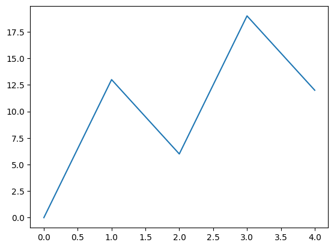
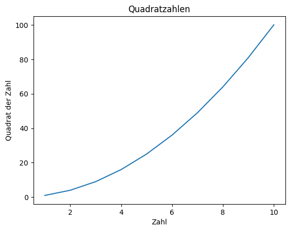
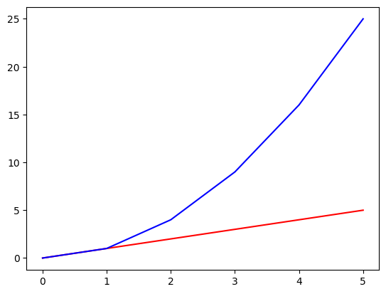
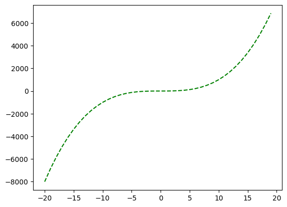
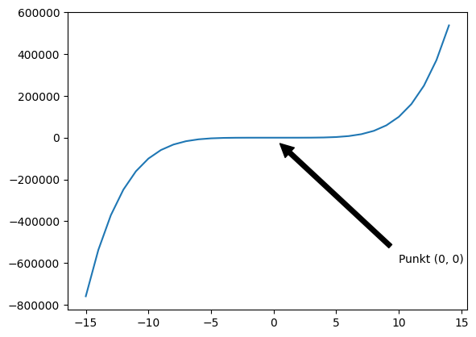
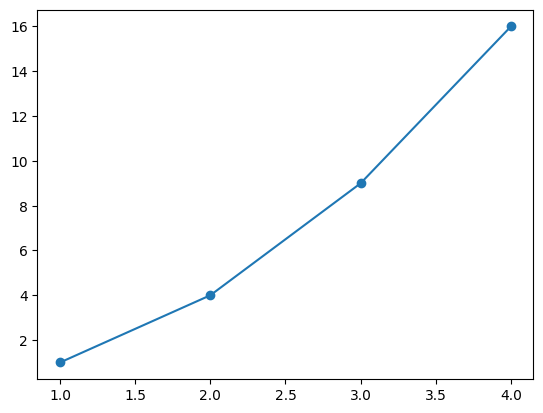
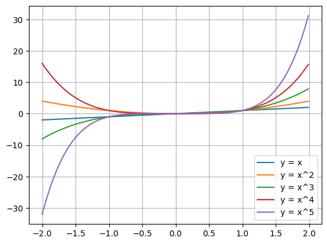

# Lösungen

### A1: Grundlegender Linienplot 🌶️

<details>
<summary>
🎦 Lösungsvideo
</summary>
<iframe width="560" height="315" src="https://www.youtube.com/embed/BYrpE_4xz1s?si=sbz-YC2gRSrVTK5f" title="YouTube video player" frameborder="0" allow="accelerometer; autoplay; clipboard-write; encrypted-media; gyroscope; picture-in-picture; web-share" allowfullscreen></iframe>
</details>

Erstelle einen einfachen Linienplot mit den x-Werten [0, 1, 2, 3, 4] und den y-Werten [0, 13, 6, 19, 12].


```python
import matplotlib.pyplot as plt

x = [0, 1, 2, 3, 4]
y = [0, 13, 6, 19, 12]

plt.plot(x, y)
plt.show()
```


    

    


### A2: Linienplot mit Titel und Achsenbeschriftungen 🌶️

<details>
<summary>
🎦 Lösungsvideo
</summary>
<iframe width="560" height="315" src="https://www.youtube.com/embed/dqiCjPTZkZk?si=pGBIayAMGhAYyL8v" title="YouTube video player" frameborder="0" allow="accelerometer; autoplay; clipboard-write; encrypted-media; gyroscope; picture-in-picture; web-share" allowfullscreen></iframe>
</details>

Erstelle einen Linienplot mit x-Werten von 1 bis 10 und y-Werten als deren Quadrate. Füge dem Plot einen Titel und Achsenbeschriftungen hinzu.


```python
import matplotlib.pyplot as plt

x = range(1, 11)
y = [xi**2 for xi in x]

plt.plot(x, y)
plt.title("Quadratzahlen")
plt.xlabel("Zahl")
plt.ylabel("Quadrat der Zahl")
plt.show()
```


    

    


### A3: Mehrfarbiger Linienplot 🌶️

<details>
<summary>
🎦 Lösungsvideo
</summary>
<iframe width="560" height="315" src="https://www.youtube.com/embed/_zvjRpNiixs?si=Cf6ZsyUTqNDYSLNG" title="YouTube video player" frameborder="0" allow="accelerometer; autoplay; clipboard-write; encrypted-media; gyroscope; picture-in-picture; web-share" allowfullscreen></iframe>
</details>

Erstelle einen Linienplot für die Funktionen y = x und y = x^2 auf dem Intervall [0, 5], wobei jede Linie eine andere Farbe haben soll.


```python
import matplotlib.pyplot as plt

x = range(0, 6)
y1 = x
y2 = [xi**2 for xi in x]

plt.plot(x, y1, 'r') # Rot für die erste Linie
plt.plot(x, y2, 'b') # Blau für die zweite Linie
plt.show()
```


    

    


### A4:  Gestrichelter Linienplot 🌶️🌶️

<details>
<summary>
🎦 Lösungsvideo
</summary>
<iframe width="560" height="315" src="https://www.youtube.com/embed/Xra8IxyYXv0?si=ynLSD1NHm5Ev4hpF" title="YouTube video player" frameborder="0" allow="accelerometer; autoplay; clipboard-write; encrypted-media; gyroscope; picture-in-picture; web-share" allowfullscreen></iframe>
</details>

Erstelle einen Linienplot für die Funktion y = x^3 von -20 bis +20, wobei die Linie gestrichelt und in Grün dargestellt werden soll.


```python
import matplotlib.pyplot as plt

x = range(-20, 20)
y = [xi**3 for xi in x]

plt.plot(x, y, 'g--') # Grüne, gestrichelte Linie
plt.show()
```


    

    


### A5: Linienplot mit Anmerkungen 🌶️🌶️🌶️

<details>
<summary>
🎦 Lösungsvideo
</summary>
<iframe width="560" height="315" src="https://www.youtube.com/embed/mPB-QQ5nxw8?si=ApnX63T86KpuuInn" title="YouTube video player" frameborder="0" allow="accelerometer; autoplay; clipboard-write; encrypted-media; gyroscope; picture-in-picture; web-share" allowfullscreen></iframe>
</details>

Erstelle einen Linienplot für y = x^5 von -15 bis +15 und füge eine Anmerkung bei dem Punkt (0,0) hinzu.


```python
import matplotlib.pyplot as plt

x = range(-15, +15)
y = [xi**5 for xi in x]

plt.plot(x, y)
plt.annotate('Punkt (0, 0)',
             xy=(0, 0),
             xytext=(10, -600000),
             arrowprops=dict(facecolor='black', shrink=0.05))
plt.show()
```


    

    


### A6: Linienplot mit Markierungen für Datenpunkte 🌶️

<details>
<summary>
🎦 Lösungsvideo
</summary>
<iframe width="560" height="315" src="https://www.youtube.com/embed/d8QCN6ppnYw?si=D_Suu-K0Vr1MHsR-" title="YouTube video player" frameborder="0" allow="accelerometer; autoplay; clipboard-write; encrypted-media; gyroscope; picture-in-picture; web-share" allowfullscreen></iframe>
</details>

Erstelle einen Linienplot für die Funktion y = x^2 auf dem Intervall [1, 4]. Verwende unterschiedliche Markierungen für die Datenpunkte.


```python
import matplotlib.pyplot as plt

x = range(1, 5)
y = [xi**2 for xi in x]

plt.plot(x, y, marker='o') # Kreismarkierungen
plt.show()
```


    

    


### A7: Linienplots mit Legende 🌶️🌶️🌶

<details>
<summary>
🎦 Lösungsvideo
</summary>
<iframe width="560" height="315" src="https://www.youtube.com/embed/UpjP7ZAfTUw?si=x8mDYozy07Su0TId" title="YouTube video player" frameborder="0" allow="accelerometer; autoplay; clipboard-write; encrypted-media; gyroscope; picture-in-picture; web-share" allowfullscreen></iframe>
</details>

Erzeuge 5 Linienplots mit Legenden für x, x^2, x^3, x^4, x^5 im Bereich -100 bis +100.
Zeige auch noch ein Gitter an.


```python
import matplotlib.pyplot as plt
import numpy as np

x = np.arange(-2,+2, 0.01)
y1 = x
y2 = [xi**2 for xi in x]
y3 = [xi**3 for xi in x]
y4 = [xi**4 for xi in x]
y5 = [xi**5 for xi in x]

plt.plot(x, y1, label='y = x')
plt.plot(x, y2, label='y = x^2')
plt.plot(x, y3, label='y = x^3')
plt.plot(x, y4, label='y = x^4')
plt.plot(x, y5, label='y = x^5')
plt.legend()
plt.grid()
plt.show()
```


    

    

