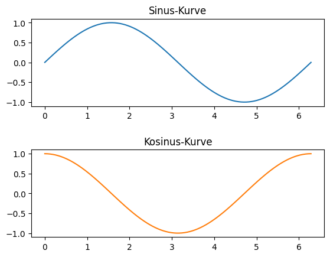
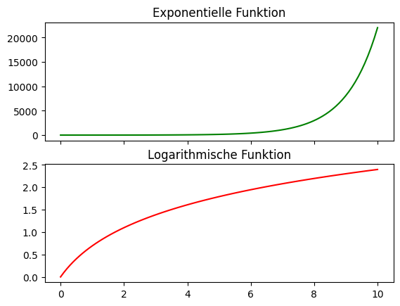
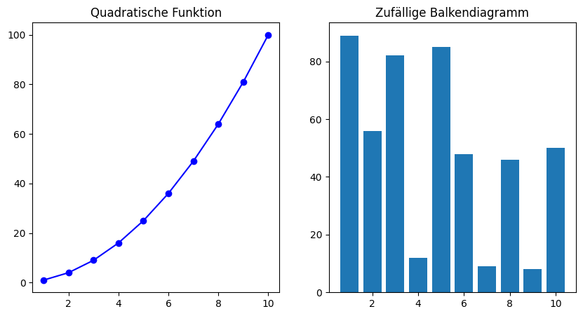
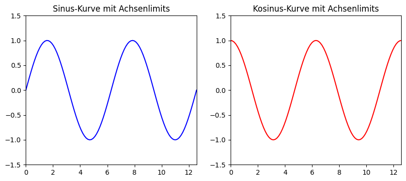
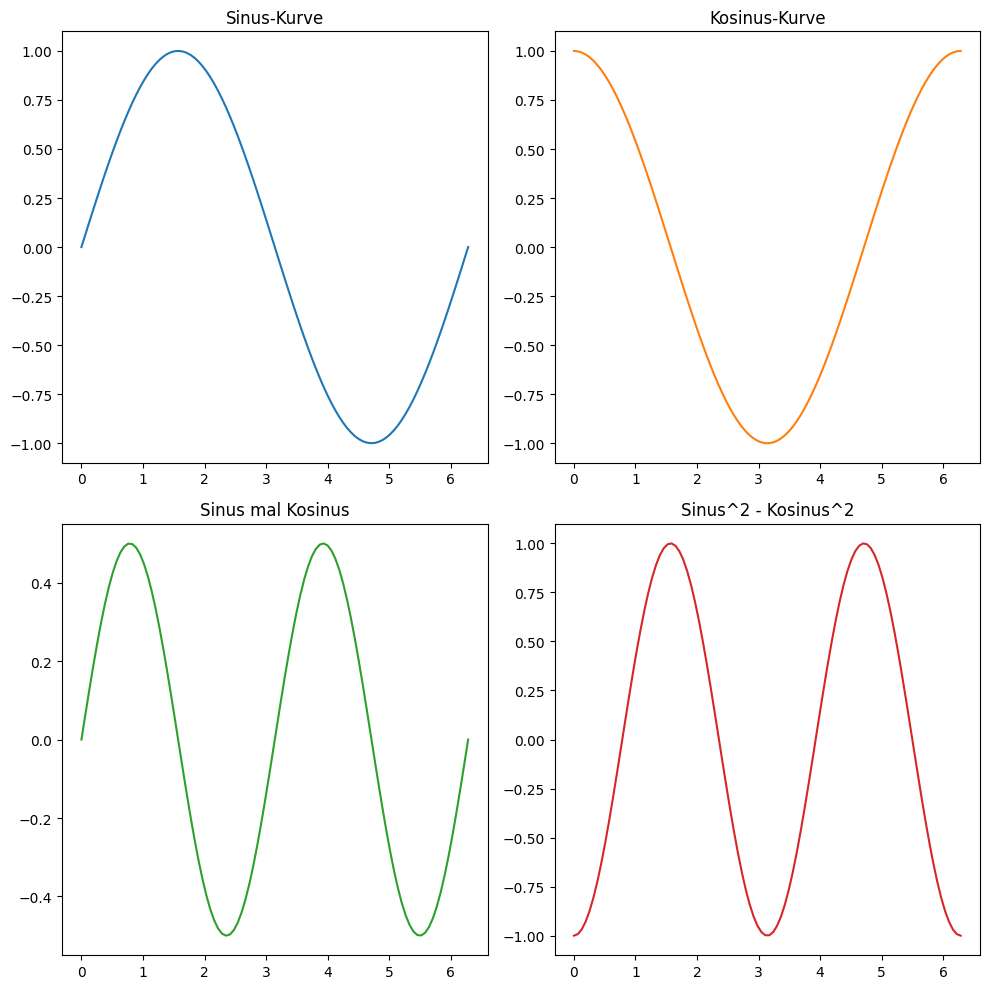

# Matplotlib: Subplots

## Einführung [10 min]

Eine der nützlichsten Funktionen in Matplotlib ist die Erstellung von Subplots. Subplots ermöglichen es, mehrere Plots in einem einzigen Fenster oder einer Bildfläche zu organisieren, was für die Analyse und den Vergleich von Daten sehr hilfreich sein kann.

## Was sind Subplots?

Ein Subplot ist ein einzelner Abschnitt innerhalb einer größeren Grafik, in dem ein eigenständiger Plot dargestellt wird. In Matplotlib ermöglichen Subplots das Erstellen von Layouts mit mehreren Plots in einer geordneten und übersichtlichen Struktur. Jeder Subplot kann unterschiedliche Daten, Grafiktypen, Skalierungen und Anpassungen enthalten, aber alle zusammen in einem kohärenten Gesamtbild präsentiert werden.

## Warum Subplots verwenden?

Subplots sind aus mehreren Gründen in der Datenvisualisierung von Bedeutung:

- Vergleich von Daten: Subplots sind ideal, um ähnliche Daten nebeneinander zu stellen und direkte Vergleiche anzustellen. Dies ist besonders nützlich, wenn man Trends, Muster oder Unterschiede zwischen verschiedenen Datensätzen hervorheben möchte.

- Raum effizient nutzen: Statt separate Fenster für jeden Plot zu öffnen, kann man mit Subplots mehrere Grafiken in einem einzigen Fenster organisieren. Dies spart Platz auf dem Bildschirm oder in einer Präsentation und erleichtert die gleichzeitige Betrachtung mehrerer Diagramme.

- Thematische Konsistenz: Wenn man mehrere Grafiken zu einem Thema hat, ermöglichen Subplots eine konsistente Darstellung. So kann man beispielsweise in einer Studie über Klimaveränderungen verschiedene Aspekte wie Temperatur, Niederschlag und Windgeschwindigkeit in verwandten Subplots darstellen.

- Geschichten erzählen: Mit Subplots kann man eine visuelle Geschichte erzählen, indem man eine Sequenz von Datenpunkten oder Analysen in einer logischen Reihenfolge präsentiert.

## Codebeispiele [45 min]

### Beispiel 1: Grundlegendes Subplot-Layout


```python
import matplotlib.pyplot as plt
import numpy as np

# Daten generieren
x = np.linspace(0, 2*np.pi, 100)
y1 = np.sin(x)
y2 = np.cos(x)

# Subplots erstellen
fig, axs = plt.subplots(2)
axs[0].plot(x, y1, 'tab:blue')
axs[1].plot(x, y2, 'tab:orange')

# Titel setzen
axs[0].set_title('Sinus-Kurve')
axs[1].set_title('Kosinus-Kurve')

plt.subplots_adjust(hspace=0.5)  
plt.show()
```


    

    


Dieses Beispiel zeigt, wie man zwei Subplots in einer vertikalen Anordnung erstellt. Im ersten Subplot wird eine Sinuskurve und im zweiten eine Kosinuskurve dargestellt. Hier wird plt.subplots(2) verwendet, um zwei Subplots zu erzeugen.

### Beispiel 2: Subplots mit gemeinsamer Achse


```python
import matplotlib.pyplot as plt
import numpy as np

# Daten generieren
x = np.linspace(0, 10, 100)
y1 = np.exp(x)
y2 = np.log(x + 1)

# Subplots erstellen
fig, (ax1, ax2) = plt.subplots(2, sharex=True)
ax1.plot(x, y1, 'g-')
ax2.plot(x, y2, 'r-')

# Titel setzen
ax1.set_title('Exponentielle Funktion')
ax2.set_title('Logarithmische Funktion')

plt.show()

```


    

    


In diesem Beispiel werden zwei Subplots mit einer gemeinsamen x-Achse erstellt, was nützlich ist, wenn man Datenreihen mit demselben x-Wertebereich vergleichen möchte. Die sharex=True Option sorgt dafür, dass beide Subplots dieselbe x-Achse verwenden.

### Beispiel 3: Subplots mit unterschiedlichen Diagrammtypen


```python
import matplotlib.pyplot as plt
import numpy as np

# Daten generieren
x = np.arange(1, 11)
y1 = x ** 2
y2 = np.random.randint(1, 100, 10)

# Subplots erstellen
fig, (ax1, ax2) = plt.subplots(1, 2, figsize=(10, 5))
ax1.plot(x, y1, 'bo-')
ax2.bar(x, y2)

# Titel setzen
ax1.set_title('Quadratische Funktion')
ax2.set_title('Zufällige Balkendiagramm')

plt.show()
```


    

    


Hier werden zwei Subplots nebeneinander angezeigt, einer mit einem Liniendiagramm und der andere mit einem Balkendiagramm. Dies ist ein gutes Beispiel dafür, wie man verschiedene Datentypen in einem einzigen Diagramm visualisieren kann.

### Beispiel 4: Anpassen der Achsenlimits in Subplots


```python
import matplotlib.pyplot as plt
import numpy as np

# Daten generieren
x = np.linspace(0, 4*np.pi, 100)
y1 = np.sin(x)
y2 = np.cos(x)

# Subplots erstellen
fig, (ax1, ax2) = plt.subplots(1, 2, figsize=(10, 4))
ax1.plot(x, y1, 'b-')
ax2.plot(x, y2, 'r-')

# Achsenlimits setzen
ax1.set_xlim([0, 4*np.pi])
ax1.set_ylim([-1.5, 1.5])
ax2.set_xlim([0, 4*np.pi])
ax2.set_ylim([-1.5, 1.5])

# Titel setzen
ax1.set_title('Sinus-Kurve mit Achsenlimits')
ax2.set_title('Kosinus-Kurve mit Achsenlimits')

plt.show()
```


    

    


Dieses Beispiel zeigt, wie man die Achsenlimits in Subplots anpasst, um die Darstellung der Plots zu verfeinern. Mit set_xlim und set_ylim werden die Grenzen der x- und y-Achsen festgelegt. Damit können wir die Achsenbereiche für jeden Subplot ganz genau festlegen.

### Beispiel 5: 2x2 Subplot Anordnung


```python
import matplotlib.pyplot as plt
import numpy as np

# Daten generieren
x = np.linspace(0, 2*np.pi, 100)
y1 = np.sin(x)
y2 = np.cos(x)
y3 = np.sin(x) * np.cos(x)
y4 = np.sin(x)**2 - np.cos(x)**2

# Subplots erstellen
fig, axs = plt.subplots(2, 2, figsize=(10, 10))

# Erster Subplot
axs[0, 0].plot(x, y1, 'tab:blue')
axs[0, 0].set_title('Sinus-Kurve')

# Zweiter Subplot
axs[0, 1].plot(x, y2, 'tab:orange')
axs[0, 1].set_title('Kosinus-Kurve')

# Dritter Subplot
axs[1, 0].plot(x, y3, 'tab:green')
axs[1, 0].set_title('Sinus mal Kosinus')

# Vierter Subplot
axs[1, 1].plot(x, y4, 'tab:red')
axs[1, 1].set_title('Sinus^2 - Kosinus^2')

# Layout anpassen
plt.tight_layout()

plt.show()
```


    

    


Dieses Beispiel erzeugt vier Subplots in einem 2x2 Gitter.

Jeder Subplot stellt eine andere mathematische Funktion von x dar: Sinus, Kosinus, Sinus mal Kosinus, und Sinus-Quadrat minus Kosinus-Quadrat.

plt.subplots(2, 2) erstellt ein Gitter von Subplots mit 2 Reihen und 2 Spalten.

figsize=(10, 10) definiert die Größe des Gesamtbildes.

plt.tight_layout() wird verwendet, um sicherzustellen, dass die Subplots ordentlich angeordnet sind und es keine Überlappung der Titel oder Achsenbeschriftungen gibt.

Wieso tab?

tab:blue, tab:orange, tab:green und tab:red auf die Farbnamen, die in Matplotlib verwendet werden, um die Linien in den verschiedenen Subplots zu zeichnen. Diese Farbnamen sind Teil der erweiterten Farbpalette, die in Matplotlib verfügbar ist.

Die Präfix tab steht für "tableau", eine Palette von Farben, die speziell für ihre gute Sichtbarkeit und Unterscheidbarkeit in Grafiken und Diagrammen entwickelt wurde. Diese Farben sind so ausgewählt, dass sie auch für Farbblindheit gut erkennbar sind und auf Bildschirmen gut aussehen.

tab:blue, tab:orange, tab:green und tab:red sind also spezifische Farbtöne aus dieser Tableau-Palette. Sie bieten eine Alternative zu den grundlegenden Farbnamen wie blue, orange, green und red.

## Aufgaben [120 min]

### A1: Subplot mit 3x2 Anordnung mittels plt.subplot() 🌶️🌶️

Erstelle ein Subplot mit 3 Zeilen und 2 Spalten und den gleichen Plot in allen 6 Subplots.

Benutze dabei den Befehl plt.subplot().

### A2: Subplot mit 3x2 Anordnung mittels plt.subplot()s 🌶️🌶️🌶️

Erstelle ein Subplot mit 3 Zeilen und 2 Spalten und den gleichen Plot in allen 6 Subplots.

Benutze dabei den Befehl plt.subplots() (ja! den mit dem s am Ende)

Versuche alle 6 Subplots im Rahmen einer Schleife zu erzeugen!

### A3: Anpassen der Subplot-Abstände 🌶️🌶️

Erstelle vier Subplots in einem Gitter und passe die Abstände zwischen ihnen an.

Der Abstand soll vertikal und horizontal geregelt werden können.

### A4: Ein großer und zwei kleine Subplots 🌶️🌶️🌶️

Erstelle ein Layout mit einem großen Subplot oben und zwei kleineren Subplots unten.

Lese hierzu vorher in der Dokumentation den Befehl `subplot2grid()` nach!

### A5: Subplots in L-Form 🌶️🌶️

Erstelle ein Subplot-Layout in L-Form, bei dem sich ein vertikales Subplot links und ein horizontales Subplot unten befinden.

### A6: Schachbrett-Layout 🌶️🌶️

Erstelle ein 3x3 Schachbrett-Layout, wobei abwechselnd Subplots und leere Räume sind.

### A7: Zwei Horizontale Subplots Nebeneinander 🌶️

Erstelle zwei horizontale Subplots nebeneinander, wobei der linke Subplot doppelt so breit ist wie der rechte.

### A8: T-förmiges Layout 🌶️🌶️

Erstelle ein T-förmiges Layout mit drei Subplots.

[Lösungen](matplotlib_subplots_loesungen.md)
