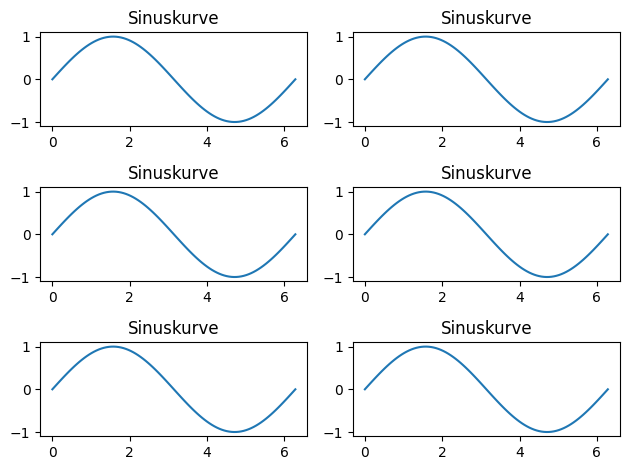
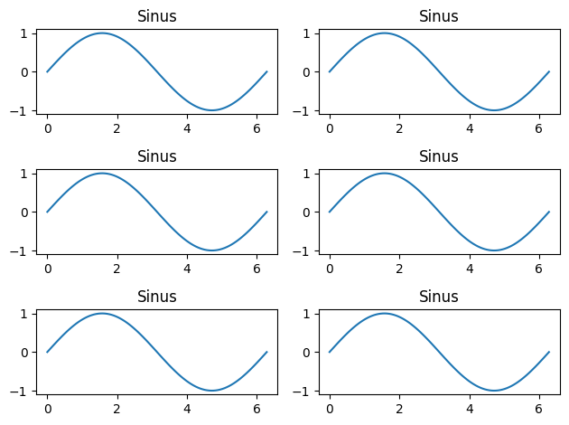
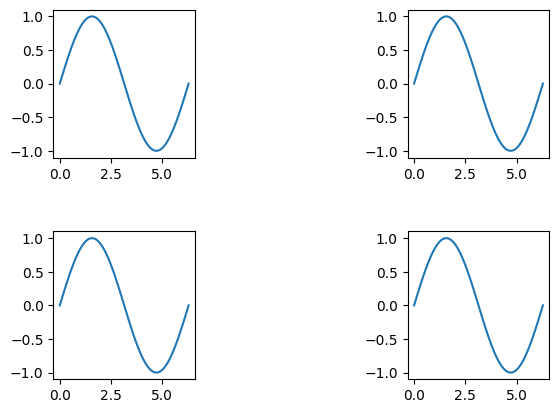
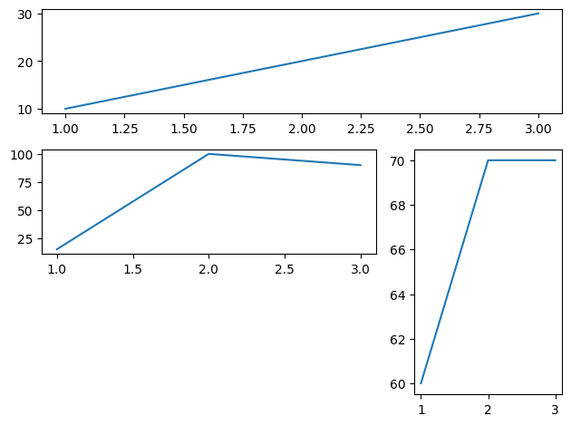
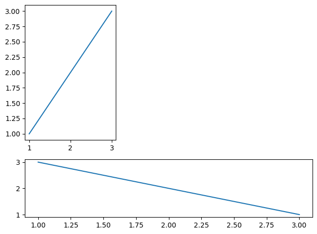
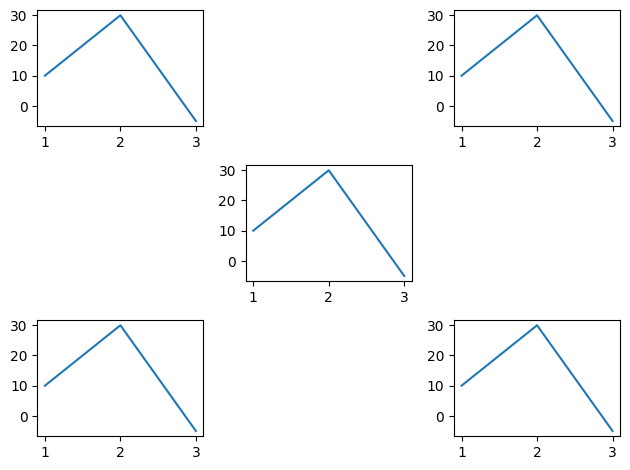
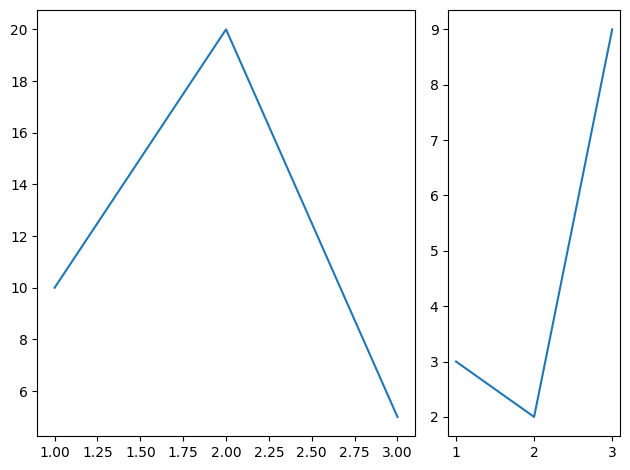
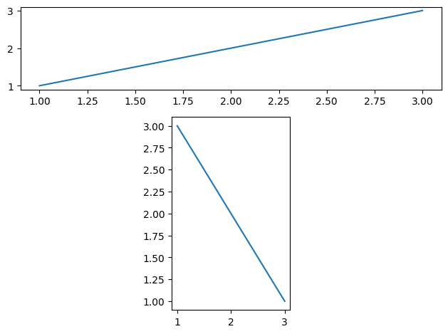

# Lösungen

### A1: Subplot mit 3x2 Anordnung mittels plt.subplot() 🌶️🌶️

Erstelle ein Subplot mit 3 Zeilen und 2 Spalten und den gleichen Plot in allen 6 Subplots.

Benutze dabei den Befehl plt.subplot().


```python
import matplotlib.pyplot as plt
import numpy as np

x = np.linspace(0, 2*np.pi, 100)
y = np.sin(x)

for i in range(1,7):
    plt.subplot(3, 2, i)
    plt.plot(x, y)
    plt.title('Sinuskurve')

plt.tight_layout()
plt.show()
```


    

    


### A2: Subplot mit 3x2 Anordnung mittels plt.subplot()s 🌶️🌶️🌶️

Erstelle ein Subplot mit 3 Zeilen und 2 Spalten und den gleichen Plot in allen 6 Subplots.

Benutze dabei den Befehl plt.subplots() (ja! den mit dem s am Ende)

Versuche alle 6 Subplots im Rahmen einer Schleife zu erzeugen!


```python
import matplotlib.pyplot as plt
import numpy as np

x = np.linspace(0, 2*np.pi, 100)
y = np.sin(x)

fig, axs = plt.subplots(3, 2)

for i in range(0,6):
    zeile  = i%3
    spalte = i%2
    print((zeile,spalte))
    axs[zeile, spalte].plot(x,y)
    axs[zeile, spalte].set_title("Sinus")   
    
plt.tight_layout()
plt.show()
```

    (0, 0)
    (1, 1)
    (2, 0)
    (0, 1)
    (1, 0)
    (2, 1)


    

    


### A3: Anpassen der Subplot-Abstände 🌶️🌶️

Erstelle vier Subplots in einem Gitter und passe die Abstände zwischen ihnen an.

Der Abstand soll vertikal und horizontal geregelt werden können.


```python
x = np.linspace(0, 2*np.pi, 100)
y = np.sin(x)

fig, axs = plt.subplots(2, 2)

axs[0, 0].plot(x, y)
axs[0, 1].plot(x, y)
axs[1, 0].plot(x, y)
axs[1, 1].plot(x, y)

plt.subplots_adjust(wspace=1.5, hspace=0.5)

plt.show()
```


    

    


### A4: Ein großer und zwei kleine Subplots 🌶️🌶️🌶️

Erstelle ein Layout mit einem großen Subplot oben und zwei kleineren Subplots unten.

Lese hierzu vorher in der Dokumentation den Befehl `subplot2grid()` nach!


```python
import matplotlib.pyplot as plt

fig = plt.figure()

ax1 = plt.subplot2grid((3, 3), (0, 0), colspan=3)
ax2 = plt.subplot2grid((3, 3), (1, 0), colspan=2)
ax3 = plt.subplot2grid((3, 3), (1, 2), rowspan=2)

# Beispieldaten plotten
ax1.plot([1, 2, 3], [10,  20, 30])
ax2.plot([1, 2, 3], [15, 100, 90])
ax3.plot([1, 2, 3], [60,  70, 70])

plt.tight_layout()
plt.show()
```


    

    


### A5: Subplots in L-Form 🌶️🌶️

Erstelle ein Subplot-Layout in L-Form, bei dem sich ein vertikales Subplot links und ein horizontales Subplot unten befinden.


```python
fig = plt.figure()

ax1 = plt.subplot2grid((3, 3), (0, 0), rowspan=2)
ax2 = plt.subplot2grid((3, 3), (2, 0), colspan=3)

# Beispieldaten plotten
ax1.plot([1, 2, 3], [1, 2, 3])
ax2.plot([1, 2, 3], [3, 2, 1])

plt.tight_layout()
plt.show()
```


    

    


### A6: Schachbrett-Layout 🌶️🌶️

Erstelle ein 3x3 Schachbrett-Layout, wobei abwechselnd Subplots und leere Räume sind.


```python
fig = plt.figure()

for i in range(3):
    for j in range(3):
        if (i + j) % 2 == 0:
            ax = plt.subplot2grid((3, 3), (i, j))
            ax.plot([1, 2, 3], [10, 30, -5])  # Beispieldaten

plt.tight_layout()
plt.show()
```


    

    


### A7: Zwei Horizontale Subplots Nebeneinander 🌶️

Erstelle zwei horizontale Subplots nebeneinander, wobei der linke Subplot doppelt so breit ist wie der rechte.


```python
fig = plt.figure()

ax1 = plt.subplot2grid((1, 3), (0, 0), colspan=2)
ax2 = plt.subplot2grid((1, 3), (0, 2))

# Beispieldaten plotten
ax1.plot([1, 2, 3], [10, 20, 5])
ax2.plot([1, 2, 3], [3, 2, 9])

plt.tight_layout()
plt.show()
```


    

    


### A8: T-förmiges Layout 🌶️🌶️

Erstelle ein T-förmiges Layout mit drei Subplots.


```python
fig = plt.figure()

ax1 = plt.subplot2grid((3, 3), (0, 0), colspan=3)
ax2 = plt.subplot2grid((3, 3), (1, 1), rowspan=2)

# Beispieldaten plotten
ax1.plot([1, 2, 3], [1, 2, 3])
ax2.plot([1, 2, 3], [3, 2, 1])

plt.tight_layout()
plt.show()
```


    

    

