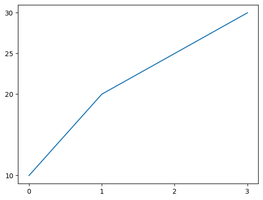
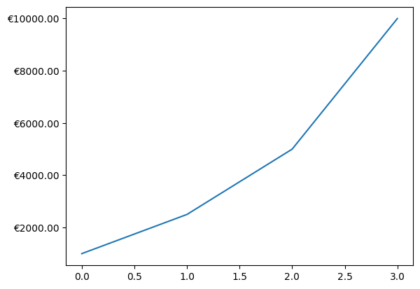
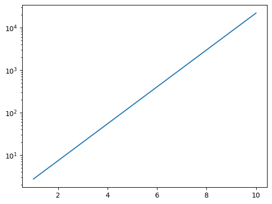
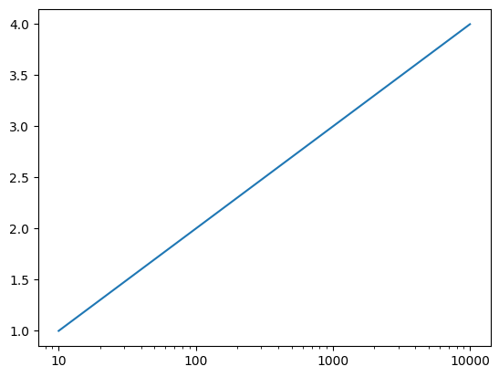

# Matplotlib: Ticks

## Einführung [10 min]

Eines der Kernkonzepte in Matplotlib sind die "Ticks", kleine Markierungen auf den Achsen eines Diagramms, die den Maßstab und die Position von Datenpunkten kennzeichnen.

## Die Bedeutung von Ticks

Ticks spielen eine entscheidende Rolle bei der Interpretation von Daten in einem Diagramm. Sie bieten einen Referenzrahmen, der es dem Betrachter ermöglicht, die Größenordnung und die genaue Position von Datenpunkten zu verstehen. Ticks können sowohl auf der x- als auch auf der y-Achse eines Diagramms erscheinen und sind oft mit Beschriftungen versehen, die zusätzliche Informationen über die jeweilige Achse liefern.

## Anpassung von Ticks

Eine der Stärken von Matplotlib ist die Flexibilität bei der Anpassung von Ticks. Nutzer können die Anzahl, die Position, die Größe und sogar das Format der Ticks verändern. Diese Anpassungen sind besonders nützlich, wenn Daten spezielle Skalierungen oder Intervalle aufweisen, die nicht standardmäßig von Matplotlib erfasst werden.

## Beispiele für die Nützlichkeit von Ticks

In der Praxis können Ticks auf vielfältige Weise nützlich sein. Zum Beispiel:

- Zeitreihenanalyse: Bei der Darstellung von Zeitreihendaten ist es oft hilfreich, Ticks zu verwenden, um spezifische Zeitpunkte oder Perioden hervorzuheben. Das könnte die Darstellung von Quartalen in einem Geschäftsbericht oder Stunden in einem Tagesverlauf sein.

- Wissenschaftliche Daten: In der Wissenschaft, wo Daten oft in ungewöhnlichen Maßeinheiten oder Skalen dargestellt werden, ermöglichen anpassbare Ticks eine präzise und klare Darstellung der Ergebnisse.

- Finanzanalysen: In der Finanzwelt, wo Graphen oft zum Darstellen von Aktienkursen oder ökonomischen Trends genutzt werden, helfen individuell eingestellte Ticks, wichtige Preisniveaus oder historische Datenpunkte hervorzuheben.

## Erweiterte Tick-Optionen

Für fortgeschrittene Anwendungen bietet Matplotlib zusätzliche Tick-Funktionen wie das Rotieren von Tick-Beschriftungen für verbesserte Lesbarkeit oder das Verwenden von Logarithmus-Skalen für exponentiell wachsende Daten. Diese erweiterten Optionen erlauben es, selbst komplexe Daten effektiv zu visualisieren.
Fazit

## Codebeispiele [30 min]

### Beispiel 1 : Grundlegende Tick-Anpassung


```python
import matplotlib.pyplot as plt

fig, ax = plt.subplots()
ax.plot([0, 1, 2, 3], [10, 20, 25, 30])
ax.set_xticks([0, 1, 2, 3])
ax.set_yticks([10, 20, 25, 30])
plt.show()
```


    

    


In diesem Beispiel wird ein einfaches Liniendiagramm erstellt. Die set_xticks und set_yticks Funktionen von Matplotlib werden verwendet, um die Position der Ticks auf der x- und y-Achse anzupassen. Dies sorgt für eine klare Darstellung der Datenpunkte bei 0, 1, 2, 3 auf der x-Achse und 10, 20, 25, 30 auf der y-Achse.

### Beispiel 2: Formatierung der Tick-Beschriftungen


```python
import matplotlib.pyplot as plt
import matplotlib.ticker as ticker

fig, ax = plt.subplots()
ax.plot([0, 1, 2, 3], [1000, 2500, 5000, 10000])
ax.xaxis.set_major_formatter(ticker.FormatStrFormatter('%0.1f'))
ax.yaxis.set_major_formatter(ticker.FormatStrFormatter('€%0.2f'))
plt.show()
```


    

    


Hier werden die Ticks auf der x- und y-Achse formatiert. Die x-Achsen-Ticks werden als Dezimalzahlen mit einer Nachkommastelle angezeigt, während die y-Achsen-Ticks als Währungswerte mit zwei Nachkommastellen und einem Eurozeichen vorangestellt dargestellt werden. Dies ist nützlich für die Darstellung von finanziellen Daten oder wenn eine spezielle Formatierung erforderlich ist.

### Beispiel 3: Anpassen der Tick-Rotation


```python
import matplotlib.pyplot as plt

fig, ax = plt.subplots()
ax.plot([0, 1, 2, 3], [10, 20, 25, 30])
ax.set_xticks([0, 1, 2, 3])
ax.set_xticklabels(['Jan', 'Feb', 'Mar', 'Apr'], rotation=45)
plt.show()
```


    

    


In diesem Beispiel werden die Beschriftungen der x-Achsen-Ticks auf Monatsnamen gesetzt und um 45 Grad gedreht. Diese Art der Rotation ist besonders nützlich, wenn die Beschriftungen länger sind oder um Platz zu sparen, wodurch das Diagramm übersichtlicher und lesbarer wird.

### Beispiel 4: Verwendung von Logarithmischen Ticks


```python
import matplotlib.pyplot as plt
import numpy as np

fig, ax = plt.subplots()
ax.set_yscale('log')
ax.plot(np.linspace(1, 10, 100), np.exp(np.linspace(1, 10, 100)))
plt.show()
```


    

    


Dieses Beispiel demonstriert die Verwendung einer logarithmischen Skala auf der y-Achse. Das ist besonders nützlich, wenn die Daten über einen großen Wertebereich variieren, wie es oft bei exponentiellem Wachstum der Fall ist. Die logarithmische Skala ermöglicht es, die Daten in einer komprimierten Form darzustellen, wobei die Details erhalten bleiben.

Und ja: es ist richtig, dass wir dann jetzt eine Gerade sehen ;-)

### Beispiel 5: Dynamische Anpassung der Ticks


```python
import matplotlib.pyplot as plt
import matplotlib.ticker as ticker

fig, ax = plt.subplots()
ax.plot([10, 100, 1000, 10000], [1, 2, 3, 4])
ax.set_xscale('log')
ax.get_xaxis().set_major_formatter(ticker.ScalarFormatter())
plt.show()
```


    

    


Hier wird ein Diagramm mit einer logarithmischen x-Achse erstellt. Der ScalarFormatter wird verwendet, um die Ticks auf der x-Achse in einer skalierten, aber nicht-logarithmischen Form darzustellen. Dies ist nützlich, wenn man eine logarithmische Skala benötigt, aber die Ticks in einer verständlicheren, linearen Form anzeigen möchte.

## Aufgaben [90 min]

### A1: Einfache Tick-Einstellung 🌶️

Erstelle ein Liniendiagramm mit x-Werten [0, 1, 2, 3, 4] und y-Werten [20, 35, 30, 35, 27]. Setze Ticks auf der x-Achse bei jedem ganzzahligen Wert und auf der y-Achse bei jedem Wert der y-Daten.

### A2: Rotieren von Tick-Beschriftungen 🌶️

Erstelle ein Balkendiagramm für das Dataset ['Apple', 'Banana', 'Orange', 'Grapes', 'Cherries'] mit zufälligen Verkaufszahlen. Rotiere die x-Achsen-Tick-Beschriftungen um 30 Grad.

### A3: Logarithmische Skala 🌶️

Erstelle ein Liniendiagramm für exponentiell wachsende Daten. Verwende eine logarithmische Skala für die y-Achse.

### A4: Anpassen der Tick-Dichte 🌶️🌶️

Erstelle ein Liniendiagramm mit x-Werten von 0 bis 20 und y-Werten als deren Quadrat. Setze Ticks auf der x-Achse in 2er Schritten.

### A5: Formatierung der Tick-Beschriftungen 🌶️🌶️🌶️

Erstelle ein Balkendiagramm für das Dataset ['A', 'B', 'C', 'D'] mit Werten [3, 7, 2, 5]. Formatiere die y-Achsen-Ticks als Prozente.

### A6: Benutzerdefinierte Tick-Beschriftungen 🌶️🌶️

Erstelle ein Liniendiagramm mit x-Werten [1, 2, 3, 4, 5] und y-Werten [2, 3, 5, 7, 11]. Benenne die Ticks auf der x-Achse als ['eins', 'zwei', 'drei', 'vier', 'fünf'].

### A7: Verstecken von Ticks 🌶️

Erstelle ein Liniendiagramm und "verstecke" alle Ticks auf der y-Achse.

### A8: Tick-Beschriftungen mit wissenschaftlicher Notation 🌶️🌶️🌶️

Erstelle ein Balkendiagramm mit großen Zahlen und stelle die y-Achsen-Ticks in wissenschaftlicher Notation dar.

### A9: Anpassen von Tick-Farben 🌶️🌶️

Erstelle ein Liniendiagramm und ändere die Farbe der Ticks auf der x-Achse in Rot.

[Lösungen](matplotlib_ticks_loesungen.md)
