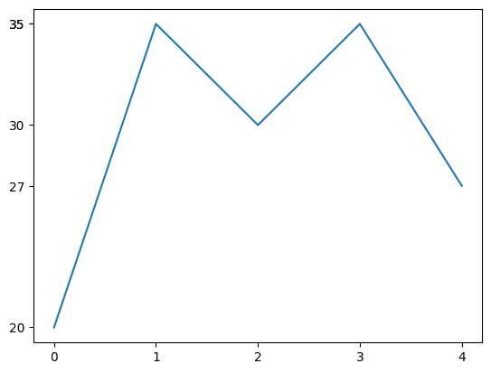
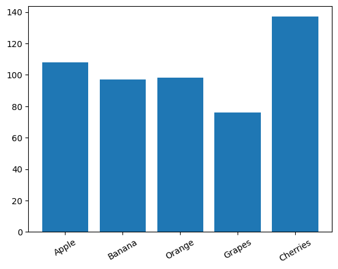
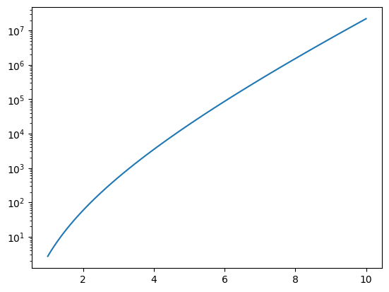
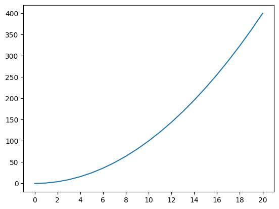
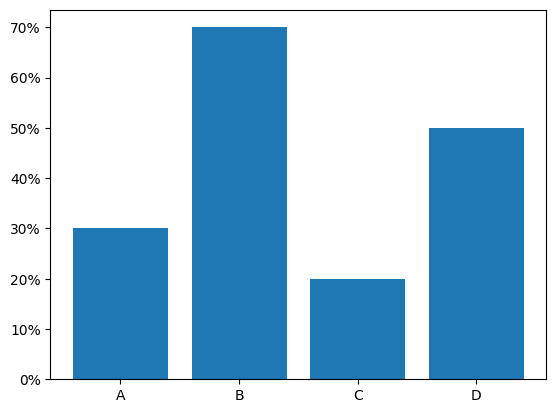
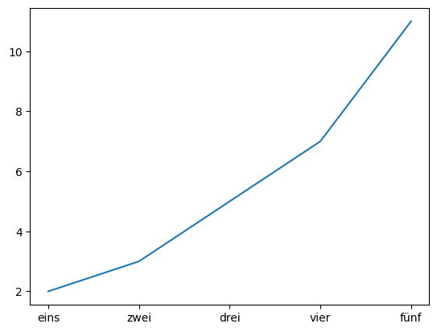
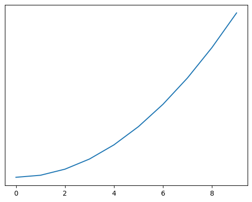
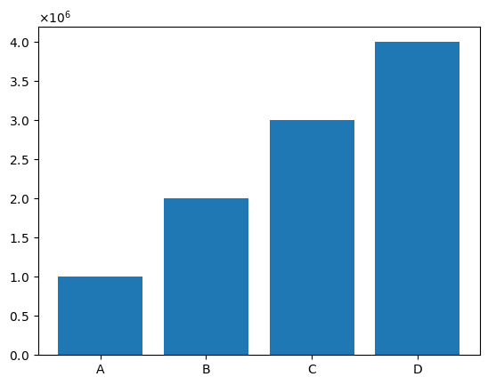
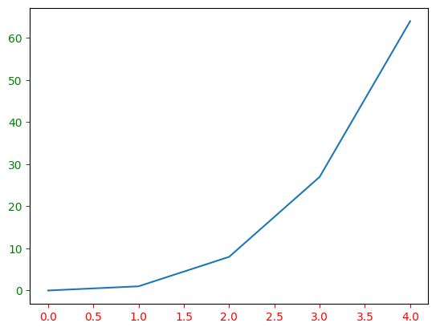

# Lösungen

### A1: Einfache Tick-Einstellung 🌶️

<details>
<summary>
🎦 Lösungsvideo
</summary>
<iframe width="560" height="315" src="https://www.youtube.com/embed/5eRKo-SFR80?si=WUITxNSb8WmCzR3k" title="YouTube video player" frameborder="0" allow="accelerometer; autoplay; clipboard-write; encrypted-media; gyroscope; picture-in-picture; web-share" allowfullscreen></iframe>
</details>

Erstelle ein Liniendiagramm mit x-Werten [0, 1, 2, 3, 4] und y-Werten [20, 35, 30, 35, 27]. Setze Ticks auf der x-Achse bei jedem ganzzahligen Wert und auf der y-Achse bei jedem Wert der y-Daten.


```python
import matplotlib.pyplot as plt

x = [0, 1, 2, 3, 4]
y = [20, 35, 30, 35, 27]

plt.plot(x, y)
plt.xticks(x)
plt.yticks(y)
plt.show()
```


    

    


### A2: Rotieren von Tick-Beschriftungen 🌶️

<details>
<summary>
🎦 Lösungsvideo
</summary>
<iframe width="560" height="315" src="https://www.youtube.com/embed/4DjykPw_hBQ?si=mWRz56VbyTBo8_8O" title="YouTube video player" frameborder="0" allow="accelerometer; autoplay; clipboard-write; encrypted-media; gyroscope; picture-in-picture; web-share" allowfullscreen></iframe>
</details>

Erstelle ein Balkendiagramm für das Dataset ['Apple', 'Banana', 'Orange', 'Grapes', 'Cherries'] mit zufälligen Verkaufszahlen. Rotiere die x-Achsen-Tick-Beschriftungen um 30 Grad.


```python
import matplotlib.pyplot as plt
import numpy as np

fruits = ['Apple', 'Banana', 'Orange', 'Grapes', 'Cherries']
sales = np.random.randint(50, 200, size=len(fruits))

plt.bar(fruits, sales)
plt.xticks(rotation=30)
plt.show()
```


    

    


### A3: Logarithmische Skala 🌶️

<details>
<summary>
🎦 Lösungsvideo
</summary>
<iframe width="560" height="315" src="https://www.youtube.com/embed/QglTuqOWsKE?si=BNrc7tUcYRtMogMH" title="YouTube video player" frameborder="0" allow="accelerometer; autoplay; clipboard-write; encrypted-media; gyroscope; picture-in-picture; web-share" allowfullscreen></iframe>
</details>

Erstelle ein Liniendiagramm für exponentiell wachsende Daten. Verwende eine logarithmische Skala für die y-Achse.


```python
import matplotlib.pyplot as plt
import numpy as np

x = np.linspace(1, 10, 100)
y = np.exp(x) * x**3

plt.plot(x, y)
plt.yscale('log')
plt.show()
```


    

    


### A4: Anpassen der Tick-Dichte 🌶️🌶️

<details>
<summary>
🎦 Lösungsvideo
</summary>
<iframe width="560" height="315" src="https://www.youtube.com/embed/pw7np51Sbzo?si=DLlWdlWNONLU0mkV" title="YouTube video player" frameborder="0" allow="accelerometer; autoplay; clipboard-write; encrypted-media; gyroscope; picture-in-picture; web-share" allowfullscreen></iframe>
</details>

Erstelle ein Liniendiagramm mit x-Werten von 0 bis 20 und y-Werten als deren Quadrat. Setze Ticks auf der x-Achse in 2er Schritten.


```python
import matplotlib.pyplot as plt

x = range(21)
y = [i**2 for i in x]

plt.plot(x, y)
plt.xticks(range(0, 21, 2))
plt.show()
```


    

    


### A5: Formatierung der Tick-Beschriftungen 🌶️🌶️🌶️

<details>
<summary>
🎦 Lösungsvideo
</summary>
<iframe width="560" height="315" src="https://www.youtube.com/embed/ZgWrKJAoFH4?si=NGbmX5xeR-z_BvV1" title="YouTube video player" frameborder="0" allow="accelerometer; autoplay; clipboard-write; encrypted-media; gyroscope; picture-in-picture; web-share" allowfullscreen></iframe>
</details>

Erstelle ein Balkendiagramm für das Dataset ['A', 'B', 'C', 'D'] mit Werten [3, 7, 2, 5]. Formatiere die y-Achsen-Ticks als Prozente.


```python
import matplotlib.pyplot as plt
import matplotlib.ticker as mticker

categories = ['A', 'B', 'C', 'D']
values = [3, 7, 2, 5]

plt.bar(categories, values)
plt.gca().yaxis.set_major_formatter(mticker.PercentFormatter(xmax=10))
plt.show()
```


    

    


### A6: Benutzerdefinierte Tick-Beschriftungen 🌶️🌶️

<details>
<summary>
🎦 Lösungsvideo
</summary>
<iframe width="560" height="315" src="https://www.youtube.com/embed/Zu4w299wQK0?si=WY-K5TfqX7p_LTxd" title="YouTube video player" frameborder="0" allow="accelerometer; autoplay; clipboard-write; encrypted-media; gyroscope; picture-in-picture; web-share" allowfullscreen></iframe>
</details>

Erstelle ein Liniendiagramm mit x-Werten [1, 2, 3, 4, 5] und y-Werten [2, 3, 5, 7, 11]. Benenne die Ticks auf der x-Achse als ['eins', 'zwei', 'drei', 'vier', 'fünf'].


```python
import matplotlib.pyplot as plt

x = [1, 2, 3, 4, 5]
y = [2, 3, 5, 7, 11]
labels = ['eins', 'zwei', 'drei', 'vier', 'fünf']

plt.plot(x, y)
plt.xticks(x, labels)
plt.show()
```


    

    


### A7: Verstecken von Ticks 🌶️

<details>
<summary>
🎦 Lösungsvideo
</summary>
<iframe width="560" height="315" src="https://www.youtube.com/embed/JA7p8D55La0?si=b4ZwMnHL3LjaBsgs" title="YouTube video player" frameborder="0" allow="accelerometer; autoplay; clipboard-write; encrypted-media; gyroscope; picture-in-picture; web-share" allowfullscreen></iframe>
</details>

Erstelle ein Liniendiagramm und "verstecke" alle Ticks auf der y-Achse.


```python
import matplotlib.pyplot as plt

x = range(10)
y = [i**2 for i in x]

plt.plot(x, y)
plt.yticks([])
plt.show()
```


    

    


### A8: Tick-Beschriftungen mit wissenschaftlicher Notation 🌶️🌶️🌶️

<details>
<summary>
🎦 Lösungsvideo
</summary>
<iframe width="560" height="315" src="https://www.youtube.com/embed/Ft0tMTNJ6EQ?si=CXc1u5fBq2Pw8rbf" title="YouTube video player" frameborder="0" allow="accelerometer; autoplay; clipboard-write; encrypted-media; gyroscope; picture-in-picture; web-share" allowfullscreen></iframe>
</details>

Erstelle ein Balkendiagramm mit großen Zahlen und stelle die y-Achsen-Ticks in wissenschaftlicher Notation dar.


```python
import matplotlib.pyplot as plt
import matplotlib.ticker as mticker

categories = ['A', 'B', 'C', 'D']
values = [1000000, 2000000, 3000000, 4000000]

plt.bar(categories, values)
plt.gca().yaxis.set_major_formatter(mticker.ScalarFormatter(useMathText=True))
plt.show()
```


    

    


### A9: Anpassen von Tick-Farben 🌶️🌶️

<details>
<summary>
🎦 Lösungsvideo
</summary>
<iframe width="560" height="315" src="https://www.youtube.com/embed/cDgnI5lyBEA?si=U6PxzLU_YZ64J6vA" title="YouTube video player" frameborder="0" allow="accelerometer; autoplay; clipboard-write; encrypted-media; gyroscope; picture-in-picture; web-share" allowfullscreen></iframe>
</details>

Erstelle ein Liniendiagramm und ändere die Farbe der Ticks auf der x-Achse in Rot.


```python
import matplotlib.pyplot as plt

x = range(5)
y = [i**3 for i in x]

plt.plot(x, y)
ax = plt.gca()
ax.tick_params(axis='x', colors='red')
ax.tick_params(axis='y', colors='green')
plt.show()
```


    

    

