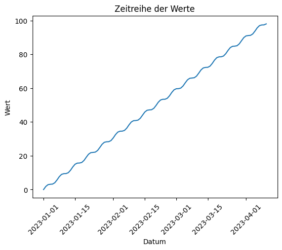
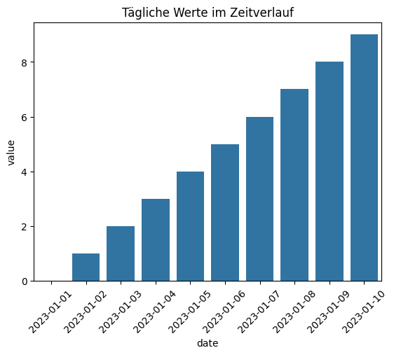

# Exkurs: Zeitstempel und Pandas / Matplotlib / Seaborn

## Einführung [5 min]

In der Welt der Datenanalyse spielen Zeitstempel eine wesentliche Rolle. Sie dienen als fundamentale Marker für Zeitreihendaten, die in vielen Bereichen wie Finanzen, Wissenschaft, Wirtschaft und Technologie unerlässlich sind. Die Bibliotheken Pandas, Matplotlib und Seaborn in Python bieten hierzu viele Werkzeuge zur Handhabung, Analyse und Visualisierung von Zeitstempeldaten.

## Zeitstempel in Pandas

Zeitstempel werden in Pandas oft in Form von DateTime-Objekten genutzt. Diese ermöglichen eine präzise und flexible Manipulation von Zeitreihendaten. Beispielsweise kann man Daten basierend auf verschiedenen Zeitintervallen wie Tagen, Monaten oder Jahren gruppieren. Dies ist besonders hilfreich in der Finanzanalyse, wo Trends und Muster über verschiedene Zeiträume hinweg untersucht werden.

## Visualisierung mit Matplotlib und Seaborn

Bei der Arbeit mit Zeitstempeln ermöglichen diese Bibliotheken die Darstellung von Zeitreihendaten in einer visuell ansprechenden und interpretierbaren Form. Sei es durch Liniendiagramme, die Trends über die Zeit aufzeigen, oder durch Balkendiagramme, die saisonale Muster darstellen, die Verwendung von Zeitstempeln in der Visualisierung hilft, Einblicke in komplexe Datensätze zu gewinnen. Ein typisches Beispiel hierfür ist die Wetterdatenanalyse, wo Temperaturverläufe über Monate oder Jahre hinweg visualisiert werden.

## Codebeispiele [45 min]

### Beispiel 1 : Konvertieren von Strings zu Datetime in Pandas


```python
import pandas as pd

date_strings = ['2023-01-01', '2023-02-01', '2023-03-01']
date_times = pd.to_datetime(date_strings)

print(date_times)
```

    DatetimeIndex(['2023-01-01', '2023-02-01', '2023-03-01'], dtype='datetime64[ns]', freq=None)


In diesem Beispiel wird die Pandas-Funktion to_datetime verwendet, um eine Liste von Datumsstrings in DateTime-Objekte umzuwandeln. Dies ist eine grundlegende Operation in Pandas, die nützlich ist, um Datumsinformationen aus Textdaten zu extrahieren und in ein Format umzuwandeln, das für Zeitreihenanalysen geeignet ist.

### Beispiel 2: Zeitreihen-Daten in Pandas filtern


```python
import pandas as pd

# Erstellen eines DataFrame mit Datumsspalte
data = {'date': pd.date_range(start='2023-01-01', periods=30, freq='D'),
        'value': range(30)}
df = pd.DataFrame(data)
print("df:\n", df)

# Filtern für Daten nach einem bestimmten Datum
filtered_df = df[df['date'] > '2023-01-15']

print("\nfiltered_df:\n", filtered_df)
```

    df:
              date  value
    0  2023-01-01      0
    1  2023-01-02      1
    2  2023-01-03      2
    3  2023-01-04      3
    4  2023-01-05      4
    5  2023-01-06      5
    6  2023-01-07      6
    7  2023-01-08      7
    8  2023-01-09      8
    9  2023-01-10      9
    10 2023-01-11     10
    11 2023-01-12     11
    12 2023-01-13     12
    13 2023-01-14     13
    14 2023-01-15     14
    15 2023-01-16     15
    16 2023-01-17     16
    17 2023-01-18     17
    18 2023-01-19     18
    19 2023-01-20     19
    20 2023-01-21     20
    21 2023-01-22     21
    22 2023-01-23     22
    23 2023-01-24     23
    24 2023-01-25     24
    25 2023-01-26     25
    26 2023-01-27     26
    27 2023-01-28     27
    28 2023-01-29     28
    29 2023-01-30     29
    
    filtered_df:
              date  value
    15 2023-01-16     15
    16 2023-01-17     16
    17 2023-01-18     17
    18 2023-01-19     18
    19 2023-01-20     19
    20 2023-01-21     20
    21 2023-01-22     21
    22 2023-01-23     22
    23 2023-01-24     23
    24 2023-01-25     24
    25 2023-01-26     25
    26 2023-01-27     26
    27 2023-01-28     27
    28 2023-01-29     28
    29 2023-01-30     29


In diesem Beispiel wird ein DataFrame mit einer Datumsreihe und zugehörigen Werten erstellt. Anschließend wird der DataFrame gefiltert, um nur die Zeilen zu behalten, die nach einem bestimmten Datum liegen (hier nach dem 15. Januar 2023). Dieses Vorgehen ist typisch für die Analyse von Zeitreihendaten, bei der man sich oft nur für einen bestimmten Zeitraum interessiert.

### Beispiel 3: Visualisierung einer Zeitreihe in Matplotlib


```python
import matplotlib.pyplot as plt
import pandas as pd
import numpy as np

# Erstellen eines DataFrame
data = {'date': pd.date_range(start='2023-01-01', periods=100, freq='D'),
        'value': np.sin(range(100)) + range(100)}
df = pd.DataFrame(data)

# Visualisierung
plt.plot(df['date'], df['value'])
plt.title('Zeitreihe der Werte')
plt.xlabel('Datum')
plt.ylabel('Wert')
plt.xticks(rotation=45)
plt.show()
```


    

    


Hier wird eine Zeitreihe mit Matplotlib visualisiert. Der DataFrame enthält eine Datumsreihe und eine Reihe von Werten. Mit plt.plot wird ein Liniendiagramm erstellt, wobei das Datum auf der X-Achse und die Werte auf der Y-Achse abgetragen sind. Diese Art der Darstellung ist nützlich, um Trends und Muster in Zeitreihendaten zu erkennen.

### Beispiel 4: Erstellen eines Zeitreihen-Barplots mit Seaborn


```python
import seaborn as sns
import pandas as pd
import matplotlib.pyplot as plt

# Erstellen eines DataFrame
data = {'date': pd.date_range(start='2023-01-01', periods=10, freq='D'),
        'value': range(10)}
df = pd.DataFrame(data)

# Visualisierung mit Seaborn
sns.barplot(x='date', y='value', data=df)
plt.xticks(rotation=45)
plt.title('Tägliche Werte im Zeitverlauf')
plt.show()

```


    

    


In diesem Beispiel wird Seaborn verwendet, um einen Barplot von Zeitreihendaten zu erstellen. Jeder Balken im Diagramm repräsentiert den Wert an einem bestimmten Tag. Diese Darstellungsart eignet sich gut, um die Verteilung von Werten über einen Zeitraum hinweg zu visualisieren.

### Beispiel 5: Gruppieren und Summieren von Zeitreihendaten in Pandas


```python
import pandas as pd

# Erstellen eines DataFrame
data = {'date': pd.date_range(start='2023-01-01', periods=30, freq='D'),
        'value': [1]*30}
df = pd.DataFrame(data)
# Gruppierung nach Woche und Summierung der Werte
df['week'] = df['date'].dt.isocalendar().week
weekly_sum = df.groupby('week')['value'].sum()

print("df:\n", df)
print("\nweekly_sum:\n", weekly_sum)
```

    df:
              date  value  week
    0  2023-01-01      1    52
    1  2023-01-02      1     1
    2  2023-01-03      1     1
    3  2023-01-04      1     1
    4  2023-01-05      1     1
    5  2023-01-06      1     1
    6  2023-01-07      1     1
    7  2023-01-08      1     1
    8  2023-01-09      1     2
    9  2023-01-10      1     2
    10 2023-01-11      1     2
    11 2023-01-12      1     2
    12 2023-01-13      1     2
    13 2023-01-14      1     2
    14 2023-01-15      1     2
    15 2023-01-16      1     3
    16 2023-01-17      1     3
    17 2023-01-18      1     3
    18 2023-01-19      1     3
    19 2023-01-20      1     3
    20 2023-01-21      1     3
    21 2023-01-22      1     3
    22 2023-01-23      1     4
    23 2023-01-24      1     4
    24 2023-01-25      1     4
    25 2023-01-26      1     4
    26 2023-01-27      1     4
    27 2023-01-28      1     4
    28 2023-01-29      1     4
    29 2023-01-30      1     5
    
    weekly_sum:
     week
    1     7
    2     7
    3     7
    4     7
    5     1
    52    1
    Name: value, dtype: int64


In diesem Beispiel wird gezeigt, wie man in Pandas Zeitreihendaten nach Wochen gruppiert und die Werte für jede Woche summiert. Zuerst wird eine neue Spalte 'week' zum DataFrame hinzugefügt, die das Wochenattribut des Datums darstellt. Anschließend werden die Daten nach dieser Spalte gruppiert und die Werte summiert. Diese Technik ist hilfreich, um langfristige Trends auf einer wöchentlichen Basis zu analysieren.

## Aufgaben [120 min]

### A1: Auswahl von Daten in einem bestimmten Monat 🌶️🌶️

Erstellen Sie einen DataFrame mit einer Datumsreihe vom 1. Januar 2023 bis zum 31. Dezember 2023 und wählen Sie alle Daten aus, die im März 2023 liegen.

### A2: Erstellen eines Liniendiagramms 🌶️🌶️

Erstellen Sie einen DataFrame mit täglichen Daten vom 1. bis 15. Januar 2023 und zufälligen Werten. Visualisieren Sie diese Daten mit einem Liniendiagramm in Matplotlib.

### A3: Erstellen eines Barplots mit Seaborn 🌶️🌶️

Erstellen Sie einen DataFrame mit täglichen Daten vom 1. bis 10. Januar 2023 und zufälligen Werten. Visualisieren Sie diese Daten mit einem Barplot in Seaborn.

### A4: Gruppierung und Durchschnittsberechnung 🌶️🌶️🌶️

Erstellen Sie einen DataFrame mit täglichen Daten und zufälligen Werten für das ganze Jahr 2023. Gruppieren Sie die Daten nach Monaten und berechnen Sie den Durchschnittswert für jeden Monat.

### A5: Finden des frühesten und spätesten Datums 🌶️🌶️🌶️🌶️

Erzeugen Sie ein DataFrame mit einer Spalte date, die zufällige Datumsangaben im Jahr 2023 enthält. Finden Sie das früheste und das späteste Datum im DataFrame.

### A6: Hinzufügen einer Spalte für den Wochentag 🌶️🌶️🌶️

Fügen Sie in einem DataFrame mit täglichen Daten für das Jahr 2023 eine neue Spalte hinzu, die den Wochentag als String enthält (z.B. "Montag", "Dienstag", etc.).

### A7: Umwandlung von UTC zu lokaler Zeitzone 🌶️🌶️🌶️🌶️

Konvertieren Sie eine Serie von DateTime-Objekten, die in UTC vorliegen, in die lokale Zeitzone "Europe/Berlin".

### A8: Erstellung einer Zeitreihe mit fehlenden Daten und deren Auffüllung 🌶️🌶️🌶️

Erstellen Sie einen DataFrame mit einer unvollständigen Zeitreihe für Januar 2023 (einige Tage fehlen) und füllen Sie die fehlenden Tage mit dem vorherigen gültigen Wert auf.

[Lösungen](pandas_matplotlib_datetime_loesungen.md)
