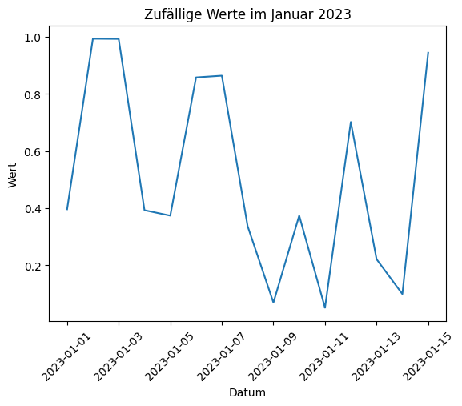
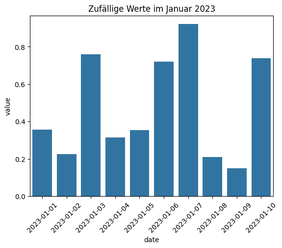

# Lösungen

### A1: Auswahl von Daten in einem bestimmten Monat 🌶️🌶️

Erstellen Sie einen DataFrame mit einer Datumsreihe vom 1. Januar 2023 bis zum 31. Dezember 2023 und wählen Sie alle Daten aus, die im März 2023 liegen.


```python
import pandas as pd

df = pd.DataFrame({'date': pd.date_range(start='2023-01-01', end='2023-12-31')})
march_data = df[df['date'].dt.month == 3]
print(march_data)
```

             date
    59 2023-03-01
    60 2023-03-02
    61 2023-03-03
    62 2023-03-04
    63 2023-03-05
    64 2023-03-06
    65 2023-03-07
    66 2023-03-08
    67 2023-03-09
    68 2023-03-10
    69 2023-03-11
    70 2023-03-12
    71 2023-03-13
    72 2023-03-14
    73 2023-03-15
    74 2023-03-16
    75 2023-03-17
    76 2023-03-18
    77 2023-03-19
    78 2023-03-20
    79 2023-03-21
    80 2023-03-22
    81 2023-03-23
    82 2023-03-24
    83 2023-03-25
    84 2023-03-26
    85 2023-03-27
    86 2023-03-28
    87 2023-03-29
    88 2023-03-30
    89 2023-03-31


### A2: Erstellen eines Liniendiagramms 🌶️🌶️

Erstellen Sie einen DataFrame mit täglichen Daten vom 1. bis 15. Januar 2023 und zufälligen Werten. Visualisieren Sie diese Daten mit einem Liniendiagramm in Matplotlib.


```python
import matplotlib.pyplot as plt
import numpy as np

df = pd.DataFrame({'date': pd.date_range(start='2023-01-01', periods=15),
                   'value': np.random.rand(15)})
plt.plot(df['date'], df['value'])
plt.title('Zufällige Werte im Januar 2023')
plt.xlabel('Datum')
plt.xticks(rotation=45)
plt.ylabel('Wert')
plt.show()
```


    

    


### A3: Erstellen eines Barplots mit Seaborn 🌶️🌶️

Erstellen Sie einen DataFrame mit täglichen Daten vom 1. bis 10. Januar 2023 und zufälligen Werten. Visualisieren Sie diese Daten mit einem Barplot in Seaborn.


```python
import seaborn as sns

df = pd.DataFrame({'date': pd.date_range(start='2023-01-01', periods=10),
                   'value': np.random.rand(10)})
sns.barplot(x='date', y='value', data=df)
plt.xticks(rotation=45)
plt.title('Zufällige Werte im Januar 2023')
plt.show()
```


    

    


### A4: Gruppierung und Durchschnittsberechnung 🌶️🌶️🌶️

Erstellen Sie einen DataFrame mit täglichen Daten und zufälligen Werten für das ganze Jahr 2023. Gruppieren Sie die Daten nach Monaten und berechnen Sie den Durchschnittswert für jeden Monat.


```python
df = pd.DataFrame({'date': pd.date_range(start='2023-01-01', end='2023-12-31'),
                   'value': np.random.rand(365)})
df['month'] = df['date'].dt.month
print("df:\n", df)

monthly_avg = df.groupby('month')['value'].mean()
print("\nmonthly_avg:\n", monthly_avg)
```

    df:
               date     value  month
    0   2023-01-01  0.002940      1
    1   2023-01-02  0.053843      1
    2   2023-01-03  0.369443      1
    3   2023-01-04  0.999298      1
    4   2023-01-05  0.095921      1
    ..         ...       ...    ...
    360 2023-12-27  0.190131     12
    361 2023-12-28  0.063205     12
    362 2023-12-29  0.866243     12
    363 2023-12-30  0.704873     12
    364 2023-12-31  0.884548     12
    
    [365 rows x 3 columns]
    
    monthly_avg:
     month
    1     0.433438
    2     0.487477
    3     0.547312
    4     0.471658
    5     0.531698
    6     0.463228
    7     0.576519
    8     0.367802
    9     0.575927
    10    0.531405
    11    0.508465
    12    0.522734
    Name: value, dtype: float64


### A5: Finden des frühesten und spätesten Datums 🌶️🌶️🌶️🌶️

Erzeugen Sie ein DataFrame mit einer Spalte date, die zufällige Datumsangaben im Jahr 2023 enthält. Finden Sie das früheste und das späteste Datum im DataFrame.


```python
df = pd.DataFrame({'date': pd.to_datetime(
                        np.random.choice(pd.date_range(start='2023-01-01', end='2023-12-31'), size=100))})
earliest = df['date'].min()
latest = df['date'].max()
print(f"Frühestes Datum: {earliest}, Spätestes Datum: {latest}")
```

    Frühestes Datum: 2023-01-10 00:00:00, Spätestes Datum: 2023-12-30 00:00:00


### A6: Hinzufügen einer Spalte für den Wochentag 🌶️🌶️🌶️

Fügen Sie in einem DataFrame mit täglichen Daten für das Jahr 2023 eine neue Spalte hinzu, die den Wochentag als String enthält (z.B. "Montag", "Dienstag", etc.).


```python
df = pd.DataFrame({'date': pd.date_range(start='2023-01-01', end='2023-12-31')})
df['weekday'] = df['date'].dt.day_name()
print(df)
```

              date    weekday
    0   2023-01-01     Sunday
    1   2023-01-02     Monday
    2   2023-01-03    Tuesday
    3   2023-01-04  Wednesday
    4   2023-01-05   Thursday
    ..         ...        ...
    360 2023-12-27  Wednesday
    361 2023-12-28   Thursday
    362 2023-12-29     Friday
    363 2023-12-30   Saturday
    364 2023-12-31     Sunday
    
    [365 rows x 2 columns]


### A7: Umwandlung von UTC zu lokaler Zeitzone 🌶️🌶️🌶️🌶️

Konvertieren Sie eine Serie von DateTime-Objekten, die in UTC vorliegen, in die lokale Zeitzone "Europe/Berlin".


```python
df = pd.DataFrame({'utc_date': pd.date_range(start='2023-01-01', periods=10, tz='UTC')})
df['local_date'] = df['utc_date'].dt.tz_convert('Europe/Berlin')
print(df)
```

                       utc_date                local_date
    0 2023-01-01 00:00:00+00:00 2023-01-01 01:00:00+01:00
    1 2023-01-02 00:00:00+00:00 2023-01-02 01:00:00+01:00
    2 2023-01-03 00:00:00+00:00 2023-01-03 01:00:00+01:00
    3 2023-01-04 00:00:00+00:00 2023-01-04 01:00:00+01:00
    4 2023-01-05 00:00:00+00:00 2023-01-05 01:00:00+01:00
    5 2023-01-06 00:00:00+00:00 2023-01-06 01:00:00+01:00
    6 2023-01-07 00:00:00+00:00 2023-01-07 01:00:00+01:00
    7 2023-01-08 00:00:00+00:00 2023-01-08 01:00:00+01:00
    8 2023-01-09 00:00:00+00:00 2023-01-09 01:00:00+01:00
    9 2023-01-10 00:00:00+00:00 2023-01-10 01:00:00+01:00


### A8: Erstellung einer Zeitreihe mit fehlenden Daten und deren Auffüllung 🌶️🌶️🌶️

Erstellen Sie einen DataFrame mit einer unvollständigen Zeitreihe für Januar 2023 (einige Tage fehlen) und füllen Sie die fehlenden Tage mit dem vorherigen gültigen Wert auf.


```python
dates = pd.date_range(start='2023-01-01', periods=31).delete([2, 5, 7])  # Entfernen einiger Tage
df = pd.DataFrame({'date': dates, 'value': np.random.rand(len(dates))})
df.set_index('date', inplace=True)
print("df vorher:\n", df)

df = df.asfreq('D', method='ffill')
print("\ndf nachher:\n", df)
```

    df vorher:
                    value
    date                
    2023-01-01  0.511503
    2023-01-02  0.129738
    2023-01-04  0.471665
    2023-01-05  0.961665
    2023-01-07  0.936817
    2023-01-09  0.340362
    2023-01-10  0.835974
    2023-01-11  0.069119
    2023-01-12  0.829665
    2023-01-13  0.015311
    2023-01-14  0.999134
    2023-01-15  0.669758
    2023-01-16  0.901722
    2023-01-17  0.807183
    2023-01-18  0.068055
    2023-01-19  0.196522
    2023-01-20  0.619397
    2023-01-21  0.588806
    2023-01-22  0.068636
    2023-01-23  0.552558
    2023-01-24  0.925848
    2023-01-25  0.084785
    2023-01-26  0.269530
    2023-01-27  0.479843
    2023-01-28  0.101022
    2023-01-29  0.390103
    2023-01-30  0.722270
    2023-01-31  0.759520
    
    df nachher:
                    value
    date                
    2023-01-01  0.511503
    2023-01-02  0.129738
    2023-01-03  0.129738
    2023-01-04  0.471665
    2023-01-05  0.961665
    2023-01-06  0.961665
    2023-01-07  0.936817
    2023-01-08  0.936817
    2023-01-09  0.340362
    2023-01-10  0.835974
    2023-01-11  0.069119
    2023-01-12  0.829665
    2023-01-13  0.015311
    2023-01-14  0.999134
    2023-01-15  0.669758
    2023-01-16  0.901722
    2023-01-17  0.807183
    2023-01-18  0.068055
    2023-01-19  0.196522
    2023-01-20  0.619397
    2023-01-21  0.588806
    2023-01-22  0.068636
    2023-01-23  0.552558
    2023-01-24  0.925848
    2023-01-25  0.084785
    2023-01-26  0.269530
    2023-01-27  0.479843
    2023-01-28  0.101022
    2023-01-29  0.390103
    2023-01-30  0.722270
    2023-01-31  0.759520

