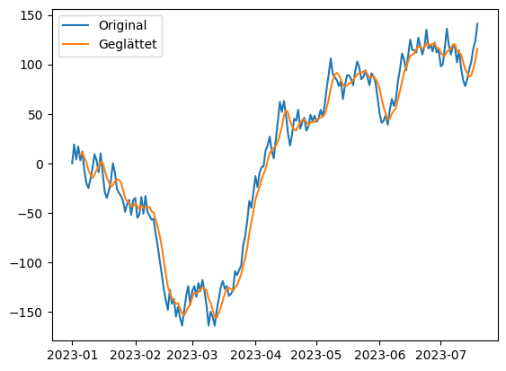
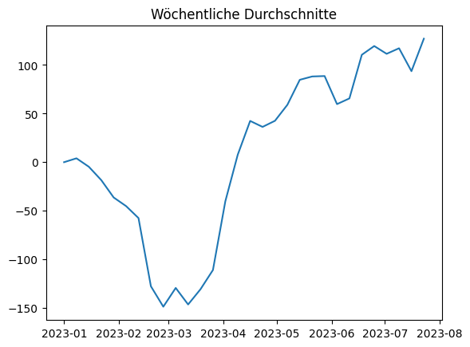
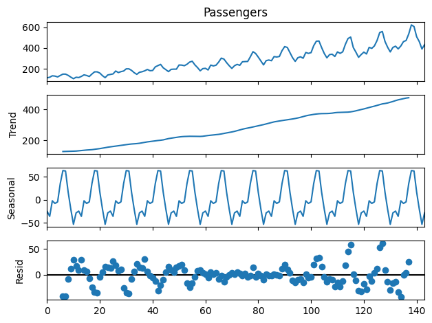
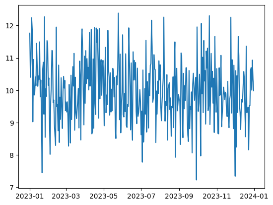
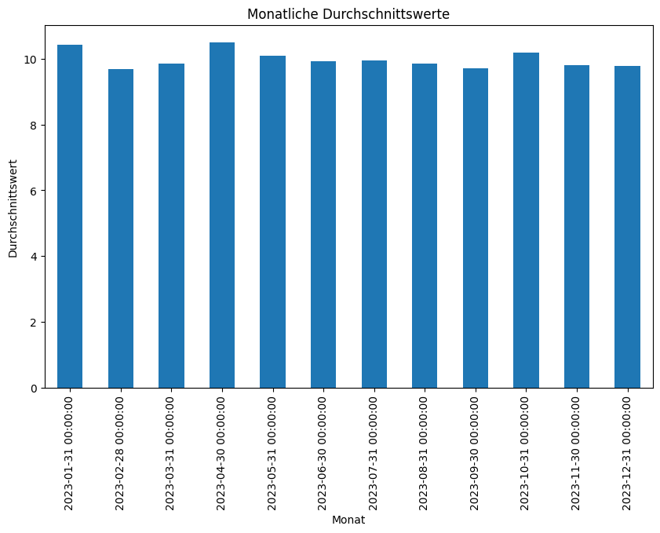

# Thema: Zeitreihenanalyse mit Pandas und Matplotib 

## Einführung [10 min]

Zeitreihenanalysen spielen in vielen Anwendungsbereichen eine zentrale Rolle. Sie ermöglichen es, Muster, Trends und saisonale Schwankungen in Datensätzen über Zeit zu erkennen und zu analysieren. Die Bibliotheken Pandas und Matplotlib in Python sind dabei unverzichtbare Werkzeuge. Pandas bietet effiziente und intuitive Methoden zur Manipulation und Analyse von Zeitreihendaten, während Matplotlib leistungsstarke Visualisierungsfunktionen bietet.

## Grundlagen von Zeitreihen

Eine Zeitreihe ist eine Sequenz von Datenpunkten, die in zeitlicher Reihenfolge erfasst werden. Typische Beispiele sind Aktienkurse, Wetterdaten, Verkaufszahlen oder Sensordaten einer Maschine. Zeitreihen sind besonders wertvoll, weil sie es ermöglichen, nicht nur den aktuellen Zustand, sondern auch die Entwicklung über Zeit zu verstehen. Dies ist entscheidend für Prognosen, Trendanalysen und sogar für das Erkennen von Anomalien.

## Anwendungen in der Praxis

- Finanzmarktanalyse: Im Finanzbereich sind Zeitreihen unverzichtbar, um Markttrends zu verstehen und Vorhersagen zu treffen. Aktienkurse und Währungswerte, die über Zeit aufgezeichnet werden, helfen Analysten, Marktverhalten zu interpretieren und informierte Investitionsentscheidungen zu treffen.

- Wettervorhersage: Meteorologen verwenden Zeitreihen, um Wetterveränderungen zu analysieren und Vorhersagen zu treffen. Durch die Analyse historischer Wetterdaten können Muster und Trends identifiziert werden, die für zukünftige Prognosen nützlich sind.

- Verkaufs- und Marketinganalyse: Unternehmen nutzen Zeitreihendaten, um Verkaufstrends zu verstehen und Marketingstrategien anzupassen. Die Analyse saisonaler Muster in Verkaufsdaten hilft bei der Planung von Werbekampagnen und Lagerbeständen.

- Maschinenwartung: Viele Maschinen besitzen heute Sensoren wie Temperatur, Druck, Durchflussgeschwindigkeit, Drehmomente, etc. Diese werden oft mit hohen Abtastfrequnzen geliefert, so dass pro Minute Maschinenbetrieb riesige Mengen Zeitreihen zur Verfügung stehen. Diese können dann genutzt werden, um Modelle des Maschinenverhaltens zu erlernen, die wiederum zum Beispiel Vorhersagen ermöglichen können, Maschinenausfälle vorherzusagen.

## Bedeutung von Pandas und Matplotlib bei der Zeitreihenverarbeitung

Pandas ist besonders nützlich für die Handhabung und Analyse von Zeitreihendaten, da es Funktionen bietet, um Datums- und Zeitstempel effizient zu verarbeiten. Es erleichtert das Gruppieren, Filtern und Aggregieren von Daten basierend auf Zeitintervallen. Matplotlib ergänzt Pandas, indem es ermöglicht, die Ergebnisse der Zeitreihenanalyse visuell darzustellen. Graphen und Charts helfen dabei, Trends und Muster schnell zu erkennen und zu kommunizieren.

Die Arbeit mit Zeitreihen in Pandas und Matplotlib hat einen hohen Praxisbezug in vielen Bereichen, von der Finanzanalyse über die Meteorologie, Marketing und die Maschinenwartung. Diese Werkzeuge bieten eine leistungsstarke Kombination aus Analyse- und Visualisierungsfunktionen, die es ermöglichen, wertvolle Einblicke aus Zeitreihendaten zu gewinnen und fundierte Entscheidungen zu treffen.

## Codebeispiele [50 min]

### Beispiel 1: Daten in eine Zeitreihe mit Datum als Index umwandeln


```python
import pandas as pd

# Beispiel-Datensatz
data = {'Datum': ['2023-01-01', '2023-01-02', '2023-01-03', '2023-01-04', '2023-01-05'],
        'Wert': [100, 200, 300, 250, 290]}
df = pd.DataFrame(data)

# Umwandlung der 'Datum'-Spalte in ein Datumsformat
df['Datum'] = pd.to_datetime(df['Datum'])

# Setzen der 'Datum'-Spalte als Index
df.set_index('Datum', inplace=True)

print(df)
```

                Wert
    Datum           
    2023-01-01   100
    2023-01-02   200
    2023-01-03   300
    2023-01-04   250
    2023-01-05   290


In diesem Beispiel wird zuerst ein Pandas DataFrame df mit einer Spalte für Daten ('Datum') und einer Spalte für Werte ('Wert') erstellt. Anschließend wird die 'Datum'-Spalte in ein Python Datumsformat umgewandelt, damit Pandas sie als Zeitreihe behandeln kann. Schließlich wird diese Spalte als Index des DataFrames gesetzt, was eine wichtige Voraussetzung für die meisten Zeitreihenoperationen ist.

### Beispiel 2: Zeitreihendaten glätten


```python
import matplotlib.pyplot as plt
import numpy as np

N = 200
x = [0]
for i in range(N-1):
    x.append( x[-1] + np.random.randint(-20,21) )

# Erzeugen einer einfachen Zeitreihe
ts = pd.Series(x, 
               index=pd.date_range(start='2023-01-01', periods=N))

# Glätten der Daten mit einem gleitenden Durchschnitt
smoothed_ts = ts.rolling(window=5).mean()

print(ts.head(10))
print(smoothed_ts.head(10))

# Plotten der Original- und geglätteten Zeitreihe
plt.plot(ts, label='Original')
plt.plot(smoothed_ts, label='Geglättet')
plt.legend()
plt.show()
```

    2023-01-01     0
    2023-01-02    19
    2023-01-03     4
    2023-01-04    17
    2023-01-05     3
    2023-01-06    12
    2023-01-07    -7
    2023-01-08   -20
    2023-01-09   -25
    2023-01-10   -16
    Freq: D, dtype: int64
    2023-01-01     NaN
    2023-01-02     NaN
    2023-01-03     NaN
    2023-01-04     NaN
    2023-01-05     8.6
    2023-01-06    11.0
    2023-01-07     5.8
    2023-01-08     1.0
    2023-01-09    -7.4
    2023-01-10   -11.2
    Freq: D, dtype: float64


    

    


In diesem Beispiel wird eine einfache Zeitreihe ts mit zufälligen Werten erzeugt. Die Zeitreihe wird dann mit der Methode rolling() geglättet, die einen gleitenden Durchschnitt berechnet (hier über ein Fenster von 5 Tagen). Die Original- und die geglättete Zeitreihe werden anschließend mit Matplotlib geplottet, um den Glättungseffekt zu visualisieren.

### Beispiel 3: Zeitreihendaten auf eine bestimmte Periode resampling


```python
# Resampling der Zeitreihe auf wöchentliche Daten
weekly_ts = ts.resample('W').mean()
print(weekly_ts.head(10))

# Plotten der wöchentlich aggregierten Zeitreihe
plt.plot(weekly_ts)
plt.title('Wöchentliche Durchschnitte')
plt.show()
```

    2023-01-01      0.000000
    2023-01-08      4.000000
    2023-01-15     -4.714286
    2023-01-22    -18.428571
    2023-01-29    -36.285714
    2023-02-05    -45.142857
    2023-02-12    -57.428571
    2023-02-19   -127.571429
    2023-02-26   -148.571429
    2023-03-05   -129.285714
    Freq: W-SUN, dtype: float64


    

    


In diesem Beispiel wird die zuvor erstellte Zeitreihe ts auf eine wöchentliche Frequenz umgerechnet, indem das resample()-Verfahren verwendet wird. Für jede Woche wird der Durchschnitt der Werte berechnet. Das Ergebnis wird dann als Linienplot dargestellt, um die wöchentlichen Durchschnittswerte zu visualisieren.

### Beispiel 4: Zeitreihe auf Trend und Saisonalität untersuchen

Installieren Sie jetzt zuerst das Paket statsmodels mit:

    pip install statsmodels

In einer Jupyter-Notebook-Codezelle können Sie dies mit

    !pip install statsmodels

tun.


```python
from statsmodels.tsa.seasonal import seasonal_decompose

df = pd.read_csv("https://raw.githubusercontent.com/jbrownlee/Datasets/master/airline-passengers.csv")
print(df.head())

passengers = df["Passengers"]

# Annahme: ts hat eine tägliche Frequenz
result = seasonal_decompose(passengers, model='additive', period=12)

# Plotten der Komponenten
result.plot()
plt.show()
```

         Month  Passengers
    0  1949-01         112
    1  1949-02         118
    2  1949-03         132
    3  1949-04         129
    4  1949-05         121


    

    


Hier wird die Bibliothek statsmodels verwendet, um eine Zeitreihe in ihre Komponenten zu zerlegen: Trend, Saisonalität und Restkomponente. Dies geschieht mit der Funktion seasonal_decompose, wobei angenommen wird, dass die Zeitreihe eine monatliche Frequenz hat und die Saisonalität auf einer jährlichen Basis (Periodenlänge 12 Monate) auftritt. Das Ergebnis wird in separaten Plots dargestellt, um die verschiedenen Komponenten der Zeitreihe zu visualisieren.

### Beispiel 5: Zeitreihen-Daten anhand von Monatsdurchschnitten aggregieren


```python
# Erzeugen einer Zeitreihe mit täglichen Daten über ein Jahr
np.random.seed(0)
daily_data = np.random.randn(365) + 10  # Zufällige Daten um den Mittelwert 10
dates = pd.date_range(start='2023-01-01', periods=365, freq='D')
daily_ts = pd.Series(daily_data, index=dates)

plt.plot(daily_ts)
plt.show()

# Monatsdurchschnitte berechnen
monthly_avg = daily_ts.resample('M').mean()

# Plotten der monatlichen Durchschnittswerte
plt.figure(figsize=(10, 6))
monthly_avg.plot(kind='bar')
plt.title('Monatliche Durchschnittswerte')
plt.xlabel('Monat')
plt.ylabel('Durchschnittswert')
plt.show()
```


    

    


    

    


In diesem Beispiel wird zunächst eine Zeitreihe mit zufälligen täglichen Werten über ein Jahr erstellt. Diese Werte sind um den Mittelwert 10 zentriert. Die Zeitreihe wird dann auf Monatsbasis neu gruppiert, indem die Methode resample('M') verwendet wird, und für jeden Monat wird der Durchschnittswert berechnet. Diese monatlichen Durchschnittswerte werden als Balkendiagramm dargestellt, um die Veränderungen über die Monate hinweg zu visualisieren. Dies ist besonders nützlich, um saisonale Trends oder langfristige Veränderungen in den Daten zu erkennen.

## Aufgaben [150 min]

### A1: Zeitreihendatensatz erstellen 🌶️🌶️

Erstellen Sie eine Pandas Zeitreihe aus einem Datensatz mit täglichen Daten für ein Jahr. Verwenden Sie dabei zufällige Werte.
Zudem soll es einen linearen Trend geben.

### A2: Zeitreihe visualisieren 🌶️

Visualisieren Sie die erstellte Zeitreihe aus Aufgabe 1 mit Matplotlib.

### A3: Gleitenden Durchschnitt berechnen 🌶️🌶️

Berechnen Sie den gleitenden Durchschnitt über 7 Tage für die Zeitreihe aus Aufgabe 1 und plotten Sie das Ergebnis.

### A4: Zeitreihe auf Monatsbasis aggregieren 🌶️🌶️🌶️

Aggregieren Sie die Daten aus Aufgabe 1 auf Monatsbasis und visualisieren Sie die monatlichen Durchschnittswerte.

### A5: Zeitreihen-Daten normalisieren 🌶️🌶️🌶️

Normalisieren Sie die Werte der ersten Zeitreihe aus Aufgabe 1, so dass sie zwischen 0 und 1 liegen, und visualisieren Sie das Ergebnis.

### A6: Zeitreihe mit saisonalem Muster 🌶️🌶️

Erstellen Sie eine Zeitreihe mit einem klaren saisonalen Muster und visualisieren Sie diese.

### A7: Zeitreihen mit Seaborn als Heatmap visualisieren 🌶️🌶️

Verwenden Sie Seaborn, um eine Heatmap der monatlichen Daten aus Aufgabe 4 zu erstellen.

In dieser Aufgabe wird die ursprüngliche Zeitreihe auf eine zweidimensionale Form umstrukturiert, um eine Heatmap zu erstellen. Dabei wird jeder Monat gegen jeden Tag im Monat abgebildet. Seaborn's heatmap-Funktion wird verwendet, um die Daten zu visualisieren, wobei unterschiedliche Farben die Intensität der Werte an jedem Tag anzeigen.

### A8: Zukünftige Werte einer Zeitreihe prognostizieren 🌶️🌶️🌶️🌶️

Verwenden Sie eine einfache lineare Regression aus scikit-learn, um die nächsten 30 Tage der Zeitreihe aus Aufgabe 1 zu prognostizieren.

Falls Sie scikit-learn noch nicht installiert haben, können Sie dies mit

    pip install scikit-learn

### A9: Zeitreihen-Daten in Perioden unterteilen und vergleichen 🌶️🌶️🌶️

Unterteilen Sie die Zeitreihe aus Aufgabe 1 in zwei gleiche Perioden und vergleichen Sie die statistischen Kennzahlen (Mittelwert, Median, Standardabweichung) dieser Perioden.

Die Zeitreihe wird in dieser Aufgabe in zwei gleich lange Perioden unterteilt. Für jede Periode werden statistische Kennzahlen wie Mittelwert, Median und Standardabweichung berechnet. Diese Kennzahlen werden dann verglichen, um festzustellen, ob es signifikante Unterschiede zwischen den beiden Perioden gibt. Solche Analysen sind nützlich, um Veränderungen im Zeitverlauf zu verstehen, die auf Trends, saisonale Einflüsse oder andere Faktoren hindeuten könnten.

[Lösungen](pandas_matplotlib_zeitreihen_loesungen.md)


```python

```
