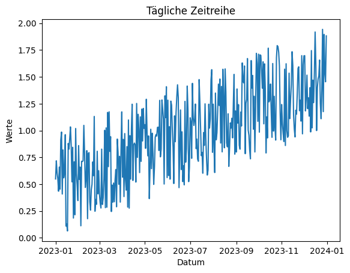
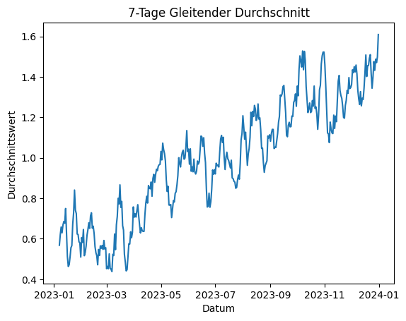
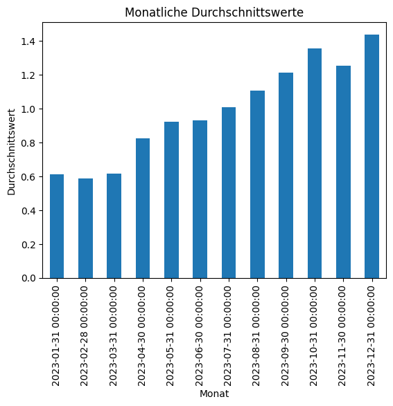
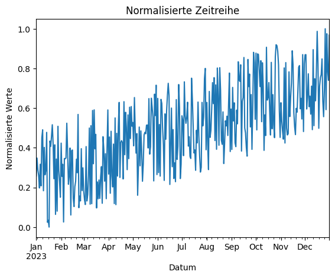
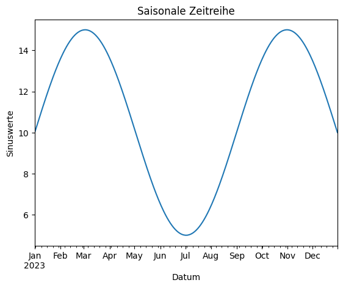
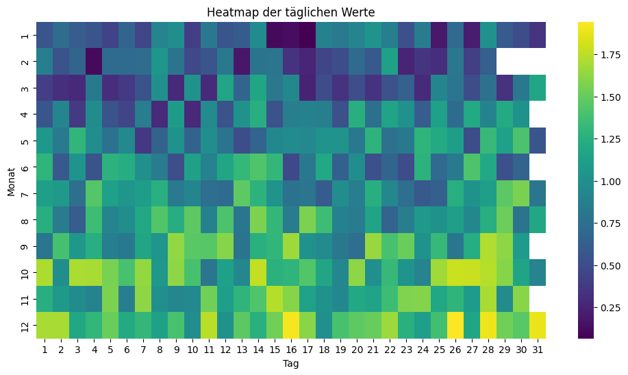
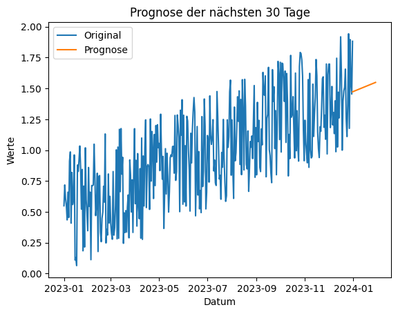

# Lösungen

### A1: Zeitreihendatensatz erstellen 🌶️🌶️

<details>
<summary>
🎦 Lösungsvideo
</summary>
<iframe width="560" height="315" src="https://www.youtube.com/embed/Y9-xkfsY1Ro?si=iepuH5D_uphCKqep" title="YouTube video player" frameborder="0" allow="accelerometer; autoplay; clipboard-write; encrypted-media; gyroscope; picture-in-picture; web-share" allowfullscreen></iframe>
</details>

Erstellen Sie eine Pandas Zeitreihe aus einem Datensatz mit täglichen Daten für ein Jahr. Verwenden Sie dabei zufällige Werte.
Zudem soll es einen linearen Trend geben.


```python
import pandas as pd
import numpy as np

# Datensatz erstellen
np.random.seed(0)
data = np.random.rand(365) + np.linspace(0,1,365)
dates = pd.date_range(start='2023-01-01', periods=365)
time_series = pd.Series(data, index=dates)

print(time_series.head())
```

    2023-01-01    0.548814
    2023-01-02    0.717937
    2023-01-03    0.608258
    2023-01-04    0.553125
    2023-01-05    0.434644
    Freq: D, dtype: float64


### A2: Zeitreihe visualisieren 🌶️

<details>
<summary>
🎦 Lösungsvideo
</summary>
<iframe width="560" height="315" src="https://www.youtube.com/embed/Edko1ulcQug?si=tPBwLv3657Ku_BER" title="YouTube video player" frameborder="0" allow="accelerometer; autoplay; clipboard-write; encrypted-media; gyroscope; picture-in-picture; web-share" allowfullscreen></iframe>
</details>


Visualisieren Sie die erstellte Zeitreihe aus Aufgabe 1 mit Matplotlib.


```python
import matplotlib.pyplot as plt

# Zeitreihe plotten
plt.plot(time_series)
plt.title('Tägliche Zeitreihe')
plt.xlabel('Datum')
plt.ylabel('Werte')
plt.show()
```


    

    


### A3: Gleitenden Durchschnitt berechnen 🌶️🌶️

<details>
<summary>
🎦 Lösungsvideo
</summary>
<iframe width="560" height="315" src="https://www.youtube.com/embed/LlRAK8gkli4?si=M884urL7D6woOHQm" title="YouTube video player" frameborder="0" allow="accelerometer; autoplay; clipboard-write; encrypted-media; gyroscope; picture-in-picture; web-share" allowfullscreen></iframe>
</details>


Berechnen Sie den gleitenden Durchschnitt über 7 Tage für die Zeitreihe aus Aufgabe 1 und plotten Sie das Ergebnis.


```python
# Gleitenden Durchschnitt berechnen
rolling_series = time_series.rolling(window=7).mean()

# Plotten
plt.plot(rolling_series)
plt.title('7-Tage Gleitender Durchschnitt')
plt.xlabel('Datum')
plt.ylabel('Durchschnittswert')
plt.show()
```


    

    


### A4: Zeitreihe auf Monatsbasis aggregieren 🌶️🌶️🌶️

<details>
<summary>
🎦 Lösungsvideo
</summary>
<iframe width="560" height="315" src="https://www.youtube.com/embed/1Rfb1O6lfL8?si=iqdTvd2OmUmQLeKZ" title="YouTube video player" frameborder="0" allow="accelerometer; autoplay; clipboard-write; encrypted-media; gyroscope; picture-in-picture; web-share" allowfullscreen></iframe>
</details>


Aggregieren Sie die Daten aus Aufgabe 1 auf Monatsbasis und visualisieren Sie die monatlichen Durchschnittswerte.


```python
# Monatsdurchschnitte berechnen
monthly_avg = time_series.resample('M').mean()

# Visualisieren
monthly_avg.plot(kind='bar')
plt.title('Monatliche Durchschnittswerte')
plt.xlabel('Monat')
plt.ylabel('Durchschnittswert')
plt.show()
```


    

    


### A5: Zeitreihen-Daten normalisieren 🌶️🌶️🌶️

<details>
<summary>
🎦 Lösungsvideo
</summary>
<iframe width="560" height="315" src="https://www.youtube.com/embed/mES3-YpmXiw?si=-zOpcnNdueOzw5tY" title="YouTube video player" frameborder="0" allow="accelerometer; autoplay; clipboard-write; encrypted-media; gyroscope; picture-in-picture; web-share" allowfullscreen></iframe>
</details>


Normalisieren Sie die Werte der ersten Zeitreihe aus Aufgabe 1, so dass sie zwischen 0 und 1 liegen, und visualisieren Sie das Ergebnis.


```python
# Normalisierung
normalized_series = (time_series - time_series.min()) / (time_series.max() - time_series.min())

# Visualisierung
normalized_series.plot()
plt.title('Normalisierte Zeitreihe')
plt.xlabel('Datum')
plt.ylabel('Normalisierte Werte')
plt.show()
```


    

    


### A6: Zeitreihe mit saisonalem Muster 🌶️🌶️

<details>
<summary>
🎦 Lösungsvideo
</summary>
<iframe width="560" height="315" src="https://www.youtube.com/embed/nyb-S-F-iqU?si=CWOlPE-bFRzaLGLX" title="YouTube video player" frameborder="0" allow="accelerometer; autoplay; clipboard-write; encrypted-media; gyroscope; picture-in-picture; web-share" allowfullscreen></iframe>
</details>


Erstellen Sie eine Zeitreihe mit einem klaren saisonalen Muster und visualisieren Sie diese.


```python
# Zeitreihe mit saisonalem Muster erstellen
saison_data = np.sin(np.linspace(0, 3 * np.pi, 365))

dates = pd.date_range(start='2023-01-01', periods=365)
saison_series = pd.Series(saison_data, index=dates) * 5.0 + 10

# Visualisierung
saison_series.plot()
plt.title('Saisonale Zeitreihe')
plt.xlabel('Datum')
plt.ylabel('Sinuswerte')
plt.show()
```


    

    


### A7: Zeitreihen mit Seaborn als Heatmap visualisieren 🌶️🌶️

<details>
<summary>
🎦 Lösungsvideo
</summary>
<iframe width="560" height="315" src="https://www.youtube.com/embed/MV2aNVbTIoU?si=z-fXrkR3J2YoR2at" title="YouTube video player" frameborder="0" allow="accelerometer; autoplay; clipboard-write; encrypted-media; gyroscope; picture-in-picture; web-share" allowfullscreen></iframe>
</details>


Verwenden Sie Seaborn, um eine Heatmap der monatlichen Daten aus Aufgabe 4 zu erstellen.


```python
import seaborn as sns

# Daten für Heatmap vorbereiten
heatmap_data = time_series.groupby([time_series.index.month, time_series.index.day]).mean().unstack()

# Heatmap erstellen
plt.figure(figsize=(12, 6))
sns.heatmap(heatmap_data, cmap='viridis')
plt.title('Heatmap der täglichen Werte')
plt.xlabel('Tag')
plt.ylabel('Monat')
plt.show()
```


    

    


In dieser Aufgabe wird die ursprüngliche Zeitreihe auf eine zweidimensionale Form umstrukturiert, um eine Heatmap zu erstellen. Dabei wird jeder Monat gegen jeden Tag im Monat abgebildet. Seaborn's heatmap-Funktion wird verwendet, um die Daten zu visualisieren, wobei unterschiedliche Farben die Intensität der Werte an jedem Tag anzeigen.

### A8: Zukünftige Werte einer Zeitreihe prognostizieren 🌶️🌶️🌶️🌶️

<details>
<summary>
🎦 Lösungsvideo
</summary>
<iframe width="560" height="315" src="https://www.youtube.com/embed/kntr1N1ld5E?si=sAbPMrS5sG_8deMO" title="YouTube video player" frameborder="0" allow="accelerometer; autoplay; clipboard-write; encrypted-media; gyroscope; picture-in-picture; web-share" allowfullscreen></iframe>
</details>


Verwenden Sie eine einfache lineare Regression aus scikit-learn, um die nächsten 30 Tage der Zeitreihe aus Aufgabe 1 zu prognostizieren.

Falls Sie scikit-learn noch nicht installiert haben, können Sie dies mit

    pip install scikit-learn


```python
from sklearn.linear_model import LinearRegression

# Linear Regression Modell
model = LinearRegression()
X = np.array(range(len(time_series))).reshape(-1, 1)
y = time_series.values
model.fit(X, y)

# Prognose für die nächsten 30 Tage
X_future = np.array(range(len(time_series), len(time_series) + 30)).reshape(-1, 1)
future_predictions = model.predict(X_future)

# Plotten der Prognose
plt.plot(time_series.index, time_series, label='Original')
plt.plot(pd.date_range(time_series.index[-1], periods=30), future_predictions, label='Prognose')
plt.title('Prognose der nächsten 30 Tage')
plt.xlabel('Datum')
plt.ylabel('Werte')
plt.legend()
plt.show()
```


    

    


### A9: Zeitreihen-Daten in Perioden unterteilen und vergleichen 🌶️🌶️🌶️

<details>
<summary>
🎦 Lösungsvideo
</summary>
<iframe width="560" height="315" src="https://www.youtube.com/embed/LFWNZqMR2Dk?si=Ha-R-n9MkU_VKp5D" title="YouTube video player" frameborder="0" allow="accelerometer; autoplay; clipboard-write; encrypted-media; gyroscope; picture-in-picture; web-share" allowfullscreen></iframe>
</details>


Unterteilen Sie die Zeitreihe aus Aufgabe 1 in zwei gleiche Perioden und vergleichen Sie die statistischen Kennzahlen (Mittelwert, Median, Standardabweichung) dieser Perioden.


```python
# Zeitreihe in zwei Perioden unterteilen
half = len(time_series) // 2
first_period = time_series[:half]
second_period = time_series[half:]

# Statistische Kennzahlen berechnen
stats_first = first_period.describe()
stats_second = second_period.describe()

# Ergebnisse ausgeben
print("Statistiken Erste Periode:\n", stats_first)
print("\nStatistiken Zweite Periode:\n", stats_second)
```

    Statistiken Erste Periode:
     count    182.000000
    mean       0.751999
    std        0.320487
    min        0.064174
    25%        0.512766
    50%        0.762013
    75%        0.997332
    max        1.426071
    dtype: float64
    
    Statistiken Zweite Periode:
     count    183.000000
    mean       1.229981
    std        0.322349
    min        0.585118
    25%        0.976382
    50%        1.224639
    75%        1.494251
    max        1.942669
    dtype: float64


Die Zeitreihe wird in dieser Aufgabe in zwei gleich lange Perioden unterteilt. Für jede Periode werden statistische Kennzahlen wie Mittelwert, Median und Standardabweichung berechnet. Diese Kennzahlen werden dann verglichen, um festzustellen, ob es signifikante Unterschiede zwischen den beiden Perioden gibt. Solche Analysen sind nützlich, um Veränderungen im Zeitverlauf zu verstehen, die auf Trends, saisonale Einflüsse oder andere Faktoren hindeuten könnten.
