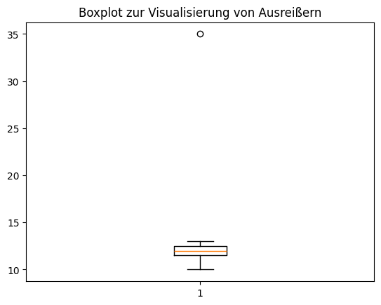
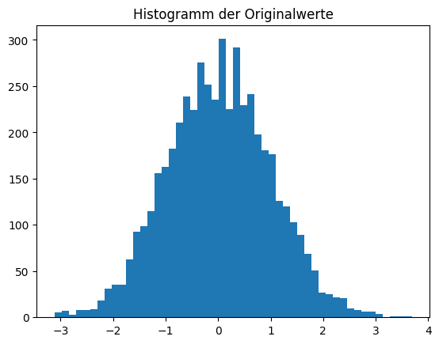
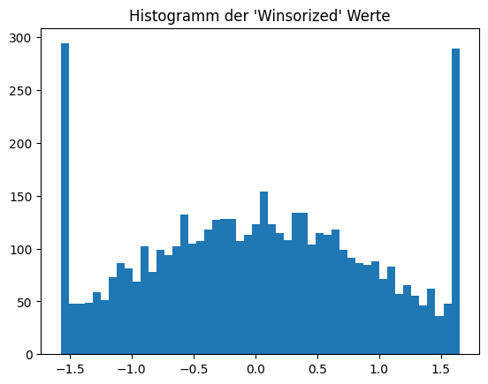

# Exkurs: Pandas und Outlier (Ausreißer)

## Einführung [20 min]

## Pandas und das Management von Ausreißern in Datensätzen

Im Bereich der Datenanalyse sind Ausreißer sowohl eine Herausforderung als auch eine Gelegenheit, tiefere Einsichten in Datensätze zu gewinnen. Die Python-Bibliothek Pandas, ein leistungsstarkes Werkzeug für Datenmanipulation und -analyse, bietet verschiedene Methoden, um Ausreißer zu identifizieren und zu behandeln.

## Was sind Ausreißer?

Ausreißer sind Datenpunkte, die signifikant von anderen Beobachtungen abweichen. Sie können aufgrund verschiedener Faktoren wie Messfehler, Datenerfassungsprobleme oder einfach durch natürliche Variabilität in den Daten entstehen. Die Identifizierung von Ausreißern ist entscheidend, da sie die Ergebnisse statistischer Analysen erheblich verzerren können.

## Ausreißererkennung mit Pandas

Die Identifizierung von Ausreißern beginnt mit der grundlegenden Datenexploration. Pandas stellt Funktionen wie `describe()`, `mean()`, `median()`, und `std`() zur Verfügung, um einen ersten Überblick über die Daten zu erhalten. Diese statistischen Maßnahmen helfen dabei, Anomalien in den Daten zu erkennen.

## Methoden zur Ausreißererkennung

- Z-Score: Diese Methode verwendet die Standardabweichung, um zu bestimmen, wie weit ein Datenpunkt vom Mittelwert entfernt ist. In Pandas kann der Z-Score leicht berechnet werden, um Ausreißer zu identifizieren.

- IQR-Score: Der Interquartilsabstand (IQR) ist ein weiteres robustes Maß zur Ausreißererkennung. Pandas ermöglicht die Berechnung des IQR und das Identifizieren von Datenpunkten, die außerhalb des 1,5 * IQR-Bereichs liegen.


## Behandlung von Ausreißern

Sobald Ausreißer identifiziert sind, gibt es verschiedene Strategien zu ihrer Behandlung:

- Entfernung: Eine direkte Methode ist das Entfernen der Ausreißer aus dem Datensatz. Dies ist sinnvoll, wenn die Anzahl der Ausreißer gering ist und ihre Entfernung die Integrität des Datensatzes nicht beeinträchtigt.

- Transformation: Manchmal können Ausreißer durch Transformationen wie Logarithmierung oder Box-Cox-Transformation normalisiert werden.

- Imputation: In einigen Fällen können Ausreißer durch andere Werte ersetzt werden, z. B. durch den Median oder Mittelwert der Daten.

## Codebeispiele [50 min]

### Beispiel 1: Erkennung von Ausreißern mit dem Z-Score


```python
import pandas as pd
from scipy import stats

# Erstellen eines Beispieldatensatzes
data = {'Werte': [10, 12, 12, 13, 12, 11, 40]}
df = pd.DataFrame(data)
print("Werte:\n", df)

# Berechnung des Z-Scores
df['Z-Score'] = stats.zscore(df['Werte'])

# Identifikation von Ausreißern
ausreißer = df[df['Z-Score'].abs() > 2]
print("\nAusreißer:\n", ausreißer)
```

    Werte:
        Werte
    0     10
    1     12
    2     12
    3     13
    4     12
    5     11
    6     40
    
    Ausreißer:
        Werte   Z-Score
    6     40  2.440052


In diesem Beispiel verwenden wir den Z-Score, um Ausreißer in einem Pandas DataFrame zu identifizieren. Der Z-Score ist eine Maßzahl, die angibt, wie viele Standardabweichungen ein Datenpunkt vom Mittelwert entfernt ist. Zuerst erstellen wir einen DataFrame mit einer Spalte von Werten. Dann berechnen wir den Z-Score für jeden Wert in dieser Spalte. Schließlich identifizieren wir Ausreißer als jene Werte, deren Z-Score absolut größer als 2 ist, was bedeutet, dass sie signifikant vom Mittelwert abweichen.

### Beispiel 2: Entfernung von Ausreißern mit IQR-Methode


```python
import pandas as pd

# Erstellen eines Beispieldatensatzes
data = {'Werte': [10, 12, 12, 13, 12, 11, 100]}
df = pd.DataFrame(data)
print("df:\n", df)

# Berechnung des Interquartilbereichs (IQR)
Q1 = df['Werte'].quantile(0.25)
Q3 = df['Werte'].quantile(0.75)
IQR = Q3 - Q1

# Filtern der Datenpunkte innerhalb des IQR
bereinigter_df = df[(df['Werte'] >= (Q1 - 1.5 * IQR)) & (df['Werte'] <= (Q3 + 1.5 * IQR))]
print("\nBereinigter df:\n", bereinigter_df)
```

    df:
        Werte
    0     10
    1     12
    2     12
    3     13
    4     12
    5     11
    6    100
    
    Bereinigter df:
        Werte
    0     10
    1     12
    2     12
    3     13
    4     12
    5     11


Dieses Beispiel zeigt, wie man mit der IQR-Methode Ausreißer entfernt. Der Interquartilbereich (IQR) ist die Differenz zwischen dem 25. und dem 75. Perzentil der Daten. Datenpunkte, die mehr als 1,5-mal den IQR unter dem 25. Perzentil oder über dem 75. Perzentil liegen, werden als Ausreißer betrachtet. In diesem Code berechnen wir den IQR und entfernen alle Datenpunkte, die außerhalb dieses Bereichs liegen, um einen bereinigten DataFrame zu erhalten.

### Beispiel 3: Visualisierung von Ausreißern mit Boxplot


```python
import pandas as pd
import matplotlib.pyplot as plt

# Erstellen eines Beispieldatensatzes
data = {'Werte': [10, 12, 12, 13, 12, 11, 35]}
df = pd.DataFrame(data)

# Erstellung eines Boxplots
plt.boxplot(df['Werte'])
plt.title('Boxplot zur Visualisierung von Ausreißern')
plt.show()
```


    

    


In diesem Beispiel verwenden wir einen Boxplot, um Ausreißer in einem Pandas DataFrame zu visualisieren. Boxplots sind nützlich, um die Verteilung der Daten und potenzielle Ausreißer zu zeigen. Der zentrale Kasten des Boxplots repräsentiert den Interquartilbereich, während die Linien (Whiskers) typischerweise 1,5-mal den IQR darstellen. Datenpunkte außerhalb dieser Whiskers gelten als Ausreißer.

### Beispiel 4: Erkennung von Ausreißern mit der Standardabweichung


```python
import pandas as pd

# Erstellen eines Beispieldatensatzes
data = {'Werte': [10, 12, 145, 13, -155, 12, 11, 12, 8, 9, 10]}
df = pd.DataFrame(data)
print("df:\n", df)

# Berechnung des Mittelwerts und der Standardabweichung
mittelwert = df['Werte'].mean()
standardabweichung = df['Werte'].std()

# Identifikation von Ausreißern
ausreißer = df[(df['Werte'] < mittelwert - 2 * standardabweichung) | (df['Werte'] > mittelwert + 2 * standardabweichung)]
print("\nausreißer:\n", ausreißer)
```

    df:
         Werte
    0      10
    1      12
    2     145
    3      13
    4    -155
    5      12
    6      11
    7      12
    8       8
    9       9
    10     10
    
    ausreißer:
        Werte
    2    145
    4   -155


In diesem Beispiel identifizieren wir Ausreißer mit Hilfe der Standardabweichung. Zuerst berechnen wir den Mittelwert und die Standardabweichung der Werte in unserem DataFrame. Anschließend identifizieren wir Ausreißer als jene Werte, die mehr als zwei Standardabweichungen vom Mittelwert entfernt sind. Diese Methode ist hilfreich, um Ausreißer zu erkennen, die weit von der typischen Datenverteilung entfernt sind.

### Beispiel 5: Umgang mit Ausreißern durch Winsorizing


```python
import pandas as pd
from scipy.stats.mstats import winsorize
import numpy as np
import matplotlib.pyplot as plt

# Erstellen eines Beispieldatensatzes
data = np.random.normal(size=5000)
df = pd.DataFrame({"Werte" : data})
print("df:\n", df)
plt.title("Histogramm der Originalwerte")
plt.hist(df["Werte"], bins=50)
plt.show()

# Anwendung von Winsorizing
df['Winsorized'] = winsorize(df['Werte'], limits=[0.05, 0.05])
plt.title("Histogramm der 'Winsorized' Werte")
plt.hist(df["Winsorized"], bins=50)
plt.show()
```

    df:
              Werte
    0     0.170841
    1    -0.932804
    2    -0.541506
    3    -0.321670
    4     0.579846
    ...        ...
    4995  0.318654
    4996 -0.192907
    4997  0.259052
    4998  0.975110
    4999  1.871599
    
    [5000 rows x 1 columns]


    

    


    

    


In diesem Beispiel zeigen wir, wie man Ausreißer mit der Winsorizing-Technik behandelt. Winsorizing ist ein Weg, um extreme Werte in den Daten zu begrenzen, indem die Ausreißer am oberen und unteren Ende der Verteilung durch die nächstliegenden Werte innerhalb der festgelegten Grenzen ersetzt werden. In unserem Code begrenzen wir die extremen Werte auf die 5% an beiden Enden der Verteilung. Diese Methode ist nützlich, um den Einfluss von extremen Ausreißern auf die Datenanalyse zu reduzieren, ohne die Datenpunkte vollständig zu entfernen.

## Aufgaben [100 min]

### A1: Erkennung von Ausreißern mit Z-Score 🌶️

Gegeben ist ein DataFrame df mit einer Spalte 'Werte'. Berechne den Z-Score für jeden Wert und identifiziere Werte, die als Ausreißer gelten (Z-Score > 2 oder < -2).

### A2: Entfernen von Ausreißern mit IQR 🌶️

Gegeben ist ein DataFrame df mit einer Spalte 'Werte'. Entferne Ausreißer mit der IQR-Methode.

### A3: Visualisierung von Ausreißern 🌶️🌶️

Erstelle einen Boxplot für den DataFrame df mit der Spalte 'Werte', um Ausreißer zu visualisieren.

### A4: Ausreißererkennung mit Standardabweichung 🌶️

Erstelle zuerst ein DataFrame df mit Werten.

Identifiziere dann Ausreißer, die mehr als zwei Standardabweichungen vom Mittelwert entfernt sind.

### A5: Winsorizing von Daten 🌶️🌶️

Wende die Winsorizing-Technik auf `df['Werte']` an, um extreme Ausreißer zu begrenzen.

### A6: Erstellung eines bereinigten Datensatzes 🌶️🌶️

Erstelle ein DataFrame mit einer Spalte 'Werte' und dann einen bereinigten DataFrame `df_clean`, indem du Ausreißer in df['Werte'] entfernst, die mehr als 1.5 IQR vom oberen oder unteren Quartil entfernt sind.

### A7: Mittelwertberechnung mit und ohne Ausreißer 🌶️🌶️

Berechne den Mittelwert von `df['Werte']` sowohl mit als auch ohne Ausreißer, die mehr als zwei Standardabweichungen vom Mittelwert entfernt sind.

### A8: Erkennung von Ausreißern in mehreren Spalten 🌶️🌶️🌶️

Gegeben ist ein DataFrame `df` mit den Spalten 'Werte1' und 'Werte2'. Identifiziere Ausreißer in beiden Spalten mit der Z-Score-Methode.

### A9: Filtern von Ausreißern mit einem benutzerdefinierten Schwellenwert 🌶️🌶️🌶️

Erstelle eine Funktion `filter_ausreißer(df, schwellenwert)`, die Ausreißer aus `df['Werte']` entfernt, die mehr als den angegebenen Schwellenwert vom Mittelwert entfernt sind.

### A10: Anwendung von Winsorizing auf einen Datensatz 🌶️🌶️🌶️

Wende Winsorizing auf `df['Werte']` an, um die oberen und unteren 10% der Werte zu begrenzen, und vergleiche die Mittelwerte vor und nach dem Winsorizing.

[Lösungen](pandas_outlier_loesungen.md)
