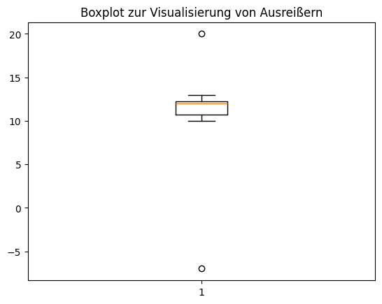

# Lösungen

### A1: Erkennung von Ausreißern mit Z-Score 🌶️

<details>
<summary>
🎦 Lösungsvideo
</summary>
<iframe width="560" height="315" src="https://www.youtube.com/embed/J5nE1iFNjWA?si=pYtN3-ITkiEIZQuN" title="YouTube video player" frameborder="0" allow="accelerometer; autoplay; clipboard-write; encrypted-media; gyroscope; picture-in-picture; web-share" allowfullscreen></iframe>
</details>


Gegeben ist ein DataFrame df mit einer Spalte 'Werte'. Berechne den Z-Score für jeden Wert und identifiziere Werte, die als Ausreißer gelten (Z-Score > 2 oder < -2).


```python
import pandas as pd
from scipy import stats

df = pd.DataFrame({'Werte': [10, 12, 12, 13, 12, 11, 40]})
df['Z-Score'] = stats.zscore(df['Werte'])
ausreißer = df[df['Z-Score'].abs() > 2]
print(ausreißer)
```

       Werte   Z-Score
    6     40  2.440052


### A2: Entfernen von Ausreißern mit IQR 🌶️

<details>
<summary>
🎦 Lösungsvideo
</summary>
<iframe width="560" height="315" src="https://www.youtube.com/embed/lYkUWdGDvpg?si=nDaPsYa5fYhUiUmh" title="YouTube video player" frameborder="0" allow="accelerometer; autoplay; clipboard-write; encrypted-media; gyroscope; picture-in-picture; web-share" allowfullscreen></iframe>
</details>


Gegeben ist ein DataFrame df mit einer Spalte 'Werte'. Entferne Ausreißer mit der IQR-Methode.


```python
df = pd.DataFrame({'Werte': [10, 12, 12, 13, 12, 11, 100]})
Q1 = df['Werte'].quantile(0.25)
Q3 = df['Werte'].quantile(0.75)
IQR = Q3 - Q1
df = df[(df['Werte'] >= (Q1 - 1.5 * IQR)) & (df['Werte'] <= (Q3 + 1.5 * IQR))]
print(df)
```

       Werte
    0     10
    1     12
    2     12
    3     13
    4     12
    5     11


### A3: Visualisierung von Ausreißern 🌶️🌶️

<details>
<summary>
🎦 Lösungsvideo
</summary>
<iframe width="560" height="315" src="https://www.youtube.com/embed/IQBluAxXnns?si=vVrBZvJAq3etaVrW" title="YouTube video player" frameborder="0" allow="accelerometer; autoplay; clipboard-write; encrypted-media; gyroscope; picture-in-picture; web-share" allowfullscreen></iframe>
</details>


Erstelle einen Boxplot für den DataFrame df mit der Spalte 'Werte', um Ausreißer zu visualisieren.


```python
import pandas as pd
import matplotlib.pyplot as plt

df = pd.DataFrame({'Werte': [10, 12, 12, -7, 20, 13, 12, 11]})
plt.boxplot(df['Werte'])
plt.title('Boxplot zur Visualisierung von Ausreißern')
plt.show()
```


    

    


### A4: Ausreißererkennung mit Standardabweichung 🌶️

<details>
<summary>
🎦 Lösungsvideo
</summary>
<iframe width="560" height="315" src="https://www.youtube.com/embed/0GHOwDpVc0g?si=ktCToa6ymLWDB9lT" title="YouTube video player" frameborder="0" allow="accelerometer; autoplay; clipboard-write; encrypted-media; gyroscope; picture-in-picture; web-share" allowfullscreen></iframe>
</details>


Erstelle zuerst ein DataFrame df mit Werten.

Identifiziere dann Ausreißer, die mehr als zwei Standardabweichungen vom Mittelwert entfernt sind.


```python
df = pd.DataFrame({'Werte': [10, 12, 12, 13, 12, 11, 35]})
mittelwert = df['Werte'].mean()
standardabweichung = df['Werte'].std()
ausreißer = df[(df['Werte'] < mittelwert - 2 * standardabweichung) | (df['Werte'] > mittelwert + 2 * standardabweichung)]
print(ausreißer)
```

       Werte
    6     35


### A5: Winsorizing von Daten 🌶️🌶️

<details>
<summary>
🎦 Lösungsvideo
</summary>
<iframe width="560" height="315" src="https://www.youtube.com/embed/s3r7wpDJCO8?si=k41OdGAtcuxxXNGT" title="YouTube video player" frameborder="0" allow="accelerometer; autoplay; clipboard-write; encrypted-media; gyroscope; picture-in-picture; web-share" allowfullscreen></iframe>
</details>


Wende die Winsorizing-Technik auf `df['Werte']` an, um extreme Ausreißer zu begrenzen.


```python
import numpy as np
from scipy.stats.mstats import winsorize

df = pd.DataFrame({'Werte': list(np.arange(-100,101)) + [-200, 200]})
df['Winsorized'] = winsorize(df['Werte'], limits=[0.05, 0.05])
print(df)
```

         Werte  Winsorized
    0     -100         -91
    1      -99         -91
    2      -98         -91
    3      -97         -91
    4      -96         -91
    ..     ...         ...
    198     98          91
    199     99          91
    200    100          91
    201   -200         -91
    202    200          91
    
    [203 rows x 2 columns]


### A6: Erstellung eines bereinigten Datensatzes 🌶️🌶️

<details>
<summary>
🎦 Lösungsvideo
</summary>
<iframe width="560" height="315" src="https://www.youtube.com/embed/Np8vNBzyZzQ?si=w3FTmriLmzEP8sCW" title="YouTube video player" frameborder="0" allow="accelerometer; autoplay; clipboard-write; encrypted-media; gyroscope; picture-in-picture; web-share" allowfullscreen></iframe>
</details>


Erstelle ein DataFrame mit einer Spalte 'Werte' und dann einen bereinigten DataFrame `df_clean`, indem du Ausreißer in `df['Werte']` entfernst, die mehr als 1.5 IQR vom oberen oder unteren Quartil entfernt sind.


```python
df = pd.DataFrame({'Werte': [10, 20, 30, 40, 50, 300]})
Q1 = df['Werte'].quantile(0.25)
Q3 = df['Werte'].quantile(0.75)
IQR = Q3 - Q1
df_clean = df[(df['Werte'] >= (Q1 - 1.5 * IQR)) & (df['Werte'] <= (Q3 + 1.5 * IQR))]
print(df_clean)
```

       Werte
    0     10
    1     20
    2     30
    3     40
    4     50


### A7: Mittelwertberechnung mit und ohne Ausreißer 🌶️🌶️

<details>
<summary>
🎦 Lösungsvideo
</summary>
<iframe width="560" height="315" src="https://www.youtube.com/embed/jOT9A65rRes?si=pYS0oQwpbxAPXm2X" title="YouTube video player" frameborder="0" allow="accelerometer; autoplay; clipboard-write; encrypted-media; gyroscope; picture-in-picture; web-share" allowfullscreen></iframe>
</details>


Berechne den Mittelwert von `df['Werte']` sowohl mit als auch ohne Ausreißer, die mehr als zwei Standardabweichungen vom Mittelwert entfernt sind.


```python
df = pd.DataFrame({'Werte': [10, 20, 30, 40, 50, 300]})
mittelwert = df['Werte'].mean()
standardabweichung = df['Werte'].std()
df_ohne_ausreißer = df[(df['Werte'] >= mittelwert - 2 * standardabweichung) & (df['Werte'] <= mittelwert + 2 * standardabweichung)]
print(df_ohne_ausreißer)

mittelwert_ohne_ausreißer = df_ohne_ausreißer['Werte'].mean()
print("Mittelwert mit Ausreißern:", mittelwert)
print("Mittelwert ohne Ausreißer:", mittelwert_ohne_ausreißer)
```

       Werte
    0     10
    1     20
    2     30
    3     40
    4     50
    Mittelwert mit Ausreißern: 75.0
    Mittelwert ohne Ausreißer: 30.0


### A8: Erkennung von Ausreißern in mehreren Spalten 🌶️🌶️🌶️

<details>
<summary>
🎦 Lösungsvideo
</summary>
<iframe width="560" height="315" src="https://www.youtube.com/embed/gBwsYim3jPw?si=6xMJTGrGIYgxcDuA" title="YouTube video player" frameborder="0" allow="accelerometer; autoplay; clipboard-write; encrypted-media; gyroscope; picture-in-picture; web-share" allowfullscreen></iframe>
</details>


Gegeben ist ein DataFrame `df` mit den Spalten 'Werte1' und 'Werte2'. Identifiziere Ausreißer in beiden Spalten mit der Z-Score-Methode.


```python
df = pd.DataFrame({'Werte1': [10, 12, 12, 13, 12, 11, 40], 'Werte2': [20, 22, 19, 18, 21, 20, 100]})
df['Z-Score1'] = stats.zscore(df['Werte1'])
df['Z-Score2'] = stats.zscore(df['Werte2'])
print("df:\n", df)

ausreißer = df[(df['Z-Score1'].abs() > 2) | (df['Z-Score2'].abs() > 2)]
print("\nausreißer:\n",ausreißer)
```

    df:
        Werte1  Werte2  Z-Score1  Z-Score2
    0      10      20 -0.574130 -0.407877
    1      12      22 -0.373184 -0.336498
    2      12      19 -0.373184 -0.443566
    3      13      18 -0.272712 -0.479255
    4      12      21 -0.373184 -0.372187
    5      11      20 -0.473657 -0.407877
    6      40     100  2.440052  2.447260
    
    ausreißer:
        Werte1  Werte2  Z-Score1  Z-Score2
    6      40     100  2.440052   2.44726


### A9: Filtern von Ausreißern mit einem benutzerdefinierten Schwellenwert 🌶️🌶️🌶️

<details>
<summary>
🎦 Lösungsvideo
</summary>
<iframe width="560" height="315" src="https://www.youtube.com/embed/6sdMZFKALCE?si=ApeW-QctVj4HghFi" title="YouTube video player" frameborder="0" allow="accelerometer; autoplay; clipboard-write; encrypted-media; gyroscope; picture-in-picture; web-share" allowfullscreen></iframe>
</details>


Erstelle eine Funktion `filter_ausreißer(df, schwellenwert)`, die Ausreißer aus `df['Werte']` entfernt, die mehr als den angegebenen Schwellenwert vom Mittelwert entfernt sind.


```python
def filter_ausreißer(df, schwellenwert):
    mittelwert = df['Werte'].mean()
    return df[abs(df['Werte'] - mittelwert) < schwellenwert]

df = pd.DataFrame({'Werte': [10, 20, 30, 40, 50, 300]})
print("df:\n", df)

df_clean = filter_ausreißer(df, 100)
print("\ndf_clean:\n", df_clean)
```

    df:
        Werte
    0     10
    1     20
    2     30
    3     40
    4     50
    5    300
    
    df_clean:
        Werte
    0     10
    1     20
    2     30
    3     40
    4     50


### A10: Anwendung von Winsorizing auf einen Datensatz 🌶️🌶️🌶️

<details>
<summary>
🎦 Lösungsvideo
</summary>
<iframe width="560" height="315" src="https://www.youtube.com/embed/C2YJ6B9IuwI?si=H8wd-8sne4ClsHDt" title="YouTube video player" frameborder="0" allow="accelerometer; autoplay; clipboard-write; encrypted-media; gyroscope; picture-in-picture; web-share" allowfullscreen></iframe>
</details>


Wende Winsorizing auf `df['Werte']` an, um die oberen und unteren 10% der Werte zu begrenzen, und vergleiche die Mittelwerte vor und nach dem Winsorizing.


```python
df = pd.DataFrame({'Werte': [1, 2, 3, 4, 5, 6, 7, 8, 9, 10, 100]})
mittelwert_vor = df['Werte'].mean()

df['Winsorized'] = winsorize(df['Werte'], limits=[0.1, 0.1])
mittelwert_nach = df['Winsorized'].mean()

print("Mittelwert vor Winsorizing:", mittelwert_vor)
print("Mittelwert nach Winsorizing:", mittelwert_nach)
```

    Mittelwert vor Winsorizing: 14.090909090909092
    Mittelwert nach Winsorizing: 6.0

