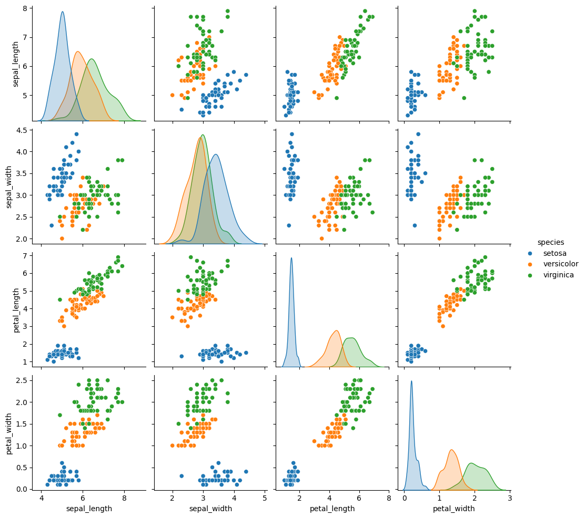

# Seaborn Grundlagen

## Einführung

Seaborn ist eine leistungsstarke und vielseitige Visualisierungsbibliothek in Python, die auf Matplotlib aufbaut. Sie bietet eine höhere Abstraktionsebene für die Erstellung von ansprechenden und informativen statistischen Grafiken. Mit Seaborn ist es einfacher, komplexe Visualisierungen zu erstellen, die große Datenmengen effektiv darstellen.

## Benutzerfreundlichkeit und Ästhetik

Im Vergleich zu Matplotlib bietet Seaborn eine benutzerfreundlichere Schnittstelle. Es benötigt weniger Codezeilen, um ähnliche Diagramme zu erstellen, und die Standardstile und Farbschemata von Seaborn sind visuell ansprechender. Diese Verbesserungen in der Ästhetik und Benutzerfreundlichkeit erleichtern das Erstellen von professionell aussehenden Grafiken.

## Erweiterte Visualisierungsmöglichkeiten

Seaborn erweitert die Möglichkeiten von Matplotlib durch die Integration zusätzlicher Diagrammtypen, die speziell für statistische Datenanalyse entwickelt wurden. Dazu gehören:

- Violin Plots: Diese bieten eine tiefere Einsicht in die Verteilung der Daten, indem sie Aspekte von Boxplots und Kernel-Dichteschätzungen kombinieren.
- Heatmaps: Ideal für die Darstellung von Korrelationen und Mustern in großen Datensätzen.
- Pair Plots: Ermöglichen das schnelle Vergleichen mehrerer Variablenpaare in einem Datensatz.

Diese gibt es teilweise auch in Matplotlib, aber nicht so komfortabel verfügbar bzw. nicht so flexibel parametrisierbar wie in Seaborn.

## Vereinfachte Darstellung statistischer Beziehungen

Seaborn erleichtert die Darstellung und Interpretation statistischer Beziehungen. Funktionen wie regplot und lmplot vereinfachen beispielsweise das Zeichnen von Regressionsmodellen direkt in den Diagrammen. Dies ist in Matplotlib möglich, erfordert jedoch zusätzlichen Code und Anpassungen.

## Bessere Unterstützung für DataFrames

Als eine auf die Pandas-Bibliothek zugeschnittene Bibliothek, integriert sich Seaborn nahtlos mit Pandas DataFrames. Dies ermöglicht es Benutzern, direkt mit DataFrame-Objekten zu arbeiten, ohne sie in andere Formate umwandeln zu müssen. In Matplotlib ist der Umgang mit DataFrames weniger direkt und erfordert oft zusätzliche Schritte.

## Codebeispiele [60 min]

### Beispiel 1: Erstellung eines Scatter Plots mit Seaborn


```python
import seaborn as sns
import matplotlib.pyplot as plt

# Beispieldaten
tips = sns.load_dataset("tips")
print(tips.head())


# Scatter Plot erstellen
sns.scatterplot(x="total_bill", y="tip", data=tips)

# Diagramm anzeigen
plt.show()
```

       total_bill   tip     sex smoker  day    time  size
    0       16.99  1.01  Female     No  Sun  Dinner     2
    1       10.34  1.66    Male     No  Sun  Dinner     3
    2       21.01  3.50    Male     No  Sun  Dinner     3
    3       23.68  3.31    Male     No  Sun  Dinner     2
    4       24.59  3.61  Female     No  Sun  Dinner     4


    

    


In diesem Beispiel laden wir den integrierten Datensatz tips aus Seaborn. Wir verwenden die Funktion scatterplot, um einen Streudiagramm zu erstellen, der die Beziehung zwischen der Gesamtrechnung (total_bill) und dem Trinkgeld (tip) darstellt. Das Diagramm visualisiert, wie das Trinkgeld mit der Höhe der Rechnung variiert.

### Beispiel 2: Erstellen eines Violin-Plots


```python
import seaborn as sns
import matplotlib.pyplot as plt

# Beispieldaten
tips = sns.load_dataset("tips")

# Violin Plot erstellen
sns.violinplot(x="day", y="total_bill", data=tips)

# Diagramm anzeigen
plt.show()
```


    

    


Hier erstellen wir einen Violin Plot, der die Verteilung der Gesamtrechnung (total_bill) über verschiedene Tage (day) im tips-Datensatz zeigt. Violin Plots kombinieren Boxplots mit einer Kerndichteschätzung, was eine detaillierte Sicht auf die Verteilung der Daten ermöglicht.

Jetzt fragen Sie sich vielleicht: Wie kann man solche Violin-Plots lesen?

Hier eine kurze Erläuterung:

Ein Violin-Plot ist eine Methode der Datenvisualisierung, die verwendet wird, um die Verteilung von Datenpunkten grafisch darzustellen. Er kombiniert Elemente aus Boxplots und Kerndichteschätzungen, um eine reichhaltige Darstellung der Daten zu bieten. Hier sind die Schlüsselelemente und wie man einen Violin-Plot liest:

- Kerndichteschätzung: Dies ist die breitere, symmetrische Form, die den Hauptteil des Violin-Plots bildet. Sie zeigt die Dichteverteilung der Daten, wobei die Breite an jedem Punkt die Häufigkeit der Datenpunkte an dieser Stelle angibt. Ein breiterer Bereich im Violin-Plot bedeutet eine höhere Konzentration von Datenpunkten (höhere Dichte), und ein schmalerer Bereich bedeutet weniger Datenpunkte.

- Boxplot-Elemente: Innerhalb des Violin-Plots befindet sich oft ein Miniatur-Boxplot. Dieser zeigt den Median (die mittlere Linie im Boxplot), das untere und das obere Quartil (die Grenzen des Boxplots). Der Median gibt den mittleren Wert der Daten an, während das untere und obere Quartil den Bereich angeben, in dem die mittleren 50% der Daten liegen.

- Whiskers: Manchmal sind am Violin-Plot auch Whiskers (engl. Schnurrharre, ähnlich wie bei einem Boxplot) zu sehen, die die Variabilität außerhalb der oberen und unteren Quartile darstellen. Sie können auf Extremwerte oder die Gesamtverteilung der Daten hinweisen.

Wie man einen Violin-Plot liest

- Beurteilung der Verteilung: Schauen Sie sich die Breite des Violins an verschiedenen Punkten an. Wo der Violin breiter ist, sind mehr Datenpunkte vorhanden. Eine schmale Stelle zeigt weniger Datenpunkte an.

- Identifikation von Median und Quartilen: Der innere Boxplot (falls vorhanden) hilft Ihnen, den Median und die Quartile zu identifizieren. Der Median teilt die Daten in zwei Hälften, während die Quartile zeigen, wo sich die mittleren 50% der Daten befinden.

- Erkennung von Asymmetrien: Ein asymmetrischer Violin-Plot deutet auf eine schiefe Verteilung hin. Zum Beispiel, wenn eine Seite des Violins länger ist, zeigt diese eine längeren "Schwanz" in der Verteilung in diese Richtung an.

- Vergleich zwischen Kategorien: Wenn mehrere Violin-Plots nebeneinander gezeichnet sind (zum Beispiel für verschiedene Kategorien), ermöglichen sie den direkten Vergleich der Verteilungen zwischen diesen Kategorien.

Violin-Plots sind besonders nützlich, wenn Sie die Verteilung von Daten untersuchen und gleichzeitig Unterschiede zwischen verschiedenen Kategorien oder Gruppen hervorheben möchten. Sie bieten eine detaillierte Ansicht der Verteilung, die über die grundlegenden Informationen eines Boxplots hinausgeht.

### Beispiel 3: Erstellen eines Heatmaps


```python
import seaborn as sns
import matplotlib.pyplot as plt

# Beispieldaten laden
flights = sns.load_dataset("flights")

# Pivottabelle erstellen
flights_pivot = flights.pivot(index='month', columns='year', values='passengers')

# Heatmap erstellen
sns.heatmap(flights_pivot, annot=True, fmt="d")

# Diagramm anzeigen
plt.show()
```


    

    


In diesem Beispiel laden wir den flights-Datensatz (der enthält historische Flugpassagierzahlen) und erstellen eine Heatmap, die zeigt, wie viele Passagiere in jedem Monat eines Jahres geflogen sind. Die annot=True-Option fügt die Anzahl der Passagiere in jede Zelle der Heatmap ein, was ein schnelles Ablesen der Werte ermöglicht.

### Beispiel 4: Erstellen eines Pair Plots


```python
import seaborn as sns
import matplotlib.pyplot as plt

# Beispieldaten
iris = sns.load_dataset("iris")

# Pair Plot erstellen
sns.pairplot(iris, hue="species")

# Diagramm anzeigen
plt.show()
```


    

    


In diesem Beispiel verwenden wir den iris-Datensatz, um einen Pair Plot zu erstellen. Dieser Plot zeigt Scatter Plots für jedes Paar von Merkmalen im Datensatz und farblich nach Spezies unterschieden (hue="species"). Pair Plots sind nützlich, um Beziehungen zwischen mehreren Variablen zu visualisieren.

Der iris-Datensatz enthält hierbei Informationen über die Blattdimensionen dreier verschiedener Blumenarten:


```python
iris.head()
```


<div>
<style scoped>
    .dataframe tbody tr th:only-of-type {
        vertical-align: middle;
    }

    .dataframe tbody tr th {
        vertical-align: top;
    }

    .dataframe thead th {
        text-align: right;
    }
</style>
<table border="1" class="dataframe">
  <thead>
    <tr style="text-align: right;">
      <th></th>
      <th>sepal_length</th>
      <th>sepal_width</th>
      <th>petal_length</th>
      <th>petal_width</th>
      <th>species</th>
    </tr>
  </thead>
  <tbody>
    <tr>
      <th>0</th>
      <td>5.1</td>
      <td>3.5</td>
      <td>1.4</td>
      <td>0.2</td>
      <td>setosa</td>
    </tr>
    <tr>
      <th>1</th>
      <td>4.9</td>
      <td>3.0</td>
      <td>1.4</td>
      <td>0.2</td>
      <td>setosa</td>
    </tr>
    <tr>
      <th>2</th>
      <td>4.7</td>
      <td>3.2</td>
      <td>1.3</td>
      <td>0.2</td>
      <td>setosa</td>
    </tr>
    <tr>
      <th>3</th>
      <td>4.6</td>
      <td>3.1</td>
      <td>1.5</td>
      <td>0.2</td>
      <td>setosa</td>
    </tr>
    <tr>
      <th>4</th>
      <td>5.0</td>
      <td>3.6</td>
      <td>1.4</td>
      <td>0.2</td>
      <td>setosa</td>
    </tr>
  </tbody>
</table>
</div>


### Beispiel 5: Erstellen eines Bar Plots


```python
import seaborn as sns
import matplotlib.pyplot as plt

# Beispieldaten
tips = sns.load_dataset("tips")

# Bar Plot erstellen
sns.barplot(x="sex", y="total_bill", data=tips)

# Diagramm anzeigen
plt.show()
```


    

    


In diesem Codebeispiel erstellen wir einen Balkendiagramm (Bar Plot), der den Durchschnitt der Gesamtrechnungen (total_bill) aufgeschlüsselt nach Geschlecht (sex) im tips-Datensatz zeigt. Bar Plots sind hilfreich, um kategoriale Daten zu vergleichen. Hier sind die beiden Kategorien: male vs. female.

Was macht hier der schwarze Strich oben am Ende der Box?

In einem Barplot, der mit Seaborn erstellt wurde, repräsentieren die schwarzen Linien auf den Balken die Unsicherheitsintervalle. Diese Linien werden oft als "Fehlerbalken" bezeichnet und bieten eine visuelle Darstellung der Variabilität oder der Unsicherheit in den dargestellten Daten.

Bedeutung: In einem Seaborn-Barplot zeigen diese Fehlerbalken standardmäßig das Konfidenzintervall um den Mittelwert (oder einen anderen Schätzer) der Daten. Ein Konfidenzintervall gibt einen Bereich an, von dem man erwartet, dass er den wahren Wert in der Grundgesamtheit mit einer bestimmten Wahrscheinlichkeit enthält. Standardmäßig wird das 95% Konfidenzintervall verwendet.

Berechnung: Seaborn berechnet diese Intervalle unter der Annahme, dass die Daten normalverteilt sind. Dies erfolgt typischerweise durch die Berechnung des Mittelwerts der Datenpunkte innerhalb jeder Kategorie und dann der Berechnung des Konfidenzintervalls dieses Mittelwerts.

Interpretation: Ein kurzer Fehlerbalken bedeutet, dass die Werte in dieser Kategorie weniger variieren (d.h., sie sind konsistenter), während ein langer Fehlerbalken auf eine größere Variabilität der Werte hindeutet.

## Aufgaben [120 min]

### A1: Erstellen eines weiteren Violin-Plots 🌶️🌶️

Erstellen Sie einen Violin Plot für die 'total_bill'-Variable im 'tips'-Datensatz, wobei die Violins nach 'time' getrennt sind. Stellen Sie sicher, dass der Plot innere Quartile anzeigt.

Können wir aus dem Plot eine Erkenntnis gewinnen, ob es einen Unterschied gibt zwischen den Trinkgeldern die Mittags und Abends gegegeben werden?

### A2: Count-Plot 🌶️🌶️

Verwenden Sie den 'titanic'-Datensatz von Seaborn, um einen Count Plot zu erstellen, der die Anzahl der Passagiere in jeder 'class' anzeigt.

### A3: Boxplots und Anpassen der Achsenbeschriftungen 🌶️🌶️🌶️

Erstellen Sie einen Boxplot für die 'total_bill' im 'tips'-Datensatz.

Was ist ein Boxplot? Wie ist so ein Boxplot zu "lesen"?

Benennen Sie die x-Achse als "Gesamtrechnung" und die y-Achse als "Häufigkeit".

### A4: Scatterplot mit Regressionslinie 🌶️🌶️

Erstellen Sie einen Scatter Plot für 'total_bill' gegen 'tip' aus dem 'tips'-Datensatz und fügen Sie eine Regressionslinie hinzu.

### A5: Erstellung eines Facet Grids 🌶️🌶️

Versuchen Sie zu verstehen was ein Facet Grid ist und erstellen Sie ein Codebeispiel hierzu!

### A6: Anpassen von Plot-Legenden 🌶️🌶️

Erstellen Sie einen Scatter Plot mit 'total_bill' gegen 'tip' aus dem 'tips'-Datensatz. Unterscheiden Sie die Punkte nach 'smoker' und passen Sie die Legende entsprechend an.

### A7: Neuer Plottyp: jointplots 🌶️🌶️

Finden Sie heraus was jointplots sind und erstellen Sie ein eigenes Beispiel!

### A8: Neuer Plottyp: kdeplot 🌶️🌶️

Finden Sie heraus was kdeplots sind und erstellen Sie ein eigenes Beispiel!

[Lösungen](seaborn_einfuehrung_loesungen.md)
