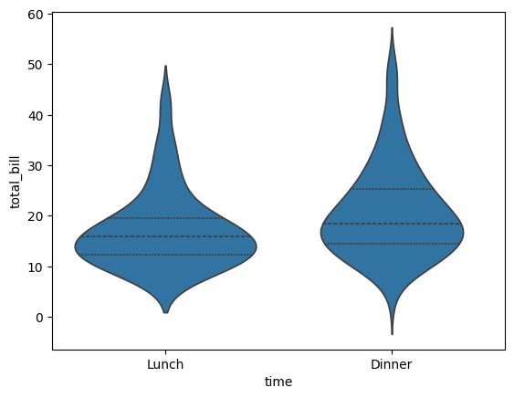
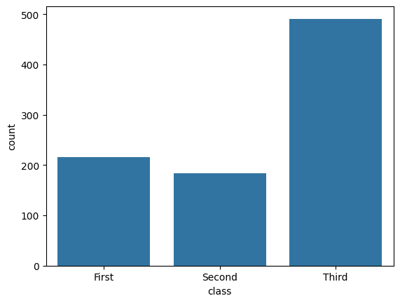
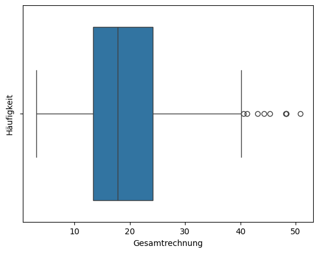
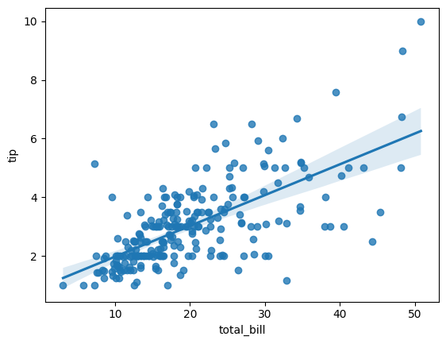
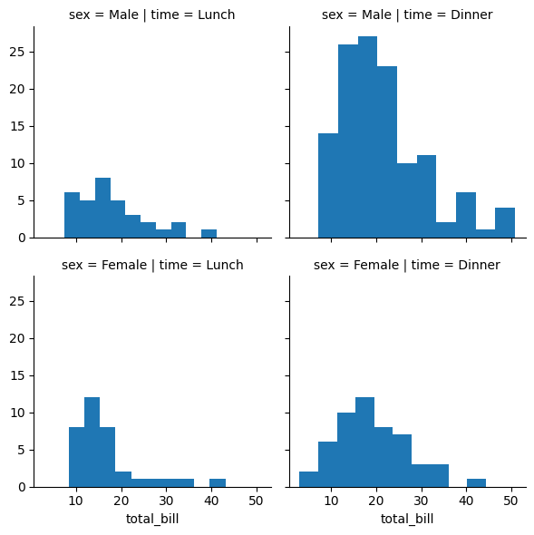
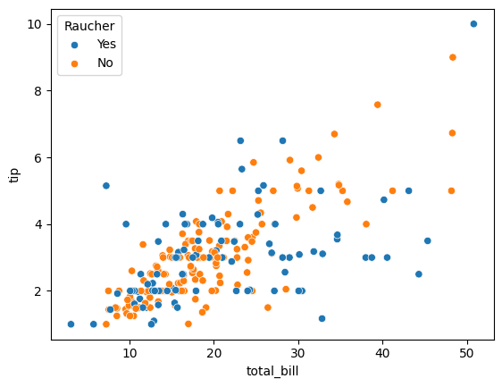
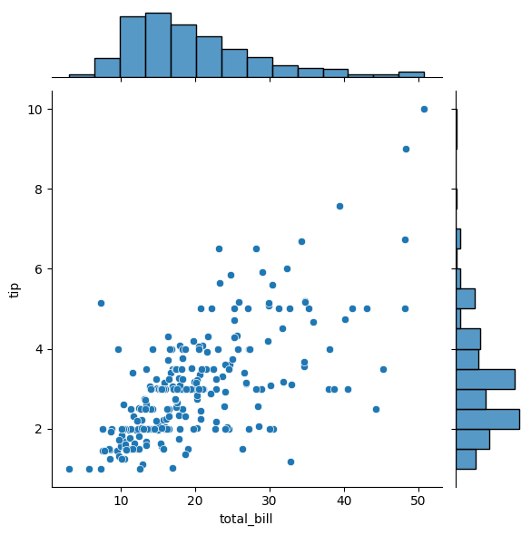
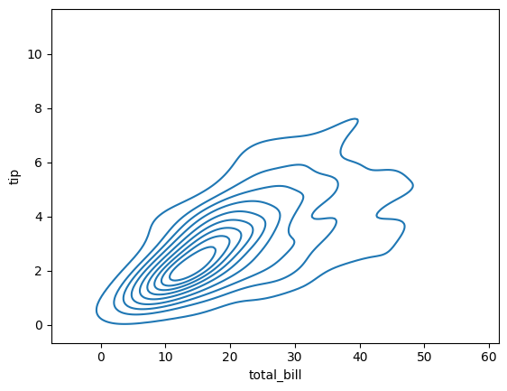

# Lösungen

### A1: Erstellen eines weiteren Violin-Plots 🌶️🌶️

<details>
<summary>
🎦 Lösungsvideo
</summary>
 <iframe width="560" height="315" src="https://www.youtube.com/embed/k1Wa5m7wfYA?si=au-Hb1AryvjNUlls" title="YouTube video player" frameborder="0" allow="accelerometer; autoplay; clipboard-write; encrypted-media; gyroscope; picture-in-picture; web-share" allowfullscreen></iframe>
</details>

Erstellen Sie einen Violin Plot für die 'total_bill'-Variable im 'tips'-Datensatz, wobei die Violins nach 'time' getrennt sind. Stellen Sie sicher, dass der Plot innere Quartile anzeigt.

Können wir aus dem Plot eine Erkenntnis gewinnen, ob es einen Unterschied gibt zwischen den Trinkgeldern die Mittags und Abends gegegeben werden?


```python
import seaborn as sns
import matplotlib.pyplot as plt

tips = sns.load_dataset("tips")
print( tips.head() )

sns.violinplot(x="time", y="total_bill", data=tips, inner="quartile")
plt.show()
```

       total_bill   tip     sex smoker  day    time  size
    0       16.99  1.01  Female     No  Sun  Dinner     2
    1       10.34  1.66    Male     No  Sun  Dinner     3
    2       21.01  3.50    Male     No  Sun  Dinner     3
    3       23.68  3.31    Male     No  Sun  Dinner     2
    4       24.59  3.61  Female     No  Sun  Dinner     4


    

    


### A2: Count-Plot 🌶️🌶️

<details>
<summary>
🎦 Lösungsvideo
</summary>
<iframe width="560" height="315" src="https://www.youtube.com/embed/_FwRBiU60xM?si=iS2KFH_6InK7iVEP" title="YouTube video player" frameborder="0" allow="accelerometer; autoplay; clipboard-write; encrypted-media; gyroscope; picture-in-picture; web-share" allowfullscreen></iframe>
</details>


Verwenden Sie den 'titanic'-Datensatz von Seaborn, um einen Count Plot zu erstellen, der die Anzahl der Passagiere in jeder 'class' anzeigt.


```python
import seaborn as sns
import matplotlib.pyplot as plt

titanic = sns.load_dataset("titanic")
print( titanic.head() )

sns.countplot(x="class", data=titanic)
plt.show()
```

       survived  pclass     sex   age  sibsp  parch     fare embarked  class  \
    0         0       3    male  22.0      1      0   7.2500        S  Third   
    1         1       1  female  38.0      1      0  71.2833        C  First   
    2         1       3  female  26.0      0      0   7.9250        S  Third   
    3         1       1  female  35.0      1      0  53.1000        S  First   
    4         0       3    male  35.0      0      0   8.0500        S  Third   
    
         who  adult_male deck  embark_town alive  alone  
    0    man        True  NaN  Southampton    no  False  
    1  woman       False    C    Cherbourg   yes  False  
    2  woman       False  NaN  Southampton   yes   True  
    3  woman       False    C  Southampton   yes  False  
    4    man        True  NaN  Southampton    no   True  


    

    


### A3: Boxplots und Anpassen der Achsenbeschriftungen 🌶️🌶️🌶️

<details>
<summary>
🎦 Lösungsvideo
</summary>
<iframe width="560" height="315" src="https://www.youtube.com/embed/nQ2Wj9Wx7Lc?si=4jUr9jZoqSty-3dP" title="YouTube video player" frameborder="0" allow="accelerometer; autoplay; clipboard-write; encrypted-media; gyroscope; picture-in-picture; web-share" allowfullscreen></iframe>
</details>


Erstellen Sie einen Boxplot für die 'total_bill' im 'tips'-Datensatz.

Was ist ein Boxplot? Wie ist so ein Boxplot zu "lesen"?

Benennen Sie die x-Achse als "Gesamtrechnung" und die y-Achse als "Häufigkeit".


```python
import seaborn as sns
import matplotlib.pyplot as plt

tips = sns.load_dataset("tips")
sns.boxplot(x="total_bill", data=tips)
plt.xlabel("Gesamtrechnung")
plt.ylabel("Häufigkeit")
plt.show()
```


    

    


Ein Boxplot ist ein standardisiertes Mittel zur Darstellung der Verteilung von Daten basierend auf einem Fünf-Punkte-Zusammenfassung: Minimum, erstes Quartil (Q1), Median, drittes Quartil (Q3) und Maximum.

Folgende Elemente des Boxplots sind folgendermaßen zu interpretieren:

- Zentraler Kasten: Der zentrale Kasten des Boxplots stellt die Interquartilspanne (IQR) dar, die den Bereich vom ersten Quartil (Q1, 25. Perzentil) bis zum dritten Quartil (Q3, 75. Perzentil) umfasst. Dies zeigt den mittleren 50% Bereich der Daten.

- Median (mittlere Linie im Kasten): Die Linie innerhalb des Kastens zeigt den Median der Daten an. Der Median teilt die Daten in zwei Hälften – 50% der Beobachtungen liegen unter diesem Wert und 50% darüber.

- Whiskers („Schnurrhaare“): Die Linien, die sich vom Kasten nach oben und unten erstrecken, sind die „Whiskers“. Sie zeigen die Variabilität außerhalb der oberen und unteren Quartile. In der Regel erstrecken sie sich bis zum kleinsten bzw. größten Wert innerhalb von 1,5 * IQR vom unteren bzw. oberen Quartil. Datenpunkte außerhalb dieses Bereichs werden oft als Ausreißer betrachtet.

- Ausreißer: Dies sind Punkte, die außerhalb der Whiskers liegen. Sie werden oft separat als Punkte dargestellt, die weiter vom Hauptteil der Daten entfernt sind.

Durch die Betrachtung dieses Boxplots können Sie eine Vorstellung von der zentralen Tendenz (durch den Median), der Variabilität (durch die IQR und Whiskers) und der Präsenz von Ausreißern in den Gesamtrechnungsdaten erhalten. Boxplots geben uns also eine schnelle grafische Zusammenfassung der Daten, aber zeigen keine detaillierten Informationen über die Verteilungsform an (wie bei Violin-Plots).

### A4: Scatterplot mit Regressionslinie 🌶️🌶️

<details>
<summary>
🎦 Lösungsvideo
</summary>
<iframe width="560" height="315" src="https://www.youtube.com/embed/s5BkbUD2NW8?si=tCXiR35etDaysNUo" title="YouTube video player" frameborder="0" allow="accelerometer; autoplay; clipboard-write; encrypted-media; gyroscope; picture-in-picture; web-share" allowfullscreen></iframe>
</details>


Erstellen Sie einen Scatter Plot für 'total_bill' gegen 'tip' aus dem 'tips'-Datensatz und fügen Sie eine Regressionslinie hinzu.


```python
import seaborn as sns
import matplotlib.pyplot as plt

tips = sns.load_dataset("tips")
sns.regplot(x="total_bill", y="tip", data=tips)
plt.show()

```


    

    


### A5: Erstellung eines Facet Grids 🌶️🌶️

<details>
<summary>
🎦 Lösungsvideo
</summary>
<iframe width="560" height="315" src="https://www.youtube.com/embed/zp_euTSfXMg?si=DldKs6WBrXReJkIN" title="YouTube video player" frameborder="0" allow="accelerometer; autoplay; clipboard-write; encrypted-media; gyroscope; picture-in-picture; web-share" allowfullscreen></iframe>
</details>


Versuchen Sie zu verstehen was ein Facet Grid ist und erstellen Sie ein Codebeispiel hierzu!


```python
import seaborn as sns
import matplotlib.pyplot as plt

# Laden des Datensatzes
tips = sns.load_dataset("tips")

# Erstellen eines FacetGrids
g = sns.FacetGrid(tips, col="time", row="sex")

# Mappen eines Plots auf jedes Facet
g.map(plt.hist, "total_bill")

# Anzeigen des Plots
plt.show()
```


    

    


Hier erstellen wir ein FacetGrid-Objekt g.

Hier geben wir an, dass wir unterschiedliche Plots für verschiedene Werte der Spalten "time" (z. B. Lunch, Dinner) und "sex" (Geschlecht) erstellen wollen. Dies bedeutet, dass für jede Kombination aus "time" und "sex" ein separater Plot erstellt wird.

Wir verwenden die map-Funktion, um eine Art von Plot (in diesem Fall ein Histogramm) auf jedes Facet anzuwenden. Hier sagen wir, dass wir Histogramme der "total_bill" (Gesamtrechnung) für jede Kombination aus "time" und "sex" erstellen wollen.

### A6: Anpassen von Plot-Legenden 🌶️🌶️

<details>
<summary>
🎦 Lösungsvideo
</summary>
<iframe width="560" height="315" src="https://www.youtube.com/embed/pC5iFwXT9pY?si=6yZ53QPl32g7meCI" title="YouTube video player" frameborder="0" allow="accelerometer; autoplay; clipboard-write; encrypted-media; gyroscope; picture-in-picture; web-share" allowfullscreen></iframe>
</details>


Erstellen Sie einen Scatter Plot mit 'total_bill' gegen 'tip' aus dem 'tips'-Datensatz. Unterscheiden Sie die Punkte nach 'smoker' und passen Sie die Legende entsprechend an.


```python
import seaborn as sns
import matplotlib.pyplot as plt

tips = sns.load_dataset("tips")
sns.scatterplot(x="total_bill", y="tip", hue="smoker", data=tips)
plt.legend(title="Raucher", loc="upper left")
plt.show()
```


    

    


### A7: Neuer Plottyp: jointplots 🌶️🌶️

<details>
<summary>
🎦 Lösungsvideo
</summary>
<iframe width="560" height="315" src="https://www.youtube.com/embed/vllGhfYLwGs?si=6aPE5SFAWBzHxnuT" title="YouTube video player" frameborder="0" allow="accelerometer; autoplay; clipboard-write; encrypted-media; gyroscope; picture-in-picture; web-share" allowfullscreen></iframe>
</details>


Finden Sie heraus was jointplots sind und erstellen Sie ein eigenes Beispiel!


```python
import seaborn as sns
import matplotlib.pyplot as plt

# Laden des Datensatzes
tips = sns.load_dataset("tips")

# Erstellen eines Jointplots für 'total_bill' und 'tip'
sns.jointplot(x="total_bill", y="tip", data=tips)

# Anzeigen des Plots
plt.show()
```


    

    


In diesem Beispiel wird ein Scatterplot erstellt, der die Beziehung zwischen der Gesamtrechnung (total_bill) und dem Trinkgeld (tip) aus dem tips-Datensatz darstellt. Zusätzlich zeigt es die Verteilungen von total_bill und tip an den Rändern des Plots.

### A8: Neuer Plottyp: kdeplot 🌶️🌶️

<details>
<summary>
🎦 Lösungsvideo
</summary>
<iframe width="560" height="315" src="https://www.youtube.com/embed/HrZzo0_fTa4?si=numYqa5dmTeYuWvA" title="YouTube video player" frameborder="0" allow="accelerometer; autoplay; clipboard-write; encrypted-media; gyroscope; picture-in-picture; web-share" allowfullscreen></iframe>
</details>


Finden Sie heraus was kdeplots sind und erstellen Sie ein eigenes Beispiel!


```python
import seaborn as sns
import matplotlib.pyplot as plt

# Laden des Datensatzes
tips = sns.load_dataset("tips")

# Erstellen eines KDEplots für 'total_bill' und 'tip'
sns.kdeplot(x="total_bill", y="tip", data=tips)

# Anzeigen des Plots
plt.show()

```


    

    


Dieses Beispiel zeigt eine konturbasierte Darstellung der Dichteverteilung für total_bill und tip. Es gibt eine visuelle Vorstellung davon, wo die Konzentration der Datenpunkte am höchsten ist.
