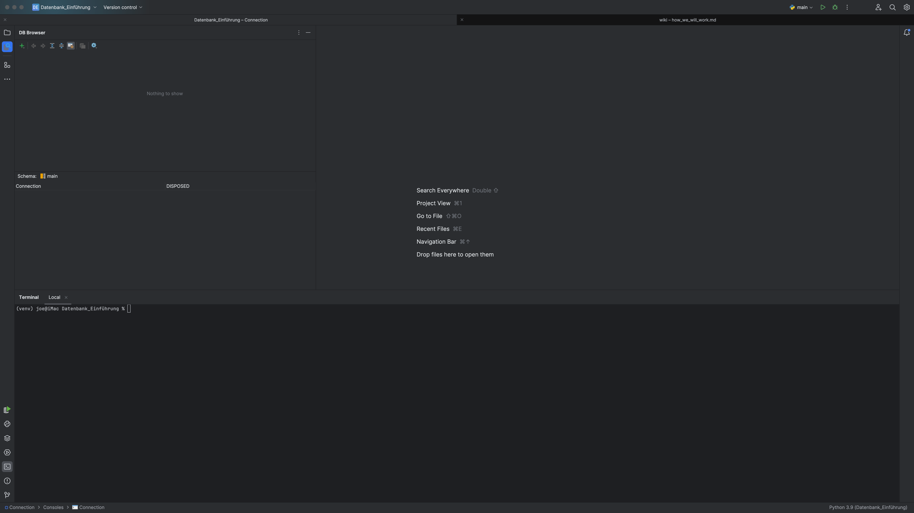

# Arbeitsumgebung

Dieser Unterricht ist Teil eines Kurses in Python. Daher verwenden wir die PyCharm IDE von JetBrains.
Sie enthält bereits SQLite als Datenbanksystem.

Da wir uns nicht um die Programmierung der Datenbank über die Tools von Python beschäftigen, sondern
Datenbanken in ihrer **rohen** Form kennenlernen möchten, werden wir die Einrichtung und Bedienung
über CLI und Konsole erledigen.

## Arbeitsumgebung einrichten

Folgene Schritte sind dazu zu unternehmen:

- PyCharm starten
- Neues Projekt "Datenbank_Einführung" anlegen
- Wo ist die Kommandozeile
- Plugin "Database Navigator" installieren

So soll es aussehen:

Über diesen Dialog legt man eine neue Datenbank über das Plugin an oder schafft eine neue Verbindung zu einer
bestehenden Datenbank.

SQLite erstellt für jede Datenbank eine eigene Datei.

**Anm.:** Es ist in der Lage auch mehrere TeraByte große Dateien anzulegen.
SQLite ist für seine Effizienz und Zuverlässigkeit bei kleinen bis mittelgroßen Datenmengen bekannt, und obwohl es
technisch möglich ist, sehr große Datenbanken zu unterstützen, ist es in Fällen, in denen extrem große Datenmengen
verarbeitet werden müssen, oft besser, ein leistungsfähigeres Datenbankmanagementsystem zu verwenden.

Um eine Datenbbank anzulegen, muss die Datei im Block **Database Files** angepasst werden.
Dazu klickt man in das ... Menü der Zeile in der "sqlite.db" steht und wählt Pfad und Dateinamen aus. Gibt es die Datei
noch nicht, so wählt man nur das Verzeichnis aus und hängt den Namen per Tastatureingabe an.

Es sollte auch der Datenbankname im Feld **Name** angepasst werden.

mit Klick auf ok sind wir hier:

