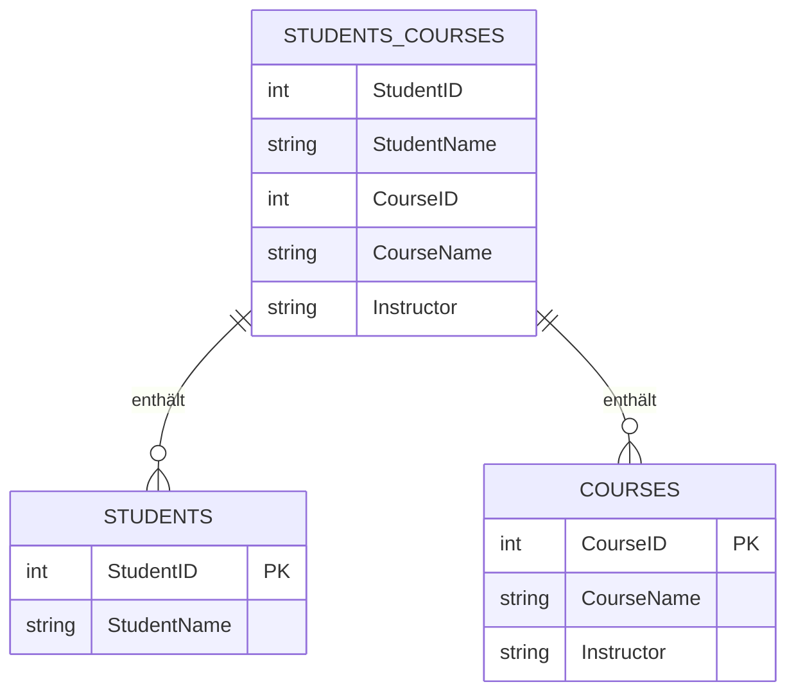
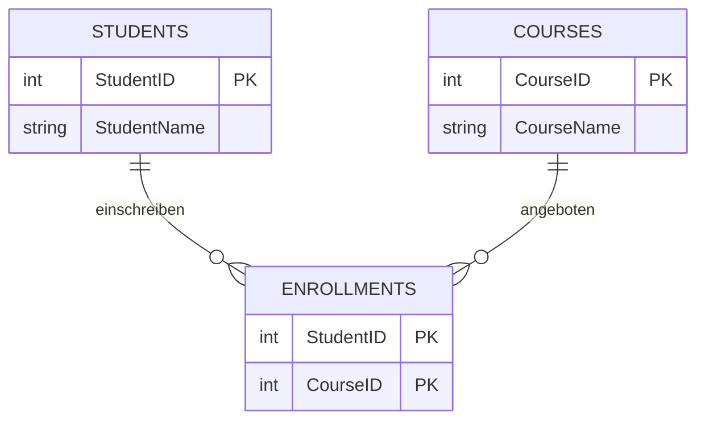
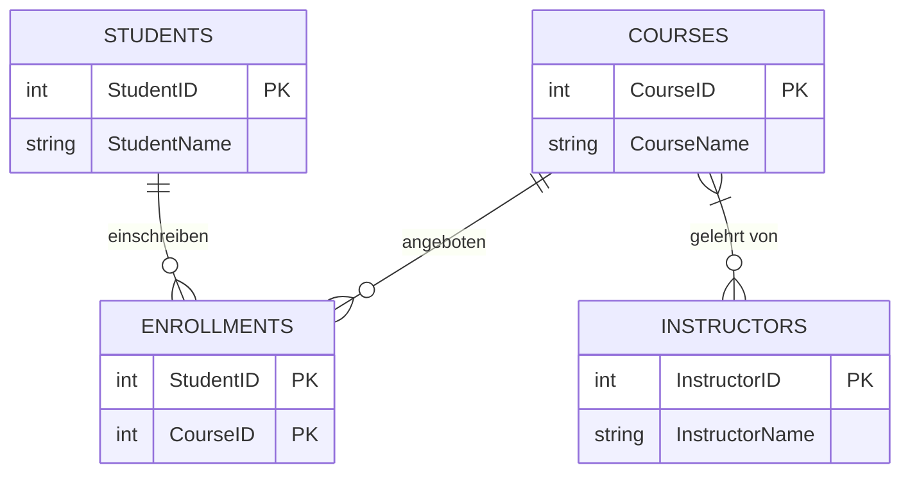

# Datenbank Normalisierung [45min]

## Was ist Normalisierung?

Die Normalisierung in SQL bezieht sich auf den Prozess des Organisierens von Daten in Tabellen. Das Hauptziel ist es,
Wiederholungen von Daten auszuschließen und die Zusammenhänge zwischen den Daten sicherzustellen. Dadurch werden größere
Tabellen in kleinere Tabellen aufgeteilt und durch Beziehungen verbunden.

Der Prozess wird durch eine Serie von Regeln bestimmt, bekannt als Normalformen, an die sich die Datenbank halten muss.

### Warum soll man normalisieren?

- **Entfernung von redundanten Daten:** Sind redundante Daten vorhanden, führt das zu einer Vielzahl von Problemen,
  einschließlich dem unnötigen Verbrauch von Speicherplatz und der Gefahr von Inkonsistenzen.
- **Datenintegrität:** Die Datenintegrität stellt sicher, dass es bei der Verteilung von Daten auf mehrere Tabellen
  nicht zu Inkonsistenzen kommt.
- **Suchanfragen:** Die Normalisierung macht Datenbankabfragen einfacher und schneller.

## Einführung in die Normalformen

Es gibt mehrere Normalformen, aber wir werden uns nur kurz mit den ersten dreien davon beschäftigen, da sie die am
meisten verbreiteten sind.

### Erste Normalform (1NF)

Eine Tabelle ist in der ersten Normalform, wenn:

- Sie ausschließlich atomare (unteilbare) Werte enthält und es keine sich wiederholenden Gruppen oder Datenfelder gibt.
- Jede Spalte enthält nur Daten eines einzigen Datentyps.
- Jede Spalte hat eine eindeutige Bezeichnung innerhalb der Tabelle.

### Zweite Normalform (2NF)

Eine Tabelle ist in der zweiten Normalform, wenn:

- Sie in der ersten Normalform ist.
- Alle Spalten, die keine Schlüsselspalten sind, funktional abhängig vom Primärschlüssel der Tabelle sind.

### Dritte Normalform (3NF)

Eine Tabelle ist in der dritten Normalform, wenn:

- Sie in der zweiten Normalform ist.
- Alle Attribute in der Tabelle funktional abhängig vom Primärschlüssel sind.

## Beispiele

### Vorwort

Betrachten wir eine Universitätsdatenbank mit einer Tabelle, die Informationen über Studenten und die Kurse, in denen
sie eingeschrieben sind, speichert.

```sql
CREATE TABLE Students_Courses
(
    StudentID   INT,
    StudentName VARCHAR(50),
    CourseID    INT,
    CourseName  VARCHAR(50),
    Instructor  VARCHAR(50)
);
```

*Listing 15.1: Students_Courses Tabelle*

Diese Tabelle ist nicht normalisiert. Schauen wir uns an, warum und wie man sie normalisiert:

#### 1NF

Teile die Tabelle so auf, dass jede Spalte atomare Werte enthält.

```sql
CREATE TABLE Students
(
    StudentID   INT PRIMARY KEY,
    StudentName VARCHAR(50)
);
```

*Listing 15.2: Students Tabelle für 1NF*

```sql
CREATE TABLE Courses
(
    CourseID   INT PRIMARY KEY,
    CourseName VARCHAR(50),
    Instructor VARCHAR(50)
);
```

*Listing 15.3: Courses Tabelle für 1NF*

#### 2NF

Stelle sicher, dass alle Nicht-Schlüsselspalten vollständig funktional abhängig vom Primärschlüssel sind. Die oben
erstellten Tabellen erfüllen bereits diese Regel.

#### 3NF

Entferne Spalten, die nicht vom Primärschlüssel abhängig sind. Die Spalte `Instructor` hängt mehr von `CourseID` als von
der Kombination von `StudentID` und `CourseID` ab, daher sollte sie nur in der `Courses`-Tabelle sein. Die oben
aufgeführten Tabellen sind bereits in 3NF basierend auf unserer Aufteilung.

## Zusammenfassung

Die Normalisierung von Datenbanken ist essenziell wichtig, um die Datenintegrität und eine optimale Datenabfrage
aufrechtzuerhalten. Sie hilft, das Schema der Datenbank so zu gestalten, dass die Duplikation von Daten auf ein Minimum
reduziert ist und die Wartung effizient gestaltet werden kann.

# Eindeutige Abhängigkeiten erklärt

Die eindeutige Abhängigkeit vom Primärschlüssel in einer Datenbanktabelle ist ein zentrales Konzept der Normalisierung,
insbesondere in Bezug auf die zweite Normalform (2NF) und die dritte Normalform (3NF). Diese Abhängigkeit bedeutet, dass
jedes Nicht-Schlüsselattribut (d.h. jede Spalte, die nicht Teil des Primärschlüssels ist) direkt und vollständig vom
Primärschlüssel abhängen muss. Hier sind einige wichtige Punkte zu diesem Konzept:

1. **Primärschlüssel:** Der Primärschlüssel einer Tabelle ist ein Attribut oder eine Kombination von Attributen, die
   jeden Datensatz in der Tabelle eindeutig identifizieren. Keine zwei Datensätze können denselben Primärschlüsselwert
   haben.

2. **Funktionale Abhängigkeit:** Ein Attribut B ist funktional abhängig von einem Attribut A, wenn zu jedem Wert von A
   genau ein Wert von B gehört. In einer Datenbanktabelle bedeutet dies, dass der Wert eines Attributs (z.B. `Adresse`)
   durch den Wert eines anderen Attributs (z.B. `KundenID` als Primärschlüssel) bestimmt wird.

3. **Vollständige Abhängigkeit:** In der zweiten Normalform geht es darum, dass jedes Nicht-Schlüsselattribut
   vollständig vom gesamten Primärschlüssel abhängen muss, insbesondere wenn der Primärschlüssel aus mehreren Spalten
   besteht. Das bedeutet, dass kein Nicht-Schlüsselattribut nur von einem Teil des Primärschlüssels abhängen darf.

4. **Beispiel für 2NF:** Angenommen, eine Tabelle `Bestellungen` hat einen zusammengesetzten
   Primärschlüssel (`BestellID`, `ProduktID`). Ein Attribut wie `Bestelldatum` sollte von der gesamten
   Kombination (`BestellID`, `ProduktID`) abhängen und nicht nur von `BestellID`.

5. **Transitive Abhängigkeit in 3NF:** Die dritte Normalform erweitert das Konzept der funktionalen Abhängigkeit, indem
   sie fordert, dass Nicht-Schlüsselattribute nicht transitiv (über ein anderes Nicht-Schlüsselattribut) vom
   Primärschlüssel abhängen dürfen. Ein Attribut A ist transitiv abhängig von einem Attribut C über ein Attribut B, wenn
   A von B abhängig ist und B von C abhängig ist.

6. **Beispiel für 3NF:** In einer Tabelle `Mitarbeiter` mit dem Primärschlüssel `MitarbeiterID` und den
   Attributen `AbteilungsID` und `Abteilungsleiter` wäre `Abteilungsleiter` transitiv abhängig von `MitarbeiterID`
   über `AbteilungsID`. Um die 3NF zu erreichen, sollte `Abteilungsleiter` in eine separate Tabelle ausgelagert werden.

Zusammenfassend sorgt die eindeutige Abhängigkeit vom Primärschlüssel dafür, dass jede Information in einer Tabelle
direkt und eindeutig durch den Primärschlüssel bestimmt wird, was Redundanzen reduziert und die Datenintegrität erhöht.

## Diagrammdarstellung

Hier sind Beispiele für Diagramme, die die Konzepte der ersten, zweiten und dritten Normalform (1NF, 2NF, 3NF)
veranschaulichen:

### 1. Erste Normalform (1NF)



### 2. Zweite Normalform (2NF)



### 3. Dritte Normalform (3NF)



Diese Diagramme zeigen die Beziehungen zwischen den Tabellen und wie sie sich von der ersten bis zur dritten Normalform
entwickeln. In der ersten Normalform wird die ursprüngliche Tabelle `STUDENTS_COURSES` in zwei Tabellen `STUDENTS`
und `COURSES` aufgeteilt. In der zweiten Normalform wird eine neue Tabelle `ENROLLMENTS` eingeführt, um die Beziehung
zwischen `STUDENTS` und `COURSES` zu verwalten. In der dritten Normalform wird eine weitere Tabelle `INSTRUCTORS`
hinzugefügt, um die transitive Abhängigkeit zu entfernen.

[zurück](datenbanken.md)
