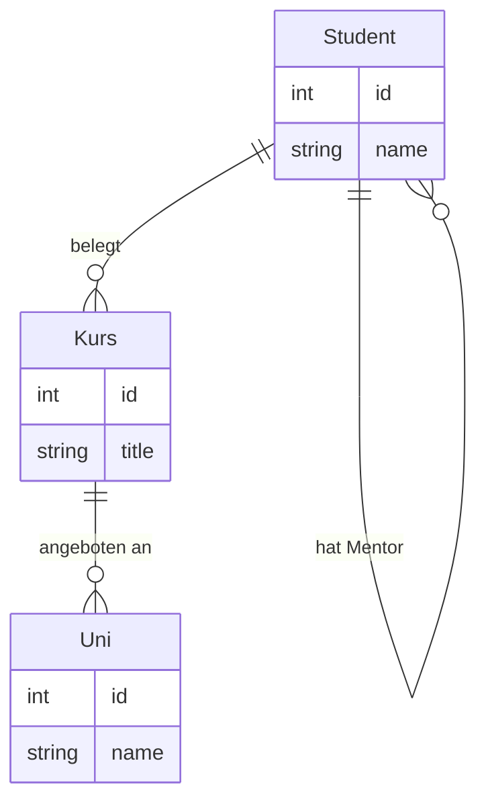

# UML Diagramme

UML steht für "Unified Modeling Language". Es handelt sich um eine standardisierte Modellierungssprache, die in der
Softwareentwicklung verwendet wird, um Systeme, Softwarearchitektur, Geschäftsprozesse und andere Aspekte der Software-
und Systementwicklung zu visualisieren, zu spezifizieren, zu konstruieren und zu dokumentieren.

Einige Schlüsselaspekte von UML sind:

1. **Visualisierung:** UML bietet eine grafische Darstellung von Systemen, was das Verständnis komplexer
   Softwarestrukturen und Geschäftsprozesse erleichtert.

2. **Standardisierung:** Als standardisierte Sprache ermöglicht UML eine konsistente Dokumentation und Kommunikation
   innerhalb und zwischen Teams, unabhängig von der verwendeten Programmiersprache oder Technologie.

3. **Verschiedene Diagrammtypen:** UML umfasst mehrere Diagrammtypen, die verschiedene Aspekte eines Systems darstellen.
   Dazu gehören Strukturdiagramme (wie Klassendiagramme, Objektdiagramme, Paketdiagramme) und Verhaltensdiagramme (wie
   Anwendungsfalldiagramme, Aktivitätsdiagramme, Sequenzdiagramme).

4. **Entwurfs- und Analysewerkzeug:** UML wird sowohl in der Planungsphase als auch während der gesamten Lebensdauer
   eines Softwareprojekts eingesetzt. Es hilft bei der Analyse, dem Entwurf und der Implementierung von
   Softwarelösungen.

5. **Breite Anwendbarkeit:** UML kann in verschiedenen Entwicklungsansätzen verwendet werden, von traditionellen
   Wasserfallmodellen bis hin zu agilen Methoden.

UML ist ein wesentliches Werkzeug für Softwarearchitekten, Systemanalytiker, Softwareingenieure und Entwickler, um
komplexe Systeme effektiv zu entwerfen, zu verstehen und zu dokumentieren.

## Verwendung in Datenbanken

UML wird in Bezug auf Datenbanken hauptsächlich für das Design und die Visualisierung der
Datenbankstruktur und der Beziehungen zwischen den Daten verwendet. Obwohl UML ursprünglich für die objektorientierte
Softwareentwicklung konzipiert wurde, kann es auch effektiv für das relationale Datenbankdesign eingesetzt werden. Hier
sind einige Schlüsselaspekte, wie UML in Bezug auf Datenbanken verwendet wird:

1. **Klassendiagramme für Datenbankentwurf:**
    - Klassendiagramme, die normalerweise zur Darstellung von Klassen und Objekten in der objektorientierten
      Programmierung verwendet werden, können auch zur Modellierung der Tabellenstruktur in einer Datenbank eingesetzt
      werden.
    - Jede Klasse im Diagramm repräsentiert eine Tabelle in der Datenbank, wobei die Attribute der Klasse den Spalten
      der Tabelle entsprechen.
    - Beziehungen wie Assoziationen (1:1, 1:N, N:M) zwischen Klassen können genutzt werden, um Fremdschlüsselbeziehungen
      und andere Arten von Beziehungen zwischen Tabellen darzustellen.

2. **Objekt-Relationales Mapping (ORM):**
    - UML-Diagramme sind besonders nützlich, um das objekt-relationale Mapping (ORM) zu planen, das in vielen modernen
      Anwendungen verwendet wird, um Objekte in einer objektorientierten Programmiersprache auf eine relationale
      Datenbank abzubilden.
    - UML kann dabei helfen, die Struktur der Datenbank und die Beziehungen zwischen den Tabellen zu visualisieren, was
      die Implementierung von ORM-Frameworks wie Hibernate, Entity Framework oder JPA erleichtert.

3. **Datenmodellierung und -analyse:**
    - UML-Diagramme können verwendet werden, um das Datenmodell einer Anwendung zu analysieren und zu entwerfen, bevor
      die Datenbank tatsächlich erstellt wird. Dies hilft, Probleme im Datenmodell frühzeitig zu erkennen und zu
      beheben.
    - Durch die Visualisierung der Datenstrukturen und Beziehungen können Entwickler und Datenbankadministratoren ein
      besseres Verständnis für das Gesamtsystem entwickeln.

4. **Dokumentation und Kommunikation:**
    - UML-Diagramme bieten eine standardisierte Methode zur Dokumentation der Datenbankstruktur, was die Kommunikation
      innerhalb des Entwicklungsteams und mit Stakeholdern erleichtert.
    - Sie sind besonders hilfreich, um neuen Teammitgliedern oder externen Partnern die Datenbankstruktur zu erklären.

5. **Erweiterung für spezifische Datenbankkonzepte:**
    - Obwohl UML nicht speziell für relationale Datenbanken entwickelt wurde, kann es durch Stereotypen und Anmerkungen
      erweitert werden, um spezifische Datenbankkonzepte wie Schlüssel, Indizes und Trigger darzustellen.

Insgesamt ist UML ein flexibles Werkzeug, das über die reine Softwareentwicklung hinaus auch im Bereich des
Datenbankdesigns und der Datenmodellierung wertvolle Dienste leistet.

## Beispiele

[//]: # (```mermaid)

[//]: # (classDiagram)

[//]: # (    class Student {)

[//]: # (        -int studentId PK)

[//]: # (        -string name)

[//]: # (        +register&#40;&#41;)

[//]: # (        #INDEX&#40;name&#41;)

[//]: # (    })

[//]: # (    class Kurs {)

[//]: # (        -int kursId PK)

[//]: # (        -string title)

[//]: # (        +addStudent&#40;Student&#41;)

[//]: # (        #TRIGGER&#40;onInsert&#41;)

[//]: # (        #INDEX&#40;title&#41;)

[//]: # (    })

[//]: # (    class Einschreibung {)

[//]: # (        -int studentId FK)

[//]: # (        -int kursId FK)

[//]: # (        #TRIGGER&#40;onUpdate&#41;)

[//]: # (    })

[//]: # ()
[//]: # (    Student "1" -- "n" Einschreibung: hat)

[//]: # (    Einschreibung "n" -- "1" Kurs: gehört zu)

[//]: # (```)

[//]: # ()
[//]: # (### Begriffsdefinitionen für Klassen-Diagramme in Mermaid)

[//]: # ()
[//]: # (1. **Entitäten &#40;Tabellen&#41;:**)

[//]: # (    - Jede Entität repräsentiert eine Tabelle in der Datenbank.)

[//]: # (    - Entitäten werden als Rechtecke dargestellt, wobei der Name der Entität &#40;Tabelle&#41; oben steht.)

[//]: # ()
[//]: # (2. **Attribute:**)

[//]: # (    - Attribute einer Entität repräsentieren die Spalten der Tabelle.)

[//]: # (    - Sie werden innerhalb der Entitätsbox aufgelistet.)

[//]: # (    - Verschiedene Präfixe oder Stile können verwendet werden, um spezielle Attribute zu kennzeichnen:)

[//]: # (        - `-`: Private Attribute &#40;nicht sichtbar außerhalb der Entität&#41;.)

[//]: # (        - `+`: Öffentliche Attribute &#40;sichtbar und zugänglich&#41;.)

[//]: # (        - `#`: Geschützte Attribute &#40;eingeschränkter Zugriff&#41;.)

[//]: # ()
[//]: # (3. **Primärschlüssel &#40;PK&#41;:**)

[//]: # (    - Ein Primärschlüssel wird oft durch Unterstreichung oder ein Präfix `PK` gekennzeichnet.)

[//]: # (    - Er identifiziert jeden Datensatz in der Tabelle eindeutig.)

[//]: # ()
[//]: # (4. **Fremdschlüssel &#40;FK&#41;:**)

[//]: # (    - Fremdschlüssel werden oft durch ein Präfix `FK` gekennzeichnet.)

[//]: # (    - Sie stellen eine Verbindung zu einem Primärschlüssel in einer anderen Tabelle her.)

[//]: # ()
[//]: # (5. **Beziehungen:**)

[//]: # (    - Beziehungen zwischen Entitäten werden durch Linien dargestellt.)

[//]: # (    - Die Art der Beziehung wird durch die Beschriftung an den Enden der Linie angezeigt:)

[//]: # (        - `"1"`: Eine 1:1-Beziehung.)

[//]: # (        - `"n"`: Eine 1:N-Beziehung.)

[//]: # (        - `"m"`: Eine M:N-Beziehung.)

[//]: # ()
[//]: # (6. **Kardinalität:**)

[//]: # (    - Die Kardinalität einer Beziehung &#40;wie 1:1, 1:N, N:M&#41; gibt an, wie viele Instanzen einer Entität mit Instanzen)

[//]: # (      einer anderen Entität in Beziehung stehen können.)

[//]: # ()
[//]: # (7. **Rekursive Beziehungen:**)

[//]: # (    - Eine rekursive Beziehung tritt auf, wenn eine Entität eine Beziehung zu sich selbst hat.)

[//]: # (    - Dies wird durch eine Linie dargestellt, die von der Entität ausgeht und zu ihr zurückführt.)

[//]: # ()
[//]: # (8. **Indizes und Trigger:**)

[//]: # (    - Indizes und Trigger sind spezielle Konstrukte, die nicht immer direkt in ER-Diagrammen dargestellt werden, aber)

[//]: # (      durch spezielle Notationen oder Kommentare gekennzeichnet werden können.)

[//]: # ()
[//]: # (Diese Legende bietet eine allgemeine Übersicht über die Elemente, die in einem ER-Diagramm in Mermaid verwendet werden)

[//]: # (können. Beachten Sie, dass die genaue Syntax und Darstellung je nach den Konventionen und dem Stil, den Sie wählen,)

[//]: # (variieren kann.)



### Begriffsdefinitionen für ER-Diagramme

#### Mermaid - Grafiktool

1. **Entitäten:**
    - Jede Entität repräsentiert eine Tabelle in der Datenbank.
    - Dargestellt als Rechtecke, mit dem Namen der Entität (Tabelle) oben.

2. **Attribute:**
    - Attribute einer Entität repräsentieren die Spalten in der Tabelle.
    - Sie werden innerhalb der Entitätsbox aufgelistet.

3. **Beziehungen:**
    - Beziehungen zwischen Entitäten werden durch Linien dargestellt.
    - Die Art der Beziehung wird durch die Beschriftung an den Enden der Linie angezeigt:
        - `||--||`: Eine Linie mit zwei doppelten Strichen für eine 1:1-Beziehung.
        - `||--o{`: Eine Linie mit einem doppelten Strich und einem Kreis mit Krähenfuß für eine 1:N-Beziehung.
        - `o{--o{`: Eine Linie mit zwei Kreisen und zwei Krähenfüßen für eine N:M-Beziehung.

4. **Kardinalität:**
    - Die Kardinalität (wie 1:1, 1:N, N:M) gibt an, wie viele Instanzen einer Entität mit Instanzen einer anderen
      Entität in Beziehung stehen können.

5. **Rekursive Beziehungen:**
    - Eine rekursive Beziehung tritt auf, wenn eine Entität eine Beziehung zu sich selbst hat.
    - Dargestellt durch eine Linie, die von der Entität ausgeht und zu ihr zurückführt.

6. **Primärschlüssel und Fremdschlüssel:**
    - Primärschlüssel (PK) und Fremdschlüssel (FK) werden oft in der Attributliste der Entitäten angegeben, sind aber in
      Mermaid nicht speziell gekennzeichnet.

7. **Indizes und Trigger:**
    - Indizes und Trigger sind spezielle Konstrukte, die in ER-Diagrammen nicht direkt dargestellt werden, aber durch
      Kommentare oder spezielle Notationen in der Beschreibung gekennzeichnet werden können.

Diese Liste bietet eine allgemeine Übersicht über die Elemente, die in einem ER-Diagramm in Mermaid verwendet werden
können. Beachten Sie, dass Mermaid in seiner Fähigkeit, komplexe Datenbankstrukturen darzustellen, begrenzt ist und
einige spezifische Datenbankkonzepte wie Indizes und Trigger möglicherweise nicht direkt visualisiert werden können.

[zurück](datenbanken.md)
