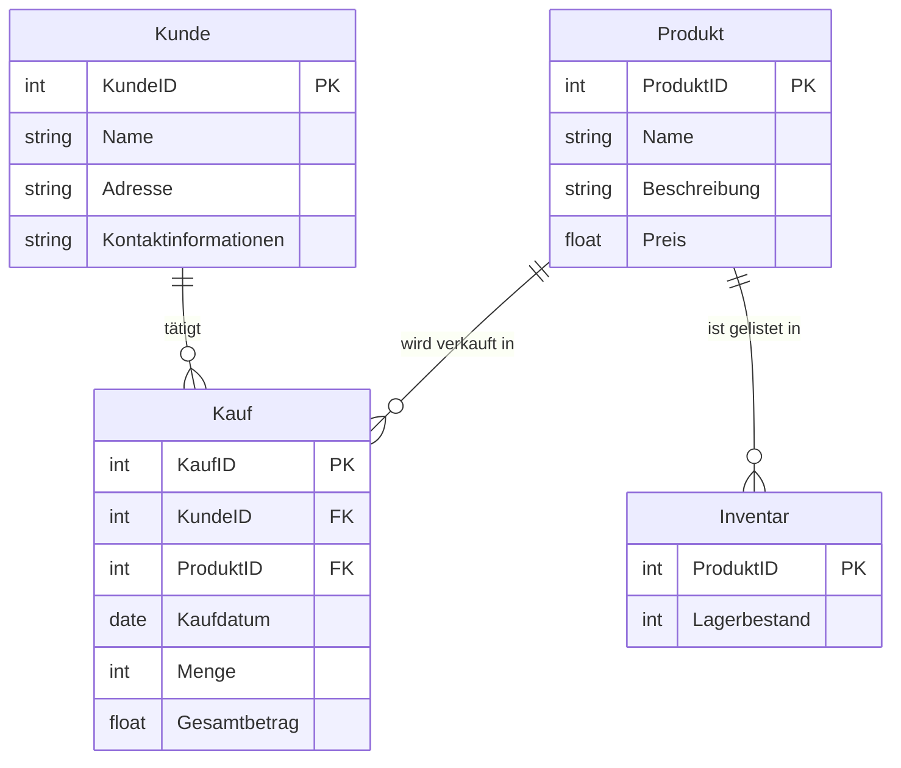

# Beispiel Projekt

**Kundendatenbank für ein Einzelhandelsunternehmen**: Entwickeln Sie eine Datenbank, die Kundeninformationen,
Kaufhistorie und Produktbestände verwaltet. Dieses Projekt könnte auch Aspekte wie Kundenloyalitätsprogramme und
Inventarmanagement umfassen.

Projektthema: Kundendatenbank für ein Einzelhandelsunternehmen

## Normalsprachliche Beschreibung der Softwarelösung

### Überblick

Die Softwarelösung ist eine umfassende Kundendatenbank für ein Einzelhandelsunternehmen, die darauf abzielt,
Kundeninformationen, Kaufhistorie und Produktbestände effizient zu verwalten. Sie soll auch Funktionen für
Kundenloyalitätsprogramme und Inventarmanagement bieten.

### Kernfunktionen

1. **Kundenverwaltung:**
    - Speicherung und Verwaltung von Kundeninformationen wie Name, Adresse, Kontaktinformationen und Kunden-ID.
    - Möglichkeit, neue Kunden hinzuzufügen, bestehende Kundeninformationen zu aktualisieren oder Kunden aus der
      Datenbank zu entfernen.
    - Verfolgung der Kundeninteraktionen und Kaufhistorie, um personalisierte Marketingstrategien zu entwickeln.

2. **Produkt- und Inventarmanagement:**
    - Verwaltung von Produktinformationen, einschließlich Produkt-ID, Name, Beschreibung, Preis und Lagerbestand.
    - Aktualisierung des Lagerbestands basierend auf Verkaufstransaktionen und Lieferungen.
    - Warnmeldungen bei niedrigem Lagerbestand, um rechtzeitige Nachbestellungen zu gewährleisten.

3. **Kaufhistorie und Transaktionen:**
    - Aufzeichnung und Speicherung aller Kundenkäufe, einschließlich gekaufter Artikel, Kaufdatum, Menge und
      Gesamtbetrag.
    - Möglichkeit, Kaufhistorie nach verschiedenen Kriterien wie Datum, Kunde oder Produkt zu durchsuchen und zu
      filtern.

4. **Kundenloyalitätsprogramm:**
    - System zur Belohnung treuer Kunden, basierend auf ihrem Kaufverhalten und der Häufigkeit ihrer Einkäufe.
    - Punktesystem, das Kunden ermöglicht, Punkte zu sammeln und gegen Rabatte oder spezielle Angebote einzutauschen.

5. **Reporting und Analyse:**
    - Erstellung von Berichten über Verkaufstrends, beliebte Produkte, Kundenpräferenzen und Lagerbestände.
    - Analyse der Daten, um Einblicke in das Kundenverhalten zu gewinnen und die Geschäftsstrategie entsprechend
      anzupassen.

### Benutzeroberfläche und Interaktion

- Die Software bietet eine benutzerfreundliche Oberfläche, die es den Mitarbeitern ermöglicht, effizient auf
  Informationen zuzugreifen und Operationen durchzuführen.
- Einfache Navigation durch Menüs und die Möglichkeit, schnell zwischen verschiedenen Funktionen wie Kundenverwaltung,
  Produktmanagement und Berichterstattung zu wechseln.
- Such- und Filterfunktionen, um spezifische Kunden- oder Produktinformationen leicht zu finden.

### Sicherheit und Datenschutz

- Sicherheitsmaßnahmen, um die Vertraulichkeit der Kundendaten zu gewährleisten, einschließlich Zugriffskontrollen und
  Verschlüsselung.
- Einhaltung der Datenschutzbestimmungen, um den Schutz der persönlichen Informationen der Kunden zu garantieren.

### Erweiterbarkeit und Skalierbarkeit

- Die Software ist so konzipiert, dass sie mit dem Wachstum des Unternehmens skaliert werden kann.
- Modularer Aufbau, der es ermöglicht, zusätzliche Funktionen oder Integrationen mit anderen Systemen bei Bedarf
  hinzuzufügen.

## Zusammenfassung

Diese Softwarelösung zielt darauf ab, ein Einzelhandelsunternehmen bei der effizienten Verwaltung seiner
Kundenbeziehungen und Inventarprozesse zu unterstützen. Durch die Kombination von Kundenmanagement, Produktverfolgung
und Analysefunktionen ermöglicht sie es dem Unternehmen, besser auf die Bedürfnisse seiner Kunden einzugehen und seine
Betriebsabläufe zu optimieren.

## Umsetzung der Kernpunkte 1,2 und 3 in UML



### Beschreibung des Diagramms:

- **Kunde:**
    - Jeder Kunde wird durch eine eindeutige `KundeID` identifiziert.
    - Enthält grundlegende Informationen wie `Name`, `Adresse` und `Kontaktinformationen`.

- **Produkt:**
    - Jedes Produkt wird durch eine eindeutige `ProduktID` identifiziert.
    - Enthält Details wie `Name`, `Beschreibung` und `Preis`.

- **Inventar:**
    - Verknüpft mit `Produkt` über `ProduktID`.
    - Enthält Informationen über den `Lagerbestand` jedes Produkts.

- **Kauf:**
    - Jeder Kauf wird durch eine eindeutige `KaufID` identifiziert.
    - Verknüpft `Kunde` und `Produkt` und speichert Details über den Kauf wie `Kaufdatum`, `Menge` und `Gesamtbetrag`.

### Beziehungen:

- **Kunde zu Kauf:**
    - Ein Kunde kann mehrere Käufe tätigen (1:N-Beziehung).

- **Produkt zu Kauf:**
    - Ein Produkt kann in mehreren Käufen verkauft werden (1:N-Beziehung).

- **Produkt zu Inventar:**
    - Jedes Produkt hat einen Eintrag im Inventar (1:1-Beziehung).

### Tabellen erstellen

Um eine SQLite-Datenbank namens "kaufhaus.db" zu erstellen und die erforderlichen Tabellen basierend auf dem
UML-Diagramm zu definieren, können Sie das folgende Batch-Script verwenden. Dieses Script erstellt die
Tabellen `Kunde`, `Produkt`, `Inventar` und `Kauf` mit den entsprechenden Schlüsseln, Constraints und Defaults:

```sql
-- SQLite Script zur Erstellung der Kaufhaus-Datenbank und Tabellen
-- Erstellung der Tabelle 'Kunde'
CREATE TABLE IF NOT EXISTS Kunde (
    KundeID INTEGER PRIMARY KEY,
    Name TEXT NOT NULL,
    Adresse TEXT,
    Kontaktinformationen TEXT
);

-- Erstellung der Tabelle 'Produkt'
CREATE TABLE IF NOT EXISTS Produkt (
    ProduktID INTEGER PRIMARY KEY,
    Name TEXT NOT NULL,
    Beschreibung TEXT,
    Preis REAL NOT NULL CHECK (Preis >= 0)
);

-- Erstellung der Tabelle 'Inventar'
CREATE TABLE IF NOT EXISTS Inventar (
    ProduktID INTEGER PRIMARY KEY,
    Lagerbestand INTEGER NOT NULL DEFAULT 0,
    FOREIGN KEY (ProduktID) REFERENCES Produkt (ProduktID)
);

-- Erstellung der Tabelle 'Kauf'
CREATE TABLE IF NOT EXISTS Kauf (
    KaufID INTEGER PRIMARY KEY,
    KundeID INTEGER,
    ProduktID INTEGER,
    Kaufdatum DATE NOT NULL,
    Menge INTEGER NOT NULL CHECK (Menge > 0),
    Gesamtbetrag REAL NOT NULL CHECK (Gesamtbetrag >= 0),
    FOREIGN KEY (KundeID) REFERENCES Kunde (KundeID),
    FOREIGN KEY (ProduktID) REFERENCES Produkt (ProduktID)
);
```

Um dieses Script auszuführen:

1. Speichern Sie den obigen Code in einer Datei mit der Endung `.sql`, zum Beispiel `create_kaufhaus_db.sql`.

2. Öffnen Sie die SQLite-Kommandozeilenoberfläche in Ihrem Terminal oder Ihrer Kommandozeile.

3. Führen Sie den Befehl aus, um die Datenbank zu erstellen und das Script auszuführen:

```bash
   sqlite3 kaufhaus.db < create_kaufhaus_db.sql
```

Dieser Befehl erstellt die Datenbank "kaufhaus.db" und führt das Script aus, um die Tabellen mit den entsprechenden
Strukturen zu erstellen. Beachten Sie, dass SQLite automatisch eine Datenbankdatei erstellt, wenn sie noch nicht
existiert.

## Einfügen von Testdaten

### Skript zum Einfügen von Daten in die Tabelle `Kunde`:

```sql
INSERT INTO Kunde (Name, Adresse, Kontaktinformationen)
VALUES ('Max Mustermann', 'Musterstraße 1, 12345 Musterstadt', 'max@example.com'),
       ('Erika Mustermann', 'Musterweg 2, 12345 Musterstadt', 'erika@example.com'),
       ('Anna Schmidt', 'Beispielallee 3, 23456 Beispielstadt', 'anna@example.com'),
       ('Johannes Bauer', 'Beispielgasse 4, 23456 Beispielstadt', 'johannes@example.com'),
       ('Sophia Becker', 'Beispielweg 5, 34567 Beispieldorf', 'sophia@example.com'),
       ('Lukas Wagner', 'Beispielplatz 6, 34567 Beispieldorf', 'lukas@example.com'),
       ('Emma Müller', 'Beispielhof 7, 45678 Beispielhausen', 'emma@example.com'),
       ('Leon Zimmermann', 'Beispielstraße 8, 45678 Beispielhausen', 'leon@example.com'),
       ('Mia Schneider', 'Beispielpfad 9, 56789 Beispielland', 'mia@example.com'),
       ('Benjamin Fischer', 'Beispielring 10, 56789 Beispielland', 'benjamin@example.com'),
       ('Emilia Weber', 'Beispielgarten 11, 67890 Beispielort', 'emilia@example.com'),
       ('Noah Schwarz', 'Beispielhügel 12, 67890 Beispielort', 'noah@example.com'),
       ('Lena Meyer', 'Beispielwald 13, 78901 Beispielfeld', 'lena@example.com'),
       ('Paul Neumann', 'Beispielberg 14, 78901 Beispielfeld', 'paul@example.com'),
       ('Lina Schröder', 'Beispielburg 15, 89012 Beispielburg', 'lina@example.com'),
       ('Finn Wolf', 'Beispielstadt 16, 89012 Beispielburg', 'finn@example.com'),
       ('Marie Braun', 'Beispielbrücke 17, 90123 Beispielbrücke', 'marie@example.com'),
       ('Luis Hartmann', 'Beispieltal 18, 90123 Beispielbrücke', 'luis@example.com'),
       ('Julia Lang', 'Beispielfluss 19, 01234 Beispielbach', 'julia@example.com'),
       ('David Schmitt', 'Beispielsee 20, 01234 Beispielbach', 'david@example.com');
```

### Skript zum Einfügen von Daten in die Tabelle `Produkt`:

```sql
INSERT INTO Produkt (Name, Beschreibung, Preis)
VALUES ('T-Shirt', 'Baumwoll-T-Shirt in verschiedenen Farben', 19.99),
       ('Jeans', 'Hochwertige Jeanshose', 49.99),
       ('Sweatshirt', 'Bequemes Sweatshirt in verschiedenen Größen', 29.99),
       ('Jacke', 'Wasserabweisende Jacke für alle Jahreszeiten', 79.99),
       ('Sneaker', 'Modische Sneaker in verschiedenen Farben', 59.99),
       ('Hemd', 'Elegantes Hemd für formelle Anlässe', 39.99),
       ('Bluse', 'Leichte Bluse für den Sommer', 34.99),
       ('Rock', 'Kurzer Rock in verschiedenen Mustern', 24.99),
       ('Anzug', 'Formeller Anzug für Geschäftstreffen', 149.99),
       ('Kleid', 'Elegantes Abendkleid', 89.99),
       ('Sonnenbrille', 'Stylische Sonnenbrille mit UV-Schutz', 15.99),
       ('Gürtel', 'Ledergürtel in verschiedenen Farben', 19.99),
       ('Mütze', 'Warme Mütze für den Winter', 9.99),
       ('Schal', 'Wollschal für kalte Tage', 14.99),
       ('Handschuhe', 'Lederhandschuhe mit Touchscreen-Funktion', 29.99),
       ('Uhr', 'Elegante Armbanduhr', 199.99),
       ('Rucksack', 'Praktischer Rucksack für den Alltag', 49.99),
       ('Tasche', 'Modische Handtasche', 59.99),
       ('Krawatte', 'Seidenkrawatte in verschiedenen Farben', 24.99),
       ('Cap', 'Baseball-Cap mit verstellbarem Verschluss', 12.99);
```

### Skript zum Einfügen von Daten in die Tabelle `Inventar`:

```sql
INSERT INTO Inventar (ProduktID, Lagerbestand)
VALUES (1, 100),
       (2, 50),
       (3, 75),
       (4, 40),
       (5, 60),
       (6, 80),
       (7, 70),
       (8, 90),
       (9, 30),
       (10, 20),
       (11, 110),
       (12, 120),
       (13, 130),
       (14, 140),
       (15, 150),
       (16, 160),
       (17, 170),
       (18, 180),
       (19, 190),
       (20, 200);
```

### Skript zum Einfügen von Daten in die Tabelle `Kauf`:

```sql
INSERT INTO Kauf (KundeID, ProduktID, Kaufdatum, Menge, Gesamtbetrag)
VALUES (1, 1, '2023-01-01', 2, 39.98),
       (2, 2, '2023-01-02', 1, 49.99),
       (3, 3, '2023-01-03', 1, 29.99),
       (4, 4, '2023-01-04', 1, 79.99),
       (5, 5, '2023-01-05', 1, 59.99),
       (6, 6, '2023-01-06', 1, 39.99),
       (7, 7, '2023-01-07', 1, 34.99),
       (8, 8, '2023-01-08', 1, 24.99),
       (9, 9, '2023-01-09', 1, 149.99),
       (10, 10, '2023-01-10', 1, 89.99),
       (11, 11, '2023-01-11', 1, 15.99),
       (12, 12, '2023-01-12', 1, 19.99),
       (13, 13, '2023-01-13', 1, 9.99),
       (14, 14, '2023-01-14', 1, 14.99),
       (15, 15, '2023-01-15', 1, 29.99),
       (16, 16, '2023-01-16', 1, 199.99),
       (17, 17, '2023-01-17', 1, 49.99),
       (18, 18, '2023-01-18', 1, 59.99),
       (19, 19, '2023-01-19', 1, 24.99),
       (20, 20, '2023-01-20', 1, 12.99);
```

Um diese Skripte auszuführen, speichern Sie sie in separaten `.sql`-Dateien und führen Sie sie mit SQLite aus, wie im
vorherigen Beispiel beschrieben

```bash
sqlite3 kaufhaus.db < insert_kunden.sql
sqlite3 kaufhaus.db < insert_produkte.sql
sqlite3 kaufhaus.db < insert_inventar.sql
sqlite3 kaufhaus.db < insert_kaeufe.sql
```

oder kopieren sie sie in die Konsole und führen sie sie dann aus.

## Abfragen der Datenbank

Um Auswertungen für die "kaufhaus.db"-Datenbank zu erstellen, die sich auf Kundeninformationen, Kaufhistorie und
Produktbestände beziehen, können Sie das folgende Batch-Script verwenden. Dieses Script enthält verschiedene
SQL-Abfragen, die nützliche Informationen aus der Datenbank extrahieren. 

Die normalsprachlichen Formulierungen finden sich jeweils in den Kommentaren:

```sql
-- SQLite Script für Auswertungen in der Kaufhaus-Datenbank

-- 1. Liste aller Kunden
SELECT *
FROM Kunde;

-- 2. Liste aller Produkte mit Lagerbestand
SELECT Produkt.Name, Inventar.Lagerbestand
FROM Produkt
JOIN Inventar ON Produkt.ProduktID = Inventar.ProduktID;

-- 3. Top 5 der meistverkauften Produkte
SELECT Produkt.Name, SUM(Kauf.Menge) AS VerkaufteMenge
FROM Kauf
JOIN Produkt ON Kauf.ProduktID = Produkt.ProduktID
GROUP BY Produkt.ProduktID
ORDER BY VerkaufteMenge DESC LIMIT 5;

-- 4. Gesamtumsatz pro Kunde
SELECT Kunde.Name, SUM(Kauf.Gesamtbetrag) AS Gesamtumsatz
FROM Kauf
JOIN Kunde ON Kauf.KundeID = Kunde.KundeID
GROUP BY Kunde.KundeID
ORDER BY Gesamtumsatz DESC;

-- 5. Durchschnittlicher Verkaufspreis pro Produkt
SELECT Produkt.Name, AVG(Kauf.Gesamtbetrag / Kauf.Menge) AS Durchschnittspreis
FROM Kauf
JOIN Produkt ON Kauf.ProduktID = Produkt.ProduktID
GROUP BY Produkt.ProduktID;

-- 6. Anzahl der Käufe pro Monat
SELECT strftime('%Y-%m', Kauf.Kaufdatum) AS Monat, COUNT(*) AS AnzahlKaeufe
FROM Kauf
GROUP BY Monat;

-- 7. Liste der Produkte, die unter dem Mindestlagerbestand liegen (angenommen Mindestbestand = 20)
SELECT Produkt.Name, Inventar.Lagerbestand
FROM Produkt
JOIN Inventar ON Produkt.ProduktID = Inventar.ProduktID
WHERE Inventar.Lagerbestand < 20;

-- 8. Gesamtanzahl der Kunden
SELECT COUNT(*) AS AnzahlKunden
FROM Kunde;

-- 9. Gesamtanzahl der Produkte im Sortiment
SELECT COUNT(*) AS AnzahlProdukte
FROM Produkt;

-- 10. Gesamteinkommen aus allen Verkäufen
SELECT SUM(Gesamtbetrag) AS Gesamteinkommen
FROM Kauf;
```

Um dieses Script auszuführen:

1. Speichern Sie den obigen Code in einer Datei mit der Endung `.sql`, zum Beispiel `kaufhaus_auswertungen.sql`.

2. Führen Sie das Script mit dem SQLite-Kommandozeilenwerkzeug aus, indem Sie den folgenden Befehl verwenden:

```bash
   sqlite3 kaufhaus.db < kaufhaus_auswertungen.sql
```

Dieses Script führt eine Reihe von Abfragen durch, die verschiedene Aspekte des Einzelhandelsgeschäfts beleuchten, wie
die Verkaufsleistung, Kundenaktivitäten und Lagerbestände.

Alternativ können natürlich einzelne Abfragen herauskopiert und in der Konsole ausgeführt werden.

## Aktionen im Geschäftsbetrieb

```sql
-- SQLite Script für kaufmännische Aktionen in der Kaufhaus-Datenbank

-- 1. Hinzufügen eines neuen Produkts
INSERT INTO Produkt (Name, Beschreibung, Preis) VALUES
('Neues Produkt', 'Beschreibung des neuen Produkts', 29.99);

-- 2. Aktualisieren des Preises eines Produkts
UPDATE Produkt SET Preis = 54.99 WHERE ProduktID = 1;

-- 3. Hinzufügen eines neuen Kunden
INSERT INTO Kunde (Name, Adresse, Kontaktinformationen) VALUES
('Neuer Kunde', 'Neue Adresse, 12345 Neue Stadt', 'neuerkunde@example.com');

-- 4. Aktualisieren der Adresse eines Kunden
UPDATE Kunde SET Adresse = 'Geänderte Adresse, 12345 Neue Stadt' WHERE KundeID = 1;

-- 5. Ein Kauf wird getätigt (Kunde kauft ein Produkt)
INSERT INTO Kauf (KundeID, ProduktID, Kaufdatum, Menge, Gesamtbetrag) VALUES
(1, 1, '2023-01-01', 1, 54.99);

-- 5a.
-- SQLite Script für verbesserte Kaufaktion in der Kaufhaus-Datenbank

INSERT INTO Kauf (KundeID, ProduktID, Kaufdatum, Menge, Gesamtbetrag)
SELECT 
    (SELECT KundeID FROM Kunde WHERE Name = 'Kundenname'),
    (SELECT ProduktID FROM Produkt WHERE Name = 'Produktname'),
    '2023-01-01', 1, 54.99;

-- 5b.
-- SQLite Script für Kaufaktion mit Common Table Expressions (CTEs)

WITH KundenID_CTE AS (
    SELECT KundeID FROM Kunde WHERE Name = 'Kundenname'
),
ProduktID_CTE AS (
    SELECT ProduktID FROM Produkt WHERE Name = 'Produktname'
)
INSERT INTO Kauf (KundeID, ProduktID, Kaufdatum, Menge, Gesamtbetrag)
SELECT 
    (SELECT KundeID FROM KundenID_CTE),
    (SELECT ProduktID FROM ProduktID_CTE),
    '2023-01-01', 1, 54.99;

-- 6. Aktualisieren des Lagerbestands nach einem Kauf
UPDATE Inventar SET Lagerbestand = Lagerbestand - 1 WHERE ProduktID = 1;

-- 7. Hinzufügen eines neuen Lagerbestands für ein neues Produkt
INSERT INTO Inventar (ProduktID, Lagerbestand) VALUES
((SELECT MAX(ProduktID) FROM Produkt), 100);

-- 8. Löschen eines veralteten Produkts aus dem Sortiment
DELETE FROM Produkt WHERE ProduktID = 20;

-- 9. Löschen des Lagerbestands des gelöschten Produkts
DELETE FROM Inventar WHERE ProduktID = 20;

-- 10. Anpassen von Kundeninformationen (z.B. Name ändern)
UPDATE Kunde SET Name = 'Geänderter Name' WHERE KundeID = 2;
```
