# Arbeitsumgebung
[30 min]
## Einleitung 

Dieser Unterricht ist Teil eines Kurses in Python. Daher verwenden wir die PyCharm IDE von JetBrains.
Sie enthält bereits SQLite als Datenbanksystem.

Da wir uns nicht um die Programmierung der Datenbank über die Tools von Python beschäftigen, sondern
Datenbanken in ihrer **rohen** Form kennenlernen möchten, werden wir die Einrichtung und Bedienung
über CLI und Konsole erledigen.

## Arbeitsumgebung einrichten - Überblick 

Folgene Schritte sind dazu zu unternehmen:

- PyCharm starten
- Neues Projekt "Datenbank_Einführung" anlegen
- Plugin "Database Navigator" installieren und in der IDE mithilfe des Datenbank-Symbols öffnen.
- Kommandozeile

So soll es aussehen:

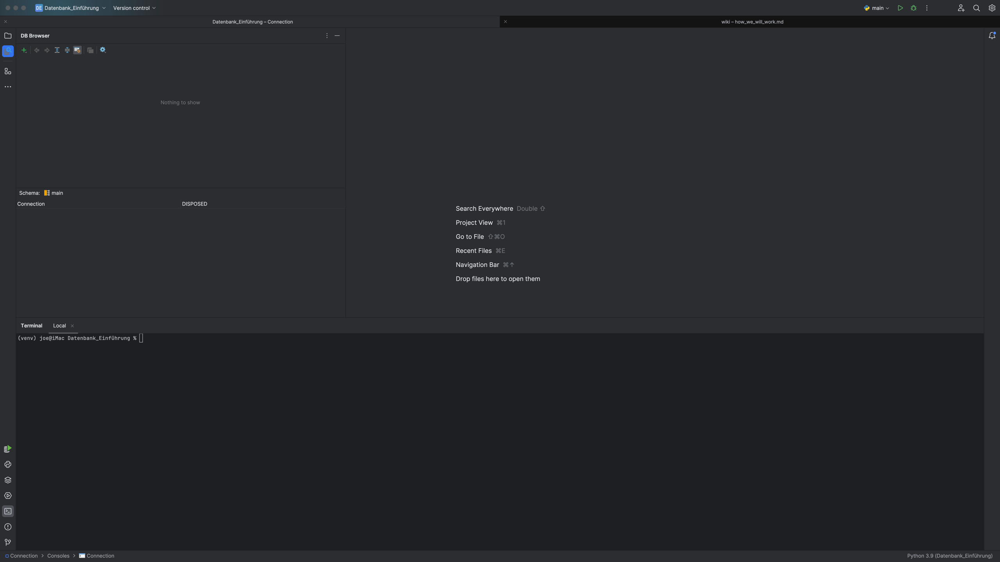

## Arbeiten mit dem Databank Navigator 

Über das grüne Plus-Zeichen in diesen Dialog legt man eine neue Datenbank an oder stellt eine neue Verbindung zu einer
bestehenden Datenbank her.

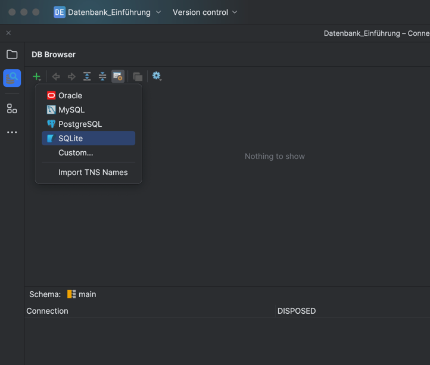

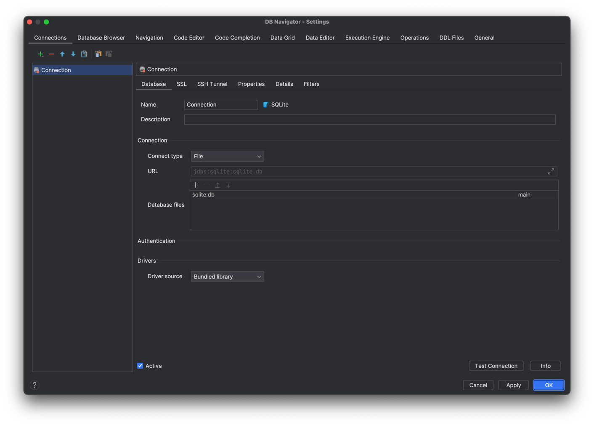

SQLite erstellt für jede Datenbank eine eigene Datei.

**Anm.:** Es ist in der Lage auch mehrere TeraByte große Dateien anzulegen.
SQLite ist für seine Effizienz und Zuverlässigkeit bei kleinen bis mittelgroßen Datenmengen bekannt, und obwohl es
technisch möglich ist, sehr große Datenbanken zu unterstützen, ist es in Fällen, in denen extrem große Datenmengen
verarbeitet werden müssen, oft besser, ein leistungsfähigeres Datenbankmanagementsystem zu verwenden.

Um eine Datenbank anzulegen, muss die Datei im Block **Database Files** angepasst werden.
Dazu klickt man in das ... Menü der Zeile in der "sqlite.db" steht und wählt Pfad und Dateinamen aus. Gibt es die Datei
noch nicht, so wählt man nur das Verzeichnis aus und hängt den Namen per Tastatureingabe an.

Es sollte auch der Datenbankname im Feld **Name** angepasst werden.

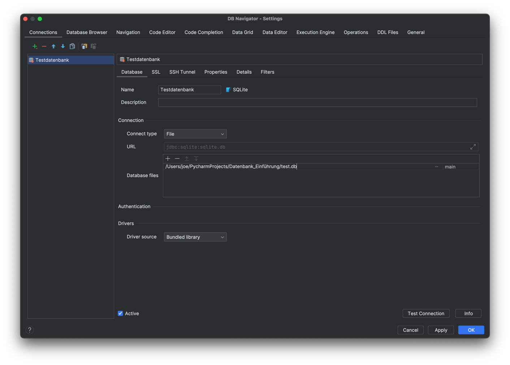

mit Klick auf ok sind wir hier:

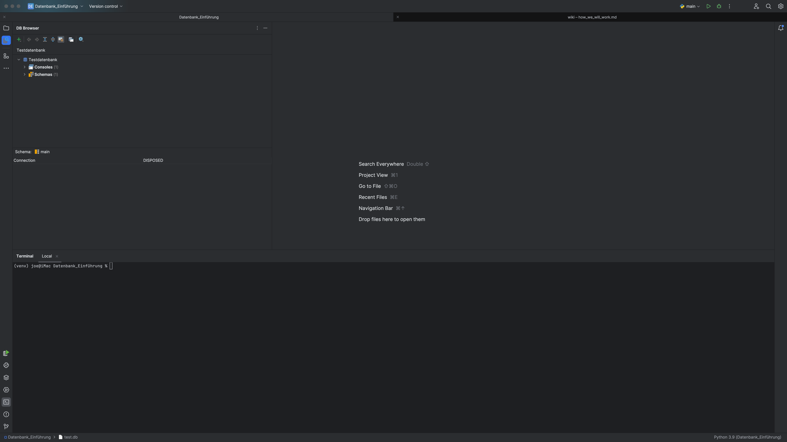

Mittels Doppelklick auf die Datenbankverbindung öffnet sich ein Editorfenster, dass es uns ermöglicht, Befehle an die 
Datenbank zu senden.

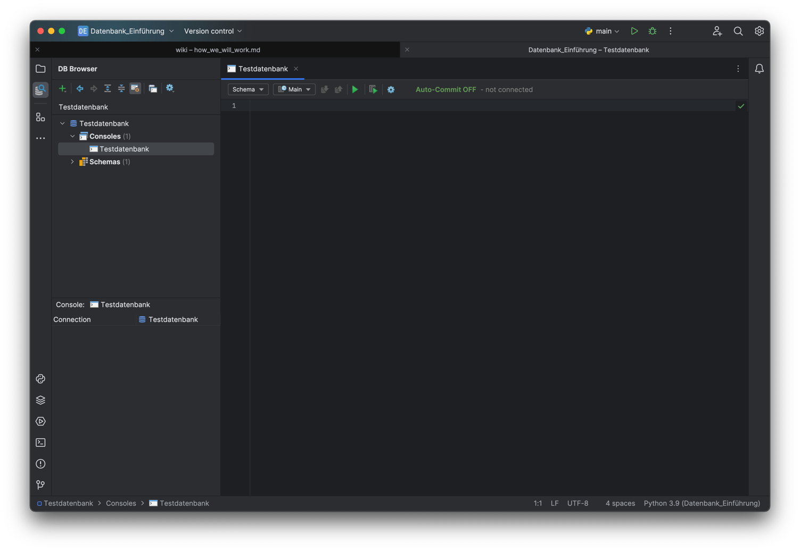

Ein Klick auf Settings öffnet erneut den Konfigurationsdialog. Nachdem man die betreffende Datenbank ausgewählt hat,
genügt der Klick auf das rote Minus-Zeichen, um die **Datenbankverbindung** zu löschen.

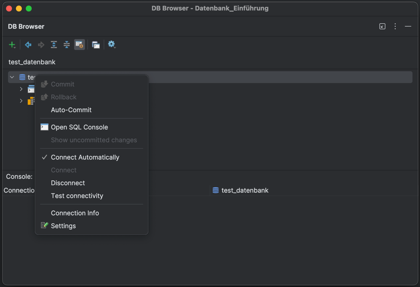

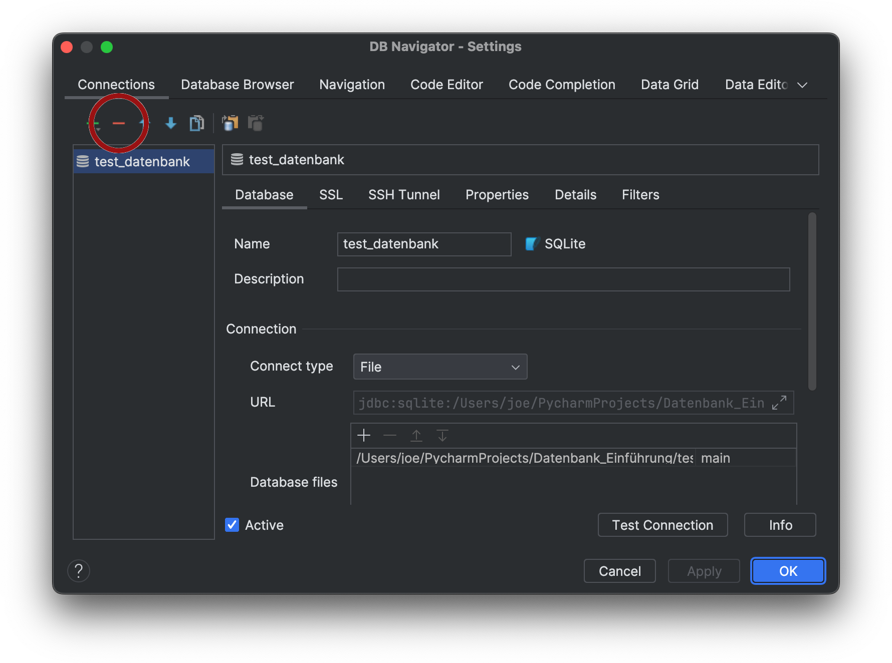

Die Datenbank selbst bleibt im Verzeichnis bestehen.

## Arbeiten mit dem Kommandozeilen-Tool

### Kommandozeilen-Tool = Command Line Interface = CLI

Gibt man in der Konsole **sqlite3** ein, zeigt das Ergebnis, ob sqlite installiert und erreichbar ist.

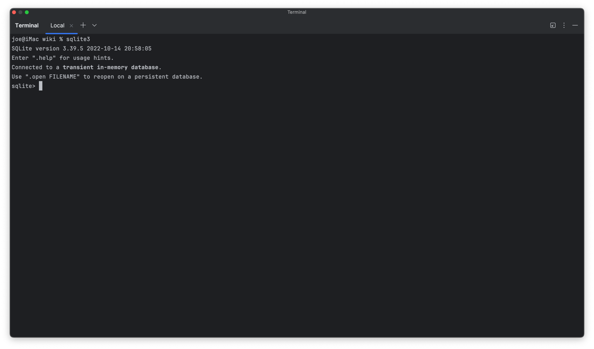

Dabei zeigt die Konsole zwei wichtige Hinweise

- .help → zeigt Hilfetexte an und
- .open FILENAME → weist darauf hin, wie die Verbindung zu einer Datenbank hergestellt wird.

### **Aufgabe: Kommandozeile bedienen 🌶️️**
[10min]
    Probiere .help selbst aus. Suche den Befehl zum Verlassen der Konsole.
    
    Verlasse die Konsole. Das ist nicht unbedingt notwendig, aber es ist gut, den Befehl zu kennen
    um zur "normalen" Betriebssystem Konsole zurückzukommen.  

    Rufe die SQLite Konsole erneut auf und öffne dabei eine neue Datenbank mit einem Namen deiner Wahl.

**Lösung 1:**

    Der zu verwendende Befehl lautet .quit oder (was nicht angegeben ist) CTRL-D.

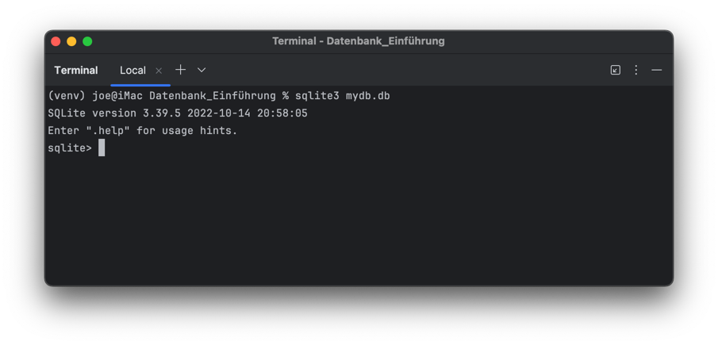

**Lösung 2:**

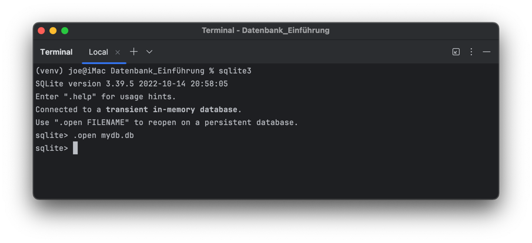

Schauen wir uns den Projektbaum an:

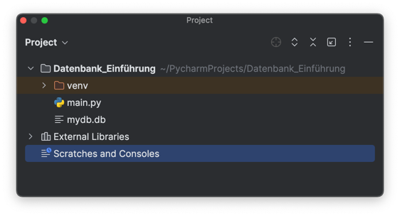

Im oben gezeigten Bild ist die Datei mydb.db zu sehen.
**Das muss nicht sein!** Je nachdem, ob Lösung 1 oder Lösung 2 verwendet wurde, ist das Ergebnis unterschiedlich.
Bei Lösung 1 wird keine Datei angezeigt. Dies geschieht erst, wenn man SQL Kommandos in der Konsole ausführt.
Außerdem ist auch die Dartstellung im Baum unterschiedlich.
Das Listensymbol weist auf eine völlig leere Datenbank hin, während ein Blatt Papier Symbol auf bestehende Daten
hinweist.

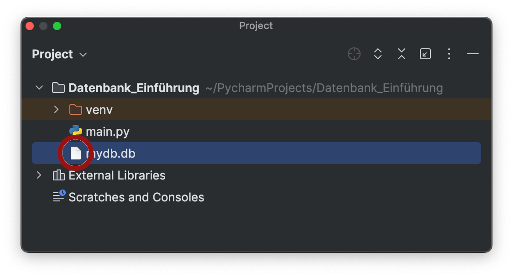

Im .help Verzeichnis findet sich kein Kommando, um eine Datenbank zu löschen.
Man erledigt das einfach durch das Löschen der Datei im Projektbaum.

# Zusammenfassung

Wir haben dargestellt, wie man mittels des Datenbank-Navigators oder des CLI, Datenbankdateien erstellt
oder eine Verbindung dazu herstellt. Über den Editor im Navigator können nun genauso wie im CLI Kommandos an die 
Datenbank senden und die Ergebnisse von Abfragen anzeigen. 

**WICHTIG!**

    Dateinamen bei SQLite folgen keiner bestimmten Konvention. So kann auch eine Datenbank ohne Endung angelegt werden.
    Es ist also wichtig hier einer eigenen Norm zu folgen.

**Vorschlag:**

    SQLite Dateinamen immer auf .db enden lassen. Das hilft anderen Programierer(n):innen oder 
    Programmen anzuzeigen, dass es sich um eine Datenbankdatei handelt.

Es ist dabei einleuchtend, dass der Navigator wesentlich komfortabler ist als die CLI. Man sollte die CLI aber nicht
unterschätzen. Bei kleinen Aufgaben und Wartungsarbeiten ist man mit dem CLI deutlich schneller als mit einer
**großen** Lösung.
