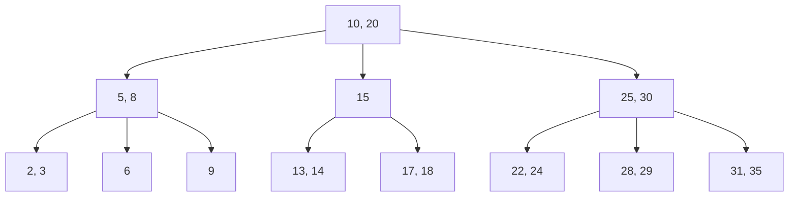
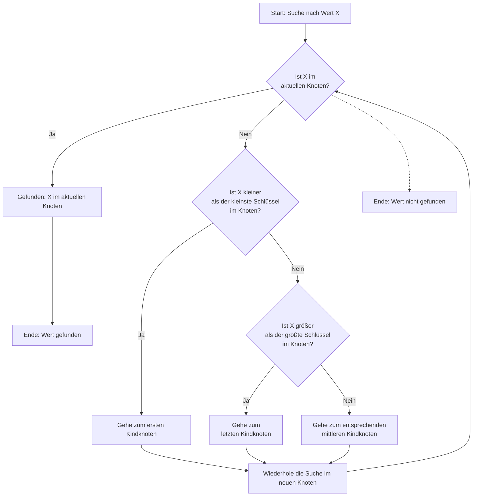
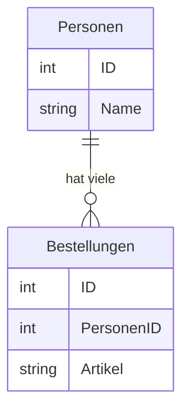

# Indizes und Referentielle Integrität
[45 min]

In diesem Abschnitt der Schulungsunterlage werden wir uns mit zwei wichtigen Aspekten von SQLite-Datenbanken
beschäftigen: Indizes und referentielle Integrität. Diese Konzepte sind entscheidend für die Effizienz und
Zuverlässigkeit von Datenbankoperationen.

## Indizes in SQLite

### Was sind Indizes?

    Ein Index in einer Datenbank ist ähnlich wie ein Inhaltsverzeichnis in einem Buch. 
    Er ermöglicht dem Datenbanksystem, Daten schneller zu finden, ohne jede Zeile in einer
    Tabelle durchsuchen zu müssen.


### Wie funktionieren Indizes allgemein?

Indizes werden in einer separaten Datenstruktur gespeichert, die es der Datenbank ermöglicht, schnell auf die Position
der gesuchten Daten in der Tabelle zuzugreifen.

    Stellen Sie sich eine Tabelle `Personen` mit Tausenden von Einträgen vor. Ohne Index müsste SQLite jeden Eintrag
    durchsuchen, um eine Person mit einem bestimmten Nachnamen zu finden. Mit einem Index auf dem Nachnamen kann SQLite
    diesen Prozess erheblich beschleunigen.

### Erstellen eines Index in SQLite

```sql
CREATE INDEX idx_nachname ON Personen (Nachname);
```

Dieser Befehl erstellt einen Index für die Spalte `Nachname` in der Tabelle `Personen`.

Es ist durchaus möglich, Indizes aus mehreren Spalten zu generieren. Zum Beispiel möchte man aus Gründen der späteren
Weiterverarbeitung von Daten den Namen und den Vornamen eines Mitarbeiters getrennt in verschiedenen Spalten speichern.
Um jemanden zu suchen kann es sinnvoll sein, die Kombination aus Vornamen und Nachnamen als Index zu verwenden, um die
Suche zu beschleunigen.

### Grundkonzept eines Index

Um die Funktionsweise eines Index in einer Datenbank zu verstehen, beginnen wir mit einem einfachen Beispiel: einem
Array. Ein Array ist eine Sammlung von Elementen, die in einer festgelegten Reihenfolge gespeichert sind. Jedes Element
hat einen Index, der seine Position im Array angibt.

### Array als Analogie

Stellen Sie sich ein Array von Buchtiteln vor, die alphabetisch sortiert sind. Um einen bestimmten Titel zu finden,
können Sie den Index verwenden, um direkt auf das Element zuzugreifen, ohne jedes Element durchsuchen zu müssen. Dies
ist die grundlegende Idee hinter einem Datenbankindex.

## Funktionsweise eines Datenbankindex

Tiefer gehende Erläuterung der Funktionsweise von Indizes.

### Struktur eines Index

In Datenbanken ist ein Index eine separate Datenstruktur (wie ein B-Baum, Hash-Tabelle oder ähnliches), die effizienten
Zugriff auf die Datensätze einer Tabelle ermöglicht.

### B-Baum-Struktur

Die meisten Datenbanken, einschließlich SQLite, verwenden für ihre Indizes eine B-Baum-Struktur. Ein B-Baum ist ein
selbst balancierender Baum, der eine sortierte Reihenfolge der Elemente und schnellen Zugriff auf diese Elemente
gewährleistet.

### Erstellung eines Index

#### Automatische vs. Manuelle Indexerstellung

- **Automatisch**: Ein Primärschlüssel in einer Datenbanktabelle erstellt automatisch einen Index.
- **Manuell**: Benutzer können manuell Indizes auf Spalten erstellen, die häufig in Suchabfragen (Queries) verwendet
  werden.

#### Beispiel

```sqlite
CREATE INDEX idx_nachname ON Personen (Nachname);
```

Dieser Befehl erstellt einen Index für die Spalte `Nachname` in der Tabelle `Personen`.

### Suchvorgang

Wenn eine Suchanfrage gestellt wird, verwendet die Datenbank den Index, um schnell die Position des gesuchten
Datensatzes in der Tabelle zu finden, ähnlich wie Sie einen Buchindex verwenden würden, um eine bestimmte Seite in einem
Buch zu finden.

### Effizienz

Ohne Index müsste die Datenbank jeden Datensatz in der Tabelle durchlaufen (Full Table Scan), was bei großen Tabellen
sehr zeitaufwendig sein kann. Mit einem Index kann die Datenbank den Suchbereich erheblich einschränken.

### Aktualisierung

Jedes Mal, wenn Daten in der Tabelle hinzugefügt, geändert oder gelöscht werden, muss der Index aktualisiert werden.
Dies kann zu einem Overhead führen, insbesondere bei großen und häufig geänderten Tabellen.

### Balance zwischen Geschwindigkeit und Speicherplatz

Die Verwendung von Indizes beschleunigt Lesevorgänge, benötigt aber zusätzlichen Speicherplatz und kann Schreibvorgänge
verlangsamen. Daher ist es wichtig, einen guten Mittelweg zwischen der Anzahl der Indizes und der Gesamtleistung der
Datenbank zu finden.

## Zusammenfassung

Indizes in Datenbanken sind leistungsstarke Werkzeuge, die den Zugriff auf Daten erheblich beschleunigen können. Sie
funktionieren ähnlich wie ein Inhaltsverzeichnis in einem Buch und basieren auf Datenstrukturen wie dem B-Baum, um
effiziente Suchoperationen zu ermöglichen. Die Erstellung und Wartung von Indizes erfordert jedoch sorgfältige
Überlegungen hinsichtlich der Leistung und des Speicherplatzes.

Um zu illustrieren, wie ein gesuchter Wert zu einem Indexeintrag geformt wird und dann auf die unsortierte Liste in
einer Datenbank zugreift, können wir ein Flussdiagramm verwenden. In diesem Beispiel konzentrieren wir uns auf einen
B-Baum-Index, der in vielen relationalen Datenbanksystemen, einschließlich SQLite, verwendet wird.

### Beispiel: B-Baum mit 3 Ebenen

Der gezeigte Index enthält die Werte, ganze Zahlen, einer Spalte aus einer Tabelle. Zu jeder Zahl gibt es einen Vektor
oder Zeiger, der bei einem Treffer sofort zu dem gesuchten Datensatz springt.



### Erläuterung des Diagramms

- **Wurzelknoten**: Der Knoten an der Spitze ist der Wurzelknoten mit den Schlüsseln 10 und 20.
- **Zweite Ebene**: Die zweite Ebene besteht aus den Kindern des Wurzelknotens: Knoten mit den Schlüsseln 5 und 8, ein
  Knoten mit dem Schlüssel 15 und ein Knoten mit den Schlüsseln 25 und 30.
- **Dritte Ebene**: Jeder Knoten der zweiten Ebene hat wiederum eigene Kinder, die die dritte Ebene bilden. Diese nennt
  man die Blätter, da sie keine Kinder mehr haben..

### Wichtige Punkte

- **Sortierung**: Die Schlüssel in jedem Knoten sind sortiert.
- **Kinder**: Jeder Knoten hat eine bestimmte Anzahl von Kindern, die von der Ordnung des B-Baums abhängt.
- **Balancierung**: B-Bäume sind so konstruiert, dass sie automatisch balanciert bleiben, was effiziente Such-, Einfüge-
  und Löschoperationen ermöglicht.



Dieses Diagramm bietet eine vereinfachte Darstellung eines B-Baums. In realen Datenbanksystemen können B-Bäume komplexer
sein und zusätzliche Regeln für das Einfügen und Löschen von Schlüsseln enthalten, um die Baumstruktur ausgewogen zu
halten.

### **Aufgabe: B-Baum Recherche 🌶️🌶️**
[30 min]
Beschäftigen sie sich mit dem Flußdiagramm und versuchen sie zu verstehen, wie das System des B-Baumes funktioniert.

# Referentielle Integrität

Referentielle Integrität ist ein Konzept in relationalen Datenbanken, das sicherstellt, dass Beziehungen zwischen
Tabellen konsistent bleiben.



In dieser Darstellung sehen wir eine 1:N Beziehung. Das bedeutet, das es für jeden Eintrag in der Tabelle Personen
mehrere Einträge in der Tabelle der bestellungen geben kann. Andersherum kann es in für jede Bestellung nur eine Person
geben.

Weitere möglich Beziehungen sind 
- **1:1** für jeden Eintrag in der Tabelle existiert genau ein Eintrag in der anderen Tabelle.
- **M:N** für jeden Eintrag in der einen Tabelle gibt es mehrere Einträge in der anderen Tabelle und umgekehrt.

**Begriff:** Kardinalität
Dies ist der fachlich korrekte Bezeichner für diese Art von Beziehungen.

### Schlüsselrollen

In der Tabelle Bestellungen gibt es zwei Schlüssel:

- **Primärschlüssel (Primary Key)**: Eindeutige Identifikation eines Datensatzes in einer Tabelle.
- **Fremdschlüssel (Foreign Key)**: Verweis auf den Primärschlüssel einer anderen Tabelle, um eine Beziehung
  herzustellen.

### Durchsetzung der referentiellen Integrität

SQLite stellt sicher, dass Beziehungen zwischen Tabellen gültig bleiben. Wenn beispielsweise ein Eintrag in einer
Tabelle gelöscht wird, der in einer anderen Tabelle als Fremdschlüssel referenziert wird, verhindert SQLite den
Löschvorgang, es sei denn, es werden entsprechende Maßnahmen getroffen (wie das Setzen von `ON DELETE CASCADE`).

In SQLite können Sie einen Fremdschlüssel (Foreign Key) erstellen, um eine Beziehung zwischen zwei Tabellen
herzustellen. Dies gewährleistet die referentielle Integrität zwischen den Tabellen. Hier ist ein grundlegendes
Beispiel, wie Sie einen Fremdschlüssel in SQLite definieren können:

Angenommen, Sie haben zwei Tabellen: `Personen` und `Bestellungen`. Jede Person kann mehrere Bestellungen haben, aber
jede Bestellung ist genau einer Person zugeordnet. In diesem Fall wäre `Personen` die Haupttabelle (Parent Table)
und `Bestellungen` die abhängige Tabelle (Child Table).

## Umsetzen des UML Diagramms in Code

### Schritt 1: Erstellen der Haupttabelle

Zuerst erstellen Sie die Haupttabelle `Personen`, die einen Primärschlüssel hat:

```sqlite
CREATE TABLE Personen
(
    PersonenID INTEGER PRIMARY KEY,
    Name       TEXT NOT NULL
);
```

### Schritt 2: Erstellen der abhängigen Tabelle mit Fremdschlüssel

Dann erstellen Sie die Tabelle `Bestellungen` mit einem Fremdschlüssel, der auf den Primärschlüssel der
Tabelle `Personen` verweist:

```sqlite
CREATE TABLE Bestellungen
(
    BestellungsID INTEGER PRIMARY KEY,
    Artikel       TEXT NOT NULL,
    PersonenID    INTEGER,
    FOREIGN KEY (PersonenID) REFERENCES Personen (PersonenID)
);
```

In diesem Beispiel:

- `BestellungsID` ist der Primärschlüssel der Tabelle `Bestellungen`.
- `PersonenID` in der Tabelle `Bestellungen` ist der Fremdschlüssel, der auf `PersonenID` in der Tabelle `Personen`
  verweist.

### Beachten Sie:

- **Referentielle Integrität**: Der Fremdschlüssel stellt sicher, dass jede `PersonenID` in der Tabelle `Bestellungen`
  einer existierenden `PersonenID` in der Tabelle `Personen` entspricht.
- **Lösch- und Aktualisierungsregeln**: Sie können zusätzliche Regeln definieren, wie `ON DELETE CASCADE`
  oder `ON UPDATE CASCADE`, um das Verhalten bei Lösch- oder Aktualisierungsoperationen zu steuern.
- **Fremdschlüssel-Unterstützung**: Stellen Sie sicher, dass die Fremdschlüssel-Unterstützung in SQLite aktiviert ist.
  In manchen SQLite-Konfigurationen ist sie standardmäßig deaktiviert. Sie können sie mit dem
  Befehl `PRAGMA foreign_keys = ON;` aktivieren.

Durch die Verwendung von Fremdschlüsseln können Sie die Datenintegrität in Ihrer Datenbank aufrechterhalten und
sicherstellen, dass Beziehungen zwischen Tabellen korrekt verwaltet werden.
