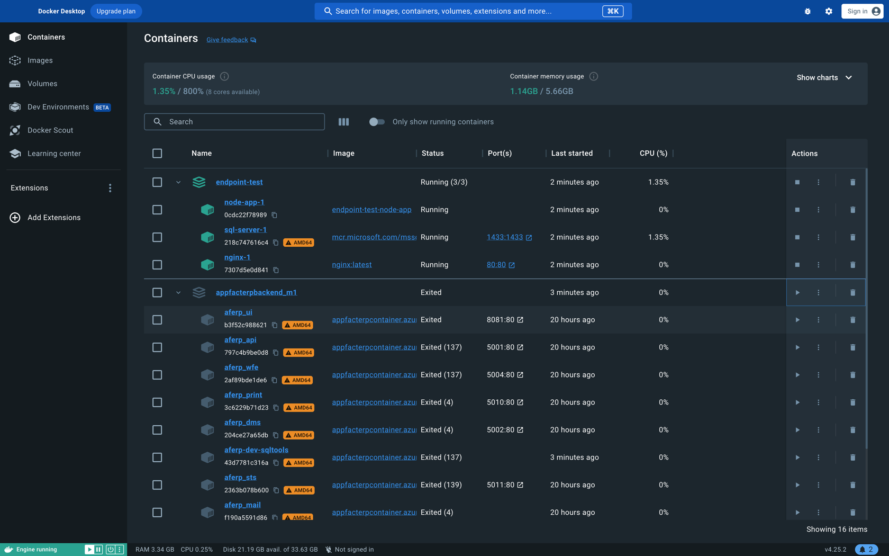

# Einführung in Docker: Grundlagen der Containervirtualisierung

[15min]

Willkommen zum Einstieg in die Welt von Docker, einer revolutionären Technologie, die die Art und Weise, wie wir
Software entwickeln, bereitstellen und ausführen, grundlegend verändert hat. In dieser Einführung konzentrieren wir uns
auf das grundlegende Verständnis von Docker, insbesondere im Kontext der Containervirtualisierung. Dies bildet den
ersten Schritt unserer Lernziele in diesem Seminar.

## Was ist Docker?

Docker ist eine Open-Source-Plattform, die die Entwicklung, den Versand und die Ausführung von Anwendungen vereinfacht.
**Docker ermöglicht, Anwendungen in sogenannten Containern zu verpacken**. Diese Container sind leichtgewichtig, tragbar
und
bieten eine konsistente Umgebung, unabhängig davon, wo die Anwendung ausgeführt wird.

## Containervirtualisierung: Ein Paradigmenwechsel

Traditionelle Virtualisierungstechnologien, wie sie von virtuellen Maschinen (VMs) verwendet werden, replizieren ganze
Betriebssysteme, was zu einem hohen Ressourcenverbrauch führt. Docker hingegen nutzt die Containervirtualisierung, die
sich durch folgende Schlüsselkonzepte auszeichnet:

1. **Leichtgewichtigkeit:** Container teilen sich den Kernel des Host-Betriebssystems und benötigen nicht das gesamte
   Betriebssystem in jeder Instanz. Dies führt zu einer erheblichen Reduzierung des Ressourcenverbrauchs.

2. **Schnelligkeit:** Container können in Sekundenbruchteilen gestartet und gestoppt werden, was eine hohe Effizienz und
   Flexibilität in Entwicklungs- und Produktionsumgebungen ermöglicht.

3. **Portabilität:** Da Container alle notwendigen Abhängigkeiten enthalten, können sie nahtlos zwischen verschiedenen
   Umgebungen (z.B. Entwicklung, Test, Produktion) und Cloud-Plattformen verschoben werden.

4. **Konsistenz:** Docker gewährleistet, dass Anwendungen immer in der gleichen Umgebung laufen, unabhängig davon, wo
   sie ausgeführt werden. Dies reduziert das Problem "Es funktioniert auf meinem Rechner, aber nicht in der Produktion".

5. **Isolation:** Jeder Container ist von anderen Containern isoliert, was Sicherheit und Zuverlässigkeit erhöht.

### Zusammenfassung

Durch das Verständnis dieser Grundlagen von Docker und der Containervirtualisierung sind Sie gut gerüstet, um tiefer in
die Welt der modernen Softwareentwicklung und -bereitstellung einzutauchen. Nach einem kleinen Ausflug in die Geschichte
von Docker werden wir uns mit der Installation und Konfiguration von Docker befassen, um eine solide Basis für
praktische Übungen und fortgeschrittene Themen zu schaffen.

### **Aufgabe: Definition 🌶️**

Beschreibe die Unterschiede zwischen VM (Virtuellen Maschine) und Containern.

## Geschichtlicher Rückblick: Die Rolle der Open Container Initiative (OCI)

[10min]

### Die Anfänge der Container-Technologie

- **Vor Docker:** Container-basierte Virtualisierung existierte bereits vor Docker, aber sie war komplex in der
  Handhabung und nicht standardisiert. Technologien wie LXC (Linux Containers) boten zwar Container-Funktionalitäten,
  waren aber für viele Entwickler nicht leicht zugänglich.

### Die Einführung von Docker

- **Docker's Revolution:** Docker, eingeführt im Jahr 2013, revolutionierte den Markt durch die Vereinfachung der
  Container-Erstellung und -Verwaltung. Es machte Container-Technologie zugänglicher und beliebter in der
  Entwicklergemeinschaft.

### Die Entstehung der OCI

- **Standardisierungsbedarf:** Mit der wachsenden Popularität von Docker und anderen Container-Technologien entstand der
  Bedarf an Standardisierung, um Kompatibilität und Interoperabilität zwischen verschiedenen Tools und Plattformen zu
  gewährleisten.
- **Gründung der OCI:** Im Jahr 2015 wurde die Open Container Initiative von führenden Technologieunternehmen, darunter
  Docker Inc., gegründet. Ihr Ziel war es, Standards für Container-Formate und -Laufzeiten zu entwickeln.

### Die Bedeutung der OCI

- **OCI-Standards:** Die OCI hat zwei wesentliche Standards veröffentlicht: das Container Runtime Specification (
  runtime-spec) und das Container Image Specification (image-spec). Diese Standards definieren, wie Container-Images
  gebaut und Container ausgeführt werden sollten.
- **Einfluss auf Docker:** Docker hat sich diesen Standards angeschlossen und seine Technologie entsprechend angepasst.
  Dies hat dazu beigetragen, dass Docker-Container und -Images mit anderen Tools und Systemen, die OCI-Standards
  einhalten, kompatibel sind.

### Zusammenfassung

Die Einbeziehung der Geschichte der OCI in die Einführung zu Docker zeigt auf, wie wichtig die Standardisierung in der
schnelllebigen Welt der Technologie ist. Es verdeutlicht auch, wie Docker nicht nur als ein Tool, sondern als ein
wesentlicher Bestandteil eines größeren Ökosystems von Container-Technologien zu verstehen ist. Dieses Verständnis kann
ihnen helfen, die Bedeutung von Docker im Kontext der gesamten Branche zu würdigen und die Wichtigkeit von
Standards und Interoperabilität in der Softwareentwicklung zu erkennen.

## Referenz

[Docker.com](https://docs.docker.com/)

## Beispiel einer Docker Desktop Anzeige

Wir sehen hier zwei Applikationen

1. endpoint-test

       drei Container, läuft

2. appfacterpbackend_m1

       viele Container (nicht alle sichtbar), läuft nicht.

In der Tabelle erkennen wir einige Informationen zu den einzelnen Containern, z.B. Name (mit ID), Name des images und
verschieden Status Werte.

Hier wird der Unterschied zur Verwendung von Virtuellen Maschinen sehr deutlich. Man müsste für jeden Container
eigentlich eine eigene virtuelle Maschine aufsetzen. Natürlich geht das, aber der Verwaltungsaufwand und der
Ressourcenverbrauch ist enorm. Die Container teilen sich die Ressourcen des Betriebssystems und sind in einer Anwendung
gruppiert. So kann man viel leichter und übersichtlicher auf die einzelnen Teile des Ganzen eingehen.