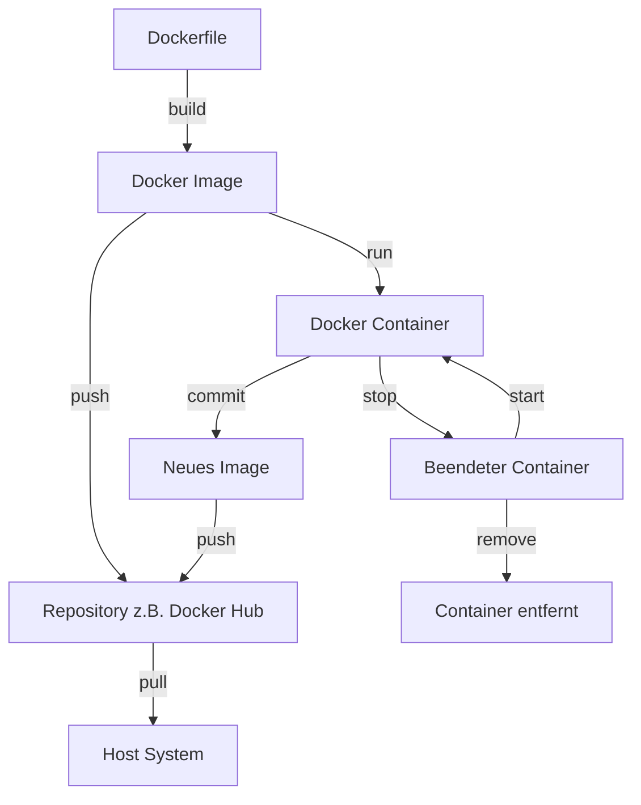

# Docker-Images und Container

[105min]

TODO: Es wäre gut, wenn diese Überschriften zu den Überschriften in den Dateien passen würden. Sonst ist es verwirrend.

## [Verständnis von Docker-Images](docker_images_verstehen.md)

## [Erstellung von Docker-Images](docker_images_erstellen.md)

## [Verwalten von Docker-Images](docker_images_verwalten.md)

## [Grundlagen der Containerisierung](docker_container_grundlagen.md)

## [Lebenszyklus der Container](docker_container_lebenszyklus.md)

## [Interaktion mit Containern](docker_container_interaktion.md)

## [Netzwerk und Kommunikation](docker_container_netzwerk.md)

## [Persistente Datenspeicherung](docker_container_daten.md)

## [Fehlerbehebung und Logs](docker_container_logs.md)

