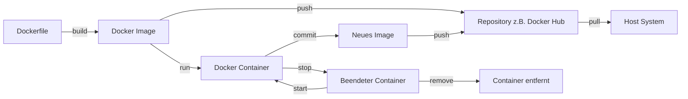

# Docker-Images und Container

[105min]

## [Verständnis von Docker-Images](images_und_container/docker_images_verstehen.md)

## [Erstellung von Docker-Images](images_und_container/docker_images_erstellen.md)

## [Verwalten von Docker-Images](images_und_container/docker_images_verwalten.md)

## [Grundlagen der Containerisierung](images_und_container/docker_container_grundlagen.md)

# Grundlagen der Containerisierung mit Docker

Die Containerisierung ist ein Schlüsselelement in der modernen Softwareentwicklung und Docker spielt dabei eine zentrale
Rolle. Dieser Abschnitt konzentriert sich auf die Grundlagen der Containerisierung und wie Docker diese Technologie
nutzt, um die Entwicklung, Bereitstellung und Ausführung von Anwendungen zu revolutionieren.

## Was ist Containerisierung?

Containerisierung ist eine Methode zur Verpackung einer Anwendung zusammen mit ihren Umgebungen und Abhängigkeiten in
einem isolierten "Container". Dies ermöglicht es, die Anwendung konsistent über verschiedene Computing-Umgebungen hinweg
auszuführen.

## Schlüsselkonzepte der Containerisierung

1. **Isolation:** Jeder Container ist von anderen Containern und dem Host-System isoliert. Dies bedeutet, dass Prozesse
   innerhalb eines Containers keinen Zugriff auf Prozesse in anderen Containern oder auf dem Host haben.

2. **Leichtgewichtigkeit:** Container teilen sich den Kernel des Host-Betriebssystems, benötigen aber nicht das gesamte
   Betriebssystem in jeder Instanz. Dies macht sie wesentlich leichtgewichtiger als traditionelle virtuelle Maschinen.

3. **Portabilität:** Da Container alle notwendigen Abhängigkeiten enthalten, können sie nahtlos zwischen verschiedenen
   Umgebungen (z.B. Entwicklung, Test, Produktion) und Cloud-Plattformen verschoben werden.

4. **Konsistenz:** Container bieten eine konsistente Umgebung für die Anwendung, unabhängig davon, wo sie ausgeführt
   wird. Dies reduziert das Problem "Es funktioniert auf meinem Rechner, aber nicht in der Produktion".

5. **Skalierbarkeit und Verwaltbarkeit:** Container können schnell gestartet und gestoppt werden, was eine einfache
   Skalierung und Verwaltung von Anwendungen ermöglicht.

## Docker und Containerisierung

Docker nutzt die Containerisierungstechnologie, um Entwicklern und Systemadministratoren eine standardisierte Methode
zur Anwendungsbereitstellung zu bieten. Mit Docker können Sie:

- **Anwendungen in Containern verpacken:** Docker-Images dienen als Vorlagen für Container. Sie enthalten alles, was
  benötigt wird, um eine Anwendung auszuführen.

- **Entwicklungsumgebungen standardisieren:** Docker stellt sicher, dass Ihre Anwendung in derselben Umgebung läuft,
  unabhängig davon, auf welchem Server oder in welcher Cloud sie ausgeführt wird.

- **Microservices-Architekturen unterstützen:** Docker ist ideal für Microservices, da jeder Service in einem separaten
  Container laufen kann, was die Isolation und Skalierbarkeit verbessert.

## Zusammenfassung

Die Containerisierung mit Docker bietet eine effiziente, portable und konsistente Methode zur Softwareentwicklung und
-bereitstellung. Sie ermöglicht es Entwicklern und Betriebsteams, Anwendungen schneller und zuverlässiger als je zuvor
zu erstellen und zu verwalten. Durch das Verständnis dieser Grundlagen sind Sie gut gerüstet, um die Vorteile der
Containerisierung in Ihren Projekten voll auszuschöpfen.

## **Lebenszyklus-Management von Containern:**

    - Praktische Erfahrung im Starten, Stoppen, Pausieren und Entfernen von Containern.
    - Untersuchen laufender Container und Verwalten von Container-Prozessen.

## **Interaktion mit Containern:**

    - Erlernen, wie man in einen laufenden Container eintritt und Befehle ausführt.
    - Verstehen, wie man Daten zwischen einem Container und dem Host-System austauscht.

## **Netzwerk und Kommunikation:**

    - Grundlagen der Netzwerkkonfiguration in Docker.
    - Verbinden von Containern untereinander und mit dem Host-Netzwerk.

## **Persistente Datenspeicherung:**

    - Verwendung von Volumes und Bind-Mounts zur Datenspeicherung.
    - Verstehen der Best Practices für die Datenspeicherung in Containern.

## **Fehlerbehebung und Logs:**

    - Grundlegende Techniken zur Fehlerbehebung bei Problemen mit Containern.
    - Verwendung von Docker-Logs zur Überwachung und Diagnose.
