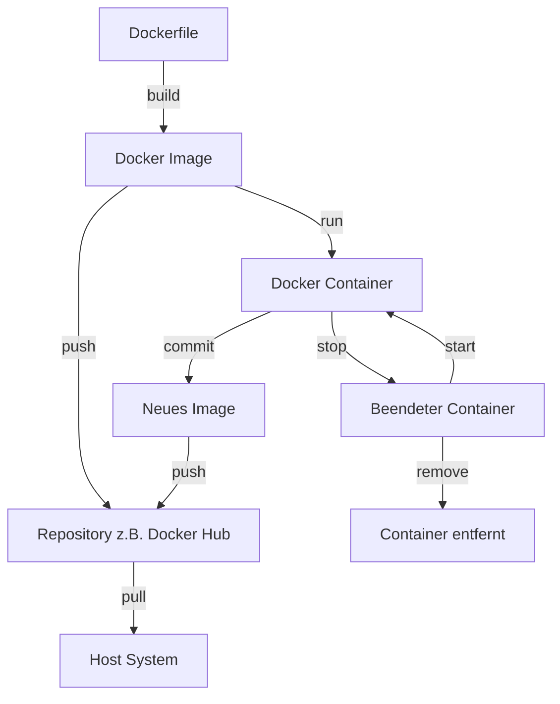

# Docker-Images und Container

[105min]

TODO: Es wäre gut, wenn diese Überschriften zu den Überschriften in den Dateien passen würden. Sonst ist es verwirrend.

## [Docker Images verstehen](docker_images_verstehen.md)

## [Docker Images erstellen](docker_images_erstellen.md)

## [Docker Images verwalten](docker_images_verwalten.md)

## [Lebenszyklus der Docker Container](lebenszyklus_der_docker_container.md)

## [Interaktion mit Docker Containern](interaktion_mit_docker_containern.md)

## [Kommunikation zwischen und mit Containern](kommunikation_zwischen_und_mit_docker_containern.md)

## [Wo und wie Docker Container Daten speichern](wo_und_wie_docker_container_daten_speichern.md)

## [Fehlersuche mit Container Logs](fehlersuche_mit__container_logs.md)

