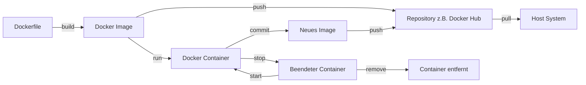

# Docker-Images und Container

[105min]

## [Verständnis von Docker-Images](images_und_container/docker_images_verstehen.md)

## [Erstellung von Docker-Images](images_und_container/docker_images_erstellen.md)

## [Verwalten von Docker-Images](images_und_container/docker_images_verwalten.md)

## [Grundlagen der Containerisierung](images_und_container/docker_container_grundlagen.md)

## [Lebenszyklus der Container](images_und_container/docker_container_lebenszyklus.md)

## [Interaktion mit Containern](images_und_container/docker_container_interaktion.md)

## [Netzwerk und Kommunikation](images_und_container/docker_container_netzwerk.md)

## [Persistente Datenspeicherung](images_und_container/docker_container_daten.md)

## [Fehlerbehebung und Logs](images_und_container/docker_container_logs.md)

