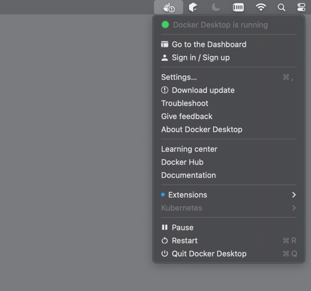

# Installation und Konfiguration von Docker

[60min]

Die Installation von Docker unterscheidet sich je nach [Betriebssystem](docker_installation_not_mac.md).

- Auf dem Mac wird Docker ähnlich wie bei Windows über Docker Desktop installiert.
- Docker Desktop für Mac verwendet eine virtuelle Maschine im Hintergrund, um Linux-Container auszuführen.
- Es bietet eine nahtlose Integration in das macOS-System, einschließlich der Benutzeroberfläche und der Möglichkeit,
  Befehle über das Terminal auszuführen.

## Installationsanleitung Mac OS

1. **Docker Desktop herunterladen:** Besuchen Sie die [offizielle Docker-Website](https://www.docker.com/products/docker-desktop) und laden Sie Docker Desktop 
für Mac herunter.

2. **Installationsdatei öffnen:** Öffnen Sie die heruntergeladene `.dmg`-Datei.

3. **Docker in den Anwendungsordner ziehen:** Ziehen Sie das Docker-Icon in den Anwendungsordner, um die Installation zu starten.

4. **Docker starten:** Öffnen Sie den Anwendungsordner und starten Sie Docker Desktop.

5. **Berechtigungen erteilen:** Möglicherweise müssen Sie Docker die erforderlichen Berechtigungen erteilen. Folgen Sie den Anweisungen auf dem
      Bildschirm.

6. **Warten, bis Docker startet:** Docker benötigt einige Momente, um zu starten. Das Docker-Symbol in der Menüleiste zeigt den Fortschritt an.

Diese Anleitung führt Sie durch die grundlegenden Schritte zur Installation von Docker auf einem Mac. Für detailliertere
Informationen und Fehlerbehebung besuchen Sie bitte
die [Docker-Dokumentation](https://docs.docker.com/desktop/install/mac-install/).

### Aufgabe: Installation🌶️
Führen Sie die Installation von Docker auf Ihren Rechnern aus.

## Exkurs: Unterschiede zwischen Docker Desktop und Docker Engine.

Der Unterschied zwischen Docker Desktop und Docker Engine liegt hauptsächlich in ihrer Zielgruppe, Funktionalität und
Einsatzumgebung.

### Docker Desktop

- **Zielgruppe und Einsatzumgebung:** Docker Desktop ist für Entwickler konzipiert, die auf Nicht-Linux-Betriebssystemen
  wie Windows und macOS arbeiten. Es bietet eine integrierte, benutzerfreundliche Umgebung, um Docker auf diesen
  Systemen zu nutzen.
- **Funktionalität:** Docker Desktop umfasst Docker Engine, Docker CLI (Command Line Interface), Docker Compose, Docker
  Content Trust, Kubernetes und Credential Helper. Es bietet eine komplette Entwicklungsumgebung für das Bauen, Testen
  und Ausführen von Docker-Containern.
- **Benutzeroberfläche:** Docker Desktop kommt mit einer grafischen Benutzeroberfläche (GUI), die das Verwalten von
  Containern, Images, Einstellungen und mehr erleichtert.
- **Virtualisierung:** Auf Windows nutzt Docker Desktop die Hyper-V-Technologie oder WSL 2 (Windows Subsystem für
  Linux), um Linux-Container auszuführen. Auf macOS verwendet es eine virtuelle Maschine im Hintergrund.
- **Einfachheit:** Es ist besonders benutzerfreundlich für diejenigen, die neu in Docker sind oder eine nahtlose
  Integration in ihre bestehende Desktop-Umgebung wünschen.

### Docker Engine

- **Zielgruppe und Einsatzumgebung:** Docker Engine ist die Kernkomponente von Docker, die auf Linux-Systemen läuft. Sie
  ist für Benutzer gedacht, die mit Linux arbeiten oder eine serverbasierte Umgebung benötigen.
- **Funktionalität:** Docker Engine ist die Laufzeitumgebung, die das Erstellen und Ausführen von Containern ermöglicht.
  Sie umfasst den Docker-Daemon (`dockerd`), die REST API und die CLI.
- **CLI-basiert:** Docker Engine wird hauptsächlich über die Kommandozeile gesteuert und bietet keine native grafische
  Benutzeroberfläche.
- **Direkte Integration:** Auf Linux-Systemen integriert sich Docker Engine direkt mit dem Betriebssystem, ohne die
  Notwendigkeit einer zusätzlichen Virtualisierungsschicht.
- **Flexibilität und Kontrolle:** Erfahrene Benutzer, die eine feinere Kontrolle über die Konfiguration und Verwaltung
  von Docker benötigen, bevorzugen oft Docker Engine.

Zusammenfassend ist Docker Desktop eine umfassendere, benutzerfreundlichere Lösung für Windows- und macOS-Benutzer, die
Docker Engine und zusätzliche Tools und Funktionen in einer integrierten Umgebung enthält. Docker Engine hingegen ist
die Kernkomponente, die auf Linux-Systemen läuft und eine direktere, CLI-basierte Interaktion mit Docker ermöglicht.

## **Post-Installations-Schritte**

1. **Überprüfen der Installation:** Sobald Docker gestartet ist, öffnen Sie das Terminal und führen Sie `docker --version` aus, um zu überprüfen, ob Docker korrekt installiert wurde.

2. **Erste Schritte:** Sie können nun mit Docker arbeiten. Probieren Sie zum Beispiel `docker run hello-world`, um einen Testcontainer zu starten.

3. **Mac OS Menüzeile:** Das Docker Menü zeigt ebenfalls an, dass Docker läuft und installiert ist. In dem gezeigten Status ist z. B. erkennbar, dass ein Update für Docker vorliegt.

### Einstellungen über Docker Desktop

Docker Desktop bietet eine grafische Benutzeroberfläche, um verschiedene Einstellungen des Docker-Daemons auf Windows-
und Mac-Systemen zu konfigurieren.

**Zugriff auf Einstellungen:** Die Einstellungen können über das Docker-Symbol in der Taskleiste (Windows) oder in der Menüleiste (Mac) aufgerufen
werden. Wählen Sie "Preferences" oder "Settings" aus dem Dropdown-Menü.

**Was kann konfiguriert werden?** In den Einstellungen können Benutzer Aspekte wie die Anzahl der CPUs und die Menge des zugewiesenen RAMs für Docker,
Netzwerkeinstellungen, Dateifreigaben, Proxies und mehr anpassen.

**Beispiel:** Sie können die Anzahl der Prozessoren erhöhen, die Docker verwenden darf, oder den Speicher erhöhen, um die Leistung
von Containern zu verbessern.

**Änderungen anwenden:** Nachdem Sie Änderungen in den Einstellungen vorgenommen haben, klicken Sie auf "Apply & Restart", um die Änderungen zu
übernehmen und Docker neu zu starten.

### **Aufgabe: Resource einstellen🌶️**

Setzen Sie die Anzahl der für Docker zur Verfügung stehenden Prozessorkerne auf die Hälfte aller Kerne ihres Systems.

### **Aufgabe: Resource einstellen🌶️**

Setzen Sie den für Docker zur Verfügung stehenden Systemspeicher auf die Hälfte des gesamten Speichers ihres Systems.

### Starten von Docker Desktop

In Docker gibt es spezifische Befehle zum Starten oder Stoppen der Docker Engine bzw. des Docker Desktops, die je nach
Betriebssystem variieren können. Hier sind einige grundlegende Befehle und Methoden:

- **Windows:** Docker Desktop startet normalerweise automatisch beim Hochfahren. Es kann auch manuell gestartet werden, 
indem man die Docker Desktop-Anwendung über das Startmenü oder die Verknüpfung auf dem Desktop öffnet.
- **Mac:** Ähnlich wie bei Windows startet Docker Desktop normalerweise automatisch. Man kann es auch manuell starten, 
indem man die Docker-Anwendung im `/Applications`-Ordner öffnet.

### Stoppen von Docker Desktop
Um Docker Desktop zu stoppen, klicken Sie auf das Docker-Symbol in der Taskleiste (Windows) oder in der
Menüleiste (Mac) und wählen Sie "Quit Docker" oder "Docker beenden".

Auf dem Mac kann Docker Desktop auch durch Rechtsklick auf das Docker-Symbol im Dock und Auswahl von "Quit"
beendet werden.

### Automatisierung

Es ist auch möglich, das Starten und Stoppen von Docker über Skripte zu automatisieren, insbesondere auf
Linux-Systemen, indem man die entsprechenden `Systemd`- oder `init.d`-Befehle in Skripten verwendet.

### Hinweis

Es ist wichtig zu beachten, dass das Stoppen von Docker Desktop oder der Docker Engine dazu führt, dass alle laufenden
Container angehalten werden. Stellen Sie sicher, dass keine kritischen Anwendungen ausgeführt werden, bevor Sie Docker
stoppen. 
