# Dockerfile und Docker Compose

In diesem Kapitel werden wir uns mit Dockerfile und Docker Compose befassen, zwei zentralen Werkzeugen in der
Docker-Technologie, die für die Automatisierung des Docker-Image-Build-Prozesses und das Management von
Multi-Container-Anwendungen unerlässlich sind.

## Dockerfile

### Wiederholung: Grundlagen eines Dockerfiles

- Dockerfiles enthalten die Anweisungen, die benötigt werden, um ein Image zu bauen.
- Der Dateiname ist `dockerfile` ohne Endung. Die Datei liegt im Arbeitsverzeichnis der Anwendung.
- Ein Dockerfile ist eine Textdatei mit einer Reihe von Anweisungen, die beschreiben, wie ein Docker-Image aufgebaut
  wird.
- Jede Anweisung im Dockerfile fügt eine neue Schicht zum Docker-Image hinzu.

### Beispiel

```Dockerfile
FROM python:3.12-slim
WORKDIR /app
RUN apt-get update
COPY . /app
RUN pip install -r requirements.txt
CMD ["python", "app.py"]
```

### Aufgabe: Bedeutung der Anweisungen🌶🌶

Wiederhole, was die Bedeutung jeder Zeile im Dockerfile ist.

<details>
    <summary>Lösung</summary>

<b>FROM python:3.12-slim</b>
<ul>
<li>Dies ist die erste Anweisung im Dockerfile und legt das Basis-Image fest.</li>
<li>Hier wird das offizielle Python-Image in der Version 3.8 verwendet, das auf einer schlanken Version von Debian basiert (slim).</li>
<li>Dieses Basis-Image enthält bereits Python und alle notwendigen Abhängigkeiten, um Python-Anwendungen auszuführen.</li>
</ul>

<b>WORKDIR /app</b>
<ul>
<li>Diese Anweisung setzt das Arbeitsverzeichnis im Container.</li>
<li>Wenn dieses Verzeichnis im Basis-Image nicht existiert, wird es erstellt.</li>
<li>Nachfolgende Anweisungen wie COPY und RUN werden relativ zu diesem Verzeichnis ausgeführt.</li>
</ul>

<b>RUN app-get update \
&& apt-get install curl
<ul>

Dies ist ein wichtiger Punkt. Er zeigt, wie ein Image durch Installation von Paketen in die Lage versetzt wird, eine
Anwendung erfolgreich auszuführen.
<li>startet das Packet Management Tool im Container und bringt die Pakete auf den neuesten Stand. Danach wird das Paket <b>curl</b> installiert. Es ist ein weiterer Paketmanager für besondere Pakete.</li>
<li>Es entsteht ein neuer layer im Container. </li>
</ul>

<b>COPY . /app</b>
<ul>
<li>Kopiert Dateien und Verzeichnisse aus dem Kontextverzeichnis in das Image.</li>
<li>Hier werden alle Dateien und Verzeichnisse aus dem aktuellen Verzeichnis des Hosts in das /app Verzeichnis im Container kopiert.</li>
</ul>

<b>RUN pip install -r requirements.txt</b>
Dieser Befehl gleich dem <b>RUN</b> Befehl weiter oben. Das zeigt, dass dieser Befehl durchaus mehrfach und an verschiedenen Stellen eingesetzt werden kann.
In diesem Fall werden über pip die notwendigen Abhängigkeiten für die Python Anwendung selbst installiert.
<ul>
<li>Führt Befehle aus, um das Image zu bauen.</li>
<li>In diesem Fall wird pip, der Paketmanager für Python, verwendet, um alle Abhängigkeiten zu installieren, die in der requirements.txt-Datei aufgelistet sind.</li>
</ul>

<b>CMD ["python", "app.py"]</b>
<ul>
<li>Definiert den Standardbefehl, der ausgeführt wird, wenn ein Container aus dem Image gestartet wird.</li>
<li>Hier wird die Python-Anwendung gestartet, indem app.py mit dem Python-Interpreter ausgeführt wird.</li>
<li>Dieser Befehl kann beim Starten des Containers überschrieben werden.</li>
</ul>

<b>Der Punkt in Dockerfiles und Docker-Befehlen:</b>
<ul>
<li>
<b>Im COPY Befehl</b>
<ul>
<li>Im Dockerfile, speziell im COPY Befehl, bezieht sich der Punkt auf das Kontextverzeichnis.</li>
<li>Der Befehl `COPY . /app` bedeutet, dass alle Dateien und Verzeichnisse aus dem Kontextverzeichnis in das Verzeichnis `/app` im Docker-Image kopiert werden.</li>
</ul>
</li>

<li>
<b>Im docker build Befehl</b>
<ul>
<li>Beim Bauen eines Docker-Images wird der Befehl docker build verwendet. Der Punkt am Ende dieses Befehls gibt das Kontextverzeichnis für den Build-Prozess an.</li>
<li>Zum Beispiel, `docker build -t mein_python_app:latest .` bedeutet, dass Docker das aktuelle Verzeichnis als Kontext für den Build-Prozess verwenden soll.</li>
<li>Der Kontext ist wichtig, da er alle Dateien und Verzeichnisse enthält, die für den Build-Prozess zugänglich sein müssen, einschließlich des Dockerfiles und aller Dateien, die durch COPY oder ADD Befehle ins Image übertragen werden.</li>
</ul>
</li>

<p>In beiden Fällen ist der Punkt eine Kurzform, um das aktuelle Verzeichnis zu bezeichnen. Es ist eine gängige Praxis in
Unix- und Linux-basierten Systemen, den aktuellen Ordner mit einem Punkt zu referenzieren.</p>
</ul>

</details>

### Aufgabe: Erstellung des Images🌶🌶

Wie erstellt man auf Basis des obigen Dockerfiles ein Image?
<details>
    <summary>Lösung</summary>

Das Image, das durch dieses Dockerfile erstellt wird, hat standardmäßig <b>keinen</b> spezifischen Namen. Um dem Image
einen Namen zu geben, müssen Sie den `docker build` Befehl mit dem `-t` Flag verwenden, gefolgt von dem gewünschten
Namen und Tag. Zum Beispiel:

```bash
docker build -t meine_python_app:latest .
```

Durch diese Anweisungen wird ein Docker-Image erstellt, das eine lauffähige Umgebung für Ihre Python-Anwendung
bereitstellt.

Hierbei ist `meine_python_app` der Name des Images und `latest` ist der Tag, der die Version des Images angibt. Ohne
das `-t` Flag würde das Image nur eine generierte ID erhalten und keinen benutzerfreundlichen Namen.
</details>

## Docker Compose

Docker Compose ist ein Tool zur Definition und Ausführung von Multi-Container Docker-Anwendungen.
Mit einer YAML-Datei können Sie Dienste, Netzwerke und Volumes definieren.

**Beispiel einer `docker-compose.yml`-Datei:**

```yaml
version: '3'
services:
  nginx:
    image: nginx:latest
    volumes:
      - ./nginx.conf:/etc/nginx/nginx.conf:ro
    ports:
      - "80:80"

  sql-server:
    image: mcr.microsoft.com/mssql/server:2019-latest
    environment:
      - ACCEPT_EULA=Y
      - SA_PASSWORD=Sql12345
    ports:
      - "1433:1433"
    volumes:
      - ./mydatabase:/var/opt/mssql

  meine_python_app:
    build:
      context: .
      dockerfile: Dockerfile
    network_mode: service:nginx
    depends_on:
      - sql-server
```

**Version**: `version: '3'` gibt die Version der Docker Compose-Datei an. Version 3 ist eine der neuesten Versionen und
bietet
Unterstützung für Docker Swarm.

**Services**: Unter `services` werden die verschiedenen Container definiert, die Teil Ihrer Anwendung sind.

- **nginx**:
  Nginx dient als Eingangspunkt für unsere Applikations. Alle Anfragen von Außen werden von Nginx entgegengenommen
  und innerhalb der Container verteilt.
    - `nginx` ist der Name des Services.
    - `image: nginx:latest` gibt an, dass der Service das neueste offizielle nginx-Image von Docker Hub verwendet.
    - `volumes: - ./nginx.conf:/etc/nginx/nginx.conf:ro` bindet die lokale Datei `nginx.conf`-Datei in den Container
      ein.
      Sie ist innerhalb des Containers unter `/etc/nginc/nginx.conf` erreichbar.
      Das `:ro` bedeutet, dass das Volume im "read-only"-Modus gemountet wird.
    - `ports: - "80:80"` leitet den Port 80 des Hosts auf den Port 80 des nginx-Containers um, was bedeutet, dass nginx
      auf dem Standard-HTTP-Port erreichbar ist.

- **sql-server**: Hier liegt die Datenbank der Applikation.
    - `sql-server` ist der Name dieses Services.
    - `image: mcr.microsoft.com/mssql/server:2019-latest` verwendet das neueste SQL Server 2019-Image von Microsoft.
    - `environment:` definiert Umgebungsvariablen innerhalb des Containers:
        - `ACCEPT_EULA=Y` akzeptiert die Endbenutzer-Lizenzvereinbarung.
        - `SA_PASSWORD=Sql12345` setzt das Passwort für den SQL Server.
    - `ports: - "1433:1433"` leitet den SQL Server-Port 1433 des Hosts auf den Port 1433 des Containers um. Der SQL
      Server ist somit von außen erreichbar. Diese Erreichbarkeit dient jedoch nur der Wartung der Datenbank.
    - `volumes: - ./mydatabase:/var/opt/mssql` bindet das lokale Verzeichnis `mydatabase` in den Container ein, um Daten
      dauerhaft zu speichern. Innerhalb des Containers ist dieses Verzeichnis unter `/var/opt/mssql` erreichbar. Dies
      ist ein 'bind-mont' und kein 'Volume'! Ein Volume hätte mit 'docker create volume ...' erstellt werden müssen.

- **meine_python_app**: In diesem Container läuft die eigentlich interessante Applikation.
    - `meine_python_app` ist der Name dieses Services.
    - `build:` gibt an, dass das Image aus einem Dockerfile gebaut werden soll. Das startet den oben angegebenen build
      Prozess.
        - `context: .` Im aktuellen Ordner (deswegen `.`) findet sich alles, was zum Bau des Containers benötigt wird.
        - `dockerfile: Dockerfile` gibt an, welches Dockerfile für den Build verwendet werden soll. Hier einfach die
          Datei `Dockerfile`.
    - `network_mode: service:nginx` bedeutet, dass der `node-app`-Service das gleiche Netzwerk wie der `nginx`-Service
      verwendet.
    - `depends_on: - sql-server` stellt sicher, dass der `sql-server`-Service gestartet wird, bevor der `node-app`
      -Service gestartet wird.

**Netzwerk testen**

Um ein Netzwerk zu testen hilft nur die Ausprobieren-Methode und Erfahrung. Lösungen sucht man in den Dokumentationen
der einzelnen Container-Dokumentationen und startet dann einen Trial-And-Error Prozess, um zu sehen, ob alles
funktioniert. Dabei helfen die Logs der Container erheblich.

```mermaid
graph TD
    subgraph Docker System
        subgraph CN["Container NGINX"]
            Conf[[<b>NGINX Config:</b><br/> meine_python_app = 3000]]
        end
        PN([Port 80]) <--> CN
        PB([Port 3000]) <--> CB["Container<br/>meine_python_app"]
        PA([Port 1433]) <--> CA["Container<br/>sql-server"]
        CN <---> PB
        PA <--> PB
    end

    HPort([öffentlicher Host Port<br/>Port 80]) <-->|Portmapping| PN
    H2Port([lokaler Host Port<br/>Port 1433]) <-->|Portmapping| PA
    Client <-->|localhost/meine_python_app| HPort
    style CN fill: #ECECFF, stroke: #9370DB
    style Conf fill: #e8dcbc , stroke: #f7be20
```



### Wichtigste compose Befehle

Im Unterschied zu `docker-compose.yml` ist `docker compose` als Aufruf in der Kommandozeile ein Programm, dass mit
verschiedenen Parametern die Ausführung der Multi-Container Umgebung steuern kann. Hier einige Befehle dazu:

| Befehl                      | Beschreibung                                                                                                                                    |
|-----------------------------|-------------------------------------------------------------------------------------------------------------------------------------------------|
| `docker compose up`         | Startet die Container, die in der `docker-compose.yml`-Datei definiert sind. Mit der Option `-d` werden die Container im Hintergrund gestartet. |
| `docker compose down`       | Stoppt und entfernt alle Container, Netzwerke, Volumes und Images, die durch `docker-compose up` erstellt wurden.                               |
| `docker compose build`      | Baut alle Dienste, die in der `docker-compose.yml`-Datei definiert sind und ein `build`-Attribut haben.                                         |
| `docker compose up --build` | Baut den Container und startet ihn danach.                                                                                                      |
| `docker compose pull`       | Lädt alle Images herunter, die in der `docker-compose.yml`-Datei definiert sind, aber nicht lokal gebaut werden.                                |
| `docker compose restart`    | Startet alle Container neu, die in der `docker-compose.yml`-Datei definiert sind.                                                               |
| `docker compose stop`       | Stoppt alle laufenden Container, die durch `docker-compose up` gestartet wurden, ohne sie zu entfernen.                                         |
| `docker compose start`      | Startet alle gestoppten Container, die durch `docker-compose up` erstellt wurden.                                                               |

In unserem Beispiel würde es genügen,
`docker compose up -d`
in der Kommandozeile aufzurufen, um die vollständige Anwendung zu starten. 

