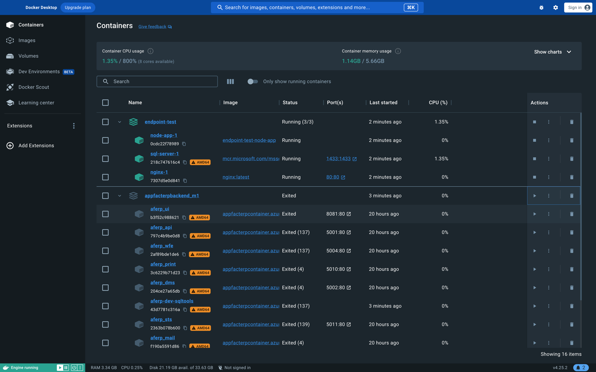

# Einführung in Docker: Grundlagen der Containervirtualisierung

[15min]

Willkommen zum Einstieg in die Welt von Docker, einer revolutionären Technologie, die die Art und Weise, wie wir
Software entwickeln, bereitstellen und ausführen, grundlegend verändert hat. In dieser Einführung konzentrieren wir uns
auf das grundlegende Verständnis von Docker, insbesondere im Kontext der Containervirtualisierung. Dies bildet den
ersten Schritt unserer Lernziele in diesem Seminar.

## Was ist Docker?

Docker ist eine Open-Source-Plattform, die die Entwicklung, den Versand und die Ausführung von Anwendungen vereinfacht.
**Docker ermöglicht, Anwendungen in sogenannten Containern zu verpacken**. Diese Container sind leichtgewichtig, tragbar
und bieten eine konsistente Umgebung, unabhängig davon, wo die Anwendung ausgeführt wird.

## Containervirtualisierung: Ein Paradigmenwechsel

Traditionelle Virtualisierungstechnologien, wie sie von virtuellen Maschinen (VMs) verwendet werden, replizieren ganze
Betriebssysteme, was zu einem hohen Ressourcenverbrauch führt. Docker hingegen nutzt die Containervirtualisierung, die
sich durch folgende Schlüsselkonzepte auszeichnet:

1. **Leichtgewichtigkeit:** Container teilen sich den Kernel des Host-Betriebssystems und benötigen nicht das gesamte
   Betriebssystem in jeder Instanz. Dies führt zu einer erheblichen Reduzierung des Ressourcenverbrauchs.

2. **Schnelligkeit:** Container können in Sekundenbruchteilen gestartet und gestoppt werden, was eine hohe Effizienz und
   Flexibilität in Entwicklungs- und Produktionsumgebungen ermöglicht.

3. **Portabilität:** Da Container alle notwendigen Abhängigkeiten enthalten, können sie nahtlos zwischen verschiedenen
   Umgebungen (z.B. Entwicklung, Test, Produktion) und Cloud-Plattformen verschoben werden.

4. **Konsistenz:** Docker gewährleistet, dass Anwendungen immer in der gleichen Umgebung laufen, unabhängig davon, wo
   sie ausgeführt werden. Dies reduziert das Problem "Es funktioniert auf meinem Rechner, aber nicht in der Produktion".

5. **Isolation:** Jeder Container ist von anderen Containern isoliert, was Sicherheit und Zuverlässigkeit erhöht.

## Beispiel einer Docker Desktop Anzeige

Wir sehen hier zwei Applikationen

| Applikation          | Container                                     | Status  |
|----------------------|-----------------------------------------------|---------|
| endpoint-test        | node-app-1 sql-server-1 nginx-1       | Running |
| appfacterpbackend_m1 | aferp-ui aferp-api ...(viele weitere) | Exited  |

In der Tabelle erkennen wir einige Informationen zu den einzelnen Containern, z.B. Name (mit ID), Name des images und
verschieden Status Werte.

Hier wird der Unterschied zur Verwendung von virtuellen Maschinen sehr deutlich. Man müsste für jeden Container
eigentlich eine eigene virtuelle Maschine aufsetzen. Natürlich geht das, aber der Verwaltungsaufwand und der
Ressourcenverbrauch ist enorm. Die Container teilen sich die Ressourcen des Betriebssystems und sind in einer Anwendung
gruppiert. So kann man viel leichter und übersichtlicher auf die einzelnen Teile des Ganzen eingehen.
