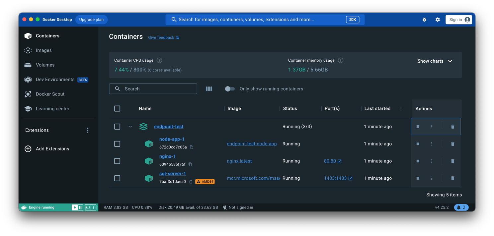
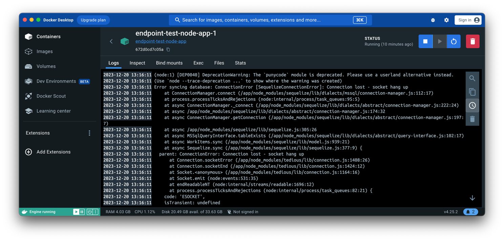

# Fehlerbehebung und Logs in Docker

Die Fähigkeit zur effektiven Fehlerbehebung und zum Umgang mit Logs ist entscheidend für die Verwaltung und Wartung von
Docker-Containern. In diesem Kapitel werden wir uns auf die grundlegenden Techniken und Tools konzentrieren, die für die
Diagnose und Behebung von Problemen in Docker-Umgebungen erforderlich sind.

## Grundlagen der Fehlerbehebung in Docker

- **Container-Logs:**
  Docker speichert die Standardausgabe (STDOUT) und Standardfehlerausgabe (STDERR) von Containern. Diese Logs sind
  oft der erste Anlaufpunkt bei der Fehlersuche.
- **Docker-Statusbefehle:**
  Befehle wie `docker ps`, `docker inspect` und `docker stats` liefern wichtige Informationen über den Zustand und
  die Leistung von Containern.
- **Health Checks:**
  Docker ermöglicht die Definition von Health Checks in einem Dockerfile oder in einer Docker-Compose-Datei, um den
  Gesundheitszustand von Containern zu überwachen.

## Praktische Beispiele für die Fehlerbehebung

Zunächst werden hier die Kommandozeilen Befehle dargestellt. Weiter unten folgt die Darstellung im Docker Desktop.

- **Anzeigen von Container-Logs:**

```bash
docker logs mein-container
```

Dieser Befehl zeigt die Logs für den Container `mein-container` an.

- **Überprüfen des Container-Status:**

```bash
docker ps -a
```

Listet alle Container auf, einschließlich der nicht laufenden, und zeigt ihren Status an.

- **Detaillierte Container-Informationen:**

```bash
docker inspect mein-container
```

Liefert detaillierte Informationen über Konfiguration und Zustand des Containers `mein-container`.

- **Überwachung der Ressourcennutzung:**

```bash
docker stats
```

Zeigt Echtzeitinformationen zur Ressourcennutzung aller laufenden Container.

## Logs und Logging-Strategien

- **Logging-Treiber:**

Docker unterstützt verschiedene Logging-Treiber, die bestimmen, wie Logs gehandhabt werden. Beispiele
sind `json-file`, `syslog`, `journald` und mehr.

- **Zentrales Log-Management:**

Für größere Anwendungen ist es ratsam, ein zentrales Log-Management-System zu verwenden, um Logs von allen
Containern zu sammeln und zu analysieren.

- **Log-Rotation:**

Stellen Sie sicher, dass Log-Dateien regelmäßig rotiert und archiviert werden, um Speicherplatzprobleme zu
vermeiden.

## Zusammenfassung

Die Fähigkeit zur Fehlerbehebung und zum Umgang mit Logs ist für die effektive Verwaltung von Docker-Containern
unerlässlich. Durch die Nutzung von Container-Logs, Docker-Statusbefehlen und Health Checks können Sie Probleme schnell
identifizieren und beheben. Die Implementierung einer soliden Logging-Strategie, einschließlich der Verwendung von
Logging-Treibern und zentralem Log-Management, ist entscheidend für die Aufrechterhaltung der Übersichtlichkeit und
Reaktionsfähigkeit in komplexen Docker-Umgebungen.

## Beispiel



Hier die Dartstellung der laufenden Container. Klickt man einen Container (hier endpoint-test-node-app-1) an, öffnet
sich folgender Dialog:



Die Logs sind sehr detailreich und man muss sehr genau lesen. Macht man das öfter entwickelt sich ein "Auge" für die
wesentlichen Dinge. Hier sehen wir zum Beispiel, dass ein Python Paket veraltet ist und man sich doch bitte um eine
aktuelle Version bemühen möge.

Zudem gibt es Probleme mit der Datenbank. Hier muss man aber wissen, dass das völlig normal ist und keinerlei Aktionen
bedarf. Der Datenbank Container ist einfach noch nicht bereit.


Kritischere Dinge werden farblich hervorgehoben. Aber auch in diesem Fall ist das nicht von Bedeutung. Erst wenn der
Container orange angezeigt würde oder ausgegraut bliebe und nicht läuft, müssen die Einträge näher betrachtet werden.

Logs können sehr lang werden. Daher können die Meldungen kopiert und anderweitig verarbeitet werden, um zur Essenz zu
kommen.

**Ausblick:**

Die NoSQL Datenbank Elasticsearch bietet Anbindungen an die Container an. So ist eine direkte
Auswertung möglich und man kann die Ergebnisse über Werkzeuge von Elasticsearch (see: /material/Elasticsearch-3.pdf
S. 27 - 28) anzeigen. 


