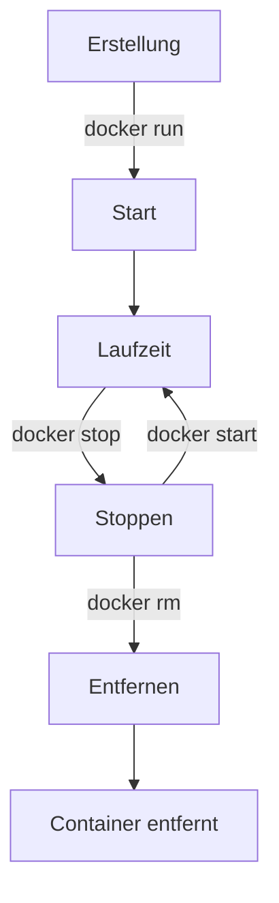

# Lebenszyklus von Containern

Der Lebenszyklus von Docker-Containern ist ein zentrales Konzept, das das Management und die Orchestrierung von
Container-basierten Anwendungen umfasst. Ein tiefgehendes Verständnis des Container-Lebenszyklus ist entscheidend für
effizientes Container-Management und -Betrieb. Hier sind die Schlüsselaspekte des Lebenszyklus von Docker-Containern:

## 1. Erstellung

- **Image als Basis:** Der Lebenszyklus eines Containers beginnt mit einem Docker-Image, das als Vorlage dient.
- **Container-Erstellung:** Mit dem `docker run`-Befehl wird aus dem Image ein Container instanziiert. Hierbei können
  verschiedene Parameter wie Netzwerkeinstellungen, Volumes und Umgebungsvariablen konfiguriert werden.

## 2. Start

- **Ausführung:** Nach der Erstellung wird der Container gestartet. Dies bedeutet, dass der im Dockerfile definierte
  Prozess (z.B. eine Webanwendung) ausgeführt wird.
- **Zugriff und Interaktion:** Sobald der Container läuft, kann mit ihm interagiert werden, beispielsweise über die
  Docker CLI, Docker API oder direkt über Netzwerkanfragen.

## 3. Laufzeit

- **Aktivität:** Während der Laufzeit führt der Container die vorgesehenen Aufgaben aus. Dies kann das Hosting einer
  Webanwendung, das Ausführen von Batch-Jobs oder das Bereitstellen von Diensten umfassen.
- **Management:** Während der Laufzeit können Container überwacht, ihre Logs eingesehen und Konfigurationen angepasst
  werden.

## 4. Stoppen

- **Manuelles Stoppen:** Ein Container kann manuell gestoppt werden, was den Hauptprozess im Container beendet.
- **Automatisches Stoppen:** Ein Container stoppt auch automatisch, wenn der Hauptprozess im Container endet.

## 5. Restart

- **Neustart:** Gestoppte Container können neu gestartet werden. Dies ist nützlich für die Wartung oder das Update von
  Konfigurationen.
- **Restart Policies:** Docker ermöglicht die Konfiguration von Restart Policies, die bestimmen, unter welchen
  Bedingungen ein Container automatisch neu gestartet wird.

## 6. Entfernen

- **Löschen:** Nachdem ein Container gestoppt wurde, bleibt er im System, bis er explizit entfernt wird. Dies geschieht
  mit dem `docker rm`-Befehl.
- **Datenpersistenz:** Beim Entfernen eines Containers gehen alle Daten, die im Container gespeichert sind, verloren, es
  sei denn, sie sind in Volumes oder externen Speichern abgelegt.

## 7. Zusätzliche Aspekte

- **Committing Changes:** Änderungen in einem laufenden Container können zu einem neuen Image "committed" werden, was
  für die Erstellung angepasster Images nützlich ist.
- **Netzwerk und Kommunikation:** Container können in verschiedenen Netzwerken laufen und mit anderen Containern und dem
  Host-System kommunizieren.
- **Skalierung:** In produktiven Umgebungen werden Container oft skaliert, d.h. es werden mehrere Instanzen desselben
  Containers gestartet, um die Last zu verteilen.

## Zusammenfassung

Der Lebenszyklus von Docker-Containern umfasst die Erstellung, den Start, die Laufzeit, das Stoppen, den Neustart und
das Entfernen von Containern. Ein tiefgehendes Verständnis dieser Phasen ist entscheidend für das effektive Management
von Docker-Containern, insbesondere in komplexen und skalierbaren Anwendungsumgebungen. Jede Phase bietet wichtige
Funktionen und Optionen, die für die Optimierung und das Management von Container-basierten Anwendungen genutzt werden
können.

### **Aufgabe: Erläutern sie den Lebenszyklus eines Docker Containers. 🌶️🌶️**