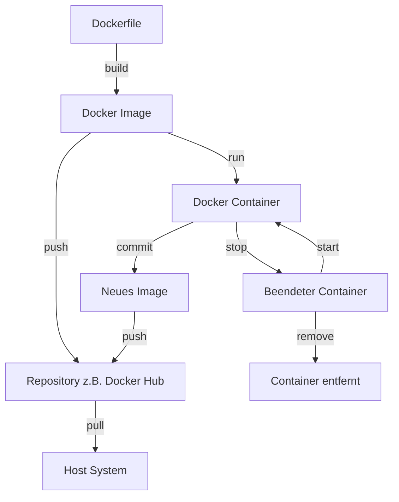

# Images verstehen

Docker-Images sind die Grundbausteine in der Docker-Technologie. Kurz gesagt sind sie schreibgeschützte Vorlagen,
die die Anweisungen zur Erstellung eines Docker-Containers enthalten. Ein Docker-Image beinhaltet alles, was für das
Ausführen einer Anwendung benötigt wird – den Code, eine Laufzeitumgebung, Bibliotheken, Umgebungsvariablen und
Konfigurationsdateien.

Ein Docker-Image ist vergleichbar mit einer Blaupause für einen Container oder, um es mehr computertechnisch
auszudrücken, eine Klasse.

Es ist eine leichte, eigenständige, ausführbare Software, die eine spezifische Umgebung für eine Anwendung bereitstellt.
Wenn ein Container gestartet wird, wird das Docker-Image als Basis verwendet, um eine laufende Instanz – den Container –
zu erstellen. Das ist in etwa so zu verstehen, als würde eine Instanz aus einer Klasse erstellt werden.

Einmal erstellt, wird ein Image **nicht mehr verändert**. Änderungen erfolgen durch Erstellen
eines neuen Images, das auf dem bestehenden Image basiert.

Im `Dockerfile` (meistens ohne Endung) wird festgehalten,
was in einem Image eingebunden ist und auf welchem Image dieses basiert.

**Docker-Images können auf jedem System ausgeführt werden, das Docker unterstützt, unabhängig von der
zugrunde liegenden Infrastruktur. Dies gewährleistet Konsistenz über verschiedene Umgebungen hinweg.**

### **Aufgabe: Definition 🌶️**

Was ist der Unterschied zwischen Image und Container?
