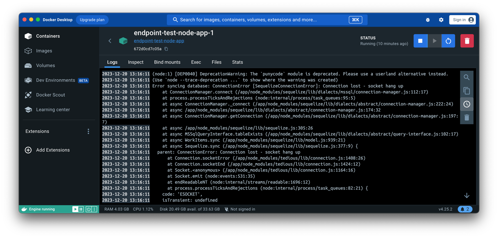

# Installation und Konfiguration von Docker

[60min]

## Zielsetzung

- Teilnehmer sollen in der Lage sein, Docker auf verschiedenen Betriebssystemen zu installieren.
- Verständnis der grundlegenden Konfigurationseinstellungen von Docker.
- Fähigkeit, grundlegende Docker-Befehle und -Operationen auszuführen.

## Inhaltliche Schwerpunkte

### **Einführung in Docker Installation**

Die Installation von Docker unterscheidet sich je nach Betriebssystem. Hier ist eine kurze Übersicht über die
Unterschiede bei der Installation von Docker auf Windows, Linux und Mac:

#### Windows

- Docker wird auf Windows über Docker Desktop installiert.
- Docker Desktop für Windows setzt auf Hyper-V und WSL 2 (Windows Subsystem für Linux) auf.
- Es bietet eine integrierte Umgebung mit einer Benutzeroberfläche und ermöglicht das Ausführen sowohl von Linux- als
  auch von Windows-Containern.

#### Linux

- Docker auf Linux wird als Docker Engine bezeichnet.
- Die Installation erfolgt meist über die Paketverwaltung des jeweiligen Linux-Systems (z.B. apt für Ubuntu, yum für
  CentOS).
- Docker Engine auf Linux bietet eine eher traditionelle, CLI-basierte Erfahrung und ist eng mit dem Linux-Kernel und
  seinen Funktionen verknüpft.

#### Mac

- Ähnlich wie bei Windows wird Docker auf dem Mac über Docker Desktop installiert.
- Docker Desktop für Mac verwendet eine virtuelle Maschine im Hintergrund, um Linux-Container auszuführen.
- Es bietet eine nahtlose Integration in das macOS-System, einschließlich der Benutzeroberfläche und der Möglichkeit,
  Befehle über das Terminal auszuführen.

### **Installationsanleitung Mac OS**

1. **Docker Desktop herunterladen:**
    - Besuchen Sie die [offizielle Docker-Website](https://www.docker.com/products/docker-desktop) und laden Sie Docker
      Desktop für Mac herunter.

2. **Installationsdatei öffnen:**
    - Öffnen Sie die heruntergeladene `.dmg`-Datei.

3. **Docker in den Anwendungsordner ziehen:**
    - Ziehen Sie das Docker-Icon in den Anwendungsordner, um die Installation zu starten.

4. **Docker starten:**
    - Öffnen Sie den Anwendungsordner und starten Sie Docker Desktop.

5. **Berechtigungen erteilen:**
    - Möglicherweise müssen Sie Docker die erforderlichen Berechtigungen erteilen. Folgen Sie den Anweisungen auf dem
      Bildschirm.

6. **Warten, bis Docker startet:**
    - Docker benötigt einige Momente, um zu starten. Das Docker-Symbol in der Menüleiste zeigt den Fortschritt an.

Diese Anleitung führt Sie durch die grundlegenden Schritte zur Installation von Docker auf einem Mac. Für detailliertere
Informationen und Fehlerbehebung besuchen Sie bitte
die [Docker-Dokumentation](https://docs.docker.com/desktop/install/mac-install/).

### **Unterschiede zwischen Docker Desktop und Docker Engine.**

Der Unterschied zwischen Docker Desktop und Docker Engine liegt hauptsächlich in ihrer Zielgruppe, Funktionalität und
Einsatzumgebung.

#### Docker Desktop

- **Zielgruppe und Einsatzumgebung:** Docker Desktop ist für Entwickler konzipiert, die auf Nicht-Linux-Betriebssystemen
  wie Windows und macOS arbeiten. Es bietet eine integrierte, benutzerfreundliche Umgebung, um Docker auf diesen
  Systemen zu nutzen.
- **Funktionalität:** Docker Desktop umfasst Docker Engine, Docker CLI (Command Line Interface), Docker Compose, Docker
  Content Trust, Kubernetes und Credential Helper. Es bietet eine komplette Entwicklungsumgebung für das Bauen, Testen
  und Ausführen von Docker-Containern.
- **Benutzeroberfläche:** Docker Desktop kommt mit einer grafischen Benutzeroberfläche (GUI), die das Verwalten von
  Containern, Images, Einstellungen und mehr erleichtert.
- **Virtualisierung:** Auf Windows nutzt Docker Desktop die Hyper-V-Technologie oder WSL 2 (Windows Subsystem für
  Linux), um Linux-Container auszuführen. Auf macOS verwendet es eine virtuelle Maschine im Hintergrund.
- **Einfachheit:** Es ist besonders benutzerfreundlich für diejenigen, die neu in Docker sind oder eine nahtlose
  Integration in ihre bestehende Desktop-Umgebung wünschen.

#### Docker Engine

- **Zielgruppe und Einsatzumgebung:** Docker Engine ist die Kernkomponente von Docker, die auf Linux-Systemen läuft. Sie
  ist für Benutzer gedacht, die mit Linux arbeiten oder eine serverbasierte Umgebung benötigen.
- **Funktionalität:** Docker Engine ist die Laufzeitumgebung, die das Erstellen und Ausführen von Containern ermöglicht.
  Sie umfasst den Docker-Daemon (`dockerd`), die REST API und die CLI.
- **CLI-basiert:** Docker Engine wird hauptsächlich über die Kommandozeile gesteuert und bietet keine native grafische
  Benutzeroberfläche.
- **Direkte Integration:** Auf Linux-Systemen integriert sich Docker Engine direkt mit dem Betriebssystem, ohne die
  Notwendigkeit einer zusätzlichen Virtualisierungsschicht.
- **Flexibilität und Kontrolle:** Erfahrene Benutzer, die eine feinere Kontrolle über die Konfiguration und Verwaltung
  von Docker benötigen, bevorzugen oft Docker Engine.

Zusammenfassend ist Docker Desktop eine umfassendere, benutzerfreundlichere Lösung für Windows- und macOS-Benutzer, die
Docker Engine und zusätzliche Tools und Funktionen in einer integrierten Umgebung enthält. Docker Engine hingegen ist
die Kernkomponente, die auf Linux-Systemen läuft und eine direktere, CLI-basierte Interaktion mit Docker ermöglicht.

### **Post-Installations-Schritte**

1. **Überprüfen der Installation:**
    - Sobald Docker gestartet ist, öffnen Sie das Terminal und führen Sie `docker --version` aus, um zu überprüfen, ob
      Docker korrekt installiert wurde.

2. **Erste Schritte:**
    - Sie können nun mit Docker arbeiten. Probieren Sie zum Beispiel `docker run hello-world`, um einen Testcontainer zu
      starten.

3. **Mac OS Menüzeile**

   Das Docker Menü zeigt ebenfalls an, dass Docker läuft und installiert ist. In dem gezeigten Status ist z. B.
   erkennbar, dass ein Update für Docker vorliegt.

   

### **Aufgabe: Installation von Docker auf dem eigenen Rechner ausführen. 🌶️**

### **Hinweis für Docker unter Linux**

#### Warum `sudo` benötigt wird:

Auf Linux-Systemen läuft der Docker-Daemon typischerweise mit Root-Privilegien, da er direkten Zugriff auf viele
Low-Level-Funktionen des Betriebssystems benötigt. Wenn ein Benutzer Docker-Befehle ausführt, interagiert er mit diesem
Daemon. Standardmäßig erfordert der Zugriff auf den Docker-Daemon Root-Berechtigungen, daher wird oft `sudo` vor
Docker-Befehlen verwendet, um diese Berechtigungen zu gewähren.

#### Umgehen der Notwendigkeit von `sudo`:

Die ständige Verwendung von `sudo` für Docker-Befehle kann umständlich sein und birgt Sicherheitsrisiken, wenn `sudo` zu
freizügig verwendet wird. Um dies zu umgehen, kann man den Benutzer zur Docker-Gruppe hinzufügen. Hier sind die
Schritte:

1. **Docker-Gruppe erstellen (falls noch nicht vorhanden):**
   ```bash
   sudo groupadd docker
   ```

2. **Aktuellen Benutzer zur Docker-Gruppe hinzufügen:**
   ```bash
   sudo usermod -aG docker $USER
   ```
   Ersetzen Sie `$USER` mit Ihrem Benutzernamen.

3. **Neustart oder Ab-/Anmeldung:**
   Damit die Änderungen wirksam werden, sollten Sie sich ab- und wieder anmelden oder den Computer neu starten.

4. **Überprüfen:**
   Führen Sie einen Docker-Befehl ohne `sudo` aus, z.B.:
   ```bash
   docker run hello-world
   ```
   Wenn keine Fehlermeldung bezüglich der Berechtigungen erscheint, war die Änderung erfolgreich.

#### Sicherheitshinweis:

Das Hinzufügen eines Benutzers zur Docker-Gruppe gewährt diesem Benutzer effektiv Root-Zugriff, da er nun Befehle mit
Docker ausführen kann, die Root-Berechtigungen erfordern. Dies sollte nur bei vertrauenswürdigen Benutzern und in
sicheren Umgebungen angewendet werden.

### **Docker Konfiguration**

#### `daemon.json` Datei in Docker auf Linux

Die `daemon.json` Datei in Docker ist eine Konfigurationsdatei für den Docker-Daemon auf **Linux-Systemen**. Sie
ermöglicht
es Benutzern, die Standardkonfiguration des Daemons anzupassen.

**Wo befindet sich die Datei?**

- Die `daemon.json` Datei befindet sich üblicherweise unter `/etc/docker/daemon.json`. Falls sie nicht existiert, kann
  sie manuell erstellt werden.

**Was kann konfiguriert werden?**

- In dieser Datei können verschiedene Einstellungen vorgenommen werden, wie z.B. die Konfiguration des Logging, die
  Festlegung von Speicherlimits, die Definition von Registry-Mirrors, die Konfiguration von Netzwerkeinstellungen und
  vieles mehr.

**Beispiel:**
Ein einfaches Beispiel für eine `daemon.json` Datei könnte so aussehen:

```json
{
  "debug": true,
  "log-level": "info",
  "storage-driver": "overlay2"
}
```

Dieses Beispiel aktiviert den Debug-Modus, setzt das Log-Level auf "info" und definiert "overlay2" als den
Storage-Driver.

**Änderungen anwenden:**

- Nachdem Änderungen an der `daemon.json` Datei vorgenommen wurden, muss der Docker-Daemon neu gestartet werden, damit
  die Änderungen wirksam werden:
  ```bash
  sudo systemctl restart docker
  ```

#### Einstellungen über Docker Desktop auf Windows und Mac

Docker Desktop bietet eine grafische Benutzeroberfläche, um verschiedene Einstellungen des Docker-Daemons auf Windows-
und Mac-Systemen zu konfigurieren.

**Zugriff auf Einstellungen:**

- Die Einstellungen können über das Docker-Symbol in der Taskleiste (Windows) oder in der Menüleiste (Mac) aufgerufen
  werden. Wählen Sie "Preferences" oder "Settings" aus dem Dropdown-Menü.

**Was kann konfiguriert werden?**

- In den Einstellungen können Benutzer Aspekte wie die Anzahl der CPUs und die Menge des zugewiesenen RAMs für Docker,
  Netzwerkeinstellungen, Dateifreigaben, Proxies und mehr anpassen.

**Beispiel:**

- Sie können die Anzahl der Prozessoren erhöhen, die Docker verwenden darf, oder den Speicher erhöhen, um die Leistung
  von Containern zu verbessern.



**Änderungen anwenden:**

- Nachdem Sie Änderungen in den Einstellungen vorgenommen haben, klicken Sie auf "Apply & Restart", um die Änderungen zu
  übernehmen und Docker neu zu starten.

### **Aufgabe: Docker Menü ausprobieren und Dashboard aufrufen. Vertraut machen mit den zur Verfügung stehenden Seiten.

🌶️**

#### Zusammenfassung

- Die `daemon.json` Datei auf Linux und die Einstellungen in Docker Desktop auf Windows und Mac bieten flexible
  Möglichkeiten, die Docker-Umgebung an spezifische Bedürfnisse anzupassen.
- Während `daemon.json` eine manuelle Bearbeitung der Konfigurationsdatei erfordert, bietet Docker Desktop eine
  benutzerfreundliche Schnittstelle für die Konfiguration.
- Es ist wichtig, die Auswirkungen von Änderungen an der Konfiguration zu verstehen, insbesondere in Bezug auf
  Systemressourcen und Netzwerksicherheit.
- Anpassung von Speicher, Netzwerk und anderen Ressourceneinstellungen.

### **Grundlegende Docker-Befehle**

Hier ist eine Markdown-Tabelle mit Docker-Befehlen, die sich auf System- und Verwaltungsaufgaben beziehen:

| Befehl                   | Beschreibung                                                                                                                                                              |
|:-------------------------|:--------------------------------------------------------------------------------------------------------------------------------------------------------------------------|
| `docker info`            | Zeigt Systemweite Informationen über Docker, einschließlich der Anzahl der Container und Images, Speicher- und Netzwerkkonfiguration, Kernel-Version usw.                 |
| `docker version`         | Zeigt Informationen über die Docker-Version, einschließlich der Client- und Server-Version (Docker-Daemon).                                                               |
| `docker system df`       | Zeigt die belegte Speichermenge durch Docker-Images, Container, Volumes und Build Cache.                                                                                  |
| `docker system prune`    | Entfernt ungenutzte Daten, um Speicherplatz freizugeben. Dies umfasst ungenutzte Container, Netzwerke, Images (sowohl hängende als auch ungenutzte) und optional Volumes. |
| `docker network ls`      | Listet alle Netzwerke auf, die von Docker verwaltet werden.                                                                                                               |
| `docker network create`  | Erstellt ein neues Netzwerk.                                                                                                                                              |
| `docker network inspect` | Zeigt detaillierte Informationen zu einem oder mehreren Netzwerken an.                                                                                                    |
| `docker network rm`      | Entfernt ein oder mehrere Netzwerke.                                                                                                                                      |
| `docker volume ls`       | Listet alle Volumes auf, die von Docker verwaltet werden.                                                                                                                 |
| `docker volume create`   | Erstellt ein neues Volume.                                                                                                                                                |
| `docker volume inspect`  | Zeigt detaillierte Informationen zu einem oder mehreren Volumes an.                                                                                                       |
| `docker volume rm`       | Entfernt ein oder mehrere Volumes.                                                                                                                                        |
| `docker login`           | Meldet sich bei einer Docker-Registry an.                                                                                                                                 |
| `docker logout`          | Meldet sich von einer Docker-Registry ab.                                                                                                                                 |
| `docker context ls`      | Listet alle Docker-Kontexte auf. Ein Kontext definiert, wie Befehle mit einem bestimmten Docker-Host und einer Docker-Registry interagieren.                              |
| `docker context create`  | Erstellt einen neuen Docker-Kontext.                                                                                                                                      |
| `docker context use`     | Wechselt zu einem anderen Docker-Kontext.                                                                                                                                 |
| `docker context rm`      | Entfernt einen Docker-Kontext.                                                                                                                                            |

Diese Befehle sind nützlich für die allgemeine Verwaltung und Überwachung von Docker-Systemen und Ressourcen. Sie
ermöglichen es Benutzern, Informationen über ihre Docker-Installation zu erhalten, Ressourcen zu verwalten und mit
Docker-Registries und Kontexten zu interagieren.

In Docker gibt es spezifische Befehle zum Starten oder Stoppen der Docker Engine bzw. des Docker Desktops, die je nach
Betriebssystem variieren können. Hier sind einige grundlegende Befehle und Methoden:

### Docker Engine auf Linux

#### Starten der Docker Engine

- **Systemd (die meisten modernen Distributionen):**
  ```bash
  sudo systemctl start docker
  ```
- **Ältere Systeme mit init.d:**
  ```bash
  sudo /etc/init.d/docker start
  ```

#### Stoppen der Docker Engine

- **Systemd:**
  ```bash
  sudo systemctl stop docker
  ```
- **Init.d:**
  ```bash
  sudo /etc/init.d/docker stop
  ```

### Docker Desktop auf Windows und Mac

#### Starten von Docker Desktop

- **Windows:**
    - Docker Desktop startet normalerweise automatisch beim Hochfahren. Es kann auch manuell gestartet werden, indem man
      die Docker Desktop-Anwendung über das Startmenü oder die Verknüpfung auf dem Desktop öffnet.
- **Mac:**
    - Ähnlich wie bei Windows startet Docker Desktop normalerweise automatisch. Man kann es auch manuell starten, indem
      man die Docker-Anwendung im `/Applications`-Ordner öffnet.

#### Stoppen von Docker Desktop

- **Windows und Mac:**
    - Um Docker Desktop zu stoppen, klicken Sie auf das Docker-Symbol in der Taskleiste (Windows) oder in der
      Menüleiste (Mac) und wählen Sie "Quit Docker" oder "Docker beenden".
    - Auf dem Mac kann Docker Desktop auch durch Rechtsklick auf das Docker-Symbol im Dock und Auswahl von "Quit"
      beendet werden.

### Automatisierung

Es ist auch möglich, das Starten und Stoppen von Docker über Skripte zu automatisieren, insbesondere auf
Linux-Systemen, indem man die entsprechenden Systemd- oder init.d-Befehle in Skripten verwendet.

### Hinweis

Es ist wichtig zu beachten, dass das Stoppen von Docker Desktop oder der Docker Engine dazu führt, dass alle laufenden
Container angehalten werden. Stellen Sie sicher, dass keine kritischen Anwendungen ausgeführt werden, bevor Sie Docker
stoppen.
