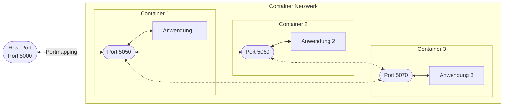
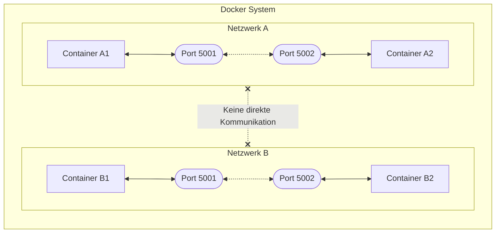
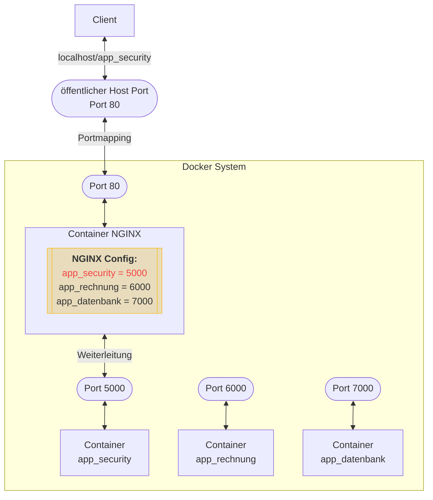

# Kommunikation zwischen und mit Docker Containern

In diesem Kapitel setzen wir und mit der Kommunikation von Docker Containern untereinander und mit der Außenwelt
auseinander.

Docker-Container kommunizieren mit ihrer Umgebung über mehrere Techniken, um Isolation zu gewährleisten und gleichzeitig
notwendige Interaktionen zu ermöglichen.

Docker-Container kommunizieren im Allgemeinen über Netzwerke (TCP/IP) untereinander und mit der Außenwelt.

Um die Dockercontainer voneinander Unterscheiden zu können, müssen sie mit einer Nummer versehen werden.
Diese Nummer bezeichnet man in der Netzwerktechnik als **Port**. Man kann es sich bildlich vorstellen, wie eine
Hausnummer bei der Post. 

**Kommunikation zwischen den Container**:
Werden mehrere Container gleichzeitig betrieben und sollen sie miteinander 
kommunizieren können, so müssen sie die Ports der jeweils anderen Container genau kennen.

**Kommunikation von Containern mit dem Hostsystem**: 
Um jetzt einen Container mit der Außenwelt (dem Hostsystem) zu verbinden, muss ein Port veröffentlicht werden



Starte Container 1 mit dem Portmapping von 8000 zu 5050.

```bash
docker run -d -p 8000:5050 container_1
```

Container 2 und 3 werden mit den folgenden Befehlen gestartet:

```bash
docker run -d container_2
docker run -d container_3
```

Und was ist nun mit den Ports `5060` und `5070` von den Anwendungen 2 und 3?
Diese müssen nicht im Dockerfile oder so angelegt werden, sondern werden in den Anwendungen selbst definiert
und hinterlegt.

D.h. bei Anwendung 1 gibt es Code, der wie folgt aussehen könnte, um sich selbst auf Port 5050 ansprechbar zu machen:

```python
import http.server
import socketserver

PORT = 5050

Handler = http.server.SimpleHTTPRequestHandler

with socketserver.TCPServer(("", PORT), Handler) as httpd:
    print("serving at port", PORT)
    httpd.serve_forever()

...
```

Andererseits gibt es in Anwendung 1 dann auch Code, um mit den beiden anderen Anwendungen zu kommunizieren,
in etwa so:

TODO: Code füllen
```python

```

Ähnliche Codes wären dann auch in Anwendung 2 und 3 vorhanden.


### Exkurs: Netzwerktypen in Docker

Docker bietet verschiedene Netzwerktypen an, um die Kommunikation zu realisieren.

| Netzwerktyp | Erklärung                                                                                                                                             |
|-------------|-------------------------------------------------------------------------------------------------------------------------------------------------------|
| `bridge`    | Standardnetzwerktyp für Docker-Container. Jeder Container in diesem Netzwerk erhält eine eigene IP-Adresse, was die interne Kommunikation ermöglicht. |
| `host`      | Container teilen sich den Netzwerk-Stack des Hosts. Nützlich für Dienste, die auf dem Host-Netzwerk sichtbar sein müssen.                             |
| `overlay`   | Ermöglicht die Netzwerkkommunikation zwischen Containern auf verschiedenen Docker-Hosts, typisch in Docker-Swarm-Umgebungen.                          |


### Beispiel

Wir werden mit `docker compose` ein Werkzeug kennenlernen, mit dem mehrere Container gestartet werden können.
Dort werden wir dann auch ein ausführliches Beispiel für die Kommunikation von Docker Containern und der Außenwelt
betrachten.


### Vom Nutzer definierte Netzwerke

In dem obigen Beispiel haben wir von Docker automatisch ein Netzwerk anlegen lassen. Wir können jedoch auch 
zunächst ein eigenes Netzwerk anlegen und dann Container zu diesem hinzufügen:

**Erstellen eines Netzwerks:**

```bash
docker network create mein-netzwerk
```

Erstellt ein benutzerdefiniertes Netzwerk namens `mein-netzwerk`.

**Starten von Containern in diesem Netzwerk:**

```bash
docker run -d --name mein-container --network mein-netzwerk hello-world-python
```

Startet einen Container im `mein-netzwerk`. Container innerhalb desselben Netzwerks können miteinander kommunizieren,
während sie von anderen Netzwerken isoliert sind.

### Mehrere Netzwerke

Wir können nun auch mehrere Netzwerke definieren und Container so in verschiedenen Netzwerken separieren.


Durch die Verwendung von benutzerdefinierten Netzwerken können Sie sicherstellen, dass nur die gewünschten Container
miteinander kommunizieren können, während andere Container oder Netzwerke isoliert bleiben. Dies ist besonders wichtig
für die Sicherheit, das Netzwerkmanagement und die Architektur von Microservices.

## Exkurs: Nginx
TODO: Text hinzufügen


