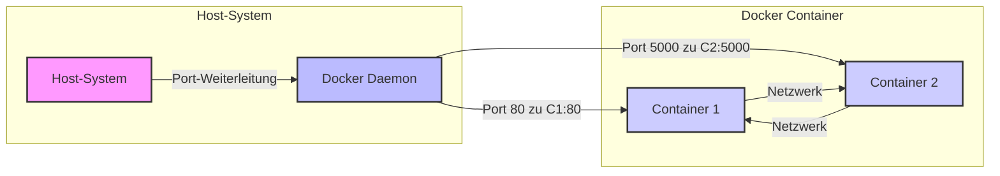

# Kommunikation zwischen und mit Docker Containern

Das Verständnis der Kommunikation ist entscheidend für die effektive Nutzung von Docker, insbesondere wenn
es um die Verbindung von Containern untereinander und mit der Außenwelt geht.

## Einführung

Docker-Container kommunizieren mit ihrer Umgebung über mehrere Techniken, um Isolation zu gewährleisten und gleichzeitig
notwendige Interaktionen zu ermöglichen. Hier sind die Schlüsselmethoden:

1. **Netzwerke:**
    - **Bridge-Netzwerk:** Standardmäßig verwendet Docker ein Bridge-Netzwerk, um die Kommunikation zwischen Containern
      und dem Host zu ermöglichen. Container im selben Bridge-Netzwerk können kommunizieren, während die Bridge den
      externen Zugriff einschränkt.
    - **Host-Netzwerk:** Container können das Netzwerk des Hosts direkt verwenden. Dies beseitigt die Netzwerkisolation
      zwischen dem Container und dem Host, ermöglicht aber eine einfachere Kommunikation mit externen Netzwerken.
    - **Overlay-Netzwerk:** Für Docker im Swarm-Modus ermöglichen Overlay-Netzwerke, dass Container, die über mehrere
      Knoten verteilt sind, kommunizieren, als wären sie auf demselben Host.

2. **Volumes:**
    - Volumes werden verwendet, um von Docker-Containern generierte und genutzte Daten zu speichern. Sie sind wesentlich
      für Daten, die auch nach einem Neustart des Containers erhalten bleiben sollen und für das Teilen von Daten
      zwischen Containern oder zwischen dem Host und einem Container.

3. **Bind Mounts:**
    - Bind Mounts sind eine einfache Möglichkeit, Daten und Dateien zwischen dem Host und dem Container zu teilen. Sie
      ermöglichen es, bestimmte Pfade des Hosts in den Container einzubinden und so direkten Zugriff auf das Dateisystem
      zu haben.

4. **Ports:**
    - Docker ermöglicht das Weiterleiten von Ports vom Host zu den Containern. Durch das Öffnen und Zuordnen von Ports
      ermöglicht Docker, dass Netzwerkdienste, die innerhalb von Containern laufen, von externen Netzwerken oder anderen
      Containern aus zugänglich sind.

5. **Inter-Container-Kommunikation (ICC):**
    - Container können über das Linking (eine ältere Methode) oder besser, indem sie Teil desselben Netzwerks sind,
      miteinander kommunizieren, was es ihnen ermöglicht, Daten oder Signale auszutauschen.

6. **APIs und Sockets:**
    - Docker bietet eine REST-API, die zur programmatischen Steuerung und Interaktion mit Containern verwendet werden
      kann. Auch UNIX- und TCP-Sockets können für Kommunikationszwecke verwendet werden, insbesondere für das Senden von
      Befehlen an den Docker-Daemon oder für Container-Interaktionen.

Diese Techniken sind Teil des Designs von Docker, um die Isolation von Containern zu wahren und gleichzeitig zu
ermöglichen, dass sie notwendige Aufgaben ausführen und effektiv mit der externen Umgebung oder anderen Containern
kommunizieren.

Das Öffnen einer Shell in einem Docker-Container, üblicherweise durchgeführt mit Befehlen
wie `docker exec -it [container-id] /bin/bash`, unterscheidet sich etwas von den oben aufgeführten
Kommunikationsmethoden. Es geht mehr um die Interaktion mit der internen Umgebung des Containers, als darum, wie der
Container mit dem externen System oder anderen Containern kommuniziert. Hier ist der Zusammenhang:

- **Interaktive Shells und Exec-Befehle:**
    - Wenn Sie eine Shell in einem Container öffnen, nutzen Sie die Fähigkeit von Docker, Befehle innerhalb des
      laufenden Containers auszuführen. Der Befehl `docker exec` ermöglicht es, spezifische Befehle in einem bestehenden
      Container auszuführen, was eine Shell wie Bash oder Sh sein kann. Dies ist im Wesentlichen eine direkte
      Interaktion mit dem Dateisystem und den Prozessen des Containers.
    - Diese Aktion wird durch die Kontrolle des Docker-Daemons über seine verwalteten Container ermöglicht. Wenn Sie
      einen Befehl wie `docker exec` ausgeben, weist es den Docker-Daemon an, eine interaktive Sitzung mit der
      Prozessumgebung des Containers zu öffnen. Sie kommunizieren nicht über ein Netzwerk oder teilen Daten über
      Volumes, sondern interagieren direkt mit der Umgebung des Containers.

Diese Methode wird hauptsächlich für das Debugging, die Verwaltung und die Interaktion mit containerisierten Anwendungen
während der Entwicklung oder Wartung verwendet. Sie erleichtert nicht die Kommunikation zwischen Containern oder
zwischen Containern und dem Hostsystem in der gleichen Weise, wie es Netzwerke oder Volumes tun. Stattdessen ist es eine
direkte Verbindung in den Container für administrative oder interaktive Aufgaben.

In diesem Kapitel werden wir die Grundlagen des Docker-Netzwerks und die verschiedenen Optionen zur
Netzwerkkonfiguration erkunden.

## Grundlagen des Docker-Netzwerks

Docker verwendet verschiedene Netzwerk-Treiber, um die Kommunikation zwischen Containern zu ermöglichen. Die
gängigsten sind `bridge`, `host` und `overlay`.

| Netwerktyp | Erklärung                                                                                                                                                                                    |
|------------|----------------------------------------------------------------------------------------------------------------------------------------------------------------------------------------------|
| `bridge`   | Das Standardnetzwerk für Docker-Container. Jeder Container, der diesem Netzwerk hinzugefügt wird, erhält eine eigene IP-Adresse, wodurch eine interne Netzwerkkommunikation ermöglicht wird. |
| `host`     | Container, die im Host-Netzwerkmodus laufen, teilen sich den Netzwerk-Stack des Hosts. Dies ist nützlich für Dienste, die auf dem Host-Netzwerk sichtbar sein müssen.                        |
| `overlay`  | Wird in Docker-Swarm-Umgebungen verwendet, um eine Netzwerkkommunikation zwischen Containern auf verschiedenen Docker-Hosts zu ermöglichen.                                                  |

## Netzwerkkommunikation und Port-Weiterleitung

1. **Port-Weiterleitung:**
    - Docker ermöglicht die Weiterleitung von Ports vom Host-System zu Containern, was den Zugriff auf Anwendungen
      innerhalb von Containern von außerhalb ermöglicht.

2. **Container-zu-Container-Kommunikation:**
    - Container innerhalb desselben Netzwerks können über ihre internen IP-Adressen oder Container-Namen kommunizieren.



- Das Host-System ist der Server oder Computer, auf dem Docker läuft.
- Der Docker Daemon verwaltet die Docker-Container und Netzwerke.
- Container 1 und Container 2 sind zwei Docker-Container, die auf dem Host-System laufen.
- Port-Weiterleitung zeigt, wie Anfragen an bestimmte Ports des Host-Systems zu den Containern weitergeleitet werden.
- Netzwerk zwischen den Containern zeigt, wie sie innerhalb desselben Netzwerks kommunizieren können.

## Praktische Beispiele

- **Erstellen eines Bridge-Netzwerks und Verbinden von Containern:**
  ```bash
  docker network create mein-bridge-netzwerk
  docker run -d --network=mein-bridge-netzwerk --name container1 nginx
  docker run -d --network=mein-bridge-netzwerk --name container2 nginx
  ```
  Dieses Beispiel zeigt, wie man ein benutzerdefiniertes Bridge-Netzwerk erstellt und zwei Container darin startet.
  TODO: im letzten abschnitt gabe es bereits sowas. soll es da vllt gelöscht werden?

- **Port-Weiterleitung für einen Webserver:**
  ```bash
  docker run -d -p 8080:80 --name mein-webserver nginx
  ```
  Startet einen Nginx-Webserver-Container und leitet den Port 8080 des Hosts auf den Port 80 des Containers um.
  TODO: weiß immer noch nicht, was Nginx ist.
  TODO: das mit den verschiedenen Ports sollte noch mal auf einem Bild erklärt werdne.

## Netzwerksicherheit

- **Firewall-Regeln und Netzwerk-Policies:**
    - Es ist wichtig, Firewall-Regeln und Netzwerk-Policies zu implementieren, um den Zugriff auf Container-Dienste zu
      kontrollieren. **TODO: was genau meinst du damit? Firewalls auf dem Hostsystem oder innerhalb des Containers?**

- **Sichere Kommunikation:**
    - Für sensible Anwendungen sollten Sie sichere Kommunikationsprotokolle wie HTTPS verwenden, um Datenübertragungen
      zu schützen.

## Zusammenfassung

Das Verständnis von Netzwerk und Kommunikation in Docker ist entscheidend für das Design und die Verwaltung von
containerisierten Anwendungen. Durch die Nutzung verschiedener Netzwerk-Treiber und -Optionen können Sie eine effiziente
und sichere Kommunikation zwischen Ihren Containern sowie zwischen Containern und der Außenwelt sicherstellen. Die
praktischen Beispiele bieten eine Grundlage, um diese Konzepte in realen Anwendungsfällen anzuwenden.

# Todo Beispiele zeigen erstellen

TODO: JA!

TODO: einige dieser Inhalte waren doch schon in anderen kapiteln?

In diesem Kapitel vertiefen wir die Themen Netzwerk und Datenspeicherung in Docker, die bereits in den Abschnitten zu
Docker-Images und Containern sowie in der Diskussion über persistente Datenspeicherung und Container-Kommunikation
angesprochen wurden. Wir konzentrieren uns auf fortgeschrittene Konzepte und Best Practices, um ein umfassendes
Verständnis dieser Schlüsselaspekte zu entwickeln.

## Fortgeschrittene Netzwerkkonzepte

### 1. **Benutzerdefinierte Netzwerke:**

- Erstellen und Verwalten benutzerdefinierter Netzwerke in Docker, um die Kommunikation zwischen Containern zu
  optimieren und zu isolieren.

### 2. **Netzwerk-Treiber:**

- Vertiefung in verschiedene Netzwerk-Treiber wie `bridge`, `overlay` und `macvlan` und deren Anwendungsfälle.

### 3. **Service Discovery und DNS:**

- Verstehen, wie Docker die Namensauflösung zwischen Containern in einem Netzwerk handhabt.

### 4. **Netzwerksicherheit:**

- Implementierung von Sicherheitsmaßnahmen wie Netzwerk-Policies und Firewalls, um den Datenverkehr zu und von
  Containern zu kontrollieren.

## Praktische Beispiele

- **Erstellen eines benutzerdefinierten Netzwerks:**

```bash
docker network create --driver bridge mein-netzwerk
```

Erstellt ein neues Bridge-Netzwerk namens `mein-netzwerk`.

- **Verbinden eines Containers mit einem benutzerdefinierten Netzwerk:**

```bash
docker run -d --network=mein-netzwerk mein-image
```

Startet einen Container im Netzwerk `mein-netzwerk`.

