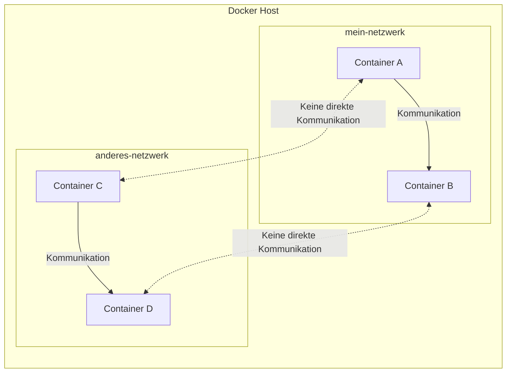

# Kommunikation zwischen und mit Docker Containern

In diesem Kapitel setzen wir und mit der Kommunikation von Docker Containern untereinander und mit der Außenwelt
auseinander.

Docker-Container kommunizieren mit ihrer Umgebung über mehrere Techniken, um Isolation zu gewährleisten und gleichzeitig
notwendige Interaktionen zu ermöglichen.

## Allgemeine Methoden

1. **Netzwerke:**
   Docker bietet
   mehrere [Netzwerktypen](kommunikation_zwischen_und_mit_docker_containern.md#grundlagen-des-docker-netzwerks) an,
   mit denen Container miteinander kommunizieren.

2. **Volumes:**
   [Volumes](wo_und_wie_docker_container_daten_speichern.md#verwendung-von-volumes) werden verwendet, um von
   Docker-Containern generierte und genutzte Daten zu speichern. Entscheidend ist, dass die
   im Volume gespeicherten Daten auch nach einem Neustart des Containers erhalten bleiben sollen
   und für das Teilen von Daten zwischen Containern oder zwischen dem Host und einem Container geeignet sind.

3. **Bind Mounts:**
   [Bind Mounts](wo_und_wie_docker_container_daten_speichern.md#verwendung-von-bind-mounts) sind eine einfache
   Möglichkeit, Daten und Dateien zwischen dem Host und dem Container zu teilen. Sie
   ermöglichen es, bestimmte Pfade des Hosts in den Container einzubinden und so direkten Zugriff auf das Dateisystem
   zu haben. Die Unterschiede von Volumes und Bind Mounts werden später
   [hier](wo_und_wie_docker_container_daten_speichern.md#unterschied-zwischen-docker-volumes-und-bind-mounts) beleuchtet

4. **Ports:**
   Docker ermöglicht
   das [Weiterleiten von Ports](kommunikation_zwischen_und_mit_docker_containern.md#netzwerkkommunikation-und-port-weiterleitung)
   vom Host zu den Containern. Durch das Öffnen und Zuordnen von Ports
   ermöglicht Docker, dass Netzwerkdienste, die innerhalb von Containern laufen, von externen Netzwerken oder anderen
   Containern aus zugänglich sind.
   *Ohne die Angabe von Ports kann keine Kommunikation zwischen Containern stattfinden!** Containern müssen bei ihrem
   Bau oder in ihrer Programmierung Ports zugewiesen sein.

5. **Inter-Container-Kommunikation (ICC):**
   Container können über das Linking (eine ältere Methode) oder besser, indem sie Teil desselben Netzwerks sind,
   miteinander kommunizieren, was es ihnen ermöglicht, Daten oder Signale auszutauschen.

6. **APIs und Sockets:**
   Docker bietet eine REST-API, die zur programmatischen Steuerung und Interaktion mit Containern verwendet werden
   kann. Auch UNIX- und TCP-Sockets können für Kommunikationszwecke verwendet werden, insbesondere für das Senden von
   Befehlen an den Docker-Daemon oder für Container-Interaktionen.

Diese Techniken sind Teil des Designs von Docker, um die Isolation von Containern zu wahren und gleichzeitig zu
ermöglichen, dass sie notwendige Aufgaben ausführen und effektiv mit der externen Umgebung oder anderen Containern
kommunizieren.

## Ausnahme

Das Öffnen einer Shell in einem Docker-Container, üblicherweise durchgeführt mit Befehlen
wie

```bash
docker exec -it [container-id] /bin/bash
```

unterscheidet sich etwas von den oben aufgeführten
Kommunikationsmethoden. Es geht mehr um die Interaktion mit der internen Umgebung des Containers, als darum, wie der
Container mit dem externen System oder anderen Containern kommuniziert. Hier ist der Zusammenhang:

- Wenn Sie eine Shell in einem Container öffnen, nutzen Sie die Fähigkeit von Docker, Befehle innerhalb des
  laufenden Containers auszuführen. Der Befehl `docker exec` ermöglicht es, spezifische Befehle in einem bestehenden
  Container auszuführen, was eine Shell wie Bash oder Sh sein kann. Dies ist im Wesentlichen eine direkte
  Interaktion mit dem Dateisystem und den Prozessen des Containers.
- Diese Aktion wird durch die Kontrolle des Docker-Daemons über seine verwalteten Container ermöglicht. Wenn Sie
  einen Befehl wie `docker exec` ausgeben, weist es den Docker-Daemon an, eine interaktive Sitzung mit der
  Prozessumgebung des Containers zu öffnen. Sie kommunizieren nicht über ein Netzwerk oder teilen Daten über
  Volumes, sondern interagieren direkt mit der Umgebung des Containers.

Diese Methode wird hauptsächlich für das Debugging, die Verwaltung und die Interaktion mit containerisierten Anwendungen
während der Entwicklung oder Wartung verwendet. Sie erleichtert nicht die Kommunikation zwischen Containern oder
zwischen Containern und dem Hostsystem in der gleichen Weise, wie es Netzwerke oder Volumes tun. Stattdessen ist es eine
direkte Verbindung in den Container für administrative oder interaktive Aufgaben.

## Grundlagen des Docker-Netzwerks

Docker-Netzwerke ermöglichen die Kommunikation zwischen Containern und dem Host-System sowie zwischen den Containern
selbst. Sie sind entscheidend für die meisten Anwendungen, die in Containern laufen. Docker verwendet verschiedene
Netzwerk-Treiber, um unterschiedliche Arten von Kommunikation und Isolation zu ermöglichen.

### Netzwerktypen in Docker

| Netzwerktyp | Erklärung                                                                                                                                             |
|-------------|-------------------------------------------------------------------------------------------------------------------------------------------------------|
| `bridge`    | Standardnetzwerktyp für Docker-Container. Jeder Container in diesem Netzwerk erhält eine eigene IP-Adresse, was die interne Kommunikation ermöglicht. |
| `host`      | Container teilen sich den Netzwerk-Stack des Hosts. Nützlich für Dienste, die auf dem Host-Netzwerk sichtbar sein müssen.                             |
| `overlay`   | Ermöglicht die Netzwerkkommunikation zwischen Containern auf verschiedenen Docker-Hosts, typisch in Docker-Swarm-Umgebungen.                          |

### Netzwerkkommunikation und Port-Weiterleitung

Port-Weiterleitung (Port Mapping) ist eine Methode, um den Zugriff auf Anwendungen innerhalb von Containern von
außerhalb des Host-Systems zu ermöglichen. Dabei werden Ports des Host-Systems auf Ports des Containers abgebildet.

#### Beispiel 1

Ihr Team hat ein Programm entwickelt, dass am Port 5000 des Netzwerks auf Anweisungen lauscht.
Dieses Programm wird als Grundlage für ein Docker Image genutzt.

Sie haben die Aufgabe, ein Programm zu schreiben, dass lokal auf ihrem Rechner läuft und mit dem Programm ihrer Kollegen
arbeiten soll. Docker ist dafür einzusetzen. Sie müssen also ihre Umgebung so konfigurieren, dass ein vom Image
abgeleiteter Container über den Port 5000 erreichbar ist.

Um den Container für ihre Anwendung erreichbar zu machen setzen sie folgendes Kommando ein:

```bash
docker run -d -p 5000:5000 team-app
```

Das Port Mapping wird über die Option `-p` gesteuert, `-d` lässt den Container im Hintergrund laufen.

Ihr Programm arbeitet dann mit HTTP Anfragen an Port 5000 zum Beispiel so: `http://localhost:5000`.
Docker hört diese Anfrage und gibt sie aufgrund der Einstellungen an den Container weiter. Dieser verarbeitet die
Anfrage und gibt die Antwort auf dem gleichen weg zurück.


**Fazit:**

Das Port-Mapping ermöglicht einer lokalen Anwendung über einen Netzwerkport mit einem Container zu kommunizieren.

#### Beispiel 2

Ein weiteres, etwas komplexeres Beispiel, dass die Arbeit interner und externer Netzwerkverbindungen aufzeigt:

Ihr Team hat zwei weitere Programme geschrieben, die jeweils auf den Port 6000 und 7000 hören.
Nennen wir die drei Anwendungen

- Rechnung Port 5000,
- Sicherheit Port 6000 und
- Datenbank Port 7000

Ihre Aufgabe ist es eine Web-Seite zu schreiben, die eine Liste unbezahlter Rechnungen anzeigt und beim anklicken einer
solchen Rechnung diese anzeigt. Da wir uns in einer geschäftlichen Umgebung befinden, muss sichergestellt sein, dass ein
Anwender die Berechtigung zu den geforderten Aufgaben hat.

Ihr Programm hat nun folgende Aufgaben:

- Liste der unbezahlten Rechnungen aus der Datenbank holen
- offene Rechnung anzeigen

dabei muss ihre eigene Benutzerkennung und ihr Passwort übermittelt werden, damit die Sicherheit gegeben ist.

Die Sicherheitsfreigabe obliegt nicht ihrem Programm, sondern die Container prüfen selbst, ob sie berechtigt sind.
Direkte Anfragen an die Datenbank sind ebenfalls nicht gewünscht. Der Rechnung-Container holt sich die notwendigen Daten
selbst aus der Datenbank.
Daher werden Anfragen ihres Programmes weiterhin nur über den Port 5000 gesendet.

Die interne Kommunikation wird nicht nach außen geöffnet.

```mermaid
graph LR
    subgraph Docker Host [localhost]
        A[mein Programm]
        subgraph Netzwerk B [Docker-Netzwerk]
            C[Rechnung]
            D[Sicherheit]
            E[Datenbank]
        end
    end

    A -- sendet :5000 --> C
    C <-- fragt :6000 --> D
    C <-- fragt :7000 --> E
    C -- antwortet :5000 --> A
 ```

Die Grafik macht deutlich, dass die Container Sicherheit und Datenbank vom Host System nicht gesehen werden und nicht
angesprochen werden können. In den jeweiligen `run` Kommandos darf kein Port Mapping definiert sein.

### Eigene Netzwerke

**Erstellen eines Netzwerks:**

```bash
docker network create mein-netzwerk
```

Erstellt ein benutzerdefiniertes Netzwerk namens `mein-netzwerk`.

**Starten von Containern in diesem Netzwerk:**

```bash
docker run -d --name mein-container --network mein-netzwerk hello-world-python
```

Startet einen Container im `mein-netzwerk`. Container innerhalb desselben Netzwerks können miteinander kommunizieren,
während sie von anderen Netzwerken isoliert sind.

### Netzwerksicherheit

Die Sicherheit von Docker-Netzwerken hängt von der korrekten Konfiguration und Verwaltung ab. Während Docker-Netzwerke
selbst keine eigene Firewall implementieren, bieten sie durch Netzwerktreiber und die Integration mit Host-Firewalls
eine Reihe von Sicherheitsfunktionen:

**Netzwerksegmentierung:**

Verwenden Sie Docker-Netzwerke, um Container zu segmentieren und nur die notwendige
Kommunikation zwischen ihnen zuzulassen.



Diese Grafik veranschaulicht, wie Docker-Netzwerke zur Isolation und Kommunikation zwischen Containern beitragen.
Durch die Verwendung von benutzerdefinierten Netzwerken können Sie sicherstellen, dass nur die gewünschten Container
miteinander kommunizieren können, während andere Container oder Netzwerke isoliert bleiben. Dies ist besonders wichtig
für die Sicherheit, das Netzwerkmanagement und die Architektur von Microservices.
TODO:Ich verstehe das Bild, aber ohne Codebeispiel etwas abstrakt, wie man die Port dann da intern einstellt.

**Port-Management:**

- Seien Sie vorsichtig bei der Veröffentlichung von Container-Ports auf dem Host-System.
- Stellen Sie sicher, dass Ports eindeutig zugeordnet sind.
- Seien Sie sich darüber im klaren, welche Ports öffentlich freigegeben sind.

### Zusammenfassung

Docker-Netzwerke sind ein mächtiges Werkzeug zur Isolation und Kommunikation zwischen Containern. Durch die Verwendung
von verschiedenen Netzwerk-Treibern und Port-Weiterleitung können Sie komplexe Anwendungen und Dienste effektiv
verwalten. Die Sicherheit dieser Netzwerke hängt von der korrekten Konfiguration und Verwaltung der Netzwerke und
Host-Firewall-Regeln ab. Mit den richtigen Praktiken können Sie eine sichere und effiziente Umgebung für Ihre Container
schaffen.