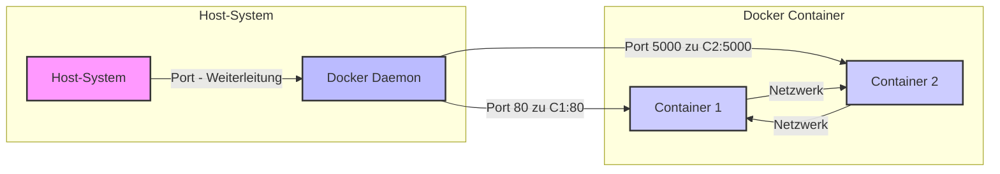

# Kommunikation zwischen und mit Docker Containern

Das Verständnis der Kommunikation ist entscheidend für die effektive Nutzung von Docker, insbesondere wenn
es um die Verbindung von Containern untereinander und mit der Außenwelt geht.

## Einführung

Docker-Container kommunizieren mit ihrer Umgebung über mehrere Techniken, um Isolation zu gewährleisten und gleichzeitig
notwendige Interaktionen zu ermöglichen.

### Allgemeine Methoden:

1. **Netzwerke:**
    - **Bridge-Netzwerk:** Standardmäßig verwendet Docker ein Bridge-Netzwerk, um die Kommunikation zwischen Containern
      und dem Host zu ermöglichen. Container im selben Bridge-Netzwerk können kommunizieren, während die Bridge den
      externen Zugriff einschränkt.
    - **Host-Netzwerk:** Container können das Netzwerk des Hosts direkt verwenden. Dies beseitigt die Netzwerkisolation
      zwischen dem Container und dem Host, ermöglicht aber eine einfachere Kommunikation mit externen Netzwerken.
    - **Overlay-Netzwerk:** Für Docker im Swarm-Modus ermöglichen Overlay-Netzwerke, dass Container, die über mehrere
      Knoten verteilt sind, kommunizieren, als wären sie auf demselben Host.

2. **Volumes:**
    - [Volumes](wo_und_wie_docker_container_daten_speichern.md#verwendung-von-volumes) werden verwendet, um von
      Docker-Containern generierte
      und genutzte Daten zu speichern. Sie sind wesentlich
      für Daten, die auch nach einem Neustart des Containers erhalten bleiben sollen und für das Teilen von Daten
      zwischen Containern oder zwischen dem Host und einem Container.

3. **Bind Mounts:**
    - [Bind Mounts](wo_und_wie_docker_container_daten_speichern.md#verwendung-von-bind-mounts) sind eine einfache
      Möglichkeit, Daten und Dateien zwischen dem Host und dem Container zu teilen. Sie
      ermöglichen es, bestimmte Pfade des Hosts in den Container einzubinden und so direkten Zugriff auf das Dateisystem
      zu haben.

4. **Ports:**
    - Docker ermöglicht das Weiterleiten von Ports vom Host zu den Containern. Durch das Öffnen und Zuordnen von Ports
      ermöglicht Docker, dass Netzwerkdienste, die innerhalb von Containern laufen, von externen Netzwerken oder anderen
      Containern aus zugänglich sind.

5. **Inter-Container-Kommunikation (ICC):**
    - Container können über das Linking (eine ältere Methode) oder besser, indem sie Teil desselben Netzwerks sind,
      miteinander kommunizieren, was es ihnen ermöglicht, Daten oder Signale auszutauschen.

6. **APIs und Sockets:**
    - Docker bietet eine REST-API, die zur programmatischen Steuerung und Interaktion mit Containern verwendet werden
      kann. Auch UNIX- und TCP-Sockets können für Kommunikationszwecke verwendet werden, insbesondere für das Senden von
      Befehlen an den Docker-Daemon oder für Container-Interaktionen.

Diese Techniken sind Teil des Designs von Docker, um die Isolation von Containern zu wahren und gleichzeitig zu
ermöglichen, dass sie notwendige Aufgaben ausführen und effektiv mit der externen Umgebung oder anderen Containern
kommunizieren.

### Ausnahme

Das Öffnen einer Shell in einem Docker-Container, üblicherweise durchgeführt mit Befehlen
wie `docker exec -it [container-id] /bin/bash`, unterscheidet sich etwas von den oben aufgeführten
Kommunikationsmethoden. Es geht mehr um die Interaktion mit der internen Umgebung des Containers, als darum, wie der
Container mit dem externen System oder anderen Containern kommuniziert. Hier ist der Zusammenhang:

- **Interaktive Shells und Exec-Befehle:**
    - Wenn Sie eine Shell in einem Container öffnen, nutzen Sie die Fähigkeit von Docker, Befehle innerhalb des
      laufenden Containers auszuführen. Der Befehl `docker exec` ermöglicht es, spezifische Befehle in einem bestehenden
      Container auszuführen, was eine Shell wie Bash oder Sh sein kann. Dies ist im Wesentlichen eine direkte
      Interaktion mit dem Dateisystem und den Prozessen des Containers.
    - Diese Aktion wird durch die Kontrolle des Docker-Daemons über seine verwalteten Container ermöglicht. Wenn Sie
      einen Befehl wie `docker exec` ausgeben, weist es den Docker-Daemon an, eine interaktive Sitzung mit der
      Prozessumgebung des Containers zu öffnen. Sie kommunizieren nicht über ein Netzwerk oder teilen Daten über
      Volumes, sondern interagieren direkt mit der Umgebung des Containers.

Diese Methode wird hauptsächlich für das Debugging, die Verwaltung und die Interaktion mit containerisierten Anwendungen
während der Entwicklung oder Wartung verwendet. Sie erleichtert nicht die Kommunikation zwischen Containern oder
zwischen Containern und dem Hostsystem in der gleichen Weise, wie es Netzwerke oder Volumes tun. Stattdessen ist es eine
direkte Verbindung in den Container für administrative oder interaktive Aufgaben.

## Grundlagen des Docker-Netzwerks

In diesem Kapitel werden wir die Grundlagen des Docker-Netzwerks und die verschiedenen Optionen zur
Netzwerkkonfiguration erkunden. Es ist die allgemeinste und wichtigste Art der Kommunikation zwischen und mit
Containern. Daher konzentriert sich dieser Kurs darauf.

Docker verwendet verschiedene Netzwerk-Treiber, um die Kommunikation zwischen Containern zu ermöglichen. Die
gängigsten sind `bridge`, `host` und `overlay`.

| Netwerktyp | Erklärung                                                                                                                                                                                    |
|------------|----------------------------------------------------------------------------------------------------------------------------------------------------------------------------------------------|
| `bridge`   | Das Standardnetzwerk für Docker-Container. Jeder Container, der diesem Netzwerk hinzugefügt wird, erhält eine eigene IP-Adresse, wodurch eine interne Netzwerkkommunikation ermöglicht wird. |
| `host`     | Container, die im Host-Netzwerkmodus laufen, teilen sich den Netzwerk-Stack des Hosts. Dies ist nützlich für Dienste, die auf dem Host-Netzwerk sichtbar sein müssen.                        |
| `overlay`  | Wird in Docker-Swarm-Umgebungen verwendet, um eine Netzwerkkommunikation zwischen Containern auf verschiedenen Docker-Hosts zu ermöglichen.                                                  |

## Netzwerkkommunikation und Port-Weiterleitung

1. **Port-Weiterleitung:**
    - Docker ermöglicht die Weiterleitung von Ports vom Host-System zu Containern, was den Zugriff auf Anwendungen
      innerhalb von Containern von außerhalb ermöglicht.

2. **Container-zu-Container-Kommunikation:**
    - Container innerhalb desselben Netzwerks können über ihre internen IP-Adressen oder Container-Namen kommunizieren.



- Das Host-System ist der Server oder Computer, auf dem Docker läuft.
- Der Docker Daemon verwaltet die Docker-Container und Netzwerke.
- Container 1 und Container 2 sind zwei Docker-Container, die auf dem Host-System laufen.
- Port-Weiterleitung zeigt, wie Anfragen an bestimmte Ports des Host-Systems zu den Containern weitergeleitet werden.
- Netzwerk zwischen den Containern zeigt, wie sie innerhalb desselben Netzwerks kommunizieren können.

## Praktische Beispiele

Im Folgenden verwenden wir das Image des Webservers `nginx`, um ein Beispiel aufzuzeigen. Funktionsweise und Aufgabe
dieses Containers sind dabei ohne Bedeutung.

- **Erstellen eines Bridge-Netzwerks und Verbinden von Containern:**
  ```bash
  docker network create mein-bridge-netzwerk
  docker run -d --network=mein-bridge-netzwerk --name container1 nginx
  docker run -d --network=mein-bridge-netzwerk --name container2 nginx
  ```
  Dieses Beispiel zeigt, wie man ein benutzerdefiniertes Bridge-Netzwerk erstellt und zwei Container darin startet.
  Beide Container sind vom gleichen Image abgeleitet. Sofern keine Port Weiterleitung implementiert ist, können diese
  Container ausschließlich miteinander kommunizieren.

### Port-Weiterleitung

```bash
docker run -d -p 8080:80 --name mein-webserver nginx
```

Dieser Befehl startet einen Nginx-Webserver in einem Docker-Container. Die Option `-p 8080:80` konfiguriert eine
Port-Weiterleitung vom Host-System zum Container:

- **8080:** Der Port auf dem Host-System. Anfragen, die an diesen Port gesendet werden, werden an den Container
  weitergeleitet.
- **80:** Der Port im Container, auf den Nginx hört. Der Webserver im Container ist so konfiguriert, dass er Anfragen
  auf diesem Port empfängt und verarbeitet.

Wenn also eine HTTP-Anfrage an den Port 8080 des Host-Systems gesendet wird, leitet Docker diese Anfrage intern an den
Port 80 des Containers weiter. Der Nginx-Server im Container empfängt die Anfrage, als ob sie direkt an ihn adressiert
wäre, und verarbeitet sie entsprechend. Dies ermöglicht es Ihnen, auf den Nginx-Webserver zuzugreifen, indem Sie
einfach `http://localhost:8080` in Ihrem Browser besuchen, während der eigentliche Webserver isoliert im Container auf
Port 80 läuft.## Netzwerksicherheit

- **Firewall-Regeln und Netzwerk-Policies:**
  Es ist wichtig, Firewall-Regeln und Netzwerk-Policies zu implementieren, um den Zugriff auf Container-Dienste zu
  kontrollieren.

- **Sichere Kommunikation:**
  Für sensible Anwendungen sollten Sie sichere Kommunikationsprotokolle wie HTTPS verwenden, um Datenübertragungen
  zu schützen.

### Anmerkungen zu Docker Netzwerken

Docker-Netzwerke selbst implementieren nicht direkt eine Firewall im traditionellen Sinne, wie man sie vielleicht von
Netzwerkgeräten oder Betriebssystemen kennt. Stattdessen nutzen sie die Isolations- und Netzwerkfähigkeiten des
Host-Betriebssystems, um Netzwerksegmentierung und -kontrolle zu ermöglichen. Hier sind einige Punkte zum Verständnis
der Netzwerksicherheit in Docker:

#### Isolation durch Netzwerktreiber

- **Netzwerktreiber:** Docker verwendet verschiedene Netzwerktreiber, um Netzwerke zu erstellen. Der Standardtreiber, "
  bridge", erstellt ein privates Netzwerk für Container auf demselben Docker-Host. Andere Treiber wie "overlay"
  ermöglichen Netzwerkkommunikation über mehrere Docker-Hosts hinweg.
- **Isolation:** Jedes durch Docker erstellte Netzwerk ist von anderen Netzwerken isoliert, es sei denn, Sie
  konfigurieren explizite Routen zwischen ihnen. Diese Isolation bietet eine gewisse Ebene der Sicherheit, ähnlich einer
  Firewall, die den Verkehr zwischen Netzwerken kontrolliert.

#### Integration mit Host-Firewalls

- **Host-Firewall:** Die Sicherheit von Docker-Netzwerken hängt auch von der Konfiguration der Firewall auf dem
  Host-System ab. Docker manipuliert die iptables-Regeln des Hosts, um Port-Weiterleitung,
  Container-zu-Container-Kommunikation und andere Netzwerkfunktionen zu ermöglichen. Die korrekte Konfiguration und
  Verwaltung der Host-Firewall ist entscheidend für die Sicherheit.
- **Anpassung der iptables:** Erfahrene Benutzer können die iptables-Regeln auf dem Host anpassen, um feinkörnige
  Kontrolle über den Netzwerkverkehr zu und von Docker-Containern und -Netzwerken zu erhalten.

#### Docker Security Best Practices

- **Netzwerksegmentierung:** Verwenden Sie Docker-Netzwerke, um Container zu segmentieren und nur die notwendige
  Kommunikation zwischen ihnen zuzulassen.
- **Port-Management:** Seien Sie vorsichtig bei der Veröffentlichung von Container-Ports auf dem Host-System. Öffnen Sie
  nur die Ports, die unbedingt notwendig sind, und verstehen Sie die Implikationen der Port-Weiterleitung.
- **Updates und Patches:** Halten Sie die Docker-Software und das Host-Betriebssystem aktuell, um von den neuesten
  Sicherheitspatches und Verbesserungen zu profitieren.

#### Zusammenfassung

Während Docker-Netzwerke selbst keine eigene Firewall implementieren, bieten sie durch Netzwerktreiber und die
Integration mit Host-Firewalls eine Reihe von Sicherheitsfunktionen. Die effektive Nutzung dieser Funktionen, zusammen
mit allgemeinen Security-Best-Practices, ist entscheidend für die Aufrechterhaltung der Sicherheit Ihrer Container und
Netzwerke. Für spezifische Firewall-Anforderungen sollten Sie zusätzliche Tools oder die Firewall-Funktionen des
Host-Betriebssystems in Betracht ziehen.

