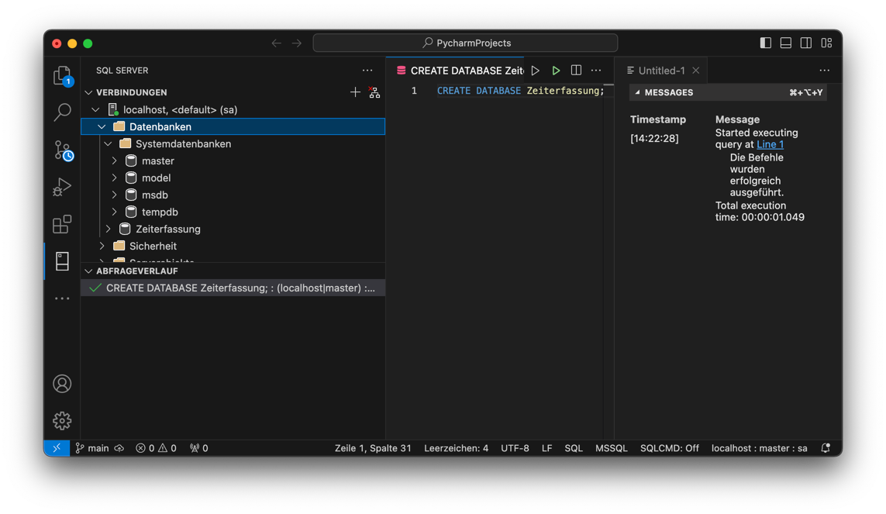

# Praktische Übungen

### **Aufgabe: Projekt 🌶️🌶️🌶️**

## Projekt Arbeitszeiterfassung

Das Projekt besteht aus einem Pyton Programm, einem nginx Webserver und einer MS SQL Server Datenbank.

Die Absicht ist es, über Postman geeignete REST Anfragen an das Projekt zu senden.

Im Anschluss daran können die übertragenen Daten per REST Anfrage abgerufen werden.

### Projektbeschreibung

Das Projekt

- soll ein JSON Objekt über einen HTTP Request entgegennehmen
- die Daten in einer SQL Server Datenbank ablegen
- die vollständige Liste der vorhandenen Datensätze in Form von JSON Objekten zurückgeben

Wir benötigen dazu:

- einen Empfänger, der die Anfragen annimmt. Dazu verwenden wir nginx.
- eine Software, die die Daten verarbeitet und an die Datenbank sendet. Dazu gibt es ein Python Backend Programm. Diese
  werden wir von GitHub herunterladen.
- eine Software, die die Datenbank abfragt und die Daten zurückschickt. Das gleiche Programm.
- die Datenbank selbst. Wir verwenden SQL Server von Microsoft.
- eine Software, die es ermöglicht direkt mit der Datenbank zu arbeiten. Dies wird für Wartungsarbeiten am Server
  benötigt.
- eine Software, die HTTP Anfragen sendet und deren Antworten darstellt.

Dargestellt wird das mit Containern, die auf folgenden Images basieren:

- nginx:latest (der Webserver)
- python:3.9.18-slim (ein oft verwendetes stabiles linux) darauf basiert unser Python Programm
- mcr.microsoft.com/mssql/server:2019-latest (die Datenbank)

Für die Kommunikation mit der Datenbank gibt es eine ganze Reihe von Programmen:

- Azure Data Studio
- DBeaver
- Kommandozeilen Tool von Microsoft
- Visual Studio Code
- PyCharm Professionel
- DataGrip (JetBrains)
- etc...

Nahezu jede Entwicklungsumgebung kann HTTP Anfragen senden und empfangen. In PyCharm arbeiten gibt es leider nicht die
Möglichkeit, wie in der Professional Version, HTTP Requests zu generieren.

### Laden des Programmcodes und der Konfigurationsdateien

Starten sie PyCharm und erstellen sie ein neues Projekt aus folgender öffentlicher
Quelle: `https://github.com/Joeatc/endpoint-app-python.git`.

Da dieser Kurs sich auf Docker bezieht, werden wir nicht auf alle Details der Python Programmierung eingehen.

Das Programm ist nach dem Laden des Repositories nicht lauffähig. Hierzu wären noch einige Schritte zur
Konfiguration des Rechners notwendig. Da auch die Bedienung anders ist, wenn die Anwendung nicht aus dem Container
heraus gestartet wird, lassen wir diesen Teil bewusst weg.

### Konfiguration:

#### requirements.txt

* blinker==1.7.0
* click==8.1.7
* Flask==3.0.0
* Flask-SQLAlchemy==3.1.1
* itsdangerous==2.1.2
* Jinja2==3.1.2
* MarkupSafe==2.1.3
* pyodbc==5.0.1
* SQLAlchemy==2.0.25
* typing_extensions==4.9.0
* Werkzeug==3.0.1

#### nginx.conf

```nginx
events {}

http {
    server {
      listen 80;

      location / {
         proxy_pass http://localhost:3000;
         proxy_http_version 1.1;
         proxy_set_header Upgrade $http_upgrade;
         proxy_set_header Host $host;
         proxy_set_header content-type "application/json";
         proxy_cache_bypass $http_upgrade;
         proxy_set_header Connection 'upgrade';
     }
    }
}
```

Wir gehen hier nicht auf alle Punkte der nginx.conf ein.

Wichtig ist,

- dass dieser Webserver Anfragen auf die Basisadresse `/` (location)
- am internen Port 80 (listen 80) entgegennimmt
- und dann an den Port 3000 des Docker internen Netzwerks weiterleitet (proxy_pass).

#### Dockerfile

Das Dockerfile fällt etwas komplexer aus, da die Konfiguration des Images auf die Verwendung des Microsoft SQL Servers
eingestellt werden muss. Es müssen Treiber geladen werden und in den Container eingebaut werden.

```bash

# Use an official Python runtime as a parent image
# This is the latest official image based on debian linux
# We ensure to use a amd64 image. That is needed to make the sql drivers work
FROM --platform=linux/amd64 python:3.12.0-slim

# Set the working directory in the container
WORKDIR /app

# Install dependencies required for pyodbc and the ODBC driver
# apt is the debian package manger for installing programs 
# At first we update all packages in the container to their latest version
RUN apt-get update \
    # Then we install some programs that we need
    && apt-get install -y --no-install-recommends \
        # curl is a program to get stuff from a certain internet repository
        curl \
        # gnupg is a program to deal with certificates, a security measure
        gnupg \
        # the unix/linux version of odbc driver \
        # odbc means Open DataBase Connector \
        unixodbc \
        unixodbc-dev \
        # g++ is the GNU C++ compiler needed for several programs 
        g++ \
    # this curl command loads a security key from microsoft and add it to the key list
    && curl https://packages.microsoft.com/keys/microsoft.asc | apt-key add - \
    # this curl command loads some stuff from microsoft to enable the installation of the needed driver
    && curl https://packages.microsoft.com/config/debian/10/prod.list > /etc/apt/sources.list.d/mssql-release.list \
    # again update all packages to their latest versions  
    && apt-get update \
    # accept the rules of use for microsoft products and finally install the driver
    && ACCEPT_EULA=Y apt-get install -y --no-install-recommends msodbcsql18 \
    # Clean up
    && apt-get clean \
    && rm -rf /var/lib/apt/lists/*
# now we copy the list of packages required for our python program into the container
COPY ./requirements.txt /app
# Install any needed packages specified in requirements.txt
RUN pip install --no-cache-dir -r requirements.txt

# Copy the current directory contents into the container at /usr/src/app
# This now the program we have written
COPY . .
# An environment variable should be set to enable us command line commands for this app. 
ENV FLASK_APP=App.py
# Finally run app.py when the container launches
CMD ["python", "./app.py"]
```

Wenn wir ein Python Programm auf unserem Computer erstellen, müssen wir über `ìmport` Pakete einbinden, die uns
notwendige Funktionen bereitstellen. Im Hintergrund laufen Prozess, die den Pythoncode zur Laufzeit des Programmes
interpretieren und damit erst ausführbar machen.

All das weiß ein offizielles Basis-Image nicht.

Über das `RUN` Kommando im Dockerfile arbeiten wir alle Schritte ab, die notwendig sind, um das Python Programm
lauffähig und ausführbar zu machen. Es stellt unsere Umgebung so her, dass sie unserer lokalen Umgebung entspricht.

#### docker-compose.yaml

```yaml
version: '3'
services:
  nginx:
    image: nginx:latest
    volumes:
      - ./nginx.conf:/etc/nginx/nginx.conf:ro
    ports:
      - "80:80"

  sql-server:
    image: mcr.microsoft.com/mssql/server:2022-latest
    environment:
      - ACCEPT_EULA=Y
      - SA_PASSWORD=Sql12345
    ports:
      - "1433:1433"
    volumes:
      - ./mydatabase:/var/opt/mssql

  node-app:
    build:
      context: .
      dockerfile: Dockerfile
    network_mode: service:nginx
    depends_on:
      - sql-server
```

Diese YAML-Datei definiert drei Services:

- nginx: der Webserver mit dem Bind-Mount nginx.conf und dem Port Mapping 80:80.
  So kann die Konfigurationsdatei von der Festplatte gelesen werden und Anfragen an den Port 80 werden registriert
  und
  weiter verarbeitet wie in
  der Konfigurationsdatei beschrieben.
- sql-server: der SQL Server von Microsoft wird in der aktuellen Version 2019 geladen, seine Lizenzbestimmungen
  werden
  akzeptiert und das Passwort für den allgemeinen Nutzer `sa`wird festgelegt. Der Port 1433, der Standardport von
  SQL-Server, wird intern verwendet und nach außen hin freigegeben. So können wir von anderen Anwendungen auf dem
  lokalen Rechner auf die Datenbank zugreifen.
- node-app: ein Container, der nach Vorschriften des Dockerfile zu bauen ist und der auf den Webserver hören soll.
  Zudem
  ist er abhängig von der Datenbank.

#### Vorbereitung der Datenbank

Was die App nicht kann ist das Erstellen der Datenbank. Deswegen sind die Schritte vorweg notwendig.

Um mit der Datenbank kommunizieren zu können, muss der Container dazu laufen.

Wir starten den Container über ein Terminal in PyCharm. Gehen Sie in PyCharm, im offenen Projekt, auf das Terminal:


Starten Sie den Datenbank Container mit folgendem Kommando:

```bash
docker compose up -d sql-server
```

Damit wird ausschließlich der Datenbank Container gestartet. Wie in der docker-compose.yml Datei bezeichnet heißt der
Service `sql-server`. Das ist notwendig, damit beim Starten des web Services keine Fehlermeldung entsteht und der
Container stoppt.

Jede Verbindung zu einer Datenbank braucht mindestens vier Verbindungsparameter:

- host: der Computer, auf dem die Datenbank läuft. Hier `localhost`
- port: der Port, auf dem die Datenbank auf dem Host erreichbar ist. Hier `1433` (Microsoft Standard)
- user: der Benutzername. Hier `sa`
- password: das Passwort des Benutzers. Hier `Sql12345`

Um eine Verbindung zur Datenbank herzustellen, benötigen wir Visual Studio Code mit der Erweiterung SQL Server.


Nach dem Auswählen des Datenbanksymbols links im Menü sollte der Dialog so aussehen:


Legen Sie eine neue Verbindung an:


Geben Sie die Anmeldedaten nacheinander ein und bestätigen Sie die Zertifikatsmeldung.


Sobald die Verbindung steht, brauchen wir eine Kommandozeile, um mit der Datenbank zu reden. Diese öffnet sich oft
schon automatisch und es wird auch ein Strukturbaum der Datenbank angezeigt. Falls nicht, suchen sie nach
Einstellungen, die diesen Strukturbaum anzeigt.

In unserer Anwendung wollen wir eine Verbindung zur Datenbank herstellen. Diese existiert aber noch nicht. Daher muss
die Datenbank erstellt werden.

Wählen Sie im Strukturbaum die Datenbank `master` aus und öffnen Sie mit einem Rechtsklick eine neue Abfrage
Geben Sie das Kommando `CREATE DATABASE Zeiterfassung;` ein und führen Sie es mit einem Klick auf das grüne Dreieck oben
rechts aus.


Mit einem Rechtsklick auf `Datenbanken -> aktualisieren` wird auch die neue Datenbank angezeigt. In den Messages wird
ebenfalls der Erfolg der Operation angezeigt.



Damit sind alle Vorbereitungen für die Datenbank abgeschlossen.

### Das Python-Programm

#### Container erstellen und starten

Öffnen sie nun die Konsole in PyCharm und führen sie folgenden Befehl aus:

```bash
docker compose up -d 
```

Dies weist die Docker Engine an, die docker-compose.yml vollständig Datei abzuarbeiten. Dabei ist es unerheblich, ob bereits Container laufen. Sie sehen, wie die Images geladen werden
und wie das Image für das Python Programm gebaut wird. Viele Schritte laufen ab, bis das Image endlich fertig ist.

Prüfen sie in Docker Desktop den Status der Container, schauen sie in die Log Dateien hinein.


Wechseln Sie zur Python App in PyCharm. 
Im Verzeichnis `/routes/` werden drei möglich Routen für das Programm definiert:

- `/` die Wurzel Route. Hier wird nur ein einfacher Text ausgegeben.
- `getAllWorkItems` die Route holt alle erfassten Arbeitszeiten aus der Datenbank und gibt sie als JSON Objekte
  zurück.
- `insertWorkItem` diese Route nimmt ein JSON Objekt mit den Daten einer Arbeitseinheit und sendet es an die
  Datenbank.

Sie sehen, wie die Flask/SQLAlchemy die SQL Kommandos für INSERT und SELECT in den Befehlen kapselt.
In App.py bewirkt der Aufruf von `db.create.all()` die Erstellung der Tabellen. Auch hier wird der
Befehl `CREATE TABLE ...` völlig verschleiert.

### Arbeiten mit dem Programm

Um mit dem Programm arbeiten zu können, müssen HTTP Anfragen gesendet werden.
Hier die Version mit Postman Daten senden (POST request):

POST Adresse: `http://localhost/insertWorkItem`

Das JSON Datenobjekt:

```JSON
{
  "date": "2023-06-30",
  "startTime": "06:30",
  "endTime": "11:30",
  "breakDuration": 0,
  "projectNumber": 5,
  "subprojectNumber": 17,
  "activity": "Applikationen an den Büroserver angepasst, damit der Workflow für die Registrierung der Stunden dort funktioniert.",
  "reviewRequired": false
}
```

Hier die Abfrage der Datenbank (GET request):

GET Adresse: `http:://localhost/getAllWorkItems`

Zum Senden dieser Anfragen nutzen wir erneut Visual Studio Code mit dem Paket REST Client:


Wechseln Sie in das Applikationsverzeichnis und laden sie die Datei `requests.http`.


Sie können die einzelnen Requests auswählen und mit Rechtsklick auf `Send Request` ausführen.


Wenn die Anfragen erfolgreich abgearbeitet werden, ist unsere Anwendung einsatzbereit.

### Variationen

Sie arbeiten alle im selben Netzwerk. Finden sie die IP-Adresse ihres Computers über
`Systemsteuereung->Netzwerk->WLAN-details`


Machen sie folgendes:

- Geben Sie mit dem POST Request einen oder mehrere Datensätze ein, in denen Sie die Uhrzeiten, das Datum oder den
  Inhalt des Feldes `activity` verändern. **Achtung:** Das Format des Datums ist zwingend `yyyy-mm-dd`. Schreiben Sie
  zusätzlich ihren Namen in den Text für das `activity` Feld.
- Prüfen Sie mit dem GET Request die erfolgreiche Übertragung und Speicherung ihrer Eingabe.
- Tauschen Sie untereinander ihre IP-Adressen und ersetzen Sie sie in den POST/GET Requests `localhost` durch die
  IP-Adresse: `http://192.168.178.42/insertWorkItem` zum Beispiel.
- Geben Sie erneut GET und POST Requests ein.

Sie sollten jetzt die Daten ihres Tauschpartners sehen oder neue Daten zu seiner Datenbank hinzufügen können.


