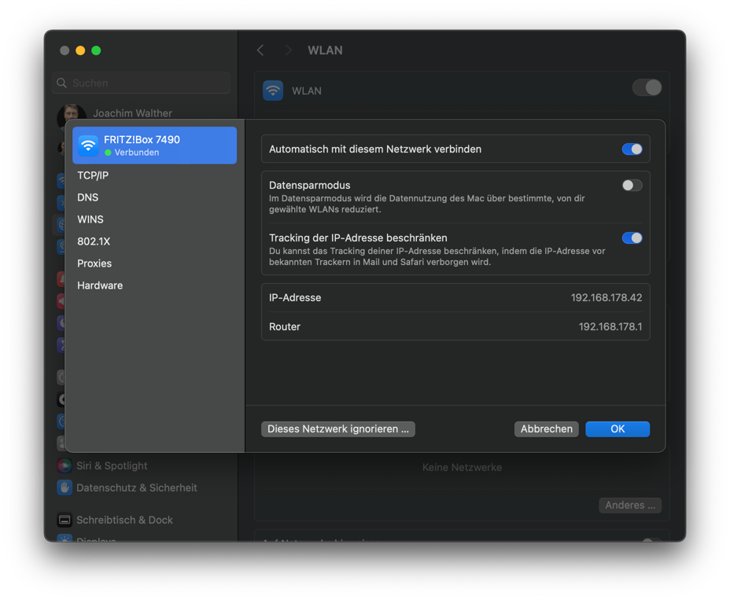

# Praktische Übungen

**Projekt Arbeitszeiterfassung**

    Das Projekt besteht aus einem Pyton Programm, einem nginx Webserver und einer MS SQL Server Datenbank.
    
    Die Absicht ist es, über Postman geeignete REST Anfragen an das Projekt zu senden.
    
    Im Anschluss daran können die übertragenen Daten per REST Anfrage abgerufen werden.

### **Aufgabe: Projekt 🌶️🌶️🌶️**

Projektbeschreibung:

Das Projekt

- soll ein JSON Objekt über einen HTTP Request entgegennehmen
- die Daten in einer SQL Server Datenbank ablegen
- die vollständige Liste der vorhandenen Datensätze in Form von JSON Objekten zurückgeben

Wir benötigen dazu:

- einen Empfänger, der die Anfragen annimmt. Dazu verwenden wir nginx.
- eine Software, die die Daten verarbeitet und an die Datenbank sendet. Dazu gibt es ein Python Backend Programm. Diese
  werden wir von GitHub herunterladen.
- eine Software, die die Datenbank abfragt und die Daten zurückschickt. Das gleiche Programm.
- die Datenbank selbst. Wir verwenden SQL Server von Microsoft.
- eine Software, die es ermöglicht direkt mit der Datenbank zu arbeiten. Dies wird für Wartungsarbeiten am Server
  benötigt.
- eine Software, die HTTP Anfragen sendet und deren Antworten darstellt.

Dargestellt wird das mit Containern, die auf folgenden Images basieren:

- nginx:latest (der Webserver)
- python:3.9.18-slim (ein oft verwendetes stabiles linux) darauf basiert unser Python Programm
- mcr.microsoft.com/mssql/server:2019-latest (die Datenbank)

Für die Kommunikation mit der datenbank gibt es eine ganze Reihe von Programmen:

- Azure Data Studio
- DBeaver
- Kommandozeilen Tool von Microsoft
- Visual Studio Code
- etc...

Nahezu jede Entwicklungsumgebung kann HTTP Anfragen senden und empfangen. Da wir mit PyCharm arbeiten ist hier der
Menüpunkt `Tools`->`HTTP-Client`->`Create Http Request` der Weg zum Ziel.

Konfiguration:

- nginx.conf

    ```nginx
    events {}
    
    http {
        server {
          listen 80;
    
          location / {
             proxy_pass http://localhost:3000;
             proxy_http_version 1.1;
             proxy_set_header Upgrade $http_upgrade;
             proxy_set_header Host $host;
             proxy_set_header content-type "application/json";
             proxy_cache_bypass $http_upgrade;
             proxy_set_header Connection 'upgrade';
         }
        }
    }
    ```

  **Anmerkung:**

  Wir gehen hier nicht auf alle Punkte der nginx.conf ein.

  Wichtig zu sehen ist,
    - dass dieser Webserver Anfragen auf die Basisadresse `/` (location)
    - am externen Port 80 (listen 80) entgegennimmt
    - und dann an den internen Port 3000 weiterleitet (proxy_pass).

- dockerfile

  Das Dockerfile fällt etwas komplexer aus, da die Konfiguration des Images auf die Verwendung des Microsoft SQL Servers
  eingestellt werden muss. Es müssen Treiber geladen werden und in den Container eingebaut werden.
  ```dockerfile
  
  # Use an official Python runtime as a parent image
  # This is the latest official image based on debian linux
  # We ensure to use a amd64 image. That is needed to make the sql drivers work
  FROM --platform=linux/amd64 python:3.9.18-slim
  
  # Set the working directory in the container
  WORKDIR /app
  
  # Install dependencies required for pyodbc and the ODBC driver
  # apt is the debian package manger for installing programs 
  # At first we update all packages in the container to their latest version
  RUN apt-get update \
      # Then we install some programs that we need
      && apt-get install -y --no-install-recommends \
          # curl is a program to get stuff from a certain internet repository
          curl \
          # gnupg is a program to deal with certificates, a security measure
          gnupg \
          # the unix/linux version of odbc driver \
          # odbc means Open DataBase Connector \
          unixodbc \
          unixodbc-dev \
          # g++ is the GNU C++ compiler needed for several programs 
          g++ \
      # this curl command loads a security key from microsoft and add it to the key list
      && curl https://packages.microsoft.com/keys/microsoft.asc | apt-key add - \
      # this curl command loads some stuff from microsoft to enable the installation of the needed driver
      && curl https://packages.microsoft.com/config/debian/10/prod.list > /etc/apt/sources.list.d/mssql-release.list \
      # again update all packages to their latest versions  
      && apt-get update \
      # accept the rules of use for microsoft products and finally install the driver
      && ACCEPT_EULA=Y apt-get install -y --no-install-recommends msodbcsql18 \
      # Clean up
      && apt-get clean \
      && rm -rf /var/lib/apt/lists/*
  # now we copy the list of packages required for our python program into the container
  COPY ./requirements.txt /app
  # Install any needed packages specified in requirements.txt
  RUN pip install --no-cache-dir -r requirements.txt
  
  # Copy the current directory contents into the container at /usr/src/app
  # This now the program we have written
  COPY . .
  # An environment variable should be set to enable us command line commands for this app. 
  ENV FLASK_APP=App.py
  # Finally run app.py when the container launches
  CMD ["python", "./app.py"]
  ```
  **Fazit:**

  Wenn wir ein Python Programm auf unserem Computer erstellen, müssen wir über `ìmport` Pakete einbinden, die uns
  notwendige Funktionen bereitstellen. Im Hintergrund laufen Prozess, die den Pythoncode zur Laufzeit des Programmes
  interpretieren und damit erst ausführbar machen.

  All das weiß ein offizielles Basis-Image nicht.

  Über das `RUN` Kommando im Dockerfile arbeiten wir alle Schritte ab, die notwendig sind, um das Python Programm
  lauffähig und ausführbar zu machen. Es stellt unsere Umgebung so her, dass sie unserer lokalen Umgebung entspricht.

- docker-compose.yaml

  ```yaml
  version: '3'
  services:
    nginx:
      image: nginx:latest
      volumes:
        - ./nginx.conf:/etc/nginx/nginx.conf:ro
      ports:
        - "80:80"
  
    sql-server:
      image: mcr.microsoft.com/mssql/server:2019-latest
      environment:
        - ACCEPT_EULA=Y
        - SA_PASSWORD=Sql12345
      ports:
        - "1433:1433"
      volumes:
        - ./mydatabase:/var/opt/mssql
  
    node-app:
      build:
        context: .
        dockerfile: Dockerfile
      network_mode: service:nginx
      depends_on:
        - sql-server
  ```

  **Anmerkung:**

  Diese YAML-Datei definiert drei Services:

    - nginx: der Webserver mit dem Bind-Mount nginx.conf und dem Port Mapping 80:80.
      So kann die Konfigurationsdatei von der Festplatte gelesen werden und Anfragen an den Port 80 werden registriert
      und
      weiter verarbeitet wie in
      der Konfigurationsdatei beschrieben.
    - sql-server: der SQL Server von Microsoft wird in der aktuellen Version 2019 geladen, seine Lizenzbestimmungen
      werden
      akzeptiert und das Passwort für den allgemeinen Nutzer `sa`wird festgelegt. Der Port 1433, der Standardport von
      SQL-Server, wird intern verwendet und nach außen hin freigegeben. So können wir von anderen Anwendungen auf dem
      lokalen Rechner auf die Datenbank zugreifen.
    - node-app: ein Container, der nach Vorschriften des Dockerfile zu bauen ist und der auf den Webserver hören soll.
      Zudem
      ist er abhängig von der Datenbank.

- Vorbereitung der Datenbank

  Jede Verbindung zu einer Datenbank braucht mindestens vier Verbindungsparameter:
    - host: der Computer, auf dem die Datenbank läuft. Hier `localhost`
    - port: der Port, auf dem die Datenbank auf dem Host erreichbar ist. Hier `1433`
    - user: der Benutzername. Hier `sa`
    - password: das Passwort des Benutzers. Hier `Sql12345`

  Hier ein Beispiel aus PyCharm Professional:

  

  Stellen wir also die Verbindung zur Datenbank her. Die Tools verwenden unter Umständen eigene Treiber. Hier muss
  individuell geschaut und recherchiert werden.

  Sobald die Verbindung steht, brauchen wir eine Kommandozeile, um mit der Datenbank zu reden. Diese öffnet sich oft
  schon automatisch und es wird auch ein Strukturbaum der Datenbank angezeigt. Falls nicht, suchen sie nach
  Einstellungen, die diesen Strukturbaum anzeigt.

  In unserer Anwendung wollen wir eine Verbindung zur Datenbank herstellen. Diese existiert aber noch nicht. Daher muss
  über ein Tool unserer Wahl, die Datenbank mit dem Kommando `CREATE DATABASE Zeiterfassung;` erstellt werden.

  

  Geben sie das Kommando in die Konsole ein und führen sie es aus. Im Strukturbaum sollte jetzt die Datenbank zu sehen
  sein.

  Damit sind alle Vorbereitungen für die Datenbank abgeschlossen.

- Das Python-Programm

  Starten sie PyCharm und erstellen sie ein neues Projekt aus folgender öffentlicher
  Quelle: `https://github.com/Joeatc/endpoint-app-python.git`.

  Da dieser Kurs sich auf Docker bezieht, werden wir nicht im Detail auf die Python Programmierung eingehen.

  Das Programm ist so nicht lauffähig. Hierzu wären einige Schritte zu erledigen, die wir uns aus dem gleichen Grund
  sparen.

- Container erstellen und starten

  Öffnen sie nun die Konsole in PyCharm und führen sie folgenden Befehl aus:

  ```bash
  docker compose up -d 
  ```
  Dies weist die Docker Engine an, die docker-compose.yml Datei abzuarbeiten. Sie sehen, wie die Images geladen werden
  und wie das IMage für das Python Programm gebaut wird. Viele Schritte laufen ab, bis das Image endlich fertig ist.
  Endlich werden die drei Container gestartet.

  Prüfen sie in Docker Desktop den Status der Container, schauen sie in die Log Dateien hinein. Ist alles in Ordnung?

  

- Das Python-Programm

  Im Verzeichnis `/routes/` werden drei möglich Routen für das Programm definiert:
    - `/` die Wurzel Route. Hier wird nur ein einfache Text ausgegeben.
    - `getAllWorkItems` die Route holt alle erfassten Arbeitszeiten aus der Datenbank und gibt sie als JSON Objekte
      zurück.
    - `insertWorkItem` diese Route nimmt ein JSON Objekt mit den Daten einer Arbeitseinheit und sendet es an die
      Datenbank.

- Arbeiten mit dem Programm

  Um mit dem Programm arbeiten zu können, müssen HTTP Anfragen gesendet werden.
  Hier die Version mit Postman Daten senden (POST request):

  

  Hier die Abfrage der Datenbank (GET request):

  

Wenn die Anfragen erfolgreich abgearbeitet werden, ist unsere Anwendung einsatzbereit.

Sie arbeiten alle im selben Netzwerk. Finden sie die Adresse ihres Computers über
`Systemsteuereung->Netzwerk->WLAN-details`



Versuchen sie folgendes:

- Verändern sie die Daten im POST Request so, dass der Text im Feld `activity` sie eindeutig erkenntlich macht.
- Verändern sie auch Uhrzeiten oder Datum, beachten sie dabei die amerikanische Schreibweise.
- Geben sie mehrere Datensätze ein.
- Prüfen sie mit dem GET Request die erfolgreiche Übertragung und Speicherung ihrer Eingabe
- tauschen sie untereinander die IP-Adressen und ersetzen sie in den POST/GET Requests `localhost` durch die
  IP-Adresse: `http://192.168.178.42/insertWorkItem` zum Beispiel.

Sie sollten jetzt die Daten ihres Tauschpartners sehen oder neue Daten zu seiner Datenbank hinzufügen können.

## Zusammenfassung

Das Beispiel soll ihnen einen Eindruck verschaffen, welches Aufwandes es bedarf, um eine solch einfache Funktion
bereitzustellen.
Andererseits erkennen sie auch, das ein einfaches `docker compose up -d` durchaus in der Lage ist, eine hochkomplexe
Anwendung aus dem Internet zu laden, aufzubauen und zu starten.
Würden wir unseren selbst gebautes Image auf Docker Hub ablegen, so würde der Bau des Images noch entfallen.

Nicht berücksichtigt in dieser Applikation wurden Sicherheitsaspekte, Datenschutz und Benutzerverifizierung.
Solche Arbeiten könnten weitere Container erledigen. Die App würde als zentrale Stelle dafür infrage kommen, meist
werden jedoch einige Routen von nginx direkt an die passenden Container weitergeleitet (proxy_pass und location). Dies
hängt ganz von der Anwendung selbst ab.  


