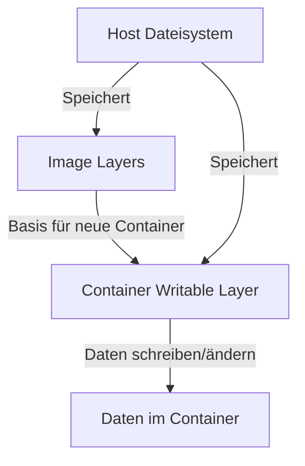

# Persistente Datenspeicherung in Docker

In Docker ist die persistente Datenspeicherung ein wesentlicher Aspekt, um sicherzustellen, dass wichtige Daten auch
nach dem Beenden oder Löschen von Containern erhalten bleiben. Dieses Kapitel behandelt die verschiedenen Methoden der
Datenspeicherung in Docker und wie sie effektiv genutzt werden können.

## Grundlagen der persistenten Datenspeicherung

### Container-Dateisystem:

- Standardmäßig speichert jeder Docker-Container Daten in einem schreibbaren Layer, der über dem Image-Dateisystem
  liegt. Diese Daten gehen verloren, wenn der Container gelöscht wird.



In Docker wird ein Layer technisch als eine Reihe von Unterschieden oder Änderungen gegenüber dem vorherigen Layer
spezifiziert. Jeder Layer in einem Docker-Image repräsentiert eine Änderung im Dateisystem, wie das Hinzufügen, Ändern
oder Löschen von Dateien. Technisch gesehen sind diese Layer implementiert als:

#### Union File Systems

Docker verwendet Union File Systems (UnionFS), um die verschiedenen Layer eines Images zu organisieren. Ein UnionFS
ermöglicht es, mehrere Dateisysteme zu überlagern und sie als ein einziges kohärentes Dateisystem zu präsentieren. In
Bezug auf Docker:

- **Read-Only Layers:** Die einzelnen Schichten eines Docker-Images sind schreibgeschützt. Wenn ein Image erstellt wird,
  wird jede Anweisung im Dockerfile (wie `RUN`, `COPY`, `ADD`) als Layer im Image gespeichert.

- **Writable Layer:** Wenn ein Container gestartet wird, fügt Docker einen schreibbaren Layer oben auf die bestehenden
  schreibgeschützten Layers hinzu. Dieser Layer wird auch als "Container Layer" bezeichnet und speichert alle
  Änderungen, die während der Laufzeit des Containers gemacht werden.

#### Layer-ID und Content-Addressable Storage

Jeder Layer in Docker ist durch eine eindeutige ID oder einen Hash-Wert identifiziert, der aus dem Inhalt des Layers
generiert wird. Dies wird als Content-Addressable Storage bezeichnet. Hier sind die technischen Aspekte:

- **Layer-ID:** Jeder Layer erhält eine eindeutige ID, die normalerweise ein SHA256-Hash des Inhalts des Layers ist.
  Diese ID repräsentiert den Zustand des Dateisystems in diesem Layer.

- **Deduplizierung:** Durch die Verwendung von Hash-Werten für Layer-IDs kann Docker Duplikate erkennen und
  Speicherplatz sparen. Wenn zwei Images denselben Layer verwenden, wird dieser Layer auf dem Host-System nur einmal
  gespeichert.

- **Immutable Layers:** Einmal erstellt, werden die Layer nicht verändert. Wenn Änderungen an einem Layer erforderlich
  sind, erstellt Docker einen neuen Layer mit den Änderungen.

#### Technische Spezifikation eines Layers

Technisch gesehen besteht ein Layer aus:

- **Dateien und Verzeichnissen:** Die tatsächlichen Dateien und Verzeichnisse, die geändert, hinzugefügt oder gelöscht
  wurden.
- **Metadaten:** Informationen über die Änderungen, wie die Layer-ID, Erstellungsdatum, Beziehung zu anderen Layern und
  möglicherweise Autorinformationen.
- **Manifest:** Ein Dokument, das die Layer und deren Reihenfolge in einem Image beschreibt. Das Manifest enthält auch
  die Layer-IDs und kann Signaturen für die Verifizierung enthalten.

TODO: Habe nicht so ganz verstanden, was die Layer sind. könnte man hier ein Beispiel zeigen? Oder kommt das im Video?

#### Zusammenfassung

Ein Layer in Docker wird technisch als eine Menge von Dateisystemänderungen definiert, die durch eine eindeutige ID
identifiziert und in einem Union File System organisiert sind. Die Verwendung von Content-Addressable Storage ermöglicht
Effizienz und Integrität, indem sichergestellt wird, dass jeder Layer eindeutig und unveränderlich ist. Layers sind die
Bausteine von Docker-Images und ermöglichen die Wiederverwendung, schnelle Verteilung und effiziente Speicherung von
Container-Dateisystemen.

## Mögliche Speichermedien

**Volumes:**
Volumes sind der bevorzugte Weg, um persistente Daten in Docker zu speichern. Sie sind komplett vom Lebenszyklus
des Containers getrennt und werden von Docker verwaltet.

**Bind Mounts:**
Bind Mounts erlauben es, Daten auf dem Host-System zu speichern und direkt in den Container einzubinden. Sie sind
nützlich für die Entwicklung oder wenn Sie spezifische Pfade auf Ihrem Host-System nutzen möchten.

**tmpfs Mounts:**
tmpfs Mounts werden hauptsächlich für temporäre Daten verwendet, die nicht auf den Host persistiert werden sollen.

## Verständnis von Docker Volumes und Bind Mounts

Docker bietet zwei Hauptmethoden, um Daten persistent zu speichern und zwischen dem Host-System und Containern zu
teilen: Volumes und Bind Mounts. Denken Sie an Volumes wie an eine externe Festplatte, die von Docker verwaltet wird,
und an Bind Mounts wie an einen USB-Stick, den Sie direkt in Ihren Computer und Container stecken.

### Verwendung von Volumes
**Erstellen eines Volumes:**
```bash
docker volume create mein-volume
```
Stellen Sie sich vor, Sie reservieren einen Bereich auf Ihrer Festplatte, den Docker verwaltet. Dieser Befehl erstellt
einen solchen reservierten Bereich, ein "Volume" genannt, mit dem Namen `mein-volume`.

**Einen Container mit einem Volume starten:**
```bash
docker run -d -v mein-volume:/pfad/im/container mein-image
```

Jetzt verbinden Sie diesen reservierten Bereich (Volume) mit Ihrem Container. Alles, was im Container
unter `/pfad/im/container` gespeichert wird, wird tatsächlich im `mein-volume` gespeichert und bleibt erhalten, selbst
wenn der Container gelöscht wird.

### Verwendung von Bind Mounts
**Starten eines Containers mit einem Bind Mount:**
```bash
docker run -d -v /pfad/auf/host:/pfad/im/container mein-image
```
Bind Mounts sind wie das Einstecken eines USB-Sticks in Ihren Computer. Sie nehmen einen Ordner auf Ihrem
Host-System (`/pfad/auf/host`) und stecken ihn direkt in den Container (`/pfad/im/container`). Änderungen auf einem Ende
spiegeln sich sofort auf dem anderen Ende wider.

## Best Practices für die Datenspeicherung

**Datenverlust vermeiden:**
Verwenden Sie Volumes oder Bind Mounts für alle Daten, die persistent gespeichert werden sollen. Sie sind wie Ihre
Sicherheitsnetze, die sicherstellen, dass wertvolle Daten nicht verloren gehen, wenn Ihr Container "umzieht" oder 
"renoviert" wird.

**Sicherheit:**
Achten Sie auf die Sicherheit der Daten, insbesondere wenn sensible Informationen gespeichert werden. Überlegen Sie,
wer Zugriff auf die Daten haben sollte und wie diese Zugriffe kontrolliert werden können.

**Backup und Wiederherstellung:**
Denken Sie daran, regelmäßige Backups Ihrer wichtigen Daten zu machen. Docker erleichtert das Backup von Volumes, aber
Sie sollten einen Plan haben, wie und wann Backups durchgeführt werden.

**Volume-Management:**
Überwachen und verwalten Sie Ihre Volumes regelmäßig. Stellen Sie sicher, dass sie wie erwartet funktionieren und
nicht unnötig Speicherplatz auf Ihrem System belegen.

## Unterschied zwischen Docker Volumes und Bind Mounts

### Docker Volumes

**Verwaltung durch Docker:** Docker kümmert sich um die Speicherung und Verwaltung. Sie müssen sich nicht um den
genauen Speicherort oder die Details kümmern.

**Isolation vom Host-System:** Volumes sind vom Host-System isoliert, was bedeutet, dass sie eine klare Trennung
zwischen Host und Container-Daten bieten.

**Verwendung im Container:** Volumes werden an einen spezifischen Pfad im Container gemountet und verhalten sich wie
ein Teil des Containers, obwohl sie außerhalb davon verwaltet werden.

### Bind Mounts

**Direkte Zuordnung zum Host-Dateisystem:** Bind Mounts sind direkt mit dem Host-Dateisystem verbunden. Sie wählen
einen Ordner auf Ihrem Host und machen ihn direkt im Container verfügbar.

**Keine Verwaltung durch Docker:** Sie haben die volle Kontrolle und Verantwortung für den Pfad und die Daten.

**Verwendung im Container:** Der Container kann direkt auf den Pfad zugreifen und Änderungen werden sofort
reflektiert.

### Zusammenfassung

Sowohl Volumes als auch Bind Mounts bieten wertvolle Methoden zur Datenspeicherung in Docker. Volumes sind ideal für die
meisten Anwendungen, da sie eine klare Trennung und Verwaltung durch Docker bieten. Bind Mounts bieten mehr Kontrolle
und sind nützlich für spezielle Fälle, wie die Entwicklung auf dem Host-System. In beiden Fällen ermöglichen sie, dass
Daten persistent und sicher gespeichert werden, unabhängig vom Lebenszyklus des Containers.

