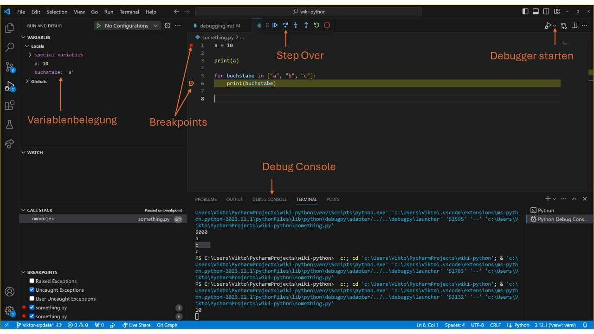
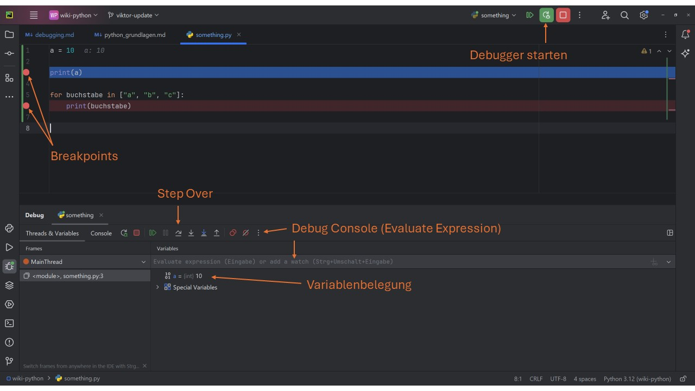

# Debugger

Programmieren ist ein komplexer Prozess, der Präzision und Aufmerksamkeit erfordert. Trotzdem sind Fehler beim 
Programmieren allgegenwärtig. Um diese Fehler zu finden, hilft es oft, den Code Schritt für Schritt ablaufen zu lassen,
sodass wir den Programmablauf als Menschen verstehen können. Ein **Debugger** erlaubt einem genau diese Art der 
Codedurchführung. Wir werden in diesem Kapitel sehen, wie man den Debugger nutzen kann.


### Aufgabe: Käferalarm🐞
Schau dir deises [🎦Video](https://youtube.com/shorts/P9ZkTIgsByk?si=FtUJerw9KcRIy9Tx) an und erkläre,
wie der Begriff "Bug" für Fehler in der Informatik entstanden ist. Warum heißt das Entfernen von Fehlern dann "Debugging"?


### Aufgabe: Von diesen sieben Tricks sollt ihr nichts wissen🌶

<iframe width="560" height="315" src="https://www.youtube.com/embed/X3jw1JVNdPE?si=I_RzovjKKbkQVRkC" title="YouTube video player" frameborder="0" allow="accelerometer; autoplay; clipboard-write; encrypted-media; gyroscope; picture-in-picture; web-share" allowfullscreen></iframe>

Schau dir das [Video von Fireship](https://youtu.be/X3jw1JVNdPE?si=qHCernkCvp5gb8dK) an und beantworte die folgenden
Fragen:

* Welche Gründe werden am Anfang des Videos als Gründe für das Auftreten von Fehlern beim Programmieren genannt.
  Sortiere diese Fehler nach der Häufigkeit.
* Welche sieben Tipps gibt das Video, um Fehler zu vermeiden, finden und zu korrigieren?

[Lösung](solution.md#aufgabe-von-diesen-sieben-tricks-sollt-ihr-nichts-wissen)

### Der Debugger

Ein Debugger ist ein wesentliches Werkzeug in der Softwareentwicklung, das Programmierern hilft, den Code Schritt für 
Schritt auszuführen, um Fehler (Bugs) zu finden und zu beheben. Debugger bieten die Möglichkeit, den Zustand eines 
Programms zu einem bestimmten Zeitpunkt zu überprüfen, Variablenwerte zu inspizieren und den Programmfluss zu 
kontrollieren. 

Debugger haben alle ähnliche Funktionen:
* **Haltepunkte setzen**: Erlaubt es dem Entwickler, die Ausführung des Programms an bestimmten Punkten anzuhalten.
* **Schrittweise Ausführung**: Führt das Programm Zeile für Zeile aus, um die Auswirkungen jeder Anweisung zu beobachten.
* **Variablen inspizieren**: Zeigt die aktuellen Werte von Variablen im Programm an.
* **Programmfluss steuern**: Erlaubt es, den Ablauf des Programms zu steuern, beispielsweise durch Fortsetzen der Ausführung oder Rückkehr zu einem früheren Punkt.

Im Folgenden werden wir 2 Varianten den Debugger zu benutzen ansehen:

* Eingebauter Debugger von **VSCode**
* Eingebauter Debugger von **PyCharm**


## Debugger in IDE Nutzen

Schau die eines der folgendne Videos an, um zu sehen, wie man den Debugger in VSCode bzw. Pycharm nutzt:
<details>
<summary>
🎦 Video: Debugger in VSCode benutzen
</summary>
<iframe width="560" height="315" src="https://www.youtube.com/embed/JCuTVvR49bs?si=kxM1Abs5o2r9Ikd-" title="YouTube video player" frameborder="0" allow="accelerometer; autoplay; clipboard-write; encrypted-media; gyroscope; picture-in-picture; web-share" allowfullscreen></iframe>
</details>

<details>
<summary>
🎦 Video: Debugger in Pycharm benutzen
</summary>
<iframe width="560" height="315" src="https://www.youtube.com/embed/NwNF68bEl5g?si=LbQ_3UM0ja3qiSSQ" title="YouTube video player" frameborder="0" allow="accelerometer; autoplay; clipboard-write; encrypted-media; gyroscope; picture-in-picture; web-share" allowfullscreen></iframe>
</details>

Übersicht in VSCode:


Übersicht in Pycharm


| Fachbegriff   | Bedeutung                                                                                                                                                                           |
|---------------|-------------------------------------------------------------------------------------------------------------------------------------------------------------------------------------|
| Breakpoint    | Zeile im Code, bis zu der dieser vom Debugger ausgeführt wird. Diese Zeile wartet noch auf die Ausführung.                                                                          |
| Continue      | Führt den Code weiter aus bis zum nächsten Breakpoint oder zum Programmende.                                                                                                        |
| Step Over     | Führe die aktuelle Codezeile aus und gehe zur nächsten Codezeile, die ausgeführt werden soll.                                                                                       |
| Step Into     | Wenn in der akutellen Zeile eine Funktion ausgeführt werden soll, wird in diese hineingesprungen, sodass die Ausführung der Funktion schritt für Schritt nachvollzogen werden kann. |
| Step Out      | Wenn derzeit eine Funktion ausgeführt wird, wird die Ausführung so lange automatisch weitergeführt, bis die Funktionsausführung beendet ist und dann wieder unterbrochen.           |
| Restart       | Beendet die Ausführung der Applikation und startet den Debugmodus erneut.                                                                                                           |
| Stop          | Beendet die Ausführung der Applikation.                                                                                                                                             |
| Debug Console | Erlaubt die Ausführung von Befehlen, während das Programm im Debugmodus pausiert. Funktionen können hier ausgeführt und Variablen gelesen und manipuliert werden.                   |

### Aufgabe: Debugger bei verschachtelten if-Bedingunen 🌶🌶

Kopiere den folgenden Code in eine .py Datei. Setze einen Breakpoint in der ersten Zeile.

```python
a = 25
b = 10

if a < b:
    result = a + b
    if result > 30:
        result = result + 5
    else:
        result = result - 3
else:
    result = a - b
    if result < 10:
        result = result * 2
    else:
        result = result // 2
print(result)
```

Sage zunächst voraus, durch welche Zeilen der Code geht. Überprüfe dies mit dem Debugger.

Finde drei weitere belegungen von `a` und `b`, sodass insgesamt alle Zeilen mindestens ein Mal durchlaufen werden.

[Lösung](solution.md#aufgabe-debugger-bei-verschachtelten-if-bedingunen-)
