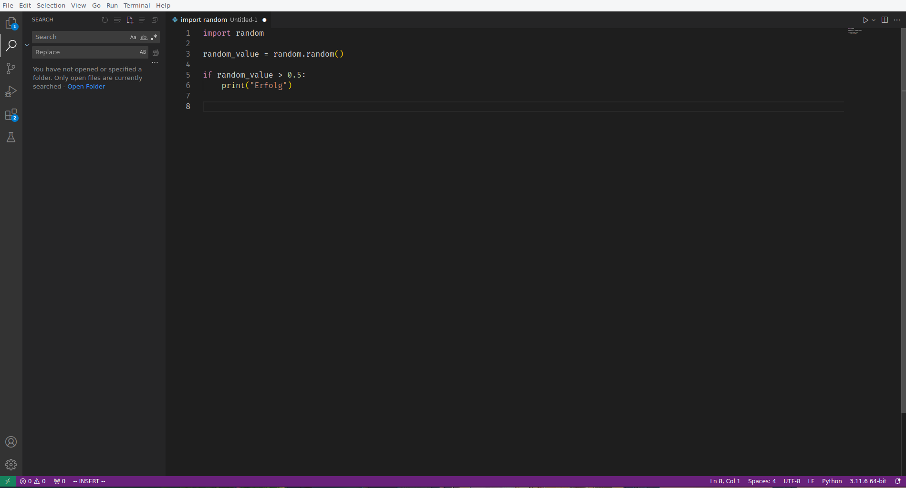
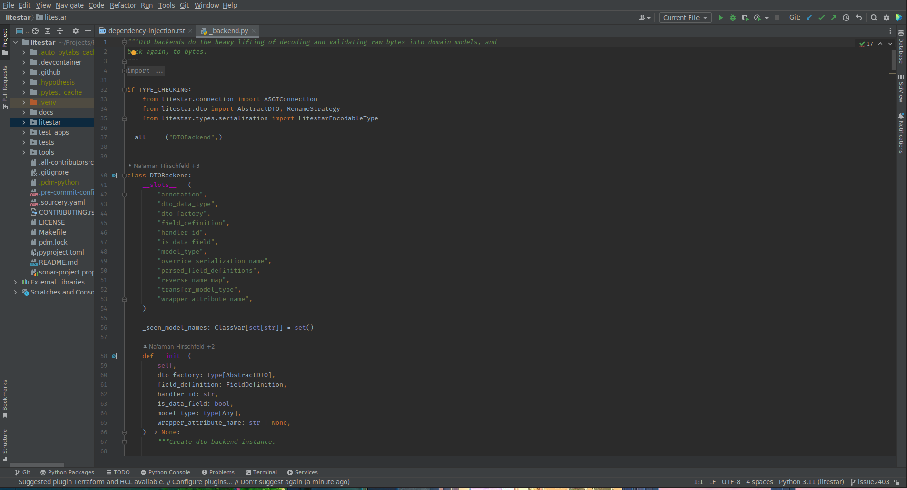
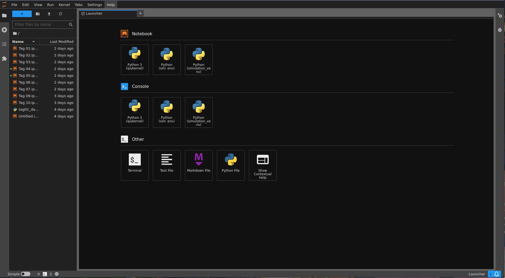
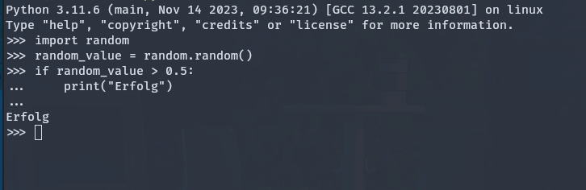

# Einführung

# Was ist Programmierung?

[//]: # ([20min])
<details>
<summary>
🎦 Video
</summary>
<iframe width="560" height="315" src="https://www.youtube.com/embed/NOahBOThdoA?si=5P1c772PP5lTsPtp" title="YouTube video player" frameborder="0" allow="accelerometer; autoplay; clipboard-write; encrypted-media; gyroscope; picture-in-picture; web-share" allowfullscreen></iframe>
</details>

Programmierung ist für uns der Prozess der Erstellung von Anweisungen, die von einem Computer ausgeführt werden, um
bestimmte Aufgaben zu erfüllen oder Probleme zu lösen.

Diese Anweisungen werden als Code bezeichnet und in einer Programmiersprache geschrieben.

Programmierung ermöglicht es uns, Softwareanwendungen, Websites, mobile Apps und andere digitale Tools zu
entwickeln.

Im professionellen Umfeld steht die Wertschöpfung durch Software-Entwicklung an erster Stelle. Mit Programmierung werden
Probleme gelöst, die ein Unternehmen oder dessen Kunden haben.

## Kernaspekte der Programmierung

- **Algorithmisches Denken**: Programmierung basiert auf der Entwicklung von Algorithmen –
   Schritt-für-Schritt-Anweisungen zur Lösung eines Problems oder zur Durchführung einer Aufgabe.

- **Code-Schreiben**: Das Schreiben von Code ist nur ein kleiner Teil der Programmierung. Hierbei wird ein Algorithmus
   in eine Sprache übersetzt, die der Computer verstehen und ausführen kann. Für uns wird dies Python sein.

- **Fehlerbehebung (Debugging)**: Kein Code ist perfekt. Programmierer verbringen viel Zeit damit, Fehler zu finden und
   zu beheben, um sicherzustellen, dass ihr Code wie beabsichtigt funktioniert.

- **Datenmanipulation**: Programme werden oft entwickelt, um Daten zu sammeln, zu verarbeiten und auszugeben. Das
   Verständnis der Datenverarbeitung ist daher ein wesentlicher Aspekt der Programmierung.

- **Benutzerinteraktion**: Viele Programme erfordern Interaktionen mit Benutzern. Das Design dieser Interaktionen ist
   ein wichtiger Teil der Entwicklung einer benutzerfreundlichen Software.
  
### Aufgabe: 🌶️🌶️

[//]: # ([15 Min + 20 Min])

1. Diskutiert, die Wichtigkeit dieser Aspekte
2. Ordnet sie entsprechend ihrer Wichtigkeit und begründet kurz wieso.


## Die Rolle von Python in der Programmierung

<details>
<summary>
🎦 Video
</summary>
<iframe width="560" height="315" src="https://www.youtube.com/embed/zWHl_x-LWiM?si=_443HW8zEZ13KGvo" title="YouTube video player" frameborder="0" allow="accelerometer; autoplay; clipboard-write; encrypted-media; gyroscope; picture-in-picture; web-share" allowfullscreen></iframe>
</details>

[//]: # ([20min])

Python ist eine weit verbreitete und vielseitige Programmiersprache, die sich durch ihre klare Syntax und Lesbarkeit
auszeichnet.

Hier sehen wir einige Gründe, warum Python in der Welt der Programmierung eine wichtige Rolle spielt:

1. **Vielseitigkeit**: Python wird in vielen Bereichen verwendet, von Web-Entwicklung über Datenanalyse und maschinelles
   Lernen bis hin zur Automatisierung.

2. **Große Community**: Python hat eine große und aktive Community, die eine Fülle von Ressourcen, Bibliotheken und
   Frameworks bietet, die die Entwicklung von Anwendungen erleichtern.

3. **Plattformunabhängigkeit**: Python-Programme können auf verschiedenen Betriebssystemen ohne Änderung des Codes
   ausgeführt werden.

4. **Wissenschaft und Forschung**: Python ist aufgrund seiner starken Unterstützung in wissenschaftlichen Berechnungen
   und Forschungsprojekten eine bevorzugte Sprache in der akademischen Welt.

Zusammenfassend ist Programmierung ein kreativer und logischer Prozess, der es ermöglicht, Lösungen für komplexe
Probleme zu entwickeln. Python spielt dabei eine Schlüsselrolle, indem es Zugänglichkeit und Flexibilität bietet,
die es zu einer der beliebtesten Sprachen in der modernen Programmierung machen.

---

# Programmierumgebungen und IDEs

[//]: # ([20min])
## Was ist ein IDE?

Eine Integrated Development Environment (IDE) ist eine Softwareanwendung, die umfangreiche Werkzeuge für Programmierer
bereitstellt, um die Entwicklung von Software zu erleichtern. Ein typisches IDE umfasst einen Code-Editor,
Compiler/Interpreter, Debugger und oft weitere hilfreiche Werkzeuge.

Das Hauptziel einer IDE ist die Vereinfachung des Entwicklungsprozesses, sodass wir uns auf die eigenltichen
Kernaufgaben
konzentrieren können.

Auf euren Rechnern sind sowohl VSCode als auch PyCharm vorinstalliert, sodass wir direkt loslegen können.

## Beliebte Tools für Python

[//]: # ([70min])
### 1. Visual Studio Code (VSCode)



Visual Studio Code, entwickelt von Microsoft, ist ein kostenloser, leistungsfähiger und leichtgewichtiger Code-Editor.
Er ist erweiterbar und anpassbar, was ihn zu einer beliebten Wahl für viele Programmiersprachen, einschließlich Python,
macht.

**Features**:
- Unterstützung für zahlreiche Programmiersprachen und Frameworks.
- Integrierter Git-Support (Git dient dazu Versionen eurer Projekte zu erstellen und zu verwalten).
- Große Auswahl an Erweiterungen für erweiterte Funktionen wie Auto-Completion, Code-Linting, Themes und mehr.

VSCode kann durch die Python-Erweiterung, die Features wie IntelliSense, Debugging, Jupyter Notebooks und mehr umfasst,
effektiv für Python-Entwicklung genutzt werden.

### 2. PyCharm



PyCharm ist eine IDE, die speziell für Python entwickelt wurde und von JetBrains angeboten wird. Sie ist deutlich
umfangreicher als VSCode.

**Features**:
- Integrierte Tools für professionelle Python-Entwicklung.
- Smart Code Navigation, Refactoring-Tools und ein leistungsstarker Debugger.
- Integrierter Git-Support
- Integration mit gängigen Frameworks und Tools wie Django, Flask, Google App Engine, und mehr.

PyCharm bietet eine tiefe Integration mit Python-spezifischen Werkzeugen und eine reichhaltige Entwicklungsumgebung,
die besonders für größere Projekte nützlich ist.

Pycharm besitzt eine kostenfreie "Community Edition" und eine kostenpflichtige "Professional Edition".

### 3. Jupyter Notebooks



Jupyter Notebooks bieten eine webbasierte interaktive Entwicklungsumgebung, die es ermöglicht,
Code auszuführen, Ergebnisse in Echtzeit zu sehen und gleichzeitig Erklärungen, Formeln und Visualisierungen
einzubinden. Es wird besonders gern in der Datenanalyse, wissenschaftlichen Forschung und Lehre.

**Features**:
- Dokumente sind über das .ipynb in Code und Markdown Blöcke unterteilt.
- Markdown kann für eine komfortable Dokumentation genutzt werden.
- Ausführung der Codeblöcke artet super mit gängigen Visualisierungsbibliotheken wie matplotlib zusammen.

Jupyter Notebooks sind ideal für exploratives Programmieren und die Visualisierung von Daten.
Sie unterstützen eine Mischung aus Code, Text, Bildern und Diagrammen.

Sowohl VSCode als auch PyCharm bieten die Möglichkeit direkt mit .ipynb Dateien zu arbeiten und haben damit ein
ähnliches Nutzererlebnis. Statt PyCharm würde man aber die Nutzung von **DataSpell** von Jetbrains empfehlen,
da dieses speziell auf dieses Dateiformat ausgelegt ist.  

### 4. Python-Interpreter als interaktive Umgebung



Auch den Python-Interpreter selbst kann man als interaktive Programmierumgebung verwenden. Dazu führt man lediglich
`python` im Terminal aus und wird dann mit einem Prompt begrüßt. 

Hier lassen sich kleine Dinge sehr einfach ausprobieren, aber es ist nicht empfehlenswert diese zur Programmierung zu 
verwenden.

### Aufgabe: Das erste Programm 🌶️

[//]: # ([25min; bis es bei jedem klappt])

1. Führe den folgenden Code mit der Python-Konsole aus
2. Führe den folgenden Code in VSCode aus
3. Führe den folgenden Code in PyCharm aus
4. Führe den folgenden Code in einem Jupyter Notebook aus

```python
print("Hello Wolfsburg! Das ist mein erstes Programm!")
```

## Zusammenfassung

IDEs sind ein wesentlicher Bestandteil des Werkzeugkastens eines jeden Entwicklers.
Während VSCode und PyCharm umfassende Entwicklungsplattformen bieten, eignen sich Jupyter Notebooks hervorragend für
interaktive und explorative Programmierung, insbesondere in der Datenwissenschaft. Die Wahl des richtigen IDE hängt
von den spezifischen Anforderungen des Projekts und den persönlichen Vorlieben des Entwicklers ab.
