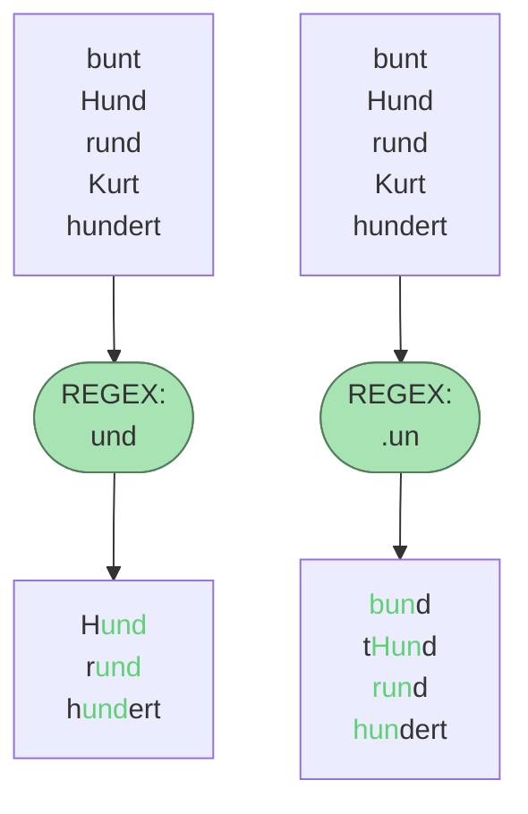

# Exkurs: Reguläre Ausdrücke

Reguläre Ausdrücke, auch **regex** genannt (vom engl. "**reg**ular **ex**presssion") ist eine Zeichenkette,
die eine bestimmte Menge von Zeichenketten beschreibt. Man kann es sich vorstellen wie ein Sieb, durch das nur
ganz bestimmte Strings durchfallen und andere abgefangen werden.


Um Regex zu lernen, eignet sich am besten das [Onlinetutorial von regexone](https://regexone.com/lesson/introduction_abcs).

## Cheat Sheet von datacamp
[🖼Link zur pdf](https://www.datacamp.com/cheat-sheet/regular-expresso)


## Reguläre Ausdrücke in Python

Um reguläre Ausdrücke in Python zu verwendet, müssen wir das Modul `re` importieren. Wir können dann mit verschiedenen
Methoden aus `re` prüfen, ob ein String den regulären Ausdruck erfüllt oder nicht

- **Suchen mit `re.search()`:** Sucht nach einem Muster in einem String und gibt ein Match-Objekt zurück, wenn das Muster gefunden wird, sonst `None`.

```python
import re
if re.search('pattern', 'string'):
    print('Muster gefunden')
```

- **Finden aller Übereinstimmungen mit `re.findall()`:** Gibt eine Liste aller Vorkommen des Musters im String zurück.

```python
matches = re.findall('pattern', 'string')
```

- **Ersetzen von Text mit `re.sub()`:** Ermöglicht das Ersetzen aller Vorkommen eines Musters in einem String.

```python
neuer_string = re.sub('pattern', 'replacement', 'string')
```

- **Kompilieren von Mustern mit `re.compile()`:** Für die wiederholte Verwendung eines Musters kann es effizient sein, es zuerst zu kompilieren.

```python
compiled_pattern = re.compile('pattern')
if compiled_pattern.search('string'):
    print('Muster gefunden')
```

Reguläre Ausdrücke sind extrem mächtig, können aber auch komplex und schwer lesbar sein. 
Eine **gute Praxis ist, die Ausdrücke gut zu kommentieren** und, wo möglich, auf Klarheit zu achten.

### Aufgabe: `re` nutzen🌶🌶🌶
Baue explizite Codebeispiel für alle obigen Funktionen auf dem modul `re`.

### Aufgabe: Funktion zur Überprüfung einer E-Mail-Adresse 🌶️🌶️
Schreibe eine Funktion, die prüft, ob ein gegebener String ein gültiger E-Mail-Adresse ist.

### 15. Überprüfung, ob ein String eine gültige URL ist: 🌶️️🌶️️
Erstelle einen String und überprüfe, ob er eine gültige URL ist.

### 18. Extrahieren von URLs aus einem Text: 🌶️️🌶️️
Schreibe einen Python-Code, um alle URLs in einem gegebenen Text zu extrahieren.

### Aufgabe: Regex im Alltag nutzen🌶
Finde heraus, wie du mit deiner favorisierten IDE mithilfe von regulären Ausdrücken suchen kannst.


