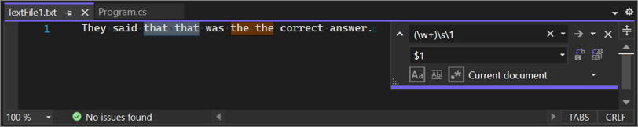
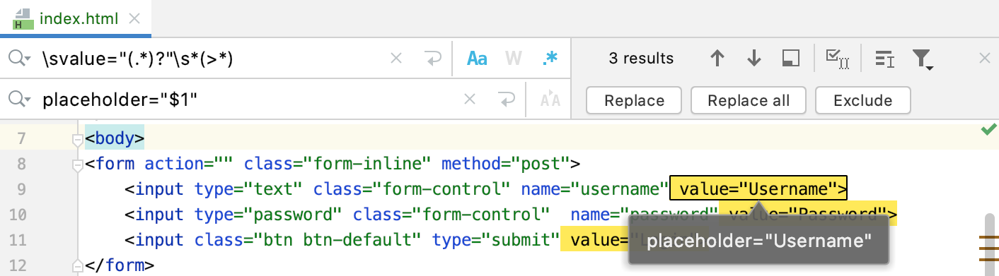

# Lösung

### Aufgabe: Hashtags extrahieren

Extrahiere alle Hashtags im folgenden Beispiel:

```python
import re
text = "Ein Text mit #Python und #Programmierung. #Regex ist cool."
hashtag_pattern = r'#\w+'
matches = re.findall(hashtag_pattern, text)
print(matches)
```

### Aufgabe: CSV-Zeile parsen

Schreibe einen regulären Ausdruck, um Daten aus einer CSV-Zeile zu extrahieren. Die `,`-separierten Einträge
sollen dann in einer Liste erscheinen.

```python
import re
csv_line = "Alice,25,Female,Engineer"

fields = re.split(r',', csv_line)
print(fields)
```

### Aufgabe: Regex im Alltag nutzen🌶
Finde heraus, wie du mit deiner favorisierten IDE mithilfe von regulären Ausdrücken suchen kannst.

In **VSCode** muss auf den `.*` Button in der Suche gedrückt werden.



In **PyCharm** muss auf den `.*` Button in der Suche gedrückt werden.



### Aufgabe: Datum filtern

Finde alle Datums im folgenden Text:

```python
import re

text = "Ein Beispieltext mit dem Datum 27.01.2024 und einem weiteren Datum 01.12.2023."

date_pattern = r'\b(\d{2}\.\d{2}.\d{4})\b'

matches = re.findall(date_pattern, text)
print(matches)
```

### Aufgabe: URLs unkenntlich machen

Ersetze im folgenden Text alle URLs durch `***hidden URL***`:

```python
import re
text = "Ein Text mit einer URL: https://www.example.com und eine weitere: http://test.org."

url_pattern = r'https?://\S+'

new_text = re.sub(url_pattern, "***hidden URL***", text)
print(new_text)
```

### Aufgabe: Farbcodes

Filtere alle Hexadezimalen Farbcodes mit 6 Ziffern heraus:

```python
import re
text = "Farbcodes: #FF0000, #00FF00, #0000FF."

color_pattern = r'#[0-9A-Fa-f]{6}'

matches = re.findall(color_pattern, text)
print(matches)
```

### Aufgabe: HTML-Tags entfernen

Entferne aus dem folgenden Text die HTML-Tags:

```python
import re
html_text = "<p>Dies ist ein <strong>Beispiel</strong> HTML-Text.</p>"

html_pattern = re.compile(r'<[^>]+>')

clean_text = re.sub(html_pattern, '', html_text)
print(clean_text)
```
